# t00026 - Template memento pattern
## Config
```yaml
diagrams:
  t00026_class:
    type: class
    glob:
      - t00026.cc
    using_namespace: clanguml::t00026
    include:
      namespaces:
        - clanguml::t00026

```
## Source code
File `tests/t00026/t00026.cc`
```cpp
#include <iostream>
#include <memory>
#include <unordered_map>

namespace clanguml {
namespace t00026 {

template <typename T> class Memento {
public:
    Memento(T &&v)
        : m_value(std::forward<T>(v))
    {
    }

    T value() const { return m_value; }

private:
    T m_value;
};

template <typename T> class Originator {
public:
    Originator(T &&v)
        : m_value(std::forward<T>(v))
    {
    }

    Memento<T> memoize_value() const { return Memento<T>{m_value}; }

    void load(const Memento<T> &m) { m_value = m.value(); }

    void print() const { std::cout << m_value << std::endl; }

    void set(T &&v) { m_value = std::forward<T>(v); }

private:
    T m_value;
};

template <typename T> class Caretaker {
public:
    Memento<T> &state(const std::string &n) { return m_mementos.at(n); }

    void set_state(const std::string &s, Memento<T> &&m)
    {
        m_mementos.try_emplace(s, std::move(m));
    }

private:
    std::unordered_map<std::string, Memento<T>> m_mementos;
};

struct StringMemento {
    Caretaker<std::string> caretaker;
    Originator<std::string> originator;
};
} // namespace t00026
} // namespace clanguml

```
## Generated PlantUML diagrams

## Generated Mermaid diagrams

## Generated JSON models
```json
{
  "diagram_type": "class",
  "elements": [
    {
      "bases": [],
      "display_name": "Memento<T>",
      "id": "9929633709823243122",
      "is_abstract": false,
      "is_nested": false,
      "is_struct": false,
      "is_template": true,
      "is_union": false,
      "members": [
        {
          "access": "private",
          "is_static": false,
          "name": "m_value",
          "source_location": {
            "column": 7,
            "file": "t00026.cc",
            "line": 18,
            "translation_unit": "t00026.cc"
          },
          "type": "T"
        }
      ],
      "methods": [
        {
          "access": "public",
          "display_name": "Memento",
          "is_const": false,
          "is_consteval": false,
          "is_constexpr": false,
          "is_constructor": true,
          "is_copy_assignment": false,
          "is_coroutine": false,
          "is_defaulted": false,
          "is_deleted": false,
          "is_move_assignment": false,
          "is_noexcept": false,
          "is_operator": false,
          "is_pure_virtual": false,
          "is_static": false,
          "is_virtual": false,
          "name": "Memento",
          "parameters": [
            {
              "name": "v",
              "type": "T &&"
            }
          ],
          "source_location": {
            "column": 5,
            "file": "t00026.cc",
            "line": 10,
            "translation_unit": "t00026.cc"
          },
          "template_parameters": [],
          "type": "void"
        },
        {
          "access": "public",
          "display_name": "value",
          "is_const": true,
          "is_consteval": false,
          "is_constexpr": false,
          "is_constructor": false,
          "is_copy_assignment": false,
          "is_coroutine": false,
          "is_defaulted": false,
          "is_deleted": false,
          "is_move_assignment": false,
          "is_noexcept": false,
          "is_operator": false,
          "is_pure_virtual": false,
          "is_static": false,
          "is_virtual": false,
          "name": "value",
          "parameters": [],
          "source_location": {
            "column": 7,
            "file": "t00026.cc",
            "line": 15,
            "translation_unit": "t00026.cc"
          },
          "template_parameters": [],
          "type": "T"
        }
      ],
      "name": "Memento",
      "namespace": "clanguml::t00026",
      "source_location": {
        "column": 29,
        "file": "t00026.cc",
        "line": 8,
        "translation_unit": "t00026.cc"
      },
      "template_parameters": [
        {
          "is_variadic": false,
          "kind": "template_type",
          "name": "T",
          "template_parameters": []
        }
      ],
      "type": "class"
    },
    {
      "bases": [],
      "display_name": "Originator<T>",
      "id": "10598166429766533816",
      "is_abstract": false,
      "is_nested": false,
      "is_struct": false,
      "is_template": true,
      "is_union": false,
      "members": [
        {
          "access": "private",
          "is_static": false,
          "name": "m_value",
          "source_location": {
            "column": 7,
            "file": "t00026.cc",
            "line": 37,
            "translation_unit": "t00026.cc"
          },
          "type": "T"
        }
      ],
      "methods": [
        {
          "access": "public",
          "display_name": "Originator",
          "is_const": false,
          "is_consteval": false,
          "is_constexpr": false,
          "is_constructor": true,
          "is_copy_assignment": false,
          "is_coroutine": false,
          "is_defaulted": false,
          "is_deleted": false,
          "is_move_assignment": false,
          "is_noexcept": false,
          "is_operator": false,
          "is_pure_virtual": false,
          "is_static": false,
          "is_virtual": false,
          "name": "Originator",
          "parameters": [
            {
              "name": "v",
              "type": "T &&"
            }
          ],
          "source_location": {
            "column": 5,
            "file": "t00026.cc",
            "line": 23,
            "translation_unit": "t00026.cc"
          },
          "template_parameters": [],
          "type": "void"
        },
        {
          "access": "public",
          "display_name": "memoize_value",
          "is_const": true,
          "is_consteval": false,
          "is_constexpr": false,
          "is_constructor": false,
          "is_copy_assignment": false,
          "is_coroutine": false,
          "is_defaulted": false,
          "is_deleted": false,
          "is_move_assignment": false,
          "is_noexcept": false,
          "is_operator": false,
          "is_pure_virtual": false,
          "is_static": false,
          "is_virtual": false,
          "name": "memoize_value",
          "parameters": [],
          "source_location": {
            "column": 16,
            "file": "t00026.cc",
            "line": 28,
            "translation_unit": "t00026.cc"
          },
          "template_parameters": [],
          "type": "Memento<T>"
        },
        {
          "access": "public",
          "display_name": "load",
          "is_const": false,
          "is_consteval": false,
          "is_constexpr": false,
          "is_constructor": false,
          "is_copy_assignment": false,
          "is_coroutine": false,
          "is_defaulted": false,
          "is_deleted": false,
          "is_move_assignment": false,
          "is_noexcept": false,
          "is_operator": false,
          "is_pure_virtual": false,
          "is_static": false,
          "is_virtual": false,
          "name": "load",
          "parameters": [
            {
              "name": "m",
              "type": "const Memento<T> &"
            }
          ],
          "source_location": {
            "column": 10,
            "file": "t00026.cc",
            "line": 30,
            "translation_unit": "t00026.cc"
          },
          "template_parameters": [],
          "type": "void"
        },
        {
          "access": "public",
          "display_name": "print",
          "is_const": true,
          "is_consteval": false,
          "is_constexpr": false,
          "is_constructor": false,
          "is_copy_assignment": false,
          "is_coroutine": false,
          "is_defaulted": false,
          "is_deleted": false,
          "is_move_assignment": false,
          "is_noexcept": false,
          "is_operator": false,
          "is_pure_virtual": false,
          "is_static": false,
          "is_virtual": false,
          "name": "print",
          "parameters": [],
          "source_location": {
            "column": 10,
            "file": "t00026.cc",
            "line": 32,
            "translation_unit": "t00026.cc"
          },
          "template_parameters": [],
          "type": "void"
        },
        {
          "access": "public",
          "display_name": "set",
          "is_const": false,
          "is_consteval": false,
          "is_constexpr": false,
          "is_constructor": false,
          "is_copy_assignment": false,
          "is_coroutine": false,
          "is_defaulted": false,
          "is_deleted": false,
          "is_move_assignment": false,
          "is_noexcept": false,
          "is_operator": false,
          "is_pure_virtual": false,
          "is_static": false,
          "is_virtual": false,
          "name": "set",
          "parameters": [
            {
              "name": "v",
              "type": "T &&"
            }
          ],
          "source_location": {
            "column": 10,
            "file": "t00026.cc",
            "line": 34,
            "translation_unit": "t00026.cc"
          },
          "template_parameters": [],
          "type": "void"
        }
      ],
      "name": "Originator",
      "namespace": "clanguml::t00026",
      "source_location": {
        "column": 29,
        "file": "t00026.cc",
        "line": 21,
        "translation_unit": "t00026.cc"
      },
      "template_parameters": [
        {
          "is_variadic": false,
          "kind": "template_type",
          "name": "T",
          "template_parameters": []
        }
      ],
      "type": "class"
    },
    {
      "bases": [],
      "display_name": "Caretaker<T>",
      "id": "16261723097462337632",
      "is_abstract": false,
      "is_nested": false,
      "is_struct": false,
      "is_template": true,
      "is_union": false,
      "members": [
        {
          "access": "private",
          "is_static": false,
          "name": "m_mementos",
          "source_location": {
            "column": 49,
            "file": "t00026.cc",
            "line": 50,
            "translation_unit": "t00026.cc"
          },
          "type": "std::unordered_map<std::string,Memento<T>>"
        }
      ],
      "methods": [
        {
          "access": "public",
          "display_name": "state",
          "is_const": false,
          "is_consteval": false,
          "is_constexpr": false,
          "is_constructor": false,
          "is_copy_assignment": false,
          "is_coroutine": false,
          "is_defaulted": false,
          "is_deleted": false,
          "is_move_assignment": false,
          "is_noexcept": false,
          "is_operator": false,
          "is_pure_virtual": false,
          "is_static": false,
          "is_virtual": false,
          "name": "state",
          "parameters": [
            {
              "name": "n",
              "type": "const std::string &"
            }
          ],
          "source_location": {
            "column": 17,
            "file": "t00026.cc",
            "line": 42,
            "translation_unit": "t00026.cc"
          },
          "template_parameters": [],
          "type": "Memento<T> &"
        },
        {
          "access": "public",
          "display_name": "set_state",
          "is_const": false,
          "is_consteval": false,
          "is_constexpr": false,
          "is_constructor": false,
          "is_copy_assignment": false,
          "is_coroutine": false,
          "is_defaulted": false,
          "is_deleted": false,
          "is_move_assignment": false,
          "is_noexcept": false,
          "is_operator": false,
          "is_pure_virtual": false,
          "is_static": false,
          "is_virtual": false,
          "name": "set_state",
          "parameters": [
            {
              "name": "s",
              "type": "const std::string &"
            },
            {
              "name": "m",
              "type": "Memento<T> &&"
            }
          ],
          "source_location": {
            "column": 10,
            "file": "t00026.cc",
            "line": 44,
            "translation_unit": "t00026.cc"
          },
          "template_parameters": [],
          "type": "void"
        }
      ],
      "name": "Caretaker",
      "namespace": "clanguml::t00026",
      "source_location": {
        "column": 29,
        "file": "t00026.cc",
        "line": 40,
        "translation_unit": "t00026.cc"
      },
      "template_parameters": [
        {
          "is_variadic": false,
          "kind": "template_type",
          "name": "T",
          "template_parameters": []
        }
      ],
      "type": "class"
    },
    {
      "bases": [],
      "display_name": "Caretaker<std::string>",
      "id": "13667857101769259918",
      "is_abstract": false,
      "is_nested": false,
      "is_struct": false,
      "is_template": true,
      "is_union": false,
      "members": [],
      "methods": [],
      "name": "Caretaker",
      "namespace": "clanguml::t00026",
      "source_location": {
        "column": 29,
        "file": "t00026.cc",
        "line": 40,
        "translation_unit": "t00026.cc"
      },
      "template_parameters": [
        {
          "is_variadic": false,
          "kind": "argument",
          "template_parameters": [],
          "type": "std::string"
        }
      ],
      "type": "class"
    },
    {
      "bases": [],
      "display_name": "Originator<std::string>",
      "id": "8113983686442908481",
      "is_abstract": false,
      "is_nested": false,
      "is_struct": false,
      "is_template": true,
      "is_union": false,
      "members": [],
      "methods": [],
      "name": "Originator",
      "namespace": "clanguml::t00026",
      "source_location": {
        "column": 29,
        "file": "t00026.cc",
        "line": 21,
        "translation_unit": "t00026.cc"
      },
      "template_parameters": [
        {
          "is_variadic": false,
          "kind": "argument",
          "template_parameters": [],
          "type": "std::string"
        }
      ],
      "type": "class"
    },
    {
      "bases": [],
      "display_name": "StringMemento",
      "id": "6814007543321034313",
      "is_abstract": false,
      "is_nested": false,
      "is_struct": true,
      "is_template": false,
      "is_union": false,
      "members": [
        {
          "access": "public",
          "is_static": false,
          "name": "caretaker",
          "source_location": {
            "column": 28,
            "file": "t00026.cc",
            "line": 54,
            "translation_unit": "t00026.cc"
          },
          "type": "Caretaker<std::string>"
        },
        {
          "access": "public",
          "is_static": false,
          "name": "originator",
          "source_location": {
            "column": 29,
            "file": "t00026.cc",
            "line": 55,
            "translation_unit": "t00026.cc"
          },
          "type": "Originator<std::string>"
        }
      ],
      "methods": [],
      "name": "StringMemento",
      "namespace": "clanguml::t00026",
      "source_location": {
        "column": 8,
        "file": "t00026.cc",
        "line": 53,
        "translation_unit": "t00026.cc"
      },
      "template_parameters": [],
      "type": "class"
    }
  ],
  "name": "t00026_class",
  "package_type": "namespace",
  "relationships": [
    {
      "access": "public",
      "destination": "9929633709823243122",
      "source": "10598166429766533816",
      "type": "dependency"
    },
    {
      "access": "private",
      "destination": "9929633709823243122",
      "label": "m_mementos",
      "source": "16261723097462337632",
      "type": "aggregation"
    },
    {
      "access": "public",
      "destination": "16261723097462337632",
      "source": "13667857101769259918",
      "type": "instantiation"
    },
    {
      "access": "public",
      "destination": "10598166429766533816",
      "source": "8113983686442908481",
      "type": "instantiation"
    },
    {
      "access": "public",
      "destination": "13667857101769259918",
      "label": "caretaker",
      "source": "6814007543321034313",
      "type": "aggregation"
    },
    {
      "access": "public",
      "destination": "8113983686442908481",
      "label": "originator",
      "source": "6814007543321034313",
      "type": "aggregation"
    }
  ],
  "using_namespace": "clanguml::t00026"
}
```
## Generated GraphML models
```xml
<?xml version="1.0"?>
<graphml xmlns="http://graphml.graphdrawing.org/xmlns" xmlns:xsi="http://www.w3.org/2001/XMLSchema-instance" xsi:schemaLocation="http://graphml.graphdrawing.org/xmlns http://graphml.graphdrawing.org/xmlns/1.0/graphml.xsd">
 <key attr.name="id" attr.type="string" for="graph" id="gd0" />
 <key attr.name="diagram_type" attr.type="string" for="graph" id="gd1" />
 <key attr.name="name" attr.type="string" for="graph" id="gd2" />
 <key attr.name="using_namespace" attr.type="string" for="graph" id="gd3" />
 <key attr.name="id" attr.type="string" for="node" id="nd0" />
 <key attr.name="type" attr.type="string" for="node" id="nd1" />
 <key attr.name="name" attr.type="string" for="node" id="nd2" />
 <key attr.name="stereotype" attr.type="string" for="node" id="nd3" />
 <key attr.name="url" attr.type="string" for="node" id="nd4" />
 <key attr.name="tooltip" attr.type="string" for="node" id="nd5" />
 <key attr.name="is_template" attr.type="boolean" for="node" id="nd6" />
 <key attr.name="type" attr.type="string" for="edge" id="ed0" />
 <key attr.name="access" attr.type="string" for="edge" id="ed1" />
 <key attr.name="label" attr.type="string" for="edge" id="ed2" />
 <key attr.name="url" attr.type="string" for="edge" id="ed3" />
 <graph id="g0" edgedefault="directed" parse.nodeids="canonical" parse.edgeids="canonical" parse.order="nodesfirst">
  <data key="gd3">clanguml::t00026</data>
  <node id="n0">
   <data key="nd1">class</data>
   <data key="nd2"><![CDATA[Memento<T>]]></data>
   <data key="nd6">true</data>
   <data key="nd4">https://github.com/bkryza/clang-uml/blob/ca93ebc700c4d8ac5504d33adbb899f44e90a1a4/tests/t00026/t00026.cc#L8</data>
   <data key="nd5">Memento</data>
  </node>
  <node id="n1">
   <data key="nd1">class</data>
   <data key="nd2"><![CDATA[Originator<T>]]></data>
   <data key="nd6">true</data>
   <data key="nd4">https://github.com/bkryza/clang-uml/blob/ca93ebc700c4d8ac5504d33adbb899f44e90a1a4/tests/t00026/t00026.cc#L21</data>
   <data key="nd5">Originator</data>
  </node>
  <node id="n2">
   <data key="nd1">class</data>
   <data key="nd2"><![CDATA[Caretaker<T>]]></data>
   <data key="nd6">true</data>
   <data key="nd4">https://github.com/bkryza/clang-uml/blob/ca93ebc700c4d8ac5504d33adbb899f44e90a1a4/tests/t00026/t00026.cc#L40</data>
   <data key="nd5">Caretaker</data>
  </node>
  <node id="n3">
   <data key="nd1">class</data>
   <data key="nd2"><![CDATA[Caretaker<std::string>]]></data>
   <data key="nd6">true</data>
   <data key="nd4">https://github.com/bkryza/clang-uml/blob/ca93ebc700c4d8ac5504d33adbb899f44e90a1a4/tests/t00026/t00026.cc#L40</data>
   <data key="nd5">Caretaker</data>
  </node>
  <node id="n4">
   <data key="nd1">class</data>
   <data key="nd2"><![CDATA[Originator<std::string>]]></data>
   <data key="nd6">true</data>
   <data key="nd4">https://github.com/bkryza/clang-uml/blob/ca93ebc700c4d8ac5504d33adbb899f44e90a1a4/tests/t00026/t00026.cc#L21</data>
   <data key="nd5">Originator</data>
  </node>
  <node id="n5">
   <data key="nd1">class</data>
   <data key="nd2"><![CDATA[StringMemento]]></data>
   <data key="nd6">false</data>
   <data key="nd4">https://github.com/bkryza/clang-uml/blob/ca93ebc700c4d8ac5504d33adbb899f44e90a1a4/tests/t00026/t00026.cc#L53</data>
   <data key="nd5">StringMemento</data>
  </node>
  <edge id="e0" source="n1" target="n0">
   <data key="ed0">dependency</data>
   <data key="ed1">public</data>
  </edge>
  <edge id="e1" source="n2" target="n0">
   <data key="ed0">aggregation</data>
   <data key="ed2">m_mementos</data>
   <data key="ed1">private</data>
  </edge>
  <edge id="e2" source="n3" target="n2">
   <data key="ed0">instantiation</data>
   <data key="ed1">public</data>
  </edge>
  <edge id="e3" source="n4" target="n1">
   <data key="ed0">instantiation</data>
   <data key="ed1">public</data>
  </edge>
  <edge id="e4" source="n5" target="n3">
   <data key="ed0">aggregation</data>
   <data key="ed2">caretaker</data>
   <data key="ed1">public</data>
  </edge>
  <edge id="e5" source="n5" target="n4">
   <data key="ed0">aggregation</data>
   <data key="ed2">originator</data>
   <data key="ed1">public</data>
  </edge>
 </graph>
</graphml>

```
