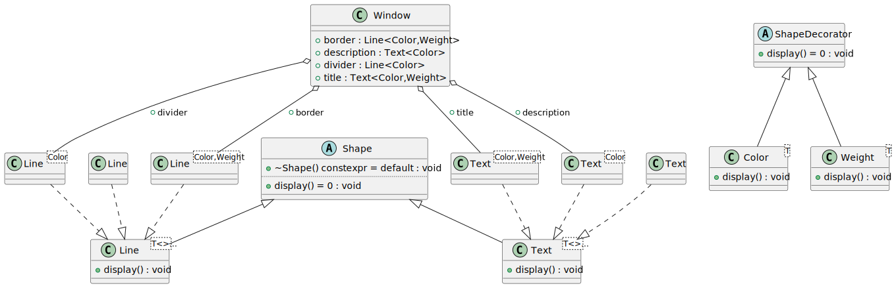

# t00027 - Template decorator pattern
## Config
```yaml
diagrams:
  t00027_class:
    type: class
    glob:
      - t00027.cc
    using_namespace: clanguml::t00027
    include:
      namespaces:
        - clanguml::t00027

```
## Source code
File `tests/t00027/t00027.cc`
```cpp
#include <memory>
#include <tuple>
#include <type_traits>

namespace clanguml {
namespace t00027 {

class Shape {
public:
    virtual void display() = 0;
    virtual ~Shape() = default;
};

template <template <typename> class... T>
class Line : public Shape, public T<Line<>>... {
public:
    void display() override
    {
        std::apply([](auto &&...x) { (x.display(), ...); },
            std::forward_as_tuple(T<Line<>>()...));
    }
};

template <template <typename> class... T>
class Text : public Shape, public T<Text<>>... {
public:
    void display() override
    {
        std::apply([](auto &&...x) { (x.display(), ...); },
            std::forward_as_tuple(T<Text<>>()...));
    }
};

struct ShapeDecorator {
    virtual void display() = 0;
};

template <typename T> class Color : public ShapeDecorator {
public:
    void display() override { }
};

template <typename T> class Weight : public ShapeDecorator {
public:
    void display() override { }
};

struct Window {
    Line<Color, Weight> border;
    Line<Color> divider;
    Text<Color, Weight> title;
    Text<Color> description;
};
} // namespace t00027
} // namespace clanguml

```
## Generated PlantUML diagrams

## Generated Mermaid diagrams

## Generated JSON models
```json
{
  "diagram_type": "class",
  "elements": [
    {
      "bases": [],
      "display_name": "Shape",
      "id": "12744739871674657768",
      "is_abstract": true,
      "is_nested": false,
      "is_struct": false,
      "is_template": false,
      "is_union": false,
      "members": [],
      "methods": [
        {
          "access": "public",
          "display_name": "display",
          "is_const": false,
          "is_consteval": false,
          "is_constexpr": false,
          "is_constructor": false,
          "is_copy_assignment": false,
          "is_coroutine": false,
          "is_defaulted": false,
          "is_deleted": false,
          "is_move_assignment": false,
          "is_noexcept": false,
          "is_operator": false,
          "is_pure_virtual": true,
          "is_static": false,
          "is_virtual": true,
          "name": "display",
          "parameters": [],
          "source_location": {
            "column": 18,
            "file": "t00027.cc",
            "line": 10,
            "translation_unit": "t00027.cc"
          },
          "template_parameters": [],
          "type": "void"
        },
        {
          "access": "public",
          "display_name": "~Shape",
          "is_const": false,
          "is_consteval": false,
          "is_constexpr": true,
          "is_constructor": false,
          "is_copy_assignment": false,
          "is_coroutine": false,
          "is_defaulted": true,
          "is_deleted": false,
          "is_move_assignment": false,
          "is_noexcept": false,
          "is_operator": false,
          "is_pure_virtual": false,
          "is_static": false,
          "is_virtual": true,
          "name": "~Shape",
          "parameters": [],
          "source_location": {
            "column": 13,
            "file": "t00027.cc",
            "line": 11,
            "translation_unit": "t00027.cc"
          },
          "template_parameters": [],
          "type": "void"
        }
      ],
      "name": "Shape",
      "namespace": "clanguml::t00027",
      "source_location": {
        "column": 7,
        "file": "t00027.cc",
        "line": 8,
        "translation_unit": "t00027.cc"
      },
      "template_parameters": [],
      "type": "class"
    },
    {
      "bases": [],
      "display_name": "Line",
      "id": "12551463032492497828",
      "is_abstract": false,
      "is_nested": false,
      "is_struct": false,
      "is_template": true,
      "is_union": false,
      "members": [],
      "methods": [],
      "name": "Line",
      "namespace": "clanguml::t00027",
      "source_location": {
        "column": 7,
        "file": "t00027.cc",
        "line": 15,
        "translation_unit": "t00027.cc"
      },
      "template_parameters": [],
      "type": "class"
    },
    {
      "bases": [
        {
          "access": "public",
          "id": "12744739871674657768",
          "is_virtual": false,
          "name": "clanguml::t00027::Shape"
        },
        {
          "access": "public",
          "id": "17476872655978593693",
          "is_virtual": false,
          "name": "clanguml::t00027::Line::T<clanguml::t00027::Line>"
        }
      ],
      "display_name": "Line<T<>...>",
      "id": "1138992659826702823",
      "is_abstract": false,
      "is_nested": false,
      "is_struct": false,
      "is_template": true,
      "is_union": false,
      "members": [],
      "methods": [
        {
          "access": "public",
          "display_name": "display",
          "is_const": false,
          "is_consteval": false,
          "is_constexpr": false,
          "is_constructor": false,
          "is_copy_assignment": false,
          "is_coroutine": false,
          "is_defaulted": false,
          "is_deleted": false,
          "is_move_assignment": false,
          "is_noexcept": false,
          "is_operator": false,
          "is_pure_virtual": false,
          "is_static": false,
          "is_virtual": true,
          "name": "display",
          "parameters": [],
          "source_location": {
            "column": 10,
            "file": "t00027.cc",
            "line": 17,
            "translation_unit": "t00027.cc"
          },
          "template_parameters": [],
          "type": "void"
        }
      ],
      "name": "Line",
      "namespace": "clanguml::t00027",
      "source_location": {
        "column": 7,
        "file": "t00027.cc",
        "line": 15,
        "translation_unit": "t00027.cc"
      },
      "template_parameters": [
        {
          "is_variadic": true,
          "kind": "template_template_type",
          "name": "T<>...",
          "template_parameters": []
        }
      ],
      "type": "class"
    },
    {
      "bases": [],
      "display_name": "Text",
      "id": "14667739730330357797",
      "is_abstract": false,
      "is_nested": false,
      "is_struct": false,
      "is_template": true,
      "is_union": false,
      "members": [],
      "methods": [],
      "name": "Text",
      "namespace": "clanguml::t00027",
      "source_location": {
        "column": 7,
        "file": "t00027.cc",
        "line": 25,
        "translation_unit": "t00027.cc"
      },
      "template_parameters": [],
      "type": "class"
    },
    {
      "bases": [
        {
          "access": "public",
          "id": "12744739871674657768",
          "is_virtual": false,
          "name": "clanguml::t00027::Shape"
        },
        {
          "access": "public",
          "id": "17980070619704453980",
          "is_virtual": false,
          "name": "clanguml::t00027::Text::T<clanguml::t00027::Text>"
        }
      ],
      "display_name": "Text<T<>...>",
      "id": "8917077181775028830",
      "is_abstract": false,
      "is_nested": false,
      "is_struct": false,
      "is_template": true,
      "is_union": false,
      "members": [],
      "methods": [
        {
          "access": "public",
          "display_name": "display",
          "is_const": false,
          "is_consteval": false,
          "is_constexpr": false,
          "is_constructor": false,
          "is_copy_assignment": false,
          "is_coroutine": false,
          "is_defaulted": false,
          "is_deleted": false,
          "is_move_assignment": false,
          "is_noexcept": false,
          "is_operator": false,
          "is_pure_virtual": false,
          "is_static": false,
          "is_virtual": true,
          "name": "display",
          "parameters": [],
          "source_location": {
            "column": 10,
            "file": "t00027.cc",
            "line": 27,
            "translation_unit": "t00027.cc"
          },
          "template_parameters": [],
          "type": "void"
        }
      ],
      "name": "Text",
      "namespace": "clanguml::t00027",
      "source_location": {
        "column": 7,
        "file": "t00027.cc",
        "line": 25,
        "translation_unit": "t00027.cc"
      },
      "template_parameters": [
        {
          "is_variadic": true,
          "kind": "template_template_type",
          "name": "T<>...",
          "template_parameters": []
        }
      ],
      "type": "class"
    },
    {
      "bases": [],
      "display_name": "ShapeDecorator",
      "id": "16393510605649316529",
      "is_abstract": true,
      "is_nested": false,
      "is_struct": true,
      "is_template": false,
      "is_union": false,
      "members": [],
      "methods": [
        {
          "access": "public",
          "display_name": "display",
          "is_const": false,
          "is_consteval": false,
          "is_constexpr": false,
          "is_constructor": false,
          "is_copy_assignment": false,
          "is_coroutine": false,
          "is_defaulted": false,
          "is_deleted": false,
          "is_move_assignment": false,
          "is_noexcept": false,
          "is_operator": false,
          "is_pure_virtual": true,
          "is_static": false,
          "is_virtual": true,
          "name": "display",
          "parameters": [],
          "source_location": {
            "column": 18,
            "file": "t00027.cc",
            "line": 35,
            "translation_unit": "t00027.cc"
          },
          "template_parameters": [],
          "type": "void"
        }
      ],
      "name": "ShapeDecorator",
      "namespace": "clanguml::t00027",
      "source_location": {
        "column": 8,
        "file": "t00027.cc",
        "line": 34,
        "translation_unit": "t00027.cc"
      },
      "template_parameters": [],
      "type": "class"
    },
    {
      "bases": [
        {
          "access": "public",
          "id": "16393510605649316529",
          "is_virtual": false,
          "name": "clanguml::t00027::ShapeDecorator"
        }
      ],
      "display_name": "Color<T>",
      "id": "11788292555464235555",
      "is_abstract": false,
      "is_nested": false,
      "is_struct": false,
      "is_template": true,
      "is_union": false,
      "members": [],
      "methods": [
        {
          "access": "public",
          "display_name": "display",
          "is_const": false,
          "is_consteval": false,
          "is_constexpr": false,
          "is_constructor": false,
          "is_copy_assignment": false,
          "is_coroutine": false,
          "is_defaulted": false,
          "is_deleted": false,
          "is_move_assignment": false,
          "is_noexcept": false,
          "is_operator": false,
          "is_pure_virtual": false,
          "is_static": false,
          "is_virtual": true,
          "name": "display",
          "parameters": [],
          "source_location": {
            "column": 10,
            "file": "t00027.cc",
            "line": 40,
            "translation_unit": "t00027.cc"
          },
          "template_parameters": [],
          "type": "void"
        }
      ],
      "name": "Color",
      "namespace": "clanguml::t00027",
      "source_location": {
        "column": 29,
        "file": "t00027.cc",
        "line": 38,
        "translation_unit": "t00027.cc"
      },
      "template_parameters": [
        {
          "is_variadic": false,
          "kind": "template_type",
          "name": "T",
          "template_parameters": []
        }
      ],
      "type": "class"
    },
    {
      "bases": [
        {
          "access": "public",
          "id": "16393510605649316529",
          "is_virtual": false,
          "name": "clanguml::t00027::ShapeDecorator"
        }
      ],
      "display_name": "Weight<T>",
      "id": "16395644259100490706",
      "is_abstract": false,
      "is_nested": false,
      "is_struct": false,
      "is_template": true,
      "is_union": false,
      "members": [],
      "methods": [
        {
          "access": "public",
          "display_name": "display",
          "is_const": false,
          "is_consteval": false,
          "is_constexpr": false,
          "is_constructor": false,
          "is_copy_assignment": false,
          "is_coroutine": false,
          "is_defaulted": false,
          "is_deleted": false,
          "is_move_assignment": false,
          "is_noexcept": false,
          "is_operator": false,
          "is_pure_virtual": false,
          "is_static": false,
          "is_virtual": true,
          "name": "display",
          "parameters": [],
          "source_location": {
            "column": 10,
            "file": "t00027.cc",
            "line": 45,
            "translation_unit": "t00027.cc"
          },
          "template_parameters": [],
          "type": "void"
        }
      ],
      "name": "Weight",
      "namespace": "clanguml::t00027",
      "source_location": {
        "column": 29,
        "file": "t00027.cc",
        "line": 43,
        "translation_unit": "t00027.cc"
      },
      "template_parameters": [
        {
          "is_variadic": false,
          "kind": "template_type",
          "name": "T",
          "template_parameters": []
        }
      ],
      "type": "class"
    },
    {
      "bases": [],
      "display_name": "Line<Color,Weight>",
      "id": "16663490611337313620",
      "is_abstract": false,
      "is_nested": false,
      "is_struct": false,
      "is_template": true,
      "is_union": false,
      "members": [],
      "methods": [],
      "name": "Line",
      "namespace": "clanguml::t00027",
      "source_location": {
        "column": 7,
        "file": "t00027.cc",
        "line": 15,
        "translation_unit": "t00027.cc"
      },
      "template_parameters": [
        {
          "is_variadic": false,
          "kind": "template_type",
          "name": "clanguml::t00027::Color",
          "template_parameters": []
        },
        {
          "is_variadic": false,
          "kind": "template_type",
          "name": "clanguml::t00027::Weight",
          "template_parameters": []
        }
      ],
      "type": "class"
    },
    {
      "bases": [],
      "display_name": "Line<Color>",
      "id": "5401063548280439576",
      "is_abstract": false,
      "is_nested": false,
      "is_struct": false,
      "is_template": true,
      "is_union": false,
      "members": [],
      "methods": [],
      "name": "Line",
      "namespace": "clanguml::t00027",
      "source_location": {
        "column": 7,
        "file": "t00027.cc",
        "line": 15,
        "translation_unit": "t00027.cc"
      },
      "template_parameters": [
        {
          "is_variadic": false,
          "kind": "template_type",
          "name": "clanguml::t00027::Color",
          "template_parameters": []
        }
      ],
      "type": "class"
    },
    {
      "bases": [],
      "display_name": "Text<Color,Weight>",
      "id": "13430994421154430212",
      "is_abstract": false,
      "is_nested": false,
      "is_struct": false,
      "is_template": true,
      "is_union": false,
      "members": [],
      "methods": [],
      "name": "Text",
      "namespace": "clanguml::t00027",
      "source_location": {
        "column": 7,
        "file": "t00027.cc",
        "line": 25,
        "translation_unit": "t00027.cc"
      },
      "template_parameters": [
        {
          "is_variadic": false,
          "kind": "template_type",
          "name": "clanguml::t00027::Color",
          "template_parameters": []
        },
        {
          "is_variadic": false,
          "kind": "template_type",
          "name": "clanguml::t00027::Weight",
          "template_parameters": []
        }
      ],
      "type": "class"
    },
    {
      "bases": [],
      "display_name": "Text<Color>",
      "id": "15102293510229313461",
      "is_abstract": false,
      "is_nested": false,
      "is_struct": false,
      "is_template": true,
      "is_union": false,
      "members": [],
      "methods": [],
      "name": "Text",
      "namespace": "clanguml::t00027",
      "source_location": {
        "column": 7,
        "file": "t00027.cc",
        "line": 25,
        "translation_unit": "t00027.cc"
      },
      "template_parameters": [
        {
          "is_variadic": false,
          "kind": "template_type",
          "name": "clanguml::t00027::Color",
          "template_parameters": []
        }
      ],
      "type": "class"
    },
    {
      "bases": [],
      "display_name": "Window",
      "id": "10988359872221771779",
      "is_abstract": false,
      "is_nested": false,
      "is_struct": true,
      "is_template": false,
      "is_union": false,
      "members": [
        {
          "access": "public",
          "is_static": false,
          "name": "border",
          "source_location": {
            "column": 25,
            "file": "t00027.cc",
            "line": 49,
            "translation_unit": "t00027.cc"
          },
          "type": "Line<Color,Weight>"
        },
        {
          "access": "public",
          "is_static": false,
          "name": "divider",
          "source_location": {
            "column": 17,
            "file": "t00027.cc",
            "line": 50,
            "translation_unit": "t00027.cc"
          },
          "type": "Line<Color>"
        },
        {
          "access": "public",
          "is_static": false,
          "name": "title",
          "source_location": {
            "column": 25,
            "file": "t00027.cc",
            "line": 51,
            "translation_unit": "t00027.cc"
          },
          "type": "Text<Color,Weight>"
        },
        {
          "access": "public",
          "is_static": false,
          "name": "description",
          "source_location": {
            "column": 17,
            "file": "t00027.cc",
            "line": 52,
            "translation_unit": "t00027.cc"
          },
          "type": "Text<Color>"
        }
      ],
      "methods": [],
      "name": "Window",
      "namespace": "clanguml::t00027",
      "source_location": {
        "column": 8,
        "file": "t00027.cc",
        "line": 48,
        "translation_unit": "t00027.cc"
      },
      "template_parameters": [],
      "type": "class"
    }
  ],
  "name": "t00027_class",
  "package_type": "namespace",
  "relationships": [
    {
      "access": "public",
      "destination": "12744739871674657768",
      "source": "1138992659826702823",
      "type": "extension"
    },
    {
      "access": "public",
      "destination": "17476872655978593693",
      "source": "1138992659826702823",
      "type": "extension"
    },
    {
      "access": "public",
      "destination": "12744739871674657768",
      "source": "8917077181775028830",
      "type": "extension"
    },
    {
      "access": "public",
      "destination": "17980070619704453980",
      "source": "8917077181775028830",
      "type": "extension"
    },
    {
      "access": "public",
      "destination": "16393510605649316529",
      "source": "11788292555464235555",
      "type": "extension"
    },
    {
      "access": "public",
      "destination": "16393510605649316529",
      "source": "16395644259100490706",
      "type": "extension"
    },
    {
      "access": "public",
      "destination": "1138992659826702823",
      "source": "16663490611337313620",
      "type": "instantiation"
    },
    {
      "access": "public",
      "destination": "1138992659826702823",
      "source": "5401063548280439576",
      "type": "instantiation"
    },
    {
      "access": "public",
      "destination": "8917077181775028830",
      "source": "13430994421154430212",
      "type": "instantiation"
    },
    {
      "access": "public",
      "destination": "8917077181775028830",
      "source": "15102293510229313461",
      "type": "instantiation"
    },
    {
      "access": "public",
      "destination": "16663490611337313620",
      "label": "border",
      "source": "10988359872221771779",
      "type": "aggregation"
    },
    {
      "access": "public",
      "destination": "5401063548280439576",
      "label": "divider",
      "source": "10988359872221771779",
      "type": "aggregation"
    },
    {
      "access": "public",
      "destination": "13430994421154430212",
      "label": "title",
      "source": "10988359872221771779",
      "type": "aggregation"
    },
    {
      "access": "public",
      "destination": "15102293510229313461",
      "label": "description",
      "source": "10988359872221771779",
      "type": "aggregation"
    }
  ],
  "using_namespace": "clanguml::t00027"
}
```
