# t00028 - PlantUML note decorator test case
## Config
```yaml
diagrams:
  t00028_class:
    type: class
    glob:
      - t00028.cc
    using_namespace: clanguml::t00028
    include:
      namespaces:
        - clanguml::t00028
    plantuml:
      after:
        - >
          note left of {{ alias("R") }}::ccc
            Reference to C.
          end note

```
## Source code
File `tests/t00028/t00028.cc`
```cpp
#include <memory>
#include <vector>

namespace clanguml {
namespace t00028 {

/// \uml{note[top] A class note.}
class A { };

/// \uml{note[] B class note.}
class B { };

///
/// @uml{note:t00028_class[bottom] C class note.}
/// This is class C.
class C { };

/// \uml{note
/// D
/// class
/// note.}
class D { };

/// \uml{note E template class note.}
template <typename T> class E {
    T param;
};

/// \uml{note:other_diagram[left] G class note.}
class G { };

/// @uml{note[ bottom ] F enum note.}
enum class F { one, two, three };

/// \uml{note[right] R class note.}
class R {
    explicit R(C &c)
        : ccc(c)
    {
    }

    /// \uml{note[left] R contains an instance of A.}
    A aaa;

    /// \uml{note:other_diagram[right] R contains an pointer to B.}
    B *bbb;

    C &ccc;

    std::vector<std::shared_ptr<D>> ddd;

    E<int> eee;

    G **ggg;
};

} // namespace t00028
} // namespace clanguml

```
## Generated PlantUML diagrams

## Generated Mermaid diagrams

## Generated JSON models
```json
{
  "diagram_type": "class",
  "elements": [
    {
      "bases": [],
      "comment": {
        "formatted": "\\uml{note[top] A class note.}",
        "raw": "/// \\uml{note[top] A class note.}"
      },
      "display_name": "A",
      "id": "12158803847702268707",
      "is_abstract": false,
      "is_nested": false,
      "is_struct": false,
      "is_template": false,
      "is_union": false,
      "members": [],
      "methods": [],
      "name": "A",
      "namespace": "clanguml::t00028",
      "source_location": {
        "column": 7,
        "file": "t00028.cc",
        "line": 8,
        "translation_unit": "t00028.cc"
      },
      "template_parameters": [],
      "type": "class"
    },
    {
      "bases": [],
      "comment": {
        "formatted": "\\uml{note[] B class note.}",
        "raw": "/// \\uml{note[] B class note.}"
      },
      "display_name": "B",
      "id": "15844776732537704560",
      "is_abstract": false,
      "is_nested": false,
      "is_struct": false,
      "is_template": false,
      "is_union": false,
      "members": [],
      "methods": [],
      "name": "B",
      "namespace": "clanguml::t00028",
      "source_location": {
        "column": 7,
        "file": "t00028.cc",
        "line": 11,
        "translation_unit": "t00028.cc"
      },
      "template_parameters": [],
      "type": "class"
    },
    {
      "bases": [],
      "comment": {
        "formatted": "\n @uml{note:t00028_class[bottom] C class note.}\n This is class C.",
        "raw": "///\n/// @uml{note:t00028_class[bottom] C class note.}\n/// This is class C."
      },
      "display_name": "C",
      "id": "7876618068600902026",
      "is_abstract": false,
      "is_nested": false,
      "is_struct": false,
      "is_template": false,
      "is_union": false,
      "members": [],
      "methods": [],
      "name": "C",
      "namespace": "clanguml::t00028",
      "source_location": {
        "column": 7,
        "file": "t00028.cc",
        "line": 16,
        "translation_unit": "t00028.cc"
      },
      "template_parameters": [],
      "type": "class"
    },
    {
      "bases": [],
      "comment": {
        "formatted": "\\uml{note\nD\nclass\nnote.}",
        "raw": "/// \\uml{note\n/// D\n/// class\n/// note.}"
      },
      "display_name": "D",
      "id": "10110229268150272562",
      "is_abstract": false,
      "is_nested": false,
      "is_struct": false,
      "is_template": false,
      "is_union": false,
      "members": [],
      "methods": [],
      "name": "D",
      "namespace": "clanguml::t00028",
      "source_location": {
        "column": 7,
        "file": "t00028.cc",
        "line": 22,
        "translation_unit": "t00028.cc"
      },
      "template_parameters": [],
      "type": "class"
    },
    {
      "bases": [],
      "comment": {
        "formatted": "\\uml{note E template class note.}",
        "raw": "/// \\uml{note E template class note.}"
      },
      "display_name": "E<T>",
      "id": "8113092523579115786",
      "is_abstract": false,
      "is_nested": false,
      "is_struct": false,
      "is_template": true,
      "is_union": false,
      "members": [
        {
          "access": "private",
          "is_static": false,
          "name": "param",
          "source_location": {
            "column": 7,
            "file": "t00028.cc",
            "line": 26,
            "translation_unit": "t00028.cc"
          },
          "type": "T"
        }
      ],
      "methods": [],
      "name": "E",
      "namespace": "clanguml::t00028",
      "source_location": {
        "column": 29,
        "file": "t00028.cc",
        "line": 25,
        "translation_unit": "t00028.cc"
      },
      "template_parameters": [
        {
          "is_variadic": false,
          "kind": "template_type",
          "name": "T",
          "template_parameters": []
        }
      ],
      "type": "class"
    },
    {
      "bases": [],
      "comment": {
        "formatted": "\\uml{note:other_diagram[left] G class note.}",
        "raw": "/// \\uml{note:other_diagram[left] G class note.}"
      },
      "display_name": "G",
      "id": "6117709827168456983",
      "is_abstract": false,
      "is_nested": false,
      "is_struct": false,
      "is_template": false,
      "is_union": false,
      "members": [],
      "methods": [],
      "name": "G",
      "namespace": "clanguml::t00028",
      "source_location": {
        "column": 7,
        "file": "t00028.cc",
        "line": 30,
        "translation_unit": "t00028.cc"
      },
      "template_parameters": [],
      "type": "class"
    },
    {
      "comment": {
        "formatted": "@uml{note[ bottom ] F enum note.}",
        "raw": "/// @uml{note[ bottom ] F enum note.}"
      },
      "constants": [
        "one",
        "two",
        "three"
      ],
      "display_name": "F",
      "id": "4713823178131109419",
      "is_nested": false,
      "name": "F",
      "namespace": "clanguml::t00028",
      "source_location": {
        "column": 12,
        "file": "t00028.cc",
        "line": 33,
        "translation_unit": "t00028.cc"
      },
      "type": "enum"
    },
    {
      "bases": [],
      "display_name": "E<int>",
      "id": "15597385435530389340",
      "is_abstract": false,
      "is_nested": false,
      "is_struct": false,
      "is_template": true,
      "is_union": false,
      "members": [],
      "methods": [],
      "name": "E",
      "namespace": "clanguml::t00028",
      "source_location": {
        "column": 12,
        "file": "t00028.cc",
        "line": 52,
        "translation_unit": "t00028.cc"
      },
      "template_parameters": [
        {
          "is_variadic": false,
          "kind": "argument",
          "template_parameters": [],
          "type": "int"
        }
      ],
      "type": "class"
    },
    {
      "bases": [],
      "comment": {
        "formatted": "\\uml{note[right] R class note.}",
        "raw": "/// \\uml{note[right] R class note.}"
      },
      "display_name": "R",
      "id": "9513143057914504932",
      "is_abstract": false,
      "is_nested": false,
      "is_struct": false,
      "is_template": false,
      "is_union": false,
      "members": [
        {
          "access": "private",
          "comment": {
            "formatted": "\\uml{note[left] R contains an instance of A.}",
            "raw": "/// \\uml{note[left] R contains an instance of A.}"
          },
          "is_static": false,
          "name": "aaa",
          "source_location": {
            "column": 7,
            "file": "t00028.cc",
            "line": 43,
            "translation_unit": "t00028.cc"
          },
          "type": "A"
        },
        {
          "access": "private",
          "comment": {
            "formatted": "\\uml{note:other_diagram[right] R contains an pointer to B.}",
            "raw": "/// \\uml{note:other_diagram[right] R contains an pointer to B.}"
          },
          "is_static": false,
          "name": "bbb",
          "source_location": {
            "column": 8,
            "file": "t00028.cc",
            "line": 46,
            "translation_unit": "t00028.cc"
          },
          "type": "B *"
        },
        {
          "access": "private",
          "is_static": false,
          "name": "ccc",
          "source_location": {
            "column": 8,
            "file": "t00028.cc",
            "line": 48,
            "translation_unit": "t00028.cc"
          },
          "type": "C &"
        },
        {
          "access": "private",
          "is_static": false,
          "name": "ddd",
          "source_location": {
            "column": 37,
            "file": "t00028.cc",
            "line": 50,
            "translation_unit": "t00028.cc"
          },
          "type": "std::vector<std::shared_ptr<D>>"
        },
        {
          "access": "private",
          "is_static": false,
          "name": "eee",
          "source_location": {
            "column": 12,
            "file": "t00028.cc",
            "line": 52,
            "translation_unit": "t00028.cc"
          },
          "type": "E<int>"
        },
        {
          "access": "private",
          "is_static": false,
          "name": "ggg",
          "source_location": {
            "column": 9,
            "file": "t00028.cc",
            "line": 54,
            "translation_unit": "t00028.cc"
          },
          "type": "G **"
        }
      ],
      "methods": [
        {
          "access": "private",
          "display_name": "R",
          "is_const": false,
          "is_consteval": false,
          "is_constexpr": false,
          "is_constructor": true,
          "is_copy_assignment": false,
          "is_coroutine": false,
          "is_defaulted": false,
          "is_deleted": false,
          "is_move_assignment": false,
          "is_noexcept": false,
          "is_operator": false,
          "is_pure_virtual": false,
          "is_static": false,
          "is_virtual": false,
          "name": "R",
          "parameters": [
            {
              "name": "c",
              "type": "C &"
            }
          ],
          "source_location": {
            "column": 14,
            "file": "t00028.cc",
            "line": 37,
            "translation_unit": "t00028.cc"
          },
          "template_parameters": [],
          "type": "void"
        }
      ],
      "name": "R",
      "namespace": "clanguml::t00028",
      "source_location": {
        "column": 7,
        "file": "t00028.cc",
        "line": 36,
        "translation_unit": "t00028.cc"
      },
      "template_parameters": [],
      "type": "class"
    }
  ],
  "name": "t00028_class",
  "package_type": "namespace",
  "relationships": [
    {
      "access": "public",
      "destination": "8113092523579115786",
      "source": "15597385435530389340",
      "type": "instantiation"
    },
    {
      "access": "private",
      "destination": "12158803847702268707",
      "label": "aaa",
      "source": "9513143057914504932",
      "type": "aggregation"
    },
    {
      "access": "private",
      "destination": "15844776732537704560",
      "label": "bbb",
      "source": "9513143057914504932",
      "type": "association"
    },
    {
      "access": "private",
      "destination": "7876618068600902026",
      "label": "ccc",
      "source": "9513143057914504932",
      "type": "association"
    },
    {
      "access": "private",
      "destination": "10110229268150272562",
      "label": "ddd",
      "source": "9513143057914504932",
      "type": "aggregation"
    },
    {
      "access": "private",
      "destination": "15597385435530389340",
      "label": "eee",
      "source": "9513143057914504932",
      "type": "aggregation"
    },
    {
      "access": "private",
      "destination": "6117709827168456983",
      "label": "ggg",
      "source": "9513143057914504932",
      "type": "association"
    }
  ],
  "using_namespace": "clanguml::t00028"
}
```
## Generated GraphML models
```xml
<?xml version="1.0"?>
<graphml xmlns="http://graphml.graphdrawing.org/xmlns" xmlns:xsi="http://www.w3.org/2001/XMLSchema-instance" xsi:schemaLocation="http://graphml.graphdrawing.org/xmlns http://graphml.graphdrawing.org/xmlns/1.0/graphml.xsd">
 <key attr.name="id" attr.type="string" for="graph" id="gd0" />
 <key attr.name="diagram_type" attr.type="string" for="graph" id="gd1" />
 <key attr.name="name" attr.type="string" for="graph" id="gd2" />
 <key attr.name="using_namespace" attr.type="string" for="graph" id="gd3" />
 <key attr.name="id" attr.type="string" for="node" id="nd0" />
 <key attr.name="type" attr.type="string" for="node" id="nd1" />
 <key attr.name="name" attr.type="string" for="node" id="nd2" />
 <key attr.name="stereotype" attr.type="string" for="node" id="nd3" />
 <key attr.name="url" attr.type="string" for="node" id="nd4" />
 <key attr.name="tooltip" attr.type="string" for="node" id="nd5" />
 <key attr.name="is_template" attr.type="boolean" for="node" id="nd6" />
 <key attr.name="type" attr.type="string" for="edge" id="ed0" />
 <key attr.name="access" attr.type="string" for="edge" id="ed1" />
 <key attr.name="label" attr.type="string" for="edge" id="ed2" />
 <key attr.name="url" attr.type="string" for="edge" id="ed3" />
 <graph id="g0" edgedefault="directed" parse.nodeids="canonical" parse.edgeids="canonical" parse.order="nodesfirst">
  <data key="gd3">clanguml::t00028</data>
  <node id="n0">
   <data key="nd1">class</data>
   <data key="nd2"><![CDATA[A]]></data>
   <data key="nd6">false</data>
  </node>
  <node id="n1">
   <data key="nd1">class</data>
   <data key="nd2"><![CDATA[B]]></data>
   <data key="nd6">false</data>
  </node>
  <node id="n2">
   <data key="nd1">class</data>
   <data key="nd2"><![CDATA[C]]></data>
   <data key="nd6">false</data>
  </node>
  <node id="n3">
   <data key="nd1">class</data>
   <data key="nd2"><![CDATA[D]]></data>
   <data key="nd6">false</data>
  </node>
  <node id="n4">
   <data key="nd1">class</data>
   <data key="nd2"><![CDATA[E<T>]]></data>
   <data key="nd6">true</data>
  </node>
  <node id="n5">
   <data key="nd1">class</data>
   <data key="nd2"><![CDATA[G]]></data>
   <data key="nd6">false</data>
  </node>
  <node id="n6">
   <data key="nd1">enum</data>
   <data key="nd2"><![CDATA[F]]></data>
  </node>
  <node id="n7">
   <data key="nd1">class</data>
   <data key="nd2"><![CDATA[E<int>]]></data>
   <data key="nd6">true</data>
  </node>
  <node id="n8">
   <data key="nd1">class</data>
   <data key="nd2"><![CDATA[R]]></data>
   <data key="nd6">false</data>
  </node>
  <node id="n9">
   <data key="nd1">note</data>
   <data key="nd2"><![CDATA[A class note.]]></data>
  </node>
  <node id="n10">
   <data key="nd1">note</data>
   <data key="nd2"><![CDATA[B class note.]]></data>
  </node>
  <node id="n11">
   <data key="nd1">note</data>
   <data key="nd2"><![CDATA[C class note.]]></data>
  </node>
  <node id="n12">
   <data key="nd1">note</data>
   <data key="nd2"><![CDATA[D
class
note.]]></data>
  </node>
  <node id="n13">
   <data key="nd1">note</data>
   <data key="nd2"><![CDATA[E template class note.]]></data>
  </node>
  <node id="n14">
   <data key="nd1">note</data>
   <data key="nd2"><![CDATA[F enum note.]]></data>
  </node>
  <node id="n15">
   <data key="nd1">note</data>
   <data key="nd2"><![CDATA[R class note.]]></data>
  </node>
  <edge id="e0" source="n9" target="n0">
   <data key="ed0">none</data>
  </edge>
  <edge id="e1" source="n10" target="n1">
   <data key="ed0">none</data>
  </edge>
  <edge id="e2" source="n11" target="n2">
   <data key="ed0">none</data>
  </edge>
  <edge id="e3" source="n12" target="n3">
   <data key="ed0">none</data>
  </edge>
  <edge id="e4" source="n13" target="n4">
   <data key="ed0">none</data>
  </edge>
  <edge id="e5" source="n14" target="n6">
   <data key="ed0">none</data>
  </edge>
  <edge id="e6" source="n15" target="n8">
   <data key="ed0">none</data>
  </edge>
  <edge id="e7" source="n7" target="n4">
   <data key="ed0">instantiation</data>
   <data key="ed1">public</data>
  </edge>
  <edge id="e8" source="n8" target="n0">
   <data key="ed0">aggregation</data>
   <data key="ed2">aaa</data>
   <data key="ed1">private</data>
  </edge>
  <edge id="e9" source="n8" target="n1">
   <data key="ed0">association</data>
   <data key="ed2">bbb</data>
   <data key="ed1">private</data>
  </edge>
  <edge id="e10" source="n8" target="n2">
   <data key="ed0">association</data>
   <data key="ed2">ccc</data>
   <data key="ed1">private</data>
  </edge>
  <edge id="e11" source="n8" target="n3">
   <data key="ed0">aggregation</data>
   <data key="ed2">ddd</data>
   <data key="ed1">private</data>
  </edge>
  <edge id="e12" source="n8" target="n7">
   <data key="ed0">aggregation</data>
   <data key="ed2">eee</data>
   <data key="ed1">private</data>
  </edge>
  <edge id="e13" source="n8" target="n5">
   <data key="ed0">association</data>
   <data key="ed2">ggg</data>
   <data key="ed1">private</data>
  </edge>
 </graph>
</graphml>

```
