# t00029 - PlantUML skip decorator test case
## Config
```yaml
compilation_database_dir: ..
output_directory: diagrams
diagrams:
  t00029_class:
    type: class
    glob:
      - ../../tests/t00029/t00029.cc
    using_namespace:
      - clanguml::t00029
    include:
      namespaces:
        - clanguml::t00029

```
## Source code
File t00029.cc
```cpp
#include <memory>
#include <vector>

namespace clanguml {
namespace t00029 {

class A { };

/// \uml{skip}
class B { };

template <typename T> class C {
    T param;
};

/// @uml{skip:t00029_class}
template <typename T> class D {
    T param;
};

enum class E { one, two, three };

/// \uml{skip}
enum class F { red, green, blue };

class G1 { };

class G2 { };

class G3 { };

class G4 { };

struct R {
    G1 g1;

    /// \uml{skip}
    G2 g2;

    /// \uml{skiprelationship}
    G3 &g3;

    std::shared_ptr<G4> g4;
};

} // namespace t00029
} // namespace clanguml

```
## Generated PlantUML diagrams

## Generated Mermaid diagrams

## Generated JSON models
```json
{
  "diagram_type": "class",
  "elements": [
    {
      "bases": [],
      "display_name": "clanguml::t00029::A",
      "id": "1970994826766369014",
      "is_abstract": false,
      "is_nested": false,
      "is_struct": false,
      "is_template": false,
      "is_union": false,
      "members": [],
      "methods": [],
      "name": "A",
      "namespace": "clanguml::t00029",
      "source_location": {
        "column": 7,
        "file": "../../tests/t00029/t00029.cc",
        "line": 7,
        "translation_unit": "../../tests/t00029/t00029.cc"
      },
      "template_parameters": [],
      "type": "class"
    },
    {
      "bases": [],
      "display_name": "clanguml::t00029::C<T>",
      "id": "543766389270348470",
      "is_abstract": false,
      "is_nested": false,
      "is_struct": false,
      "is_template": true,
      "is_union": false,
      "members": [
        {
          "access": "private",
          "is_static": false,
          "name": "param",
          "source_location": {
            "column": 7,
            "file": "../../tests/t00029/t00029.cc",
            "line": 13,
            "translation_unit": "../../tests/t00029/t00029.cc"
          },
          "type": "T"
        }
      ],
      "methods": [],
      "name": "C",
      "namespace": "clanguml::t00029",
      "source_location": {
        "column": 29,
        "file": "../../tests/t00029/t00029.cc",
        "line": 12,
        "translation_unit": "../../tests/t00029/t00029.cc"
      },
      "template_parameters": [
        {
          "is_variadic": false,
          "kind": "template_type",
          "name": "T",
          "template_parameters": []
        }
      ],
      "type": "class"
    },
    {
      "bases": [],
      "comment": {
        "formatted": "@uml{skip:t00029_class}",
        "raw": "/// @uml{skip:t00029_class}"
      },
      "display_name": "clanguml::t00029::D",
      "id": "1496914969429483234",
      "is_abstract": false,
      "is_nested": false,
      "is_struct": false,
      "is_template": false,
      "is_union": false,
      "members": [
        {
          "access": "private",
          "is_static": false,
          "name": "param",
          "source_location": {
            "column": 7,
            "file": "../../tests/t00029/t00029.cc",
            "line": 18,
            "translation_unit": "../../tests/t00029/t00029.cc"
          },
          "type": "T"
        }
      ],
      "methods": [],
      "name": "D",
      "namespace": "clanguml::t00029",
      "source_location": {
        "column": 29,
        "file": "../../tests/t00029/t00029.cc",
        "line": 17,
        "translation_unit": "../../tests/t00029/t00029.cc"
      },
      "template_parameters": [],
      "type": "class"
    },
    {
      "constants": [
        "one",
        "two",
        "three"
      ],
      "display_name": "clanguml::t00029::E",
      "id": "1936873082456592219",
      "is_nested": false,
      "name": "E",
      "namespace": "clanguml::t00029",
      "source_location": {
        "column": 12,
        "file": "../../tests/t00029/t00029.cc",
        "line": 21,
        "translation_unit": "../../tests/t00029/t00029.cc"
      },
      "type": "enum"
    },
    {
      "bases": [],
      "display_name": "clanguml::t00029::G1",
      "id": "1980718063838190763",
      "is_abstract": false,
      "is_nested": false,
      "is_struct": false,
      "is_template": false,
      "is_union": false,
      "members": [],
      "methods": [],
      "name": "G1",
      "namespace": "clanguml::t00029",
      "source_location": {
        "column": 7,
        "file": "../../tests/t00029/t00029.cc",
        "line": 26,
        "translation_unit": "../../tests/t00029/t00029.cc"
      },
      "template_parameters": [],
      "type": "class"
    },
    {
      "bases": [],
      "display_name": "clanguml::t00029::G2",
      "id": "2204627213593766591",
      "is_abstract": false,
      "is_nested": false,
      "is_struct": false,
      "is_template": false,
      "is_union": false,
      "members": [],
      "methods": [],
      "name": "G2",
      "namespace": "clanguml::t00029",
      "source_location": {
        "column": 7,
        "file": "../../tests/t00029/t00029.cc",
        "line": 28,
        "translation_unit": "../../tests/t00029/t00029.cc"
      },
      "template_parameters": [],
      "type": "class"
    },
    {
      "bases": [],
      "display_name": "clanguml::t00029::G3",
      "id": "767180516665070631",
      "is_abstract": false,
      "is_nested": false,
      "is_struct": false,
      "is_template": false,
      "is_union": false,
      "members": [],
      "methods": [],
      "name": "G3",
      "namespace": "clanguml::t00029",
      "source_location": {
        "column": 7,
        "file": "../../tests/t00029/t00029.cc",
        "line": 30,
        "translation_unit": "../../tests/t00029/t00029.cc"
      },
      "template_parameters": [],
      "type": "class"
    },
    {
      "bases": [],
      "display_name": "clanguml::t00029::G4",
      "id": "715074622924270214",
      "is_abstract": false,
      "is_nested": false,
      "is_struct": false,
      "is_template": false,
      "is_union": false,
      "members": [],
      "methods": [],
      "name": "G4",
      "namespace": "clanguml::t00029",
      "source_location": {
        "column": 7,
        "file": "../../tests/t00029/t00029.cc",
        "line": 32,
        "translation_unit": "../../tests/t00029/t00029.cc"
      },
      "template_parameters": [],
      "type": "class"
    },
    {
      "bases": [],
      "display_name": "clanguml::t00029::R",
      "id": "348749731659902910",
      "is_abstract": false,
      "is_nested": false,
      "is_struct": true,
      "is_template": false,
      "is_union": false,
      "members": [
        {
          "access": "public",
          "is_static": false,
          "name": "g1",
          "source_location": {
            "column": 8,
            "file": "../../tests/t00029/t00029.cc",
            "line": 35,
            "translation_unit": "../../tests/t00029/t00029.cc"
          },
          "type": "G1"
        },
        {
          "access": "public",
          "comment": {
            "formatted": "\\uml{skiprelationship}",
            "raw": "/// \\uml{skiprelationship}"
          },
          "is_static": false,
          "name": "g3",
          "source_location": {
            "column": 9,
            "file": "../../tests/t00029/t00029.cc",
            "line": 41,
            "translation_unit": "../../tests/t00029/t00029.cc"
          },
          "type": "G3 &"
        },
        {
          "access": "public",
          "is_static": false,
          "name": "g4",
          "source_location": {
            "column": 25,
            "file": "../../tests/t00029/t00029.cc",
            "line": 43,
            "translation_unit": "../../tests/t00029/t00029.cc"
          },
          "type": "std::shared_ptr<G4>"
        }
      ],
      "methods": [],
      "name": "R",
      "namespace": "clanguml::t00029",
      "source_location": {
        "column": 8,
        "file": "../../tests/t00029/t00029.cc",
        "line": 34,
        "translation_unit": "../../tests/t00029/t00029.cc"
      },
      "template_parameters": [],
      "type": "class"
    }
  ],
  "metadata": {
    "clang_uml_version": "0.4.0-32-g701b2c5",
    "llvm_version": "Ubuntu clang version 16.0.6 (++20230710042027+7cbf1a259152-1~exp1~20230710162048.105)",
    "schema_version": 1
  },
  "name": "t00029_class",
  "relationships": [
    {
      "access": "public",
      "destination": "1980718063838190763",
      "label": "g1",
      "source": "348749731659902910",
      "type": "aggregation"
    },
    {
      "access": "public",
      "destination": "715074622924270214",
      "label": "g4",
      "source": "348749731659902910",
      "type": "association"
    }
  ],
  "using_namespace": "clanguml::t00029"
}
```
