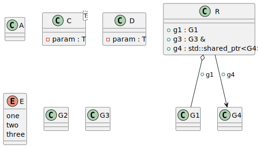

# t00029 - PlantUML skip decorator test case
## Config
```yaml
compilation_database_dir: ..
output_directory: puml
diagrams:
  t00029_class:
    type: class
    glob:
      - ../../tests/t00029/t00029.cc
    using_namespace:
      - clanguml::t00029
    include:
      namespaces:
        - clanguml::t00029

```
## Source code
File t00029.cc
```cpp
#include <memory>
#include <vector>

namespace clanguml {
namespace t00029 {

class A { };

/// \uml{skip}
class B { };

template <typename T> class C {
    T param;
};

/// @uml{skip:t00029_class}
template <typename T> class D {
    T param;
};

enum class E { one, two, three };

/// \uml{skip}
enum class F { red, green, blue };

class G1 { };

class G2 { };

class G3 { };

class G4 { };

struct R {
    G1 g1;

    /// \uml{skip}
    G2 g2;

    /// \uml{skiprelationship}
    G3 &g3;

    std::shared_ptr<G4> g4;
};

} // namespace t00029
} // namespace clanguml

```
## Generated UML diagrams

