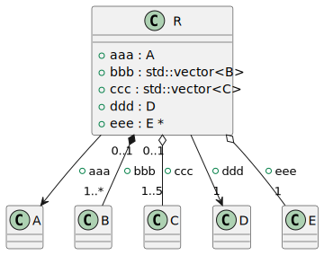

# t00030 - PlantUML relationship decorators test case
## Config
```yaml
diagrams:
  t00030_class:
    type: class
    glob:
      - t00030.cc
    using_namespace: clanguml::t00030
    include:
      namespaces:
        - clanguml::t00030

```
## Source code
File `tests/t00030/t00030.cc`
```cpp
#include <memory>
#include <vector>

namespace clanguml {
namespace t00030 {

class A { };

class B { };

class C { };

class D { };

class E { };

struct R {
    /// @uml{association[]}
    A aaa;

    /// @uml{composition[0..1:1..*]}
    std::vector<B> bbb;

    /// @uml{aggregation[0..1:1..5]}
    std::vector<C> ccc;

    /// @uml{association[:1]}
    D ddd;

    /// @uml{aggregation[:1]}
    E *eee;
};

} // namespace t00030
} // namespace clanguml

```
## Generated PlantUML diagrams

## Generated Mermaid diagrams

## Generated JSON models
```json
{
  "diagram_type": "class",
  "elements": [
    {
      "bases": [],
      "display_name": "A",
      "id": "64769484767514424",
      "is_abstract": false,
      "is_nested": false,
      "is_struct": false,
      "is_template": false,
      "is_union": false,
      "members": [],
      "methods": [],
      "name": "A",
      "namespace": "clanguml::t00030",
      "source_location": {
        "column": 7,
        "file": "t00030.cc",
        "line": 7,
        "translation_unit": "t00030.cc"
      },
      "template_parameters": [],
      "type": "class"
    },
    {
      "bases": [],
      "display_name": "B",
      "id": "156923198106222307",
      "is_abstract": false,
      "is_nested": false,
      "is_struct": false,
      "is_template": false,
      "is_union": false,
      "members": [],
      "methods": [],
      "name": "B",
      "namespace": "clanguml::t00030",
      "source_location": {
        "column": 7,
        "file": "t00030.cc",
        "line": 9,
        "translation_unit": "t00030.cc"
      },
      "template_parameters": [],
      "type": "class"
    },
    {
      "bases": [],
      "display_name": "C",
      "id": "1651557398557662399",
      "is_abstract": false,
      "is_nested": false,
      "is_struct": false,
      "is_template": false,
      "is_union": false,
      "members": [],
      "methods": [],
      "name": "C",
      "namespace": "clanguml::t00030",
      "source_location": {
        "column": 7,
        "file": "t00030.cc",
        "line": 11,
        "translation_unit": "t00030.cc"
      },
      "template_parameters": [],
      "type": "class"
    },
    {
      "bases": [],
      "display_name": "D",
      "id": "1089781072752262158",
      "is_abstract": false,
      "is_nested": false,
      "is_struct": false,
      "is_template": false,
      "is_union": false,
      "members": [],
      "methods": [],
      "name": "D",
      "namespace": "clanguml::t00030",
      "source_location": {
        "column": 7,
        "file": "t00030.cc",
        "line": 13,
        "translation_unit": "t00030.cc"
      },
      "template_parameters": [],
      "type": "class"
    },
    {
      "bases": [],
      "display_name": "E",
      "id": "425964641881054607",
      "is_abstract": false,
      "is_nested": false,
      "is_struct": false,
      "is_template": false,
      "is_union": false,
      "members": [],
      "methods": [],
      "name": "E",
      "namespace": "clanguml::t00030",
      "source_location": {
        "column": 7,
        "file": "t00030.cc",
        "line": 15,
        "translation_unit": "t00030.cc"
      },
      "template_parameters": [],
      "type": "class"
    },
    {
      "bases": [],
      "display_name": "R",
      "id": "263468735940481091",
      "is_abstract": false,
      "is_nested": false,
      "is_struct": true,
      "is_template": false,
      "is_union": false,
      "members": [
        {
          "access": "public",
          "comment": {
            "formatted": "@uml{association[]}",
            "raw": "/// @uml{association[]}"
          },
          "is_static": false,
          "name": "aaa",
          "source_location": {
            "column": 7,
            "file": "t00030.cc",
            "line": 19,
            "translation_unit": "t00030.cc"
          },
          "type": "A"
        },
        {
          "access": "public",
          "comment": {
            "formatted": "@uml{composition[0..1:1..*]}",
            "raw": "/// @uml{composition[0..1:1..*]}"
          },
          "is_static": false,
          "name": "bbb",
          "source_location": {
            "column": 20,
            "file": "t00030.cc",
            "line": 22,
            "translation_unit": "t00030.cc"
          },
          "type": "std::vector<B>"
        },
        {
          "access": "public",
          "comment": {
            "formatted": "@uml{aggregation[0..1:1..5]}",
            "raw": "/// @uml{aggregation[0..1:1..5]}"
          },
          "is_static": false,
          "name": "ccc",
          "source_location": {
            "column": 20,
            "file": "t00030.cc",
            "line": 25,
            "translation_unit": "t00030.cc"
          },
          "type": "std::vector<C>"
        },
        {
          "access": "public",
          "comment": {
            "formatted": "@uml{association[:1]}",
            "raw": "/// @uml{association[:1]}"
          },
          "is_static": false,
          "name": "ddd",
          "source_location": {
            "column": 7,
            "file": "t00030.cc",
            "line": 28,
            "translation_unit": "t00030.cc"
          },
          "type": "D"
        },
        {
          "access": "public",
          "comment": {
            "formatted": "@uml{aggregation[:1]}",
            "raw": "/// @uml{aggregation[:1]}"
          },
          "is_static": false,
          "name": "eee",
          "source_location": {
            "column": 8,
            "file": "t00030.cc",
            "line": 31,
            "translation_unit": "t00030.cc"
          },
          "type": "E *"
        }
      ],
      "methods": [],
      "name": "R",
      "namespace": "clanguml::t00030",
      "source_location": {
        "column": 8,
        "file": "t00030.cc",
        "line": 17,
        "translation_unit": "t00030.cc"
      },
      "template_parameters": [],
      "type": "class"
    }
  ],
  "name": "t00030_class",
  "package_type": "namespace",
  "relationships": [
    {
      "access": "public",
      "destination": "64769484767514424",
      "label": "aaa",
      "source": "263468735940481091",
      "type": "association"
    },
    {
      "access": "public",
      "destination": "156923198106222307",
      "label": "bbb",
      "multiplicity_destination": "1..*",
      "multiplicity_source": "0..1",
      "source": "263468735940481091",
      "type": "composition"
    },
    {
      "access": "public",
      "destination": "1651557398557662399",
      "label": "ccc",
      "multiplicity_destination": "1..5",
      "multiplicity_source": "0..1",
      "source": "263468735940481091",
      "type": "aggregation"
    },
    {
      "access": "public",
      "destination": "1089781072752262158",
      "label": "ddd",
      "multiplicity_destination": "1",
      "source": "263468735940481091",
      "type": "association"
    },
    {
      "access": "public",
      "destination": "425964641881054607",
      "label": "eee",
      "multiplicity_destination": "1",
      "source": "263468735940481091",
      "type": "aggregation"
    }
  ],
  "using_namespace": "clanguml::t00030"
}
```
