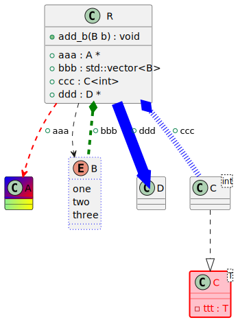

# t00031 - PlantUML style decorator test case
## Config
```yaml
diagrams:
  t00031_class:
    type: class
    glob:
      - t00031.cc
    skip_redundant_dependencies: false
    using_namespace: clanguml::t00031
    include:
      namespaces:
        - clanguml::t00031

```
## Source code
File `tests/t00031/t00031.cc`
```cpp
#include <memory>
#include <vector>

namespace clanguml {
namespace t00031 {

/// @uml{style[#back:lightgreen|yellow;header:blue/red]}
class A { };

/// @uml{style[#line.dotted:blue]}
enum B { one, two, three };

/// @uml{style[#pink;line:red;line.bold;text:red]}
template <typename T> class C {
    T ttt;
};

class D { };

struct R {
    /// @uml{style[#red,dashed,thickness=2]}
    A *aaa;

    /// @uml{composition}
    /// @uml{style[#green,dashed,thickness=4]}
    std::vector<B> bbb;

    void add_b(B b) { bbb.push_back(b); }

    /// @uml{style[#blue,dotted,thickness=8]}
    C<int> ccc;

    /// @uml{style[#blue,plain,thickness=16]}
    D *ddd;
};

} // namespace t00031
} // namespace clanguml

```
## Generated PlantUML diagrams

## Generated Mermaid diagrams

## Generated JSON models
```json
{
  "diagram_type": "class",
  "elements": [
    {
      "bases": [],
      "comment": {
        "formatted": "@uml{style[#back:lightgreen|yellow;header:blue/red]}",
        "raw": "/// @uml{style[#back:lightgreen|yellow;header:blue/red]}"
      },
      "display_name": "A",
      "id": "847775539502907247",
      "is_abstract": false,
      "is_nested": false,
      "is_struct": false,
      "is_template": false,
      "is_union": false,
      "members": [],
      "methods": [],
      "name": "A",
      "namespace": "clanguml::t00031",
      "source_location": {
        "column": 7,
        "file": "t00031.cc",
        "line": 8,
        "translation_unit": "t00031.cc"
      },
      "template_parameters": [],
      "type": "class"
    },
    {
      "comment": {
        "formatted": "@uml{style[#line.dotted:blue]}",
        "raw": "/// @uml{style[#line.dotted:blue]}"
      },
      "constants": [
        "one",
        "two",
        "three"
      ],
      "display_name": "B",
      "id": "1441796358326382179",
      "is_nested": false,
      "name": "B",
      "namespace": "clanguml::t00031",
      "source_location": {
        "column": 6,
        "file": "t00031.cc",
        "line": 11,
        "translation_unit": "t00031.cc"
      },
      "type": "enum"
    },
    {
      "bases": [],
      "comment": {
        "formatted": "@uml{style[#pink;line:red;line.bold;text:red]}",
        "raw": "/// @uml{style[#pink;line:red;line.bold;text:red]}"
      },
      "display_name": "C<T>",
      "id": "116209144733282955",
      "is_abstract": false,
      "is_nested": false,
      "is_struct": false,
      "is_template": true,
      "is_union": false,
      "members": [
        {
          "access": "private",
          "is_static": false,
          "name": "ttt",
          "source_location": {
            "column": 7,
            "file": "t00031.cc",
            "line": 15,
            "translation_unit": "t00031.cc"
          },
          "type": "T"
        }
      ],
      "methods": [],
      "name": "C",
      "namespace": "clanguml::t00031",
      "source_location": {
        "column": 29,
        "file": "t00031.cc",
        "line": 14,
        "translation_unit": "t00031.cc"
      },
      "template_parameters": [
        {
          "is_variadic": false,
          "kind": "template_type",
          "name": "T",
          "template_parameters": []
        }
      ],
      "type": "class"
    },
    {
      "bases": [],
      "display_name": "D",
      "id": "2266534344475505157",
      "is_abstract": false,
      "is_nested": false,
      "is_struct": false,
      "is_template": false,
      "is_union": false,
      "members": [],
      "methods": [],
      "name": "D",
      "namespace": "clanguml::t00031",
      "source_location": {
        "column": 7,
        "file": "t00031.cc",
        "line": 18,
        "translation_unit": "t00031.cc"
      },
      "template_parameters": [],
      "type": "class"
    },
    {
      "bases": [],
      "display_name": "C<int>",
      "id": "208700529175860645",
      "is_abstract": false,
      "is_nested": false,
      "is_struct": false,
      "is_template": true,
      "is_union": false,
      "members": [],
      "methods": [],
      "name": "C",
      "namespace": "clanguml::t00031",
      "source_location": {
        "column": 29,
        "file": "t00031.cc",
        "line": 14,
        "translation_unit": "t00031.cc"
      },
      "template_parameters": [
        {
          "is_variadic": false,
          "kind": "argument",
          "template_parameters": [],
          "type": "int"
        }
      ],
      "type": "class"
    },
    {
      "bases": [],
      "display_name": "R",
      "id": "484712092364868032",
      "is_abstract": false,
      "is_nested": false,
      "is_struct": true,
      "is_template": false,
      "is_union": false,
      "members": [
        {
          "access": "public",
          "comment": {
            "formatted": "@uml{style[#red,dashed,thickness=2]}",
            "raw": "/// @uml{style[#red,dashed,thickness=2]}"
          },
          "is_static": false,
          "name": "aaa",
          "source_location": {
            "column": 8,
            "file": "t00031.cc",
            "line": 22,
            "translation_unit": "t00031.cc"
          },
          "type": "A *"
        },
        {
          "access": "public",
          "comment": {
            "formatted": "@uml{composition}\n@uml{style[#green,dashed,thickness=4]}",
            "raw": "/// @uml{composition}\n    /// @uml{style[#green,dashed,thickness=4]}"
          },
          "is_static": false,
          "name": "bbb",
          "source_location": {
            "column": 20,
            "file": "t00031.cc",
            "line": 26,
            "translation_unit": "t00031.cc"
          },
          "type": "std::vector<B>"
        },
        {
          "access": "public",
          "comment": {
            "formatted": "@uml{style[#blue,dotted,thickness=8]}",
            "raw": "/// @uml{style[#blue,dotted,thickness=8]}"
          },
          "is_static": false,
          "name": "ccc",
          "source_location": {
            "column": 12,
            "file": "t00031.cc",
            "line": 31,
            "translation_unit": "t00031.cc"
          },
          "type": "C<int>"
        },
        {
          "access": "public",
          "comment": {
            "formatted": "@uml{style[#blue,plain,thickness=16]}",
            "raw": "/// @uml{style[#blue,plain,thickness=16]}"
          },
          "is_static": false,
          "name": "ddd",
          "source_location": {
            "column": 8,
            "file": "t00031.cc",
            "line": 34,
            "translation_unit": "t00031.cc"
          },
          "type": "D *"
        }
      ],
      "methods": [
        {
          "access": "public",
          "display_name": "add_b",
          "is_const": false,
          "is_consteval": false,
          "is_constexpr": false,
          "is_constructor": false,
          "is_copy_assignment": false,
          "is_coroutine": false,
          "is_defaulted": false,
          "is_deleted": false,
          "is_move_assignment": false,
          "is_noexcept": false,
          "is_operator": false,
          "is_pure_virtual": false,
          "is_static": false,
          "is_virtual": false,
          "name": "add_b",
          "parameters": [
            {
              "name": "b",
              "type": "B"
            }
          ],
          "source_location": {
            "column": 10,
            "file": "t00031.cc",
            "line": 28,
            "translation_unit": "t00031.cc"
          },
          "template_parameters": [],
          "type": "void"
        }
      ],
      "name": "R",
      "namespace": "clanguml::t00031",
      "source_location": {
        "column": 8,
        "file": "t00031.cc",
        "line": 20,
        "translation_unit": "t00031.cc"
      },
      "template_parameters": [],
      "type": "class"
    }
  ],
  "name": "t00031_class",
  "package_type": "namespace",
  "relationships": [
    {
      "access": "public",
      "destination": "116209144733282955",
      "source": "208700529175860645",
      "type": "instantiation"
    },
    {
      "access": "public",
      "destination": "1441796358326382179",
      "source": "484712092364868032",
      "type": "dependency"
    },
    {
      "access": "public",
      "destination": "847775539502907247",
      "label": "aaa",
      "source": "484712092364868032",
      "type": "association"
    },
    {
      "access": "public",
      "destination": "1441796358326382179",
      "label": "bbb",
      "source": "484712092364868032",
      "type": "composition"
    },
    {
      "access": "public",
      "destination": "208700529175860645",
      "label": "ccc",
      "source": "484712092364868032",
      "type": "aggregation"
    },
    {
      "access": "public",
      "destination": "2266534344475505157",
      "label": "ddd",
      "source": "484712092364868032",
      "type": "association"
    }
  ],
  "using_namespace": "clanguml::t00031"
}
```
