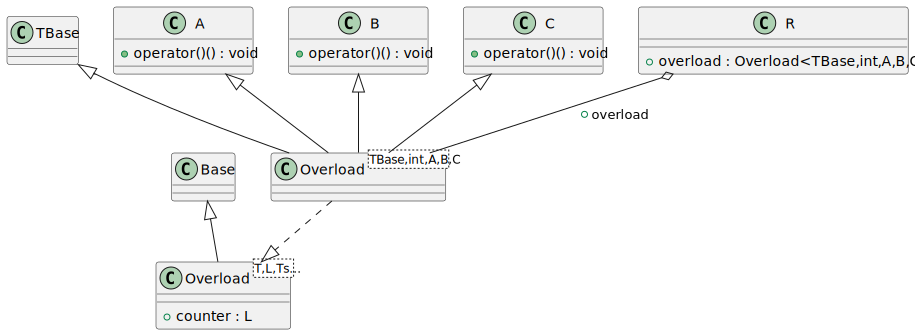

# t00032 - Class template with template base classes test case
## Config
```yaml
diagrams:
  t00032_class:
    type: class
    glob:
      - t00032.cc
    using_namespace: clanguml::t00032
    include:
      namespaces:
        - clanguml::t00032

```
## Source code
File `tests/t00032/t00032.cc`
```cpp
#include <memory>
#include <vector>

namespace clanguml {
namespace t00032 {

struct Base { };

struct TBase { };

struct A {
    void operator()() { }
};

struct B {
    void operator()() { }
};

struct C {
    void operator()() { }
};

template <typename T, typename L, typename... Ts>
struct Overload : public Base, public T, public Ts... {
    using Ts::operator()...;
    L counter;
};

template <class... Ts> Overload(Ts...) -> Overload<Ts...>;

struct R {
    Overload<TBase, int, A, B, C> overload;
};

} // namespace t00032
} // namespace clanguml

```
## Generated PlantUML diagrams

## Generated Mermaid diagrams

## Generated JSON models
```json
{
  "diagram_type": "class",
  "elements": [
    {
      "bases": [],
      "display_name": "Base",
      "id": "1619396229227632210",
      "is_abstract": false,
      "is_nested": false,
      "is_struct": true,
      "is_template": false,
      "is_union": false,
      "members": [],
      "methods": [],
      "name": "Base",
      "namespace": "clanguml::t00032",
      "source_location": {
        "column": 8,
        "file": "t00032.cc",
        "line": 7,
        "translation_unit": "t00032.cc"
      },
      "template_parameters": [],
      "type": "class"
    },
    {
      "bases": [],
      "display_name": "TBase",
      "id": "543776954602127752",
      "is_abstract": false,
      "is_nested": false,
      "is_struct": true,
      "is_template": false,
      "is_union": false,
      "members": [],
      "methods": [],
      "name": "TBase",
      "namespace": "clanguml::t00032",
      "source_location": {
        "column": 8,
        "file": "t00032.cc",
        "line": 9,
        "translation_unit": "t00032.cc"
      },
      "template_parameters": [],
      "type": "class"
    },
    {
      "bases": [],
      "display_name": "A",
      "id": "687909853333071234",
      "is_abstract": false,
      "is_nested": false,
      "is_struct": true,
      "is_template": false,
      "is_union": false,
      "members": [],
      "methods": [
        {
          "access": "public",
          "display_name": "operator()",
          "is_const": false,
          "is_consteval": false,
          "is_constexpr": false,
          "is_constructor": false,
          "is_copy_assignment": false,
          "is_coroutine": false,
          "is_defaulted": false,
          "is_deleted": false,
          "is_move_assignment": false,
          "is_noexcept": false,
          "is_operator": true,
          "is_pure_virtual": false,
          "is_static": false,
          "is_virtual": false,
          "name": "operator()",
          "parameters": [],
          "source_location": {
            "column": 10,
            "file": "t00032.cc",
            "line": 12,
            "translation_unit": "t00032.cc"
          },
          "template_parameters": [],
          "type": "void"
        }
      ],
      "name": "A",
      "namespace": "clanguml::t00032",
      "source_location": {
        "column": 8,
        "file": "t00032.cc",
        "line": 11,
        "translation_unit": "t00032.cc"
      },
      "template_parameters": [],
      "type": "class"
    },
    {
      "bases": [],
      "display_name": "B",
      "id": "737235057776029746",
      "is_abstract": false,
      "is_nested": false,
      "is_struct": true,
      "is_template": false,
      "is_union": false,
      "members": [],
      "methods": [
        {
          "access": "public",
          "display_name": "operator()",
          "is_const": false,
          "is_consteval": false,
          "is_constexpr": false,
          "is_constructor": false,
          "is_copy_assignment": false,
          "is_coroutine": false,
          "is_defaulted": false,
          "is_deleted": false,
          "is_move_assignment": false,
          "is_noexcept": false,
          "is_operator": true,
          "is_pure_virtual": false,
          "is_static": false,
          "is_virtual": false,
          "name": "operator()",
          "parameters": [],
          "source_location": {
            "column": 10,
            "file": "t00032.cc",
            "line": 16,
            "translation_unit": "t00032.cc"
          },
          "template_parameters": [],
          "type": "void"
        }
      ],
      "name": "B",
      "namespace": "clanguml::t00032",
      "source_location": {
        "column": 8,
        "file": "t00032.cc",
        "line": 15,
        "translation_unit": "t00032.cc"
      },
      "template_parameters": [],
      "type": "class"
    },
    {
      "bases": [],
      "display_name": "C",
      "id": "1497964256865073382",
      "is_abstract": false,
      "is_nested": false,
      "is_struct": true,
      "is_template": false,
      "is_union": false,
      "members": [],
      "methods": [
        {
          "access": "public",
          "display_name": "operator()",
          "is_const": false,
          "is_consteval": false,
          "is_constexpr": false,
          "is_constructor": false,
          "is_copy_assignment": false,
          "is_coroutine": false,
          "is_defaulted": false,
          "is_deleted": false,
          "is_move_assignment": false,
          "is_noexcept": false,
          "is_operator": true,
          "is_pure_virtual": false,
          "is_static": false,
          "is_virtual": false,
          "name": "operator()",
          "parameters": [],
          "source_location": {
            "column": 10,
            "file": "t00032.cc",
            "line": 20,
            "translation_unit": "t00032.cc"
          },
          "template_parameters": [],
          "type": "void"
        }
      ],
      "name": "C",
      "namespace": "clanguml::t00032",
      "source_location": {
        "column": 8,
        "file": "t00032.cc",
        "line": 19,
        "translation_unit": "t00032.cc"
      },
      "template_parameters": [],
      "type": "class"
    },
    {
      "bases": [
        {
          "access": "public",
          "id": "1619396229227632210",
          "is_virtual": false,
          "name": "clanguml::t00032::Base"
        }
      ],
      "display_name": "Overload<T,L,Ts...>",
      "id": "1463422997970691679",
      "is_abstract": false,
      "is_nested": false,
      "is_struct": true,
      "is_template": true,
      "is_union": false,
      "members": [
        {
          "access": "public",
          "is_static": false,
          "name": "counter",
          "source_location": {
            "column": 7,
            "file": "t00032.cc",
            "line": 26,
            "translation_unit": "t00032.cc"
          },
          "type": "L"
        }
      ],
      "methods": [],
      "name": "Overload",
      "namespace": "clanguml::t00032",
      "source_location": {
        "column": 8,
        "file": "t00032.cc",
        "line": 24,
        "translation_unit": "t00032.cc"
      },
      "template_parameters": [
        {
          "is_variadic": false,
          "kind": "template_type",
          "name": "T",
          "template_parameters": []
        },
        {
          "is_variadic": false,
          "kind": "template_type",
          "name": "L",
          "template_parameters": []
        },
        {
          "is_variadic": true,
          "kind": "template_type",
          "name": "Ts...",
          "template_parameters": []
        }
      ],
      "type": "class"
    },
    {
      "bases": [
        {
          "access": "public",
          "id": "543776954602127752",
          "is_virtual": false,
          "name": "clanguml::t00032::TBase"
        },
        {
          "access": "public",
          "id": "687909853333071234",
          "is_virtual": false,
          "name": "clanguml::t00032::A"
        },
        {
          "access": "public",
          "id": "737235057776029746",
          "is_virtual": false,
          "name": "clanguml::t00032::B"
        },
        {
          "access": "public",
          "id": "1497964256865073382",
          "is_virtual": false,
          "name": "clanguml::t00032::C"
        }
      ],
      "display_name": "Overload<TBase,int,A,B,C>",
      "id": "1706455047176879286",
      "is_abstract": false,
      "is_nested": false,
      "is_struct": false,
      "is_template": true,
      "is_union": false,
      "members": [],
      "methods": [],
      "name": "Overload",
      "namespace": "clanguml::t00032",
      "source_location": {
        "column": 8,
        "file": "t00032.cc",
        "line": 24,
        "translation_unit": "t00032.cc"
      },
      "template_parameters": [
        {
          "is_variadic": false,
          "kind": "argument",
          "template_parameters": [],
          "type": "TBase"
        },
        {
          "is_variadic": false,
          "kind": "argument",
          "template_parameters": [],
          "type": "int"
        },
        {
          "is_variadic": false,
          "kind": "argument",
          "template_parameters": [],
          "type": "A"
        },
        {
          "is_variadic": false,
          "kind": "argument",
          "template_parameters": [],
          "type": "B"
        },
        {
          "is_variadic": false,
          "kind": "argument",
          "template_parameters": [],
          "type": "C"
        }
      ],
      "type": "class"
    },
    {
      "bases": [],
      "display_name": "R",
      "id": "85539867332573320",
      "is_abstract": false,
      "is_nested": false,
      "is_struct": true,
      "is_template": false,
      "is_union": false,
      "members": [
        {
          "access": "public",
          "is_static": false,
          "name": "overload",
          "source_location": {
            "column": 35,
            "file": "t00032.cc",
            "line": 32,
            "translation_unit": "t00032.cc"
          },
          "type": "Overload<TBase,int,A,B,C>"
        }
      ],
      "methods": [],
      "name": "R",
      "namespace": "clanguml::t00032",
      "source_location": {
        "column": 8,
        "file": "t00032.cc",
        "line": 31,
        "translation_unit": "t00032.cc"
      },
      "template_parameters": [],
      "type": "class"
    }
  ],
  "name": "t00032_class",
  "package_type": "namespace",
  "relationships": [
    {
      "access": "public",
      "destination": "1619396229227632210",
      "source": "1463422997970691679",
      "type": "extension"
    },
    {
      "access": "public",
      "destination": "1463422997970691679",
      "source": "1706455047176879286",
      "type": "instantiation"
    },
    {
      "access": "public",
      "destination": "543776954602127752",
      "source": "1706455047176879286",
      "type": "extension"
    },
    {
      "access": "public",
      "destination": "687909853333071234",
      "source": "1706455047176879286",
      "type": "extension"
    },
    {
      "access": "public",
      "destination": "737235057776029746",
      "source": "1706455047176879286",
      "type": "extension"
    },
    {
      "access": "public",
      "destination": "1497964256865073382",
      "source": "1706455047176879286",
      "type": "extension"
    },
    {
      "access": "public",
      "destination": "1706455047176879286",
      "label": "overload",
      "source": "85539867332573320",
      "type": "aggregation"
    }
  ],
  "using_namespace": "clanguml::t00032"
}
```
