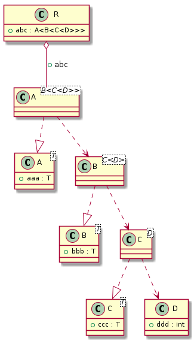

# t00033 - Nested template instantiation dependency test case
## Config
```yaml
compilation_database_dir: ..
output_directory: puml
diagrams:
  t00033_class:
    type: class
    glob:
      - ../../tests/t00033/t00033.cc
    using_namespace:
      - clanguml::t00033
    include:
      namespaces:
        - clanguml::t00033

```
## Source code
File t00033.cc
```cpp
#include <memory>
#include <vector>

namespace clanguml {
namespace t00033 {

template <typename T> struct A {
    T aaa;
};

template <typename T> struct B {
    T bbb;
};

template <typename T> struct C {
    T ccc;
};

struct D {
    int ddd;
};

struct R {
    A<B<std::unique_ptr<C<D>>>> abc;
};

} // namespace t00033
} // namespace clanguml

```
## Generated UML diagrams

