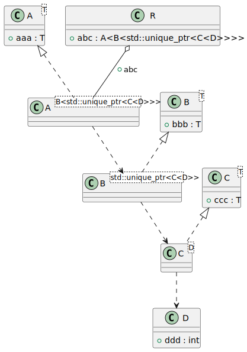

# t00033 - Nested template instantiation dependency test case
## Config
```yaml
diagrams:
  t00033_class:
    type: class
    glob:
      - t00033.cc
    using_namespace: clanguml::t00033
    plantuml:
      style:
        instantiation: up
    include:
      namespaces:
        - clanguml::t00033

```
## Source code
File `tests/t00033/t00033.cc`
```cpp
#include <memory>
#include <vector>

namespace clanguml {
namespace t00033 {

template <typename T> struct A {
    T aaa;
};

template <typename T> struct B {
    T bbb;
};

template <typename T> struct C {
    T ccc;
};

struct D {
    int ddd;
};

struct R {
    A<B<std::unique_ptr<C<D>>>> abc;
};

} // namespace t00033
} // namespace clanguml

```
## Generated PlantUML diagrams

## Generated Mermaid diagrams

## Generated JSON models
```json
{
  "diagram_type": "class",
  "elements": [
    {
      "bases": [],
      "display_name": "A<T>",
      "id": "2036031998980633871",
      "is_abstract": false,
      "is_nested": false,
      "is_struct": true,
      "is_template": true,
      "is_union": false,
      "members": [
        {
          "access": "public",
          "is_static": false,
          "name": "aaa",
          "source_location": {
            "column": 7,
            "file": "t00033.cc",
            "line": 8,
            "translation_unit": "t00033.cc"
          },
          "type": "T"
        }
      ],
      "methods": [],
      "name": "A",
      "namespace": "clanguml::t00033",
      "source_location": {
        "column": 30,
        "file": "t00033.cc",
        "line": 7,
        "translation_unit": "t00033.cc"
      },
      "template_parameters": [
        {
          "is_variadic": false,
          "kind": "template_type",
          "name": "T",
          "template_parameters": []
        }
      ],
      "type": "class"
    },
    {
      "bases": [],
      "display_name": "B<T>",
      "id": "765515233845859023",
      "is_abstract": false,
      "is_nested": false,
      "is_struct": true,
      "is_template": true,
      "is_union": false,
      "members": [
        {
          "access": "public",
          "is_static": false,
          "name": "bbb",
          "source_location": {
            "column": 7,
            "file": "t00033.cc",
            "line": 12,
            "translation_unit": "t00033.cc"
          },
          "type": "T"
        }
      ],
      "methods": [],
      "name": "B",
      "namespace": "clanguml::t00033",
      "source_location": {
        "column": 30,
        "file": "t00033.cc",
        "line": 11,
        "translation_unit": "t00033.cc"
      },
      "template_parameters": [
        {
          "is_variadic": false,
          "kind": "template_type",
          "name": "T",
          "template_parameters": []
        }
      ],
      "type": "class"
    },
    {
      "bases": [],
      "display_name": "C<T>",
      "id": "1436835384265552869",
      "is_abstract": false,
      "is_nested": false,
      "is_struct": true,
      "is_template": true,
      "is_union": false,
      "members": [
        {
          "access": "public",
          "is_static": false,
          "name": "ccc",
          "source_location": {
            "column": 7,
            "file": "t00033.cc",
            "line": 16,
            "translation_unit": "t00033.cc"
          },
          "type": "T"
        }
      ],
      "methods": [],
      "name": "C",
      "namespace": "clanguml::t00033",
      "source_location": {
        "column": 30,
        "file": "t00033.cc",
        "line": 15,
        "translation_unit": "t00033.cc"
      },
      "template_parameters": [
        {
          "is_variadic": false,
          "kind": "template_type",
          "name": "T",
          "template_parameters": []
        }
      ],
      "type": "class"
    },
    {
      "bases": [],
      "display_name": "D",
      "id": "2199581366769423637",
      "is_abstract": false,
      "is_nested": false,
      "is_struct": true,
      "is_template": false,
      "is_union": false,
      "members": [
        {
          "access": "public",
          "is_static": false,
          "name": "ddd",
          "source_location": {
            "column": 9,
            "file": "t00033.cc",
            "line": 20,
            "translation_unit": "t00033.cc"
          },
          "type": "int"
        }
      ],
      "methods": [],
      "name": "D",
      "namespace": "clanguml::t00033",
      "source_location": {
        "column": 8,
        "file": "t00033.cc",
        "line": 19,
        "translation_unit": "t00033.cc"
      },
      "template_parameters": [],
      "type": "class"
    },
    {
      "bases": [],
      "display_name": "C<D>",
      "id": "1609446044604054241",
      "is_abstract": false,
      "is_nested": false,
      "is_struct": true,
      "is_template": true,
      "is_union": false,
      "members": [],
      "methods": [],
      "name": "C",
      "namespace": "clanguml::t00033",
      "source_location": {
        "column": 30,
        "file": "t00033.cc",
        "line": 7,
        "translation_unit": "t00033.cc"
      },
      "template_parameters": [
        {
          "is_variadic": false,
          "kind": "argument",
          "template_parameters": [],
          "type": "D"
        }
      ],
      "type": "class"
    },
    {
      "bases": [],
      "display_name": "B<std::unique_ptr<C<D>>>",
      "id": "384927316081978893",
      "is_abstract": false,
      "is_nested": false,
      "is_struct": true,
      "is_template": true,
      "is_union": false,
      "members": [],
      "methods": [],
      "name": "B",
      "namespace": "clanguml::t00033",
      "source_location": {
        "column": 30,
        "file": "t00033.cc",
        "line": 7,
        "translation_unit": "t00033.cc"
      },
      "template_parameters": [
        {
          "is_variadic": false,
          "kind": "argument",
          "template_parameters": [
            {
              "is_variadic": false,
              "kind": "argument",
              "template_parameters": [
                {
                  "is_variadic": false,
                  "kind": "argument",
                  "template_parameters": [],
                  "type": "clanguml::t00033::D"
                }
              ],
              "type": "clanguml::t00033::C"
            }
          ],
          "type": "std::unique_ptr"
        }
      ],
      "type": "class"
    },
    {
      "bases": [],
      "display_name": "A<B<std::unique_ptr<C<D>>>>",
      "id": "1747493965420341251",
      "is_abstract": false,
      "is_nested": false,
      "is_struct": false,
      "is_template": true,
      "is_union": false,
      "members": [],
      "methods": [],
      "name": "A",
      "namespace": "clanguml::t00033",
      "source_location": {
        "column": 30,
        "file": "t00033.cc",
        "line": 7,
        "translation_unit": "t00033.cc"
      },
      "template_parameters": [
        {
          "is_variadic": false,
          "kind": "argument",
          "template_parameters": [
            {
              "is_variadic": false,
              "kind": "argument",
              "template_parameters": [
                {
                  "is_variadic": false,
                  "kind": "argument",
                  "template_parameters": [
                    {
                      "is_variadic": false,
                      "kind": "argument",
                      "template_parameters": [],
                      "type": "clanguml::t00033::D"
                    }
                  ],
                  "type": "clanguml::t00033::C"
                }
              ],
              "type": "std::unique_ptr"
            }
          ],
          "type": "B"
        }
      ],
      "type": "class"
    },
    {
      "bases": [],
      "display_name": "R",
      "id": "1866392706312766470",
      "is_abstract": false,
      "is_nested": false,
      "is_struct": true,
      "is_template": false,
      "is_union": false,
      "members": [
        {
          "access": "public",
          "is_static": false,
          "name": "abc",
          "source_location": {
            "column": 33,
            "file": "t00033.cc",
            "line": 24,
            "translation_unit": "t00033.cc"
          },
          "type": "A<B<std::unique_ptr<C<D>>>>"
        }
      ],
      "methods": [],
      "name": "R",
      "namespace": "clanguml::t00033",
      "source_location": {
        "column": 8,
        "file": "t00033.cc",
        "line": 23,
        "translation_unit": "t00033.cc"
      },
      "template_parameters": [],
      "type": "class"
    }
  ],
  "name": "t00033_class",
  "package_type": "namespace",
  "relationships": [
    {
      "access": "public",
      "destination": "2199581366769423637",
      "source": "1609446044604054241",
      "type": "dependency"
    },
    {
      "access": "public",
      "destination": "1436835384265552869",
      "source": "1609446044604054241",
      "type": "instantiation"
    },
    {
      "access": "public",
      "destination": "1609446044604054241",
      "source": "384927316081978893",
      "type": "dependency"
    },
    {
      "access": "public",
      "destination": "765515233845859023",
      "source": "384927316081978893",
      "type": "instantiation"
    },
    {
      "access": "public",
      "destination": "384927316081978893",
      "source": "1747493965420341251",
      "type": "dependency"
    },
    {
      "access": "public",
      "destination": "2036031998980633871",
      "source": "1747493965420341251",
      "type": "instantiation"
    },
    {
      "access": "public",
      "destination": "1747493965420341251",
      "label": "abc",
      "source": "1866392706312766470",
      "type": "aggregation"
    }
  ],
  "using_namespace": "clanguml::t00033"
}
```
