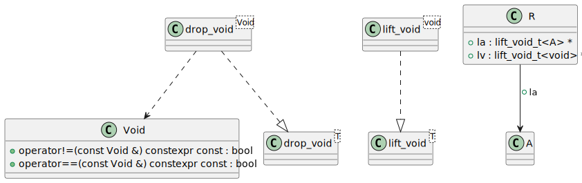

# t00034 - Template metaprogramming type function test case
## Config
```yaml
diagrams:
  t00034_class:
    type: class
    glob:
      - t00034.cc
    using_namespace: clanguml::t00034
    include:
      namespaces:
        - clanguml::t00034
    plantuml:
      after:
        - "@A(R) --> @A(A) : +la"

```
## Source code
File `tests/t00034/t00034.cc`
```cpp
#include <type_traits>

namespace clanguml {
//
// Based on https://github.com/facebook/folly/blob/master/folly/Unit.h
//
namespace t00034 {

struct Void {
    constexpr bool operator==(const Void & /* unused */) const { return true; }
    constexpr bool operator!=(const Void & /* unused */) const { return false; }
};

constexpr Void void_t{};

template <typename T> struct lift_void {
    using type = T;
};

template <> struct lift_void<void> {
    using type = Void;
};

//
// TODO: This is a shortcoming of libclang which parses the type of lift_void_t
// alias as unexposed, i.e. no actual reference to T can be inferred without
// manually parsing the string 'typename lift_void<T>::type'
// For now, this test validates that the visitor does not crash, the reference
// between R and A has to be provided in the configuration file
//
template <typename T> using lift_void_t = typename lift_void<T>::type;

template <typename T> struct drop_void {
    using type = T;
};

template <> struct drop_void<Void> {
    using type = void;
};

template <typename T> using drop_void_t = typename drop_void<T>::type;

struct A { };

struct R {
    lift_void_t<A> *la;
    lift_void_t<void> *lv;
};

} // namespace t00034
} // namespace clanguml

```
## Generated PlantUML diagrams

## Generated Mermaid diagrams

## Generated JSON models
```json
{
  "diagram_type": "class",
  "elements": [
    {
      "bases": [],
      "display_name": "Void",
      "id": "1704456490210873213",
      "is_abstract": false,
      "is_nested": false,
      "is_struct": true,
      "is_template": false,
      "is_union": false,
      "members": [],
      "methods": [
        {
          "access": "public",
          "display_name": "operator==",
          "is_const": true,
          "is_consteval": false,
          "is_constexpr": true,
          "is_constructor": false,
          "is_copy_assignment": false,
          "is_coroutine": false,
          "is_defaulted": false,
          "is_deleted": false,
          "is_move_assignment": false,
          "is_noexcept": false,
          "is_operator": true,
          "is_pure_virtual": false,
          "is_static": false,
          "is_virtual": false,
          "name": "operator==",
          "parameters": [
            {
              "name": "",
              "type": "const Void &"
            }
          ],
          "source_location": {
            "column": 20,
            "file": "t00034.cc",
            "line": 10,
            "translation_unit": "t00034.cc"
          },
          "template_parameters": [],
          "type": "bool"
        },
        {
          "access": "public",
          "display_name": "operator!=",
          "is_const": true,
          "is_consteval": false,
          "is_constexpr": true,
          "is_constructor": false,
          "is_copy_assignment": false,
          "is_coroutine": false,
          "is_defaulted": false,
          "is_deleted": false,
          "is_move_assignment": false,
          "is_noexcept": false,
          "is_operator": true,
          "is_pure_virtual": false,
          "is_static": false,
          "is_virtual": false,
          "name": "operator!=",
          "parameters": [
            {
              "name": "",
              "type": "const Void &"
            }
          ],
          "source_location": {
            "column": 20,
            "file": "t00034.cc",
            "line": 11,
            "translation_unit": "t00034.cc"
          },
          "template_parameters": [],
          "type": "bool"
        }
      ],
      "name": "Void",
      "namespace": "clanguml::t00034",
      "source_location": {
        "column": 8,
        "file": "t00034.cc",
        "line": 9,
        "translation_unit": "t00034.cc"
      },
      "template_parameters": [],
      "type": "class"
    },
    {
      "bases": [],
      "display_name": "lift_void<T>",
      "id": "867472442996685316",
      "is_abstract": false,
      "is_nested": false,
      "is_struct": true,
      "is_template": true,
      "is_union": false,
      "members": [],
      "methods": [],
      "name": "lift_void",
      "namespace": "clanguml::t00034",
      "source_location": {
        "column": 30,
        "file": "t00034.cc",
        "line": 16,
        "translation_unit": "t00034.cc"
      },
      "template_parameters": [
        {
          "is_variadic": false,
          "kind": "template_type",
          "name": "T",
          "template_parameters": []
        }
      ],
      "type": "class"
    },
    {
      "bases": [],
      "display_name": "lift_void<void>",
      "id": "126450862226197239",
      "is_abstract": false,
      "is_nested": false,
      "is_struct": true,
      "is_template": true,
      "is_union": false,
      "members": [],
      "methods": [],
      "name": "lift_void",
      "namespace": "clanguml::t00034",
      "source_location": {
        "column": 20,
        "file": "t00034.cc",
        "line": 20,
        "translation_unit": "t00034.cc"
      },
      "template_parameters": [
        {
          "is_variadic": false,
          "kind": "argument",
          "template_parameters": [],
          "type": "void"
        }
      ],
      "type": "class"
    },
    {
      "bases": [],
      "display_name": "drop_void<T>",
      "id": "1578745816100337706",
      "is_abstract": false,
      "is_nested": false,
      "is_struct": true,
      "is_template": true,
      "is_union": false,
      "members": [],
      "methods": [],
      "name": "drop_void",
      "namespace": "clanguml::t00034",
      "source_location": {
        "column": 30,
        "file": "t00034.cc",
        "line": 33,
        "translation_unit": "t00034.cc"
      },
      "template_parameters": [
        {
          "is_variadic": false,
          "kind": "template_type",
          "name": "T",
          "template_parameters": []
        }
      ],
      "type": "class"
    },
    {
      "bases": [],
      "display_name": "drop_void<Void>",
      "id": "1849836134504075115",
      "is_abstract": false,
      "is_nested": false,
      "is_struct": true,
      "is_template": true,
      "is_union": false,
      "members": [],
      "methods": [],
      "name": "drop_void",
      "namespace": "clanguml::t00034",
      "source_location": {
        "column": 20,
        "file": "t00034.cc",
        "line": 37,
        "translation_unit": "t00034.cc"
      },
      "template_parameters": [
        {
          "is_variadic": false,
          "kind": "argument",
          "template_parameters": [],
          "type": "Void"
        }
      ],
      "type": "class"
    },
    {
      "bases": [],
      "display_name": "A",
      "id": "1383912907884688827",
      "is_abstract": false,
      "is_nested": false,
      "is_struct": true,
      "is_template": false,
      "is_union": false,
      "members": [],
      "methods": [],
      "name": "A",
      "namespace": "clanguml::t00034",
      "source_location": {
        "column": 8,
        "file": "t00034.cc",
        "line": 43,
        "translation_unit": "t00034.cc"
      },
      "template_parameters": [],
      "type": "class"
    },
    {
      "bases": [],
      "display_name": "R",
      "id": "1713991735741265309",
      "is_abstract": false,
      "is_nested": false,
      "is_struct": true,
      "is_template": false,
      "is_union": false,
      "members": [
        {
          "access": "public",
          "is_static": false,
          "name": "la",
          "source_location": {
            "column": 21,
            "file": "t00034.cc",
            "line": 46,
            "translation_unit": "t00034.cc"
          },
          "type": "lift_void_t<A> *"
        },
        {
          "access": "public",
          "is_static": false,
          "name": "lv",
          "source_location": {
            "column": 24,
            "file": "t00034.cc",
            "line": 47,
            "translation_unit": "t00034.cc"
          },
          "type": "lift_void_t<void> *"
        }
      ],
      "methods": [],
      "name": "R",
      "namespace": "clanguml::t00034",
      "source_location": {
        "column": 8,
        "file": "t00034.cc",
        "line": 45,
        "translation_unit": "t00034.cc"
      },
      "template_parameters": [],
      "type": "class"
    }
  ],
  "name": "t00034_class",
  "package_type": "namespace",
  "relationships": [
    {
      "access": "public",
      "destination": "867472442996685316",
      "source": "126450862226197239",
      "type": "instantiation"
    },
    {
      "access": "public",
      "destination": "1704456490210873213",
      "source": "1849836134504075115",
      "type": "dependency"
    },
    {
      "access": "public",
      "destination": "1578745816100337706",
      "source": "1849836134504075115",
      "type": "instantiation"
    },
    {
      "access": "public",
      "destination": "1383912907884688827",
      "label": "la",
      "source": "1713991735741265309",
      "type": "association"
    }
  ],
  "using_namespace": "clanguml::t00034"
}
```
