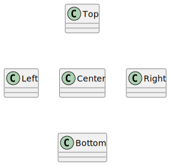

# t00035 - PlantUML class diagram layout hints test case
## Config
```yaml
diagrams:
  t00035_class:
    type: class
    glob:
      - t00035.cc
    using_namespace: clanguml::t00035
    include:
      namespaces:
        - clanguml::t00035
    layout:
      Center:
        - up: Top
        - down: Bottom
        - left: Left
        - right: Right

```
## Source code
File `tests/t00035/t00035.cc`
```cpp
namespace clanguml {
namespace t00035 {

struct Top { };

struct Left { };

struct Center { };

struct Bottom { };

struct Right { };

} // namespace t00035
} // namespace clanguml

```
## Generated PlantUML diagrams

## Generated Mermaid diagrams

## Generated JSON models
```json
{
  "diagram_type": "class",
  "elements": [
    {
      "bases": [],
      "display_name": "Top",
      "id": "2241062883697294772",
      "is_abstract": false,
      "is_nested": false,
      "is_struct": true,
      "is_template": false,
      "is_union": false,
      "members": [],
      "methods": [],
      "name": "Top",
      "namespace": "clanguml::t00035",
      "source_location": {
        "column": 8,
        "file": "t00035.cc",
        "line": 4,
        "translation_unit": "t00035.cc"
      },
      "template_parameters": [],
      "type": "class"
    },
    {
      "bases": [],
      "display_name": "Left",
      "id": "242562856080127946",
      "is_abstract": false,
      "is_nested": false,
      "is_struct": true,
      "is_template": false,
      "is_union": false,
      "members": [],
      "methods": [],
      "name": "Left",
      "namespace": "clanguml::t00035",
      "source_location": {
        "column": 8,
        "file": "t00035.cc",
        "line": 6,
        "translation_unit": "t00035.cc"
      },
      "template_parameters": [],
      "type": "class"
    },
    {
      "bases": [],
      "display_name": "Center",
      "id": "1933304541849408421",
      "is_abstract": false,
      "is_nested": false,
      "is_struct": true,
      "is_template": false,
      "is_union": false,
      "members": [],
      "methods": [],
      "name": "Center",
      "namespace": "clanguml::t00035",
      "source_location": {
        "column": 8,
        "file": "t00035.cc",
        "line": 8,
        "translation_unit": "t00035.cc"
      },
      "template_parameters": [],
      "type": "class"
    },
    {
      "bases": [],
      "display_name": "Bottom",
      "id": "1646691079607377420",
      "is_abstract": false,
      "is_nested": false,
      "is_struct": true,
      "is_template": false,
      "is_union": false,
      "members": [],
      "methods": [],
      "name": "Bottom",
      "namespace": "clanguml::t00035",
      "source_location": {
        "column": 8,
        "file": "t00035.cc",
        "line": 10,
        "translation_unit": "t00035.cc"
      },
      "template_parameters": [],
      "type": "class"
    },
    {
      "bases": [],
      "display_name": "Right",
      "id": "200121820090372322",
      "is_abstract": false,
      "is_nested": false,
      "is_struct": true,
      "is_template": false,
      "is_union": false,
      "members": [],
      "methods": [],
      "name": "Right",
      "namespace": "clanguml::t00035",
      "source_location": {
        "column": 8,
        "file": "t00035.cc",
        "line": 12,
        "translation_unit": "t00035.cc"
      },
      "template_parameters": [],
      "type": "class"
    }
  ],
  "name": "t00035_class",
  "package_type": "namespace",
  "relationships": [],
  "using_namespace": "clanguml::t00035"
}
```
