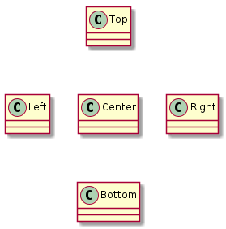

# t00035 - PlantUML class diagram layout hints test case
## Config
```yaml
compilation_database_dir: ..
output_directory: puml
diagrams:
  t00035_class:
    type: class
    glob:
      - ../../tests/t00035/t00035.cc
    using_namespace:
      - clanguml::t00035
    include:
      namespaces:
        - clanguml::t00035
    layout:
      Center:
        - up: Top
        - down: Bottom
        - left: Left
        - right: Right

```
## Source code
File t00035.cc
```cpp
namespace clanguml {
namespace t00035 {

struct Top {
};

struct Left {
};

struct Center {
};

struct Bottom {
};

struct Right {
};

} // namespace t00035
} // namespace clanguml

```
## Generated UML diagrams

