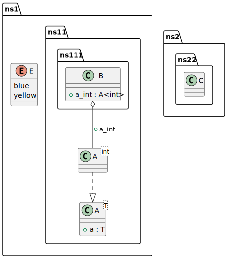

# t00036 - Class diagram with namespaces generated as packages
## Config
```yaml
diagrams:
  t00036_class:
    type: class
    generate_packages: true
    glob:
      - t00036.cc
    using_namespace: clanguml::t00036
    include:
      namespaces:
        - clanguml::t00036
    exclude:
      subclasses:
        - clanguml::t00036::ns2::ns22::D
```
## Source code
File `tests/t00036/t00036.cc`
```cpp
namespace clanguml {
namespace t00036 {

namespace ns1 {

enum class E { blue, yellow };

namespace ns11 {

template <typename T> struct A {
    T a;
};

namespace ns111 {

struct B {
    A<int> a_int;
};

} // namespace ns111
} // namespace ns11
} // namespace ns1

namespace ns2 {
namespace ns22 {

// TODO: Fix for incomplete struct C declaration "struct C;"
struct C { };

struct D { };

} // namespace ns22
} // namespace ns2

namespace ns3 {
namespace ns33 {
namespace detail {
struct DImpl : public ns2::ns22::D { };
}
} // namespace ns33
} // namespace ns3

} // namespace t00036
} // namespace clanguml

```
## Generated PlantUML diagrams

## Generated Mermaid diagrams

## Generated JSON models
```json
{
  "diagram_type": "class",
  "elements": [
    {
      "display_name": "ns1",
      "elements": [
        {
          "constants": [
            "blue",
            "yellow"
          ],
          "display_name": "E",
          "id": "2144761953049158478",
          "is_nested": false,
          "name": "E",
          "namespace": "clanguml::t00036::ns1",
          "source_location": {
            "column": 12,
            "file": "t00036.cc",
            "line": 6,
            "translation_unit": "t00036.cc"
          },
          "type": "enum"
        },
        {
          "display_name": "ns11",
          "elements": [
            {
              "bases": [],
              "display_name": "A<T>",
              "id": "571573305652194946",
              "is_abstract": false,
              "is_nested": false,
              "is_struct": true,
              "is_template": true,
              "is_union": false,
              "members": [
                {
                  "access": "public",
                  "is_static": false,
                  "name": "a",
                  "source_location": {
                    "column": 7,
                    "file": "t00036.cc",
                    "line": 11,
                    "translation_unit": "t00036.cc"
                  },
                  "type": "T"
                }
              ],
              "methods": [],
              "name": "A",
              "namespace": "clanguml::t00036::ns1::ns11",
              "source_location": {
                "column": 30,
                "file": "t00036.cc",
                "line": 10,
                "translation_unit": "t00036.cc"
              },
              "template_parameters": [
                {
                  "is_variadic": false,
                  "kind": "template_type",
                  "name": "T",
                  "template_parameters": []
                }
              ],
              "type": "class"
            },
            {
              "display_name": "ns111",
              "elements": [
                {
                  "bases": [],
                  "display_name": "B",
                  "id": "1964031933563607376",
                  "is_abstract": false,
                  "is_nested": false,
                  "is_struct": true,
                  "is_template": false,
                  "is_union": false,
                  "members": [
                    {
                      "access": "public",
                      "is_static": false,
                      "name": "a_int",
                      "source_location": {
                        "column": 12,
                        "file": "t00036.cc",
                        "line": 17,
                        "translation_unit": "t00036.cc"
                      },
                      "type": "A<int>"
                    }
                  ],
                  "methods": [],
                  "name": "B",
                  "namespace": "clanguml::t00036::ns1::ns11::ns111",
                  "source_location": {
                    "column": 8,
                    "file": "t00036.cc",
                    "line": 16,
                    "translation_unit": "t00036.cc"
                  },
                  "template_parameters": [],
                  "type": "class"
                }
              ],
              "name": "ns111",
              "type": "namespace"
            },
            {
              "bases": [],
              "display_name": "A<int>",
              "id": "1832710427462319797",
              "is_abstract": false,
              "is_nested": false,
              "is_struct": false,
              "is_template": true,
              "is_union": false,
              "members": [],
              "methods": [],
              "name": "A",
              "namespace": "clanguml::t00036::ns1::ns11",
              "source_location": {
                "column": 30,
                "file": "t00036.cc",
                "line": 10,
                "translation_unit": "t00036.cc"
              },
              "template_parameters": [
                {
                  "is_variadic": false,
                  "kind": "argument",
                  "template_parameters": [],
                  "type": "int"
                }
              ],
              "type": "class"
            }
          ],
          "name": "ns11",
          "type": "namespace"
        }
      ],
      "name": "ns1",
      "type": "namespace"
    },
    {
      "display_name": "ns2",
      "elements": [
        {
          "display_name": "ns22",
          "elements": [
            {
              "bases": [],
              "display_name": "C",
              "id": "2038956882066165590",
              "is_abstract": false,
              "is_nested": false,
              "is_struct": true,
              "is_template": false,
              "is_union": false,
              "members": [],
              "methods": [],
              "name": "C",
              "namespace": "clanguml::t00036::ns2::ns22",
              "source_location": {
                "column": 8,
                "file": "t00036.cc",
                "line": 28,
                "translation_unit": "t00036.cc"
              },
              "template_parameters": [],
              "type": "class"
            }
          ],
          "name": "ns22",
          "type": "namespace"
        }
      ],
      "name": "ns2",
      "type": "namespace"
    }
  ],
  "name": "t00036_class",
  "package_type": "namespace",
  "relationships": [
    {
      "access": "public",
      "destination": "1832710427462319797",
      "label": "a_int",
      "source": "1964031933563607376",
      "type": "aggregation"
    },
    {
      "access": "public",
      "destination": "571573305652194946",
      "source": "1832710427462319797",
      "type": "instantiation"
    }
  ],
  "using_namespace": "clanguml::t00036"
}
```
