# t00037 - Anonymous nested struct test case
## Config
```yaml
compilation_database_dir: ..
output_directory: diagrams
diagrams:
  t00037_class:
    type: class
    generate_packages: true
    glob:
      - ../../tests/t00037/t00037.cc
    using_namespace:
      - clanguml::t00037
    include:
      namespaces:
        - clanguml::t00037
```
## Source code
File t00037.cc
```cpp
namespace clanguml {
namespace t00037 {

class ST {
public:
    struct {
        double t;
        double x;
        double y;
        double z;
    } dimensions;

private:
    struct {
        double c{1.0};
        double h{1.0};
    } units;
};

struct A {
    A()
    {
        st.dimensions.t = -1.0;
        st.dimensions.x = 1.0;
        st.dimensions.y = 1.0;
        st.dimensions.z = 1.0;
    }

    ST st;
};

} // namespace t00037
} // namespace clanguml

```
## Generated PlantUML diagrams

## Generated Mermaid diagrams

## Generated JSON models
```json
{
  "diagram_type": "class",
  "elements": [
    {
      "bases": [],
      "display_name": "clanguml::t00037::ST",
      "id": "11203041379038775",
      "is_abstract": false,
      "is_nested": false,
      "is_struct": false,
      "is_template": false,
      "is_union": false,
      "members": [
        {
          "access": "public",
          "is_static": false,
          "name": "dimensions",
          "source_location": {
            "column": 7,
            "file": "../../tests/t00037/t00037.cc",
            "line": 11,
            "translation_unit": "../../tests/t00037/t00037.cc"
          },
          "type": "ST##(anonymous_662)"
        },
        {
          "access": "private",
          "is_static": false,
          "name": "units",
          "source_location": {
            "column": 7,
            "file": "../../tests/t00037/t00037.cc",
            "line": 17,
            "translation_unit": "../../tests/t00037/t00037.cc"
          },
          "type": "ST##(anonymous_792)"
        }
      ],
      "methods": [],
      "name": "ST",
      "namespace": "clanguml::t00037",
      "source_location": {
        "column": 7,
        "file": "../../tests/t00037/t00037.cc",
        "line": 4,
        "translation_unit": "../../tests/t00037/t00037.cc"
      },
      "template_parameters": [],
      "type": "class"
    },
    {
      "bases": [],
      "display_name": "clanguml::t00037::ST::(dimensions)",
      "id": "1980820317972901050",
      "is_abstract": false,
      "is_nested": true,
      "is_struct": true,
      "is_template": false,
      "is_union": false,
      "members": [
        {
          "access": "public",
          "is_static": false,
          "name": "t",
          "source_location": {
            "column": 16,
            "file": "../../tests/t00037/t00037.cc",
            "line": 7,
            "translation_unit": "../../tests/t00037/t00037.cc"
          },
          "type": "double"
        },
        {
          "access": "public",
          "is_static": false,
          "name": "x",
          "source_location": {
            "column": 16,
            "file": "../../tests/t00037/t00037.cc",
            "line": 8,
            "translation_unit": "../../tests/t00037/t00037.cc"
          },
          "type": "double"
        },
        {
          "access": "public",
          "is_static": false,
          "name": "y",
          "source_location": {
            "column": 16,
            "file": "../../tests/t00037/t00037.cc",
            "line": 9,
            "translation_unit": "../../tests/t00037/t00037.cc"
          },
          "type": "double"
        },
        {
          "access": "public",
          "is_static": false,
          "name": "z",
          "source_location": {
            "column": 16,
            "file": "../../tests/t00037/t00037.cc",
            "line": 10,
            "translation_unit": "../../tests/t00037/t00037.cc"
          },
          "type": "double"
        }
      ],
      "methods": [],
      "name": "ST::(dimensions)",
      "namespace": "clanguml::t00037",
      "source_location": {
        "column": 5,
        "file": "../../tests/t00037/t00037.cc",
        "line": 6,
        "translation_unit": "../../tests/t00037/t00037.cc"
      },
      "template_parameters": [],
      "type": "class"
    },
    {
      "bases": [],
      "display_name": "clanguml::t00037::ST::(units)",
      "id": "1811145508890403377",
      "is_abstract": false,
      "is_nested": true,
      "is_struct": true,
      "is_template": false,
      "is_union": false,
      "members": [
        {
          "access": "public",
          "is_static": false,
          "name": "c",
          "source_location": {
            "column": 16,
            "file": "../../tests/t00037/t00037.cc",
            "line": 15,
            "translation_unit": "../../tests/t00037/t00037.cc"
          },
          "type": "double"
        },
        {
          "access": "public",
          "is_static": false,
          "name": "h",
          "source_location": {
            "column": 16,
            "file": "../../tests/t00037/t00037.cc",
            "line": 16,
            "translation_unit": "../../tests/t00037/t00037.cc"
          },
          "type": "double"
        }
      ],
      "methods": [],
      "name": "ST::(units)",
      "namespace": "clanguml::t00037",
      "source_location": {
        "column": 5,
        "file": "../../tests/t00037/t00037.cc",
        "line": 14,
        "translation_unit": "../../tests/t00037/t00037.cc"
      },
      "template_parameters": [],
      "type": "class"
    },
    {
      "bases": [],
      "display_name": "clanguml::t00037::A",
      "id": "1322794181774144954",
      "is_abstract": false,
      "is_nested": false,
      "is_struct": true,
      "is_template": false,
      "is_union": false,
      "members": [
        {
          "access": "public",
          "is_static": false,
          "name": "st",
          "source_location": {
            "column": 8,
            "file": "../../tests/t00037/t00037.cc",
            "line": 29,
            "translation_unit": "../../tests/t00037/t00037.cc"
          },
          "type": "ST"
        }
      ],
      "methods": [
        {
          "access": "public",
          "is_const": false,
          "is_consteval": false,
          "is_constexpr": false,
          "is_constructor": true,
          "is_copy_assignment": false,
          "is_defaulted": false,
          "is_deleted": false,
          "is_move_assignment": false,
          "is_noexcept": false,
          "is_operator": false,
          "is_pure_virtual": false,
          "is_static": false,
          "is_virtual": false,
          "name": "A",
          "parameters": [],
          "source_location": {
            "column": 5,
            "file": "../../tests/t00037/t00037.cc",
            "line": 21,
            "translation_unit": "../../tests/t00037/t00037.cc"
          },
          "type": "void"
        }
      ],
      "name": "A",
      "namespace": "clanguml::t00037",
      "source_location": {
        "column": 8,
        "file": "../../tests/t00037/t00037.cc",
        "line": 20,
        "translation_unit": "../../tests/t00037/t00037.cc"
      },
      "template_parameters": [],
      "type": "class"
    }
  ],
  "metadata": {
    "clang_uml_version": "0.4.1-11-g39d3e1f",
    "llvm_version": "Ubuntu clang version 16.0.6 (++20230710042027+7cbf1a259152-1~exp1~20230710162048.105)",
    "schema_version": 1
  },
  "name": "t00037_class",
  "relationships": [
    {
      "access": "public",
      "destination": "1980820317972901050",
      "label": "dimensions",
      "source": "11203041379038775",
      "type": "aggregation"
    },
    {
      "access": "private",
      "destination": "1811145508890403377",
      "label": "units",
      "source": "11203041379038775",
      "type": "aggregation"
    },
    {
      "access": "public",
      "destination": "11203041379038775",
      "label": "st",
      "source": "1322794181774144954",
      "type": "aggregation"
    }
  ],
  "using_namespace": "clanguml::t00037"
}
```
