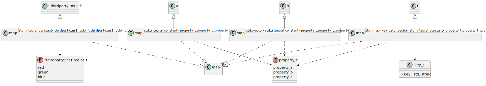

# t00038 - Template instantiation with unexposed nested templates
## Config
```yaml
diagrams:
  t00038_class:
    type: class
    generate_packages: false
    glob:
      - t00038.cc
    using_namespace: clanguml::t00038
    include:
      namespaces:
        - clanguml::t00038
        - thirdparty::ns1
```
## Source code
File `tests/t00038/t00038.cc`
```cpp
#include <map>
#include <string>
#include <type_traits>
#include <vector>

namespace thirdparty {
namespace ns1 {
enum class color_t { red, green, blue };

struct E { };
} // namespace ns1
namespace ns2 {
struct F { };
} // namespace ns2
} // namespace thirdparty

namespace clanguml {
namespace t00038 {

enum class property_t { property_a, property_b, property_c };

struct A { };
struct B { };
struct C { };

struct key_t {
    std::string key;
};

template <typename T> struct map { };

using namespace thirdparty::ns1;

template <> struct map<std::integral_constant<color_t, color_t::red>> : E { };

template <>
struct map<std::integral_constant<clanguml::t00038::property_t,
    clanguml::t00038::property_t::property_a>> : A { };

template <>
struct map<std::vector<
    std::integral_constant<t00038::property_t, t00038::property_t::property_b>>>
    : B { };

template <>
struct map<std::map<key_t,
    std::vector<std::integral_constant<property_t, property_t::property_c>>>>
    : C { };

} // namespace t00038
} // namespace clanguml

```
## Generated PlantUML diagrams

## Generated Mermaid diagrams

## Generated JSON models
```json
{
  "diagram_type": "class",
  "elements": [
    {
      "constants": [
        "red",
        "green",
        "blue"
      ],
      "display_name": "::thirdparty::ns1::color_t",
      "id": "15428046918798798672",
      "is_nested": false,
      "name": "color_t",
      "namespace": "thirdparty::ns1",
      "source_location": {
        "column": 12,
        "file": "t00038.cc",
        "line": 8,
        "translation_unit": "t00038.cc"
      },
      "type": "enum"
    },
    {
      "bases": [],
      "display_name": "::thirdparty::ns1::E",
      "id": "8639528681909371202",
      "is_abstract": false,
      "is_nested": false,
      "is_struct": true,
      "is_template": false,
      "is_union": false,
      "members": [],
      "methods": [],
      "name": "E",
      "namespace": "thirdparty::ns1",
      "source_location": {
        "column": 8,
        "file": "t00038.cc",
        "line": 10,
        "translation_unit": "t00038.cc"
      },
      "template_parameters": [],
      "type": "class"
    },
    {
      "constants": [
        "property_a",
        "property_b",
        "property_c"
      ],
      "display_name": "property_t",
      "id": "15460774761464111654",
      "is_nested": false,
      "name": "property_t",
      "namespace": "clanguml::t00038",
      "source_location": {
        "column": 12,
        "file": "t00038.cc",
        "line": 20,
        "translation_unit": "t00038.cc"
      },
      "type": "enum"
    },
    {
      "bases": [],
      "display_name": "A",
      "id": "14765557717265564533",
      "is_abstract": false,
      "is_nested": false,
      "is_struct": true,
      "is_template": false,
      "is_union": false,
      "members": [],
      "methods": [],
      "name": "A",
      "namespace": "clanguml::t00038",
      "source_location": {
        "column": 8,
        "file": "t00038.cc",
        "line": 22,
        "translation_unit": "t00038.cc"
      },
      "template_parameters": [],
      "type": "class"
    },
    {
      "bases": [],
      "display_name": "B",
      "id": "2462921044532250359",
      "is_abstract": false,
      "is_nested": false,
      "is_struct": true,
      "is_template": false,
      "is_union": false,
      "members": [],
      "methods": [],
      "name": "B",
      "namespace": "clanguml::t00038",
      "source_location": {
        "column": 8,
        "file": "t00038.cc",
        "line": 23,
        "translation_unit": "t00038.cc"
      },
      "template_parameters": [],
      "type": "class"
    },
    {
      "bases": [],
      "display_name": "C",
      "id": "7949218349619182334",
      "is_abstract": false,
      "is_nested": false,
      "is_struct": true,
      "is_template": false,
      "is_union": false,
      "members": [],
      "methods": [],
      "name": "C",
      "namespace": "clanguml::t00038",
      "source_location": {
        "column": 8,
        "file": "t00038.cc",
        "line": 24,
        "translation_unit": "t00038.cc"
      },
      "template_parameters": [],
      "type": "class"
    },
    {
      "bases": [],
      "display_name": "key_t",
      "id": "7766243516203693231",
      "is_abstract": false,
      "is_nested": false,
      "is_struct": true,
      "is_template": false,
      "is_union": false,
      "members": [
        {
          "access": "public",
          "is_static": false,
          "name": "key",
          "source_location": {
            "column": 17,
            "file": "t00038.cc",
            "line": 27,
            "translation_unit": "t00038.cc"
          },
          "type": "std::string"
        }
      ],
      "methods": [],
      "name": "key_t",
      "namespace": "clanguml::t00038",
      "source_location": {
        "column": 8,
        "file": "t00038.cc",
        "line": 26,
        "translation_unit": "t00038.cc"
      },
      "template_parameters": [],
      "type": "class"
    },
    {
      "bases": [],
      "display_name": "map<T>",
      "id": "16500072314754131417",
      "is_abstract": false,
      "is_nested": false,
      "is_struct": true,
      "is_template": true,
      "is_union": false,
      "members": [],
      "methods": [],
      "name": "map",
      "namespace": "clanguml::t00038",
      "source_location": {
        "column": 30,
        "file": "t00038.cc",
        "line": 30,
        "translation_unit": "t00038.cc"
      },
      "template_parameters": [
        {
          "is_variadic": false,
          "kind": "template_type",
          "name": "T",
          "template_parameters": []
        }
      ],
      "type": "class"
    },
    {
      "bases": [
        {
          "access": "public",
          "id": "8639528681909371202",
          "is_virtual": false
        }
      ],
      "display_name": "map<std::integral_constant<thirdparty::ns1::color_t,thirdparty::ns1::color_t::red>>",
      "id": "16856696305322242439",
      "is_abstract": false,
      "is_nested": false,
      "is_struct": true,
      "is_template": true,
      "is_union": false,
      "members": [],
      "methods": [],
      "name": "map",
      "namespace": "clanguml::t00038",
      "source_location": {
        "column": 20,
        "file": "t00038.cc",
        "line": 34,
        "translation_unit": "t00038.cc"
      },
      "template_parameters": [
        {
          "is_variadic": false,
          "kind": "argument",
          "template_parameters": [
            {
              "is_variadic": false,
              "kind": "argument",
              "template_parameters": [],
              "type": "thirdparty::ns1::color_t"
            },
            {
              "is_variadic": false,
              "kind": "argument",
              "template_parameters": [],
              "type": "thirdparty::ns1::color_t::red"
            }
          ],
          "type": "std::integral_constant"
        }
      ],
      "type": "class"
    },
    {
      "bases": [
        {
          "access": "public",
          "id": "14765557717265564533",
          "is_virtual": false
        }
      ],
      "display_name": "map<std::integral_constant<property_t,property_t::property_a>>",
      "id": "10362329718372097307",
      "is_abstract": false,
      "is_nested": false,
      "is_struct": true,
      "is_template": true,
      "is_union": false,
      "members": [],
      "methods": [],
      "name": "map",
      "namespace": "clanguml::t00038",
      "source_location": {
        "column": 8,
        "file": "t00038.cc",
        "line": 37,
        "translation_unit": "t00038.cc"
      },
      "template_parameters": [
        {
          "is_variadic": false,
          "kind": "argument",
          "template_parameters": [
            {
              "is_variadic": false,
              "kind": "argument",
              "template_parameters": [],
              "type": "clanguml::t00038::property_t"
            },
            {
              "is_variadic": false,
              "kind": "argument",
              "template_parameters": [],
              "type": "clanguml::t00038::property_t::property_a"
            }
          ],
          "type": "std::integral_constant"
        }
      ],
      "type": "class"
    },
    {
      "bases": [
        {
          "access": "public",
          "id": "2462921044532250359",
          "is_virtual": false
        }
      ],
      "display_name": "map<std::vector<std::integral_constant<property_t,property_t::property_b>>>",
      "id": "7576250168582320241",
      "is_abstract": false,
      "is_nested": false,
      "is_struct": true,
      "is_template": true,
      "is_union": false,
      "members": [],
      "methods": [],
      "name": "map",
      "namespace": "clanguml::t00038",
      "source_location": {
        "column": 8,
        "file": "t00038.cc",
        "line": 41,
        "translation_unit": "t00038.cc"
      },
      "template_parameters": [
        {
          "is_variadic": false,
          "kind": "argument",
          "template_parameters": [
            {
              "is_variadic": false,
              "kind": "argument",
              "template_parameters": [
                {
                  "is_variadic": false,
                  "kind": "argument",
                  "template_parameters": [],
                  "type": "clanguml::t00038::property_t"
                },
                {
                  "is_variadic": false,
                  "kind": "argument",
                  "template_parameters": [],
                  "type": "clanguml::t00038::property_t::property_b"
                }
              ],
              "type": "std::integral_constant"
            }
          ],
          "type": "std::vector"
        }
      ],
      "type": "class"
    },
    {
      "bases": [
        {
          "access": "public",
          "id": "7949218349619182334",
          "is_virtual": false
        }
      ],
      "display_name": "map<std::map<key_t,std::vector<std::integral_constant<property_t,property_t::property_c>>>>",
      "id": "16648797637930028107",
      "is_abstract": false,
      "is_nested": false,
      "is_struct": true,
      "is_template": true,
      "is_union": false,
      "members": [],
      "methods": [],
      "name": "map",
      "namespace": "clanguml::t00038",
      "source_location": {
        "column": 8,
        "file": "t00038.cc",
        "line": 46,
        "translation_unit": "t00038.cc"
      },
      "template_parameters": [
        {
          "is_variadic": false,
          "kind": "argument",
          "template_parameters": [
            {
              "is_variadic": false,
              "kind": "argument",
              "template_parameters": [],
              "type": "clanguml::t00038::key_t"
            },
            {
              "is_variadic": false,
              "kind": "argument",
              "template_parameters": [
                {
                  "is_variadic": false,
                  "kind": "argument",
                  "template_parameters": [
                    {
                      "is_variadic": false,
                      "kind": "argument",
                      "template_parameters": [],
                      "type": "clanguml::t00038::property_t"
                    },
                    {
                      "is_variadic": false,
                      "kind": "argument",
                      "template_parameters": [],
                      "type": "clanguml::t00038::property_t::property_c"
                    }
                  ],
                  "type": "std::integral_constant"
                }
              ],
              "type": "std::vector"
            }
          ],
          "type": "std::map"
        }
      ],
      "type": "class"
    }
  ],
  "name": "t00038_class",
  "package_type": "namespace",
  "relationships": [
    {
      "access": "public",
      "destination": "15428046918798798672",
      "source": "16856696305322242439",
      "type": "dependency"
    },
    {
      "access": "public",
      "destination": "16500072314754131417",
      "source": "16856696305322242439",
      "type": "instantiation"
    },
    {
      "access": "public",
      "destination": "8639528681909371202",
      "source": "16856696305322242439",
      "type": "extension"
    },
    {
      "access": "public",
      "destination": "15460774761464111654",
      "source": "10362329718372097307",
      "type": "dependency"
    },
    {
      "access": "public",
      "destination": "16500072314754131417",
      "source": "10362329718372097307",
      "type": "instantiation"
    },
    {
      "access": "public",
      "destination": "14765557717265564533",
      "source": "10362329718372097307",
      "type": "extension"
    },
    {
      "access": "public",
      "destination": "15460774761464111654",
      "source": "7576250168582320241",
      "type": "dependency"
    },
    {
      "access": "public",
      "destination": "16500072314754131417",
      "source": "7576250168582320241",
      "type": "instantiation"
    },
    {
      "access": "public",
      "destination": "2462921044532250359",
      "source": "7576250168582320241",
      "type": "extension"
    },
    {
      "access": "public",
      "destination": "7766243516203693231",
      "source": "16648797637930028107",
      "type": "dependency"
    },
    {
      "access": "public",
      "destination": "15460774761464111654",
      "source": "16648797637930028107",
      "type": "dependency"
    },
    {
      "access": "public",
      "destination": "16500072314754131417",
      "source": "16648797637930028107",
      "type": "instantiation"
    },
    {
      "access": "public",
      "destination": "7949218349619182334",
      "source": "16648797637930028107",
      "type": "extension"
    }
  ],
  "using_namespace": "clanguml::t00038"
}
```
## Generated GraphML models
```xml
<?xml version="1.0"?>
<graphml xmlns="http://graphml.graphdrawing.org/xmlns" xmlns:xsi="http://www.w3.org/2001/XMLSchema-instance" xsi:schemaLocation="http://graphml.graphdrawing.org/xmlns http://graphml.graphdrawing.org/xmlns/1.0/graphml.xsd">
 <key attr.name="id" attr.type="string" for="graph" id="gd0" />
 <key attr.name="diagram_type" attr.type="string" for="graph" id="gd1" />
 <key attr.name="name" attr.type="string" for="graph" id="gd2" />
 <key attr.name="using_namespace" attr.type="string" for="graph" id="gd3" />
 <key attr.name="id" attr.type="string" for="node" id="nd0" />
 <key attr.name="type" attr.type="string" for="node" id="nd1" />
 <key attr.name="name" attr.type="string" for="node" id="nd2" />
 <key attr.name="stereotype" attr.type="string" for="node" id="nd3" />
 <key attr.name="url" attr.type="string" for="node" id="nd4" />
 <key attr.name="tooltip" attr.type="string" for="node" id="nd5" />
 <key attr.name="is_template" attr.type="boolean" for="node" id="nd6" />
 <key attr.name="type" attr.type="string" for="edge" id="ed0" />
 <key attr.name="access" attr.type="string" for="edge" id="ed1" />
 <key attr.name="label" attr.type="string" for="edge" id="ed2" />
 <key attr.name="url" attr.type="string" for="edge" id="ed3" />
 <graph id="g0" edgedefault="directed" parse.nodeids="canonical" parse.edgeids="canonical" parse.order="nodesfirst">
  <data key="gd3">clanguml::t00038</data>
  <node id="n0">
   <data key="nd1">enum</data>
   <data key="nd2"><![CDATA[::thirdparty::ns1::color_t]]></data>
  </node>
  <node id="n1">
   <data key="nd1">class</data>
   <data key="nd2"><![CDATA[::thirdparty::ns1::E]]></data>
   <data key="nd6">false</data>
  </node>
  <node id="n2">
   <data key="nd1">enum</data>
   <data key="nd2"><![CDATA[property_t]]></data>
  </node>
  <node id="n3">
   <data key="nd1">class</data>
   <data key="nd2"><![CDATA[A]]></data>
   <data key="nd6">false</data>
  </node>
  <node id="n4">
   <data key="nd1">class</data>
   <data key="nd2"><![CDATA[B]]></data>
   <data key="nd6">false</data>
  </node>
  <node id="n5">
   <data key="nd1">class</data>
   <data key="nd2"><![CDATA[C]]></data>
   <data key="nd6">false</data>
  </node>
  <node id="n6">
   <data key="nd1">class</data>
   <data key="nd2"><![CDATA[key_t]]></data>
   <data key="nd6">false</data>
  </node>
  <node id="n7">
   <data key="nd1">class</data>
   <data key="nd2"><![CDATA[map<T>]]></data>
   <data key="nd6">true</data>
  </node>
  <node id="n8">
   <data key="nd1">class</data>
   <data key="nd2"><![CDATA[map<std::integral_constant<thirdparty::ns1::color_t,thirdparty::ns1::color_t::red>>]]></data>
   <data key="nd6">true</data>
  </node>
  <node id="n9">
   <data key="nd1">class</data>
   <data key="nd2"><![CDATA[map<std::integral_constant<property_t,property_t::property_a>>]]></data>
   <data key="nd6">true</data>
  </node>
  <node id="n10">
   <data key="nd1">class</data>
   <data key="nd2"><![CDATA[map<std::vector<std::integral_constant<property_t,property_t::property_b>>>]]></data>
   <data key="nd6">true</data>
  </node>
  <node id="n11">
   <data key="nd1">class</data>
   <data key="nd2"><![CDATA[map<std::map<key_t,std::vector<std::integral_constant<property_t,property_t::property_c>>>>]]></data>
   <data key="nd6">true</data>
  </node>
  <edge id="e0" source="n8" target="n0">
   <data key="ed0">dependency</data>
   <data key="ed1">public</data>
  </edge>
  <edge id="e1" source="n8" target="n7">
   <data key="ed0">instantiation</data>
   <data key="ed1">public</data>
  </edge>
  <edge id="e2" source="n8" target="n1">
   <data key="ed0">extension</data>
   <data key="ed1">public</data>
  </edge>
  <edge id="e3" source="n9" target="n2">
   <data key="ed0">dependency</data>
   <data key="ed1">public</data>
  </edge>
  <edge id="e4" source="n9" target="n7">
   <data key="ed0">instantiation</data>
   <data key="ed1">public</data>
  </edge>
  <edge id="e5" source="n9" target="n3">
   <data key="ed0">extension</data>
   <data key="ed1">public</data>
  </edge>
  <edge id="e6" source="n10" target="n2">
   <data key="ed0">dependency</data>
   <data key="ed1">public</data>
  </edge>
  <edge id="e7" source="n10" target="n7">
   <data key="ed0">instantiation</data>
   <data key="ed1">public</data>
  </edge>
  <edge id="e8" source="n10" target="n4">
   <data key="ed0">extension</data>
   <data key="ed1">public</data>
  </edge>
  <edge id="e9" source="n11" target="n6">
   <data key="ed0">dependency</data>
   <data key="ed1">public</data>
  </edge>
  <edge id="e10" source="n11" target="n2">
   <data key="ed0">dependency</data>
   <data key="ed1">public</data>
  </edge>
  <edge id="e11" source="n11" target="n7">
   <data key="ed0">instantiation</data>
   <data key="ed1">public</data>
  </edge>
  <edge id="e12" source="n11" target="n5">
   <data key="ed0">extension</data>
   <data key="ed1">public</data>
  </edge>
 </graph>
</graphml>

```
