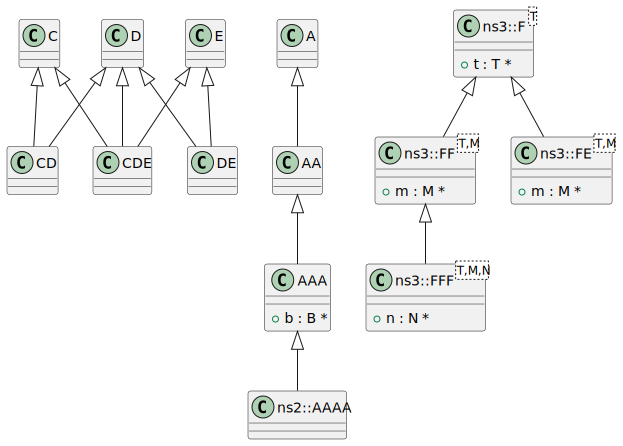

# t00039 - Subclass class diagram filter test
## Config
```yaml
diagrams:
  t00039_class:
    type: class
    generate_packages: false
    glob:
      - t00039.cc
    using_namespace: clanguml::t00039
    include:
      subclasses:
        - clanguml::t00039::A
        - clanguml::t00039::C
        - clanguml::t00039::D
        - clanguml::t00039::E
        - clanguml::t00039::ns3::F<T>
      relationships:
        - inheritance
    exclude:
      namespaces:
        - std
        - clanguml::t00039::detail
        - clanguml::t00039::ns3::detail
```
## Source code
File `tests/t00039/t00039.cc`
```cpp
#include <string>

namespace clanguml::t00039 {
struct B { };

struct C { };

struct D { };

struct E { };

namespace ns1 {
struct BB : public B { };
} // namespace ns1

struct CD : public C, public D { };

struct DE : public D, public E { };

struct CDE : public C, public D, public E { };

struct A { };

struct AA : public A { };

struct AAA : public AA {
    B *b;
};

namespace ns2 {
struct AAAA : public virtual AAA { };
} // namespace ns2

namespace detail {
struct AA : public A { };
} // namespace detail

namespace ns3 {
template <typename T> struct F {
    T *t;
};

template <typename T, typename M> struct FF : public F<T> {
    M *m;
};

template <typename T, typename M> struct FE : public F<T> {
    M *m;
};

template <typename T, typename M, typename N> struct FFF : public FF<T, M> {
    N *n;
};

} // namespace ns3
} // namespace clanguml::t00039

```
## Generated PlantUML diagrams

## Generated Mermaid diagrams

## Generated JSON models
```json
{
  "diagram_type": "class",
  "elements": [
    {
      "bases": [],
      "display_name": "C",
      "id": "241234977032861936",
      "is_abstract": false,
      "is_nested": false,
      "is_struct": true,
      "is_template": false,
      "is_union": false,
      "members": [],
      "methods": [],
      "name": "C",
      "namespace": "clanguml::t00039",
      "source_location": {
        "column": 8,
        "file": "t00039.cc",
        "line": 6,
        "translation_unit": "t00039.cc"
      },
      "template_parameters": [],
      "type": "class"
    },
    {
      "bases": [],
      "display_name": "D",
      "id": "1975187139659616784",
      "is_abstract": false,
      "is_nested": false,
      "is_struct": true,
      "is_template": false,
      "is_union": false,
      "members": [],
      "methods": [],
      "name": "D",
      "namespace": "clanguml::t00039",
      "source_location": {
        "column": 8,
        "file": "t00039.cc",
        "line": 8,
        "translation_unit": "t00039.cc"
      },
      "template_parameters": [],
      "type": "class"
    },
    {
      "bases": [],
      "display_name": "E",
      "id": "1959131184346890363",
      "is_abstract": false,
      "is_nested": false,
      "is_struct": true,
      "is_template": false,
      "is_union": false,
      "members": [],
      "methods": [],
      "name": "E",
      "namespace": "clanguml::t00039",
      "source_location": {
        "column": 8,
        "file": "t00039.cc",
        "line": 10,
        "translation_unit": "t00039.cc"
      },
      "template_parameters": [],
      "type": "class"
    },
    {
      "bases": [
        {
          "access": "public",
          "id": "241234977032861936",
          "is_virtual": false,
          "name": "clanguml::t00039::C"
        },
        {
          "access": "public",
          "id": "1975187139659616784",
          "is_virtual": false,
          "name": "clanguml::t00039::D"
        }
      ],
      "display_name": "CD",
      "id": "850483622527996929",
      "is_abstract": false,
      "is_nested": false,
      "is_struct": true,
      "is_template": false,
      "is_union": false,
      "members": [],
      "methods": [],
      "name": "CD",
      "namespace": "clanguml::t00039",
      "source_location": {
        "column": 8,
        "file": "t00039.cc",
        "line": 16,
        "translation_unit": "t00039.cc"
      },
      "template_parameters": [],
      "type": "class"
    },
    {
      "bases": [
        {
          "access": "public",
          "id": "1975187139659616784",
          "is_virtual": false,
          "name": "clanguml::t00039::D"
        },
        {
          "access": "public",
          "id": "1959131184346890363",
          "is_virtual": false,
          "name": "clanguml::t00039::E"
        }
      ],
      "display_name": "DE",
      "id": "1316022308303681160",
      "is_abstract": false,
      "is_nested": false,
      "is_struct": true,
      "is_template": false,
      "is_union": false,
      "members": [],
      "methods": [],
      "name": "DE",
      "namespace": "clanguml::t00039",
      "source_location": {
        "column": 8,
        "file": "t00039.cc",
        "line": 18,
        "translation_unit": "t00039.cc"
      },
      "template_parameters": [],
      "type": "class"
    },
    {
      "bases": [
        {
          "access": "public",
          "id": "241234977032861936",
          "is_virtual": false,
          "name": "clanguml::t00039::C"
        },
        {
          "access": "public",
          "id": "1975187139659616784",
          "is_virtual": false,
          "name": "clanguml::t00039::D"
        },
        {
          "access": "public",
          "id": "1959131184346890363",
          "is_virtual": false,
          "name": "clanguml::t00039::E"
        }
      ],
      "display_name": "CDE",
      "id": "1877487144594774465",
      "is_abstract": false,
      "is_nested": false,
      "is_struct": true,
      "is_template": false,
      "is_union": false,
      "members": [],
      "methods": [],
      "name": "CDE",
      "namespace": "clanguml::t00039",
      "source_location": {
        "column": 8,
        "file": "t00039.cc",
        "line": 20,
        "translation_unit": "t00039.cc"
      },
      "template_parameters": [],
      "type": "class"
    },
    {
      "bases": [],
      "display_name": "A",
      "id": "1051171525946759825",
      "is_abstract": false,
      "is_nested": false,
      "is_struct": true,
      "is_template": false,
      "is_union": false,
      "members": [],
      "methods": [],
      "name": "A",
      "namespace": "clanguml::t00039",
      "source_location": {
        "column": 8,
        "file": "t00039.cc",
        "line": 22,
        "translation_unit": "t00039.cc"
      },
      "template_parameters": [],
      "type": "class"
    },
    {
      "bases": [
        {
          "access": "public",
          "id": "1051171525946759825",
          "is_virtual": false,
          "name": "clanguml::t00039::A"
        }
      ],
      "display_name": "AA",
      "id": "1761969273600680013",
      "is_abstract": false,
      "is_nested": false,
      "is_struct": true,
      "is_template": false,
      "is_union": false,
      "members": [],
      "methods": [],
      "name": "AA",
      "namespace": "clanguml::t00039",
      "source_location": {
        "column": 8,
        "file": "t00039.cc",
        "line": 24,
        "translation_unit": "t00039.cc"
      },
      "template_parameters": [],
      "type": "class"
    },
    {
      "bases": [
        {
          "access": "public",
          "id": "1761969273600680013",
          "is_virtual": false,
          "name": "clanguml::t00039::AA"
        }
      ],
      "display_name": "AAA",
      "id": "2158483243842147804",
      "is_abstract": false,
      "is_nested": false,
      "is_struct": true,
      "is_template": false,
      "is_union": false,
      "members": [
        {
          "access": "public",
          "is_static": false,
          "name": "b",
          "source_location": {
            "column": 8,
            "file": "t00039.cc",
            "line": 27,
            "translation_unit": "t00039.cc"
          },
          "type": "B *"
        }
      ],
      "methods": [],
      "name": "AAA",
      "namespace": "clanguml::t00039",
      "source_location": {
        "column": 8,
        "file": "t00039.cc",
        "line": 26,
        "translation_unit": "t00039.cc"
      },
      "template_parameters": [],
      "type": "class"
    },
    {
      "bases": [
        {
          "access": "public",
          "id": "2158483243842147804",
          "is_virtual": true,
          "name": "clanguml::t00039::AAA"
        }
      ],
      "display_name": "ns2::AAAA",
      "id": "1857294881176816154",
      "is_abstract": false,
      "is_nested": false,
      "is_struct": true,
      "is_template": false,
      "is_union": false,
      "members": [],
      "methods": [],
      "name": "AAAA",
      "namespace": "clanguml::t00039::ns2",
      "source_location": {
        "column": 8,
        "file": "t00039.cc",
        "line": 31,
        "translation_unit": "t00039.cc"
      },
      "template_parameters": [],
      "type": "class"
    },
    {
      "bases": [],
      "display_name": "ns3::F<T>",
      "id": "955785395599769805",
      "is_abstract": false,
      "is_nested": false,
      "is_struct": true,
      "is_template": true,
      "is_union": false,
      "members": [
        {
          "access": "public",
          "is_static": false,
          "name": "t",
          "source_location": {
            "column": 8,
            "file": "t00039.cc",
            "line": 40,
            "translation_unit": "t00039.cc"
          },
          "type": "T *"
        }
      ],
      "methods": [],
      "name": "F",
      "namespace": "clanguml::t00039::ns3",
      "source_location": {
        "column": 30,
        "file": "t00039.cc",
        "line": 39,
        "translation_unit": "t00039.cc"
      },
      "template_parameters": [
        {
          "is_variadic": false,
          "kind": "template_type",
          "name": "T",
          "template_parameters": []
        }
      ],
      "type": "class"
    },
    {
      "bases": [
        {
          "access": "public",
          "id": "955785395599769805",
          "is_virtual": false,
          "name": "clanguml::t00039::ns3::F<T>"
        }
      ],
      "display_name": "ns3::FF<T,M>",
      "id": "1321996888067531304",
      "is_abstract": false,
      "is_nested": false,
      "is_struct": true,
      "is_template": true,
      "is_union": false,
      "members": [
        {
          "access": "public",
          "is_static": false,
          "name": "m",
          "source_location": {
            "column": 8,
            "file": "t00039.cc",
            "line": 44,
            "translation_unit": "t00039.cc"
          },
          "type": "M *"
        }
      ],
      "methods": [],
      "name": "FF",
      "namespace": "clanguml::t00039::ns3",
      "source_location": {
        "column": 42,
        "file": "t00039.cc",
        "line": 43,
        "translation_unit": "t00039.cc"
      },
      "template_parameters": [
        {
          "is_variadic": false,
          "kind": "template_type",
          "name": "T",
          "template_parameters": []
        },
        {
          "is_variadic": false,
          "kind": "template_type",
          "name": "M",
          "template_parameters": []
        }
      ],
      "type": "class"
    },
    {
      "bases": [
        {
          "access": "public",
          "id": "955785395599769805",
          "is_virtual": false,
          "name": "clanguml::t00039::ns3::F<T>"
        }
      ],
      "display_name": "ns3::FE<T,M>",
      "id": "2008055732881129924",
      "is_abstract": false,
      "is_nested": false,
      "is_struct": true,
      "is_template": true,
      "is_union": false,
      "members": [
        {
          "access": "public",
          "is_static": false,
          "name": "m",
          "source_location": {
            "column": 8,
            "file": "t00039.cc",
            "line": 48,
            "translation_unit": "t00039.cc"
          },
          "type": "M *"
        }
      ],
      "methods": [],
      "name": "FE",
      "namespace": "clanguml::t00039::ns3",
      "source_location": {
        "column": 42,
        "file": "t00039.cc",
        "line": 47,
        "translation_unit": "t00039.cc"
      },
      "template_parameters": [
        {
          "is_variadic": false,
          "kind": "template_type",
          "name": "T",
          "template_parameters": []
        },
        {
          "is_variadic": false,
          "kind": "template_type",
          "name": "M",
          "template_parameters": []
        }
      ],
      "type": "class"
    },
    {
      "bases": [
        {
          "access": "public",
          "id": "1321996888067531304",
          "is_virtual": false,
          "name": "clanguml::t00039::ns3::FF<T,M>"
        }
      ],
      "display_name": "ns3::FFF<T,M,N>",
      "id": "1617455840736919039",
      "is_abstract": false,
      "is_nested": false,
      "is_struct": true,
      "is_template": true,
      "is_union": false,
      "members": [
        {
          "access": "public",
          "is_static": false,
          "name": "n",
          "source_location": {
            "column": 8,
            "file": "t00039.cc",
            "line": 52,
            "translation_unit": "t00039.cc"
          },
          "type": "N *"
        }
      ],
      "methods": [],
      "name": "FFF",
      "namespace": "clanguml::t00039::ns3",
      "source_location": {
        "column": 54,
        "file": "t00039.cc",
        "line": 51,
        "translation_unit": "t00039.cc"
      },
      "template_parameters": [
        {
          "is_variadic": false,
          "kind": "template_type",
          "name": "T",
          "template_parameters": []
        },
        {
          "is_variadic": false,
          "kind": "template_type",
          "name": "M",
          "template_parameters": []
        },
        {
          "is_variadic": false,
          "kind": "template_type",
          "name": "N",
          "template_parameters": []
        }
      ],
      "type": "class"
    }
  ],
  "name": "t00039_class",
  "package_type": "namespace",
  "relationships": [
    {
      "access": "public",
      "destination": "241234977032861936",
      "source": "850483622527996929",
      "type": "extension"
    },
    {
      "access": "public",
      "destination": "1975187139659616784",
      "source": "850483622527996929",
      "type": "extension"
    },
    {
      "access": "public",
      "destination": "1975187139659616784",
      "source": "1316022308303681160",
      "type": "extension"
    },
    {
      "access": "public",
      "destination": "1959131184346890363",
      "source": "1316022308303681160",
      "type": "extension"
    },
    {
      "access": "public",
      "destination": "241234977032861936",
      "source": "1877487144594774465",
      "type": "extension"
    },
    {
      "access": "public",
      "destination": "1975187139659616784",
      "source": "1877487144594774465",
      "type": "extension"
    },
    {
      "access": "public",
      "destination": "1959131184346890363",
      "source": "1877487144594774465",
      "type": "extension"
    },
    {
      "access": "public",
      "destination": "1051171525946759825",
      "source": "1761969273600680013",
      "type": "extension"
    },
    {
      "access": "public",
      "destination": "1761969273600680013",
      "source": "2158483243842147804",
      "type": "extension"
    },
    {
      "access": "public",
      "destination": "2158483243842147804",
      "source": "1857294881176816154",
      "type": "extension"
    },
    {
      "access": "public",
      "destination": "955785395599769805",
      "source": "1321996888067531304",
      "type": "extension"
    },
    {
      "access": "public",
      "destination": "955785395599769805",
      "source": "2008055732881129924",
      "type": "extension"
    },
    {
      "access": "public",
      "destination": "1321996888067531304",
      "source": "1617455840736919039",
      "type": "extension"
    }
  ],
  "using_namespace": "clanguml::t00039"
}
```
