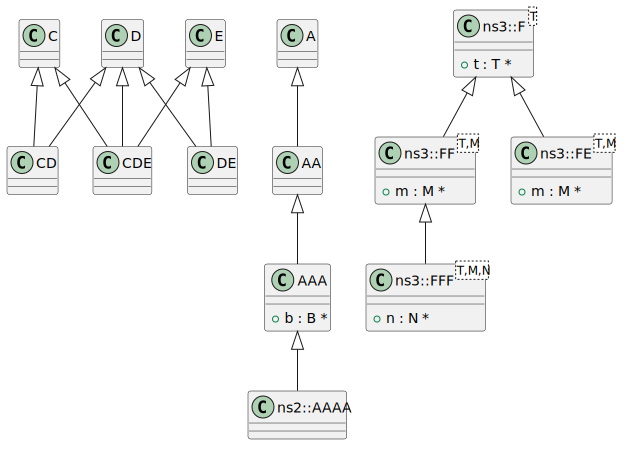

# t00039 - Subclass class diagram filter test
## Config
```yaml
diagrams:
  t00039_class:
    type: class
    generate_packages: false
    glob:
      - t00039.cc
    using_namespace: clanguml::t00039
    include:
      subclasses:
        - clanguml::t00039::A
        - clanguml::t00039::C
        - clanguml::t00039::D
        - clanguml::t00039::E
        - clanguml::t00039::ns3::F<T>
      relationships:
        - inheritance
    exclude:
      namespaces:
        - std
        - clanguml::t00039::detail
        - clanguml::t00039::ns3::detail
```
## Source code
File `tests/t00039/t00039.cc`
```cpp
#include <string>

namespace clanguml::t00039 {
struct B { };

struct C { };

struct D { };

struct E { };

namespace ns1 {
struct BB : public B { };
} // namespace ns1

struct CD : public C, public D { };

struct DE : public D, public E { };

struct CDE : public C, public D, public E { };

struct A { };

struct AA : public A { };

struct AAA : public AA {
    B *b;
};

namespace ns2 {
struct AAAA : public virtual AAA { };
} // namespace ns2

namespace detail {
struct AA : public A { };
} // namespace detail

namespace ns3 {
template <typename T> struct F {
    T *t;
};

template <typename T, typename M> struct FF : public F<T> {
    M *m;
};

template <typename T, typename M> struct FE : public F<T> {
    M *m;
};

template <typename T, typename M, typename N> struct FFF : public FF<T, M> {
    N *n;
};

} // namespace ns3
} // namespace clanguml::t00039

```
## Generated PlantUML diagrams

## Generated Mermaid diagrams

## Generated JSON models
```json
{
  "diagram_type": "class",
  "elements": [
    {
      "bases": [],
      "display_name": "C",
      "id": "4853994850187719583",
      "is_abstract": false,
      "is_nested": false,
      "is_struct": true,
      "is_template": false,
      "is_union": false,
      "members": [],
      "methods": [],
      "name": "C",
      "namespace": "clanguml::t00039",
      "source_location": {
        "column": 8,
        "file": "t00039.cc",
        "line": 6,
        "translation_unit": "t00039.cc"
      },
      "template_parameters": [],
      "type": "class"
    },
    {
      "bases": [],
      "display_name": "D",
      "id": "16659948163365164937",
      "is_abstract": false,
      "is_nested": false,
      "is_struct": true,
      "is_template": false,
      "is_union": false,
      "members": [],
      "methods": [],
      "name": "D",
      "namespace": "clanguml::t00039",
      "source_location": {
        "column": 8,
        "file": "t00039.cc",
        "line": 8,
        "translation_unit": "t00039.cc"
      },
      "template_parameters": [],
      "type": "class"
    },
    {
      "bases": [],
      "display_name": "E",
      "id": "4064276141037703698",
      "is_abstract": false,
      "is_nested": false,
      "is_struct": true,
      "is_template": false,
      "is_union": false,
      "members": [],
      "methods": [],
      "name": "E",
      "namespace": "clanguml::t00039",
      "source_location": {
        "column": 8,
        "file": "t00039.cc",
        "line": 10,
        "translation_unit": "t00039.cc"
      },
      "template_parameters": [],
      "type": "class"
    },
    {
      "bases": [
        {
          "access": "public",
          "id": "4853994850187719583",
          "is_virtual": false
        },
        {
          "access": "public",
          "id": "16659948163365164937",
          "is_virtual": false
        }
      ],
      "display_name": "CD",
      "id": "17297466583800227874",
      "is_abstract": false,
      "is_nested": false,
      "is_struct": true,
      "is_template": false,
      "is_union": false,
      "members": [],
      "methods": [],
      "name": "CD",
      "namespace": "clanguml::t00039",
      "source_location": {
        "column": 8,
        "file": "t00039.cc",
        "line": 16,
        "translation_unit": "t00039.cc"
      },
      "template_parameters": [],
      "type": "class"
    },
    {
      "bases": [
        {
          "access": "public",
          "id": "16659948163365164937",
          "is_virtual": false
        },
        {
          "access": "public",
          "id": "4064276141037703698",
          "is_virtual": false
        }
      ],
      "display_name": "DE",
      "id": "10723197420744843542",
      "is_abstract": false,
      "is_nested": false,
      "is_struct": true,
      "is_template": false,
      "is_union": false,
      "members": [],
      "methods": [],
      "name": "DE",
      "namespace": "clanguml::t00039",
      "source_location": {
        "column": 8,
        "file": "t00039.cc",
        "line": 18,
        "translation_unit": "t00039.cc"
      },
      "template_parameters": [],
      "type": "class"
    },
    {
      "bases": [
        {
          "access": "public",
          "id": "4853994850187719583",
          "is_virtual": false
        },
        {
          "access": "public",
          "id": "16659948163365164937",
          "is_virtual": false
        },
        {
          "access": "public",
          "id": "4064276141037703698",
          "is_virtual": false
        }
      ],
      "display_name": "CDE",
      "id": "12963734792484528448",
      "is_abstract": false,
      "is_nested": false,
      "is_struct": true,
      "is_template": false,
      "is_union": false,
      "members": [],
      "methods": [],
      "name": "CDE",
      "namespace": "clanguml::t00039",
      "source_location": {
        "column": 8,
        "file": "t00039.cc",
        "line": 20,
        "translation_unit": "t00039.cc"
      },
      "template_parameters": [],
      "type": "class"
    },
    {
      "bases": [],
      "display_name": "A",
      "id": "15498673742947339593",
      "is_abstract": false,
      "is_nested": false,
      "is_struct": true,
      "is_template": false,
      "is_union": false,
      "members": [],
      "methods": [],
      "name": "A",
      "namespace": "clanguml::t00039",
      "source_location": {
        "column": 8,
        "file": "t00039.cc",
        "line": 22,
        "translation_unit": "t00039.cc"
      },
      "template_parameters": [],
      "type": "class"
    },
    {
      "bases": [
        {
          "access": "public",
          "id": "15498673742947339593",
          "is_virtual": false
        }
      ],
      "display_name": "AA",
      "id": "14499891710939185384",
      "is_abstract": false,
      "is_nested": false,
      "is_struct": true,
      "is_template": false,
      "is_union": false,
      "members": [],
      "methods": [],
      "name": "AA",
      "namespace": "clanguml::t00039",
      "source_location": {
        "column": 8,
        "file": "t00039.cc",
        "line": 24,
        "translation_unit": "t00039.cc"
      },
      "template_parameters": [],
      "type": "class"
    },
    {
      "bases": [
        {
          "access": "public",
          "id": "14499891710939185384",
          "is_virtual": false
        }
      ],
      "display_name": "AAA",
      "id": "6186491521727460050",
      "is_abstract": false,
      "is_nested": false,
      "is_struct": true,
      "is_template": false,
      "is_union": false,
      "members": [
        {
          "access": "public",
          "is_static": false,
          "name": "b",
          "source_location": {
            "column": 8,
            "file": "t00039.cc",
            "line": 27,
            "translation_unit": "t00039.cc"
          },
          "type": "B *"
        }
      ],
      "methods": [],
      "name": "AAA",
      "namespace": "clanguml::t00039",
      "source_location": {
        "column": 8,
        "file": "t00039.cc",
        "line": 26,
        "translation_unit": "t00039.cc"
      },
      "template_parameters": [],
      "type": "class"
    },
    {
      "bases": [
        {
          "access": "public",
          "id": "6186491521727460050",
          "is_virtual": true
        }
      ],
      "display_name": "ns2::AAAA",
      "id": "8664564256955110119",
      "is_abstract": false,
      "is_nested": false,
      "is_struct": true,
      "is_template": false,
      "is_union": false,
      "members": [],
      "methods": [],
      "name": "AAAA",
      "namespace": "clanguml::t00039::ns2",
      "source_location": {
        "column": 8,
        "file": "t00039.cc",
        "line": 31,
        "translation_unit": "t00039.cc"
      },
      "template_parameters": [],
      "type": "class"
    },
    {
      "bases": [],
      "display_name": "ns3::F<T>",
      "id": "8826388972004065848",
      "is_abstract": false,
      "is_nested": false,
      "is_struct": true,
      "is_template": true,
      "is_union": false,
      "members": [
        {
          "access": "public",
          "is_static": false,
          "name": "t",
          "source_location": {
            "column": 8,
            "file": "t00039.cc",
            "line": 40,
            "translation_unit": "t00039.cc"
          },
          "type": "T *"
        }
      ],
      "methods": [],
      "name": "F",
      "namespace": "clanguml::t00039::ns3",
      "source_location": {
        "column": 30,
        "file": "t00039.cc",
        "line": 39,
        "translation_unit": "t00039.cc"
      },
      "template_parameters": [
        {
          "is_variadic": false,
          "kind": "template_type",
          "name": "T",
          "template_parameters": []
        }
      ],
      "type": "class"
    },
    {
      "bases": [
        {
          "access": "public",
          "id": "8826388972004065848",
          "is_virtual": false
        }
      ],
      "display_name": "ns3::FF<T,M>",
      "id": "17626678195656138801",
      "is_abstract": false,
      "is_nested": false,
      "is_struct": true,
      "is_template": true,
      "is_union": false,
      "members": [
        {
          "access": "public",
          "is_static": false,
          "name": "m",
          "source_location": {
            "column": 8,
            "file": "t00039.cc",
            "line": 44,
            "translation_unit": "t00039.cc"
          },
          "type": "M *"
        }
      ],
      "methods": [],
      "name": "FF",
      "namespace": "clanguml::t00039::ns3",
      "source_location": {
        "column": 42,
        "file": "t00039.cc",
        "line": 43,
        "translation_unit": "t00039.cc"
      },
      "template_parameters": [
        {
          "is_variadic": false,
          "kind": "template_type",
          "name": "T",
          "template_parameters": []
        },
        {
          "is_variadic": false,
          "kind": "template_type",
          "name": "M",
          "template_parameters": []
        }
      ],
      "type": "class"
    },
    {
      "bases": [
        {
          "access": "public",
          "id": "8826388972004065848",
          "is_virtual": false
        }
      ],
      "display_name": "ns3::FE<T,M>",
      "id": "13335890727038309427",
      "is_abstract": false,
      "is_nested": false,
      "is_struct": true,
      "is_template": true,
      "is_union": false,
      "members": [
        {
          "access": "public",
          "is_static": false,
          "name": "m",
          "source_location": {
            "column": 8,
            "file": "t00039.cc",
            "line": 48,
            "translation_unit": "t00039.cc"
          },
          "type": "M *"
        }
      ],
      "methods": [],
      "name": "FE",
      "namespace": "clanguml::t00039::ns3",
      "source_location": {
        "column": 42,
        "file": "t00039.cc",
        "line": 47,
        "translation_unit": "t00039.cc"
      },
      "template_parameters": [
        {
          "is_variadic": false,
          "kind": "template_type",
          "name": "T",
          "template_parameters": []
        },
        {
          "is_variadic": false,
          "kind": "template_type",
          "name": "M",
          "template_parameters": []
        }
      ],
      "type": "class"
    },
    {
      "bases": [
        {
          "access": "public",
          "id": "17626678195656138801",
          "is_virtual": false
        }
      ],
      "display_name": "ns3::FFF<T,M,N>",
      "id": "3958073572499323836",
      "is_abstract": false,
      "is_nested": false,
      "is_struct": true,
      "is_template": true,
      "is_union": false,
      "members": [
        {
          "access": "public",
          "is_static": false,
          "name": "n",
          "source_location": {
            "column": 8,
            "file": "t00039.cc",
            "line": 52,
            "translation_unit": "t00039.cc"
          },
          "type": "N *"
        }
      ],
      "methods": [],
      "name": "FFF",
      "namespace": "clanguml::t00039::ns3",
      "source_location": {
        "column": 54,
        "file": "t00039.cc",
        "line": 51,
        "translation_unit": "t00039.cc"
      },
      "template_parameters": [
        {
          "is_variadic": false,
          "kind": "template_type",
          "name": "T",
          "template_parameters": []
        },
        {
          "is_variadic": false,
          "kind": "template_type",
          "name": "M",
          "template_parameters": []
        },
        {
          "is_variadic": false,
          "kind": "template_type",
          "name": "N",
          "template_parameters": []
        }
      ],
      "type": "class"
    }
  ],
  "name": "t00039_class",
  "package_type": "namespace",
  "relationships": [
    {
      "access": "public",
      "destination": "4853994850187719583",
      "source": "17297466583800227874",
      "type": "extension"
    },
    {
      "access": "public",
      "destination": "16659948163365164937",
      "source": "17297466583800227874",
      "type": "extension"
    },
    {
      "access": "public",
      "destination": "16659948163365164937",
      "source": "10723197420744843542",
      "type": "extension"
    },
    {
      "access": "public",
      "destination": "4064276141037703698",
      "source": "10723197420744843542",
      "type": "extension"
    },
    {
      "access": "public",
      "destination": "4853994850187719583",
      "source": "12963734792484528448",
      "type": "extension"
    },
    {
      "access": "public",
      "destination": "16659948163365164937",
      "source": "12963734792484528448",
      "type": "extension"
    },
    {
      "access": "public",
      "destination": "4064276141037703698",
      "source": "12963734792484528448",
      "type": "extension"
    },
    {
      "access": "public",
      "destination": "15498673742947339593",
      "source": "14499891710939185384",
      "type": "extension"
    },
    {
      "access": "public",
      "destination": "14499891710939185384",
      "source": "6186491521727460050",
      "type": "extension"
    },
    {
      "access": "public",
      "destination": "6186491521727460050",
      "source": "8664564256955110119",
      "type": "extension"
    },
    {
      "access": "public",
      "destination": "8826388972004065848",
      "source": "17626678195656138801",
      "type": "extension"
    },
    {
      "access": "public",
      "destination": "8826388972004065848",
      "source": "13335890727038309427",
      "type": "extension"
    },
    {
      "access": "public",
      "destination": "17626678195656138801",
      "source": "3958073572499323836",
      "type": "extension"
    }
  ],
  "using_namespace": "clanguml::t00039"
}
```
## Generated GraphML models
```xml
<?xml version="1.0"?>
<graphml xmlns="http://graphml.graphdrawing.org/xmlns" xmlns:xsi="http://www.w3.org/2001/XMLSchema-instance" xsi:schemaLocation="http://graphml.graphdrawing.org/xmlns http://graphml.graphdrawing.org/xmlns/1.0/graphml.xsd">
 <key attr.name="id" attr.type="string" for="graph" id="gd0" />
 <key attr.name="diagram_type" attr.type="string" for="graph" id="gd1" />
 <key attr.name="name" attr.type="string" for="graph" id="gd2" />
 <key attr.name="using_namespace" attr.type="string" for="graph" id="gd3" />
 <key attr.name="id" attr.type="string" for="node" id="nd0" />
 <key attr.name="type" attr.type="string" for="node" id="nd1" />
 <key attr.name="name" attr.type="string" for="node" id="nd2" />
 <key attr.name="stereotype" attr.type="string" for="node" id="nd3" />
 <key attr.name="url" attr.type="string" for="node" id="nd4" />
 <key attr.name="tooltip" attr.type="string" for="node" id="nd5" />
 <key attr.name="is_template" attr.type="boolean" for="node" id="nd6" />
 <key attr.name="type" attr.type="string" for="edge" id="ed0" />
 <key attr.name="access" attr.type="string" for="edge" id="ed1" />
 <key attr.name="label" attr.type="string" for="edge" id="ed2" />
 <key attr.name="url" attr.type="string" for="edge" id="ed3" />
 <graph id="g0" edgedefault="directed" parse.nodeids="canonical" parse.edgeids="canonical" parse.order="nodesfirst">
  <data key="gd3">clanguml::t00039</data>
  <node id="n0">
   <data key="nd1">class</data>
   <data key="nd2"><![CDATA[C]]></data>
   <data key="nd6">false</data>
  </node>
  <node id="n1">
   <data key="nd1">class</data>
   <data key="nd2"><![CDATA[D]]></data>
   <data key="nd6">false</data>
  </node>
  <node id="n2">
   <data key="nd1">class</data>
   <data key="nd2"><![CDATA[E]]></data>
   <data key="nd6">false</data>
  </node>
  <node id="n3">
   <data key="nd1">class</data>
   <data key="nd2"><![CDATA[CD]]></data>
   <data key="nd6">false</data>
  </node>
  <node id="n4">
   <data key="nd1">class</data>
   <data key="nd2"><![CDATA[DE]]></data>
   <data key="nd6">false</data>
  </node>
  <node id="n5">
   <data key="nd1">class</data>
   <data key="nd2"><![CDATA[CDE]]></data>
   <data key="nd6">false</data>
  </node>
  <node id="n6">
   <data key="nd1">class</data>
   <data key="nd2"><![CDATA[A]]></data>
   <data key="nd6">false</data>
  </node>
  <node id="n7">
   <data key="nd1">class</data>
   <data key="nd2"><![CDATA[AA]]></data>
   <data key="nd6">false</data>
  </node>
  <node id="n8">
   <data key="nd1">class</data>
   <data key="nd2"><![CDATA[AAA]]></data>
   <data key="nd6">false</data>
  </node>
  <node id="n9">
   <data key="nd1">class</data>
   <data key="nd2"><![CDATA[ns2::AAAA]]></data>
   <data key="nd6">false</data>
  </node>
  <node id="n10">
   <data key="nd1">class</data>
   <data key="nd2"><![CDATA[ns3::F<T>]]></data>
   <data key="nd6">true</data>
  </node>
  <node id="n11">
   <data key="nd1">class</data>
   <data key="nd2"><![CDATA[ns3::FF<T,M>]]></data>
   <data key="nd6">true</data>
  </node>
  <node id="n12">
   <data key="nd1">class</data>
   <data key="nd2"><![CDATA[ns3::FE<T,M>]]></data>
   <data key="nd6">true</data>
  </node>
  <node id="n13">
   <data key="nd1">class</data>
   <data key="nd2"><![CDATA[ns3::FFF<T,M,N>]]></data>
   <data key="nd6">true</data>
  </node>
  <edge id="e0" source="n3" target="n0">
   <data key="ed0">extension</data>
   <data key="ed1">public</data>
  </edge>
  <edge id="e1" source="n3" target="n1">
   <data key="ed0">extension</data>
   <data key="ed1">public</data>
  </edge>
  <edge id="e2" source="n4" target="n1">
   <data key="ed0">extension</data>
   <data key="ed1">public</data>
  </edge>
  <edge id="e3" source="n4" target="n2">
   <data key="ed0">extension</data>
   <data key="ed1">public</data>
  </edge>
  <edge id="e4" source="n5" target="n0">
   <data key="ed0">extension</data>
   <data key="ed1">public</data>
  </edge>
  <edge id="e5" source="n5" target="n1">
   <data key="ed0">extension</data>
   <data key="ed1">public</data>
  </edge>
  <edge id="e6" source="n5" target="n2">
   <data key="ed0">extension</data>
   <data key="ed1">public</data>
  </edge>
  <edge id="e7" source="n7" target="n6">
   <data key="ed0">extension</data>
   <data key="ed1">public</data>
  </edge>
  <edge id="e8" source="n8" target="n7">
   <data key="ed0">extension</data>
   <data key="ed1">public</data>
  </edge>
  <edge id="e9" source="n9" target="n8">
   <data key="ed0">extension</data>
   <data key="ed1">public</data>
  </edge>
  <edge id="e10" source="n11" target="n10">
   <data key="ed0">extension</data>
   <data key="ed1">public</data>
  </edge>
  <edge id="e11" source="n12" target="n10">
   <data key="ed0">extension</data>
   <data key="ed1">public</data>
  </edge>
  <edge id="e12" source="n13" target="n11">
   <data key="ed0">extension</data>
   <data key="ed1">public</data>
  </edge>
 </graph>
</graphml>

```
