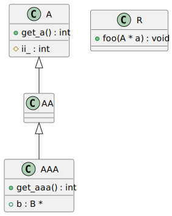

# t00040 - Relationship and access filter test
## Config
```yaml
diagrams:
  t00040_class:
    type: class
    generate_packages: false
    glob:
      - t00040.cc
    using_namespace: clanguml::t00040
    include:
      namespaces:
        - clanguml::t00040
      access:
        - public
        - protected
    exclude:
      relationships:
        - dependency
      elements:
        - clanguml::t00040::B
```
## Source code
File `tests/t00040/t00040.cc`
```cpp
namespace clanguml::t00040 {

struct B { };

struct A {
public:
    int get_a() { return hidden_a_; }

protected:
    int ii_;

private:
    void foo() { }

    int hidden_a_;
};

class AA : public A {
public:
};

class AAA : public AA {
public:
    int get_aaa() { return hidden_aaa_; }
    B *b;

private:
    int hidden_aaa_;
};

struct R {
    void foo(A *a) { }
};

} // namespace clanguml::t00040

```
## Generated PlantUML diagrams

## Generated Mermaid diagrams

## Generated JSON models
```json
{
  "diagram_type": "class",
  "elements": [
    {
      "bases": [],
      "display_name": "A",
      "id": "307580006083737677",
      "is_abstract": false,
      "is_nested": false,
      "is_struct": true,
      "is_template": false,
      "is_union": false,
      "members": [
        {
          "access": "protected",
          "is_static": false,
          "name": "ii_",
          "source_location": {
            "column": 9,
            "file": "t00040.cc",
            "line": 10,
            "translation_unit": "t00040.cc"
          },
          "type": "int"
        },
        {
          "access": "private",
          "is_static": false,
          "name": "hidden_a_",
          "source_location": {
            "column": 9,
            "file": "t00040.cc",
            "line": 15,
            "translation_unit": "t00040.cc"
          },
          "type": "int"
        }
      ],
      "methods": [
        {
          "access": "public",
          "display_name": "get_a",
          "is_const": false,
          "is_consteval": false,
          "is_constexpr": false,
          "is_constructor": false,
          "is_copy_assignment": false,
          "is_coroutine": false,
          "is_defaulted": false,
          "is_deleted": false,
          "is_move_assignment": false,
          "is_noexcept": false,
          "is_operator": false,
          "is_pure_virtual": false,
          "is_static": false,
          "is_virtual": false,
          "name": "get_a",
          "parameters": [],
          "source_location": {
            "column": 9,
            "file": "t00040.cc",
            "line": 7,
            "translation_unit": "t00040.cc"
          },
          "template_parameters": [],
          "type": "int"
        }
      ],
      "name": "A",
      "namespace": "clanguml::t00040",
      "source_location": {
        "column": 8,
        "file": "t00040.cc",
        "line": 5,
        "translation_unit": "t00040.cc"
      },
      "template_parameters": [],
      "type": "class"
    },
    {
      "bases": [
        {
          "access": "public",
          "id": "307580006083737677",
          "is_virtual": false,
          "name": "clanguml::t00040::A"
        }
      ],
      "display_name": "AA",
      "id": "534115812779766127",
      "is_abstract": false,
      "is_nested": false,
      "is_struct": false,
      "is_template": false,
      "is_union": false,
      "members": [],
      "methods": [],
      "name": "AA",
      "namespace": "clanguml::t00040",
      "source_location": {
        "column": 7,
        "file": "t00040.cc",
        "line": 18,
        "translation_unit": "t00040.cc"
      },
      "template_parameters": [],
      "type": "class"
    },
    {
      "bases": [
        {
          "access": "public",
          "id": "534115812779766127",
          "is_virtual": false,
          "name": "clanguml::t00040::AA"
        }
      ],
      "display_name": "AAA",
      "id": "745371908432158369",
      "is_abstract": false,
      "is_nested": false,
      "is_struct": false,
      "is_template": false,
      "is_union": false,
      "members": [
        {
          "access": "public",
          "is_static": false,
          "name": "b",
          "source_location": {
            "column": 8,
            "file": "t00040.cc",
            "line": 25,
            "translation_unit": "t00040.cc"
          },
          "type": "B *"
        },
        {
          "access": "private",
          "is_static": false,
          "name": "hidden_aaa_",
          "source_location": {
            "column": 9,
            "file": "t00040.cc",
            "line": 28,
            "translation_unit": "t00040.cc"
          },
          "type": "int"
        }
      ],
      "methods": [
        {
          "access": "public",
          "display_name": "get_aaa",
          "is_const": false,
          "is_consteval": false,
          "is_constexpr": false,
          "is_constructor": false,
          "is_copy_assignment": false,
          "is_coroutine": false,
          "is_defaulted": false,
          "is_deleted": false,
          "is_move_assignment": false,
          "is_noexcept": false,
          "is_operator": false,
          "is_pure_virtual": false,
          "is_static": false,
          "is_virtual": false,
          "name": "get_aaa",
          "parameters": [],
          "source_location": {
            "column": 9,
            "file": "t00040.cc",
            "line": 24,
            "translation_unit": "t00040.cc"
          },
          "template_parameters": [],
          "type": "int"
        }
      ],
      "name": "AAA",
      "namespace": "clanguml::t00040",
      "source_location": {
        "column": 7,
        "file": "t00040.cc",
        "line": 22,
        "translation_unit": "t00040.cc"
      },
      "template_parameters": [],
      "type": "class"
    },
    {
      "bases": [],
      "display_name": "R",
      "id": "1539035020975101539",
      "is_abstract": false,
      "is_nested": false,
      "is_struct": true,
      "is_template": false,
      "is_union": false,
      "members": [],
      "methods": [
        {
          "access": "public",
          "display_name": "foo",
          "is_const": false,
          "is_consteval": false,
          "is_constexpr": false,
          "is_constructor": false,
          "is_copy_assignment": false,
          "is_coroutine": false,
          "is_defaulted": false,
          "is_deleted": false,
          "is_move_assignment": false,
          "is_noexcept": false,
          "is_operator": false,
          "is_pure_virtual": false,
          "is_static": false,
          "is_virtual": false,
          "name": "foo",
          "parameters": [
            {
              "name": "a",
              "type": "A *"
            }
          ],
          "source_location": {
            "column": 10,
            "file": "t00040.cc",
            "line": 32,
            "translation_unit": "t00040.cc"
          },
          "template_parameters": [],
          "type": "void"
        }
      ],
      "name": "R",
      "namespace": "clanguml::t00040",
      "source_location": {
        "column": 8,
        "file": "t00040.cc",
        "line": 31,
        "translation_unit": "t00040.cc"
      },
      "template_parameters": [],
      "type": "class"
    }
  ],
  "name": "t00040_class",
  "package_type": "namespace",
  "relationships": [
    {
      "access": "public",
      "destination": "307580006083737677",
      "source": "534115812779766127",
      "type": "extension"
    },
    {
      "access": "public",
      "destination": "534115812779766127",
      "source": "745371908432158369",
      "type": "extension"
    }
  ],
  "using_namespace": "clanguml::t00040"
}
```
