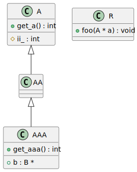

# t00040 - Relationship and access filter test
## Config
```yaml
compilation_database_dir: ..
output_directory: puml
diagrams:
  t00040_class:
    type: class
    generate_packages: false
    glob:
      - ../../tests/t00040/t00040.cc
    using_namespace:
      - clanguml::t00040
    include:
      namespaces:
        - clanguml::t00040
      access:
        - public
        - protected
    exclude:
      relationships:
        - dependency
      elements:
        - clanguml::t00040::B
```
## Source code
File t00040.cc
```cpp
namespace clanguml::t00040 {

struct B {
};

struct A {
public:
    int get_a() { return hidden_a_; }

protected:
    int ii_;

private:
    void foo() { }

    int hidden_a_;
};

class AA : public A {
public:
};

class AAA : public AA {
public:
    int get_aaa() { return hidden_aaa_; }
    B *b;

private:
    int hidden_aaa_;
};

struct R {
    void foo(A *a) { }
};

} // namespace clanguml::t00040

```
## Generated UML diagrams

