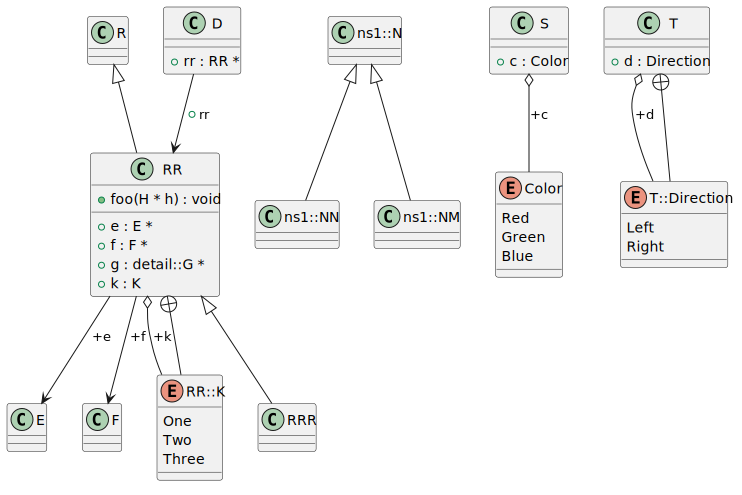

# t00041 - Context diagram filter test
## Config
```yaml
diagrams:
  t00041_class:
    type: class
    generate_packages: false
    glob:
      - t00041.cc
    using_namespace: clanguml::t00041
    include:
      namespaces:
        - clanguml::t00041
      context:
        - clanguml::t00041::RR
        - clanguml::t00041::Color
        - clanguml::t00041::T::Direction
      subclasses:
        - clanguml::t00041::ns1::N
    exclude:
      namespaces:
        - clanguml::t00041::detail
      relationships:
        - dependency
```
## Source code
File `tests/t00041/t00041.cc`
```cpp
namespace clanguml::t00041 {

struct B { };

struct A { };

class AA : public A { };

struct R { };

struct RR;

struct D {
    RR *rr;
};

struct E { };

struct F { };

namespace detail {
struct G { };
} // namespace detail

struct H { };

struct RR : public R {
    E *e;
    F *f;
    detail::G *g;

    enum K { One, Two, Three };

    K k;

    void foo(H *h) { }
};

struct RRR : public RR { };

namespace ns1 {
struct N { };

struct NN : public N { };

struct NM : public N { };
}

enum class Color { Red, Green, Blue };

struct S {
    Color c;
};

struct T {
    enum class Direction { Left, Right };
    Direction d;
};

} // namespace clanguml::t00041

```
## Generated PlantUML diagrams

## Generated Mermaid diagrams

## Generated JSON models
```json
{
  "diagram_type": "class",
  "elements": [
    {
      "bases": [],
      "display_name": "R",
      "id": "5192336214392970387",
      "is_abstract": false,
      "is_nested": false,
      "is_struct": true,
      "is_template": false,
      "is_union": false,
      "members": [],
      "methods": [],
      "name": "R",
      "namespace": "clanguml::t00041",
      "source_location": {
        "column": 8,
        "file": "t00041.cc",
        "line": 9,
        "translation_unit": "t00041.cc"
      },
      "template_parameters": [],
      "type": "class"
    },
    {
      "bases": [],
      "display_name": "D",
      "id": "15657590467902502588",
      "is_abstract": false,
      "is_nested": false,
      "is_struct": true,
      "is_template": false,
      "is_union": false,
      "members": [
        {
          "access": "public",
          "is_static": false,
          "name": "rr",
          "source_location": {
            "column": 9,
            "file": "t00041.cc",
            "line": 14,
            "translation_unit": "t00041.cc"
          },
          "type": "RR *"
        }
      ],
      "methods": [],
      "name": "D",
      "namespace": "clanguml::t00041",
      "source_location": {
        "column": 8,
        "file": "t00041.cc",
        "line": 13,
        "translation_unit": "t00041.cc"
      },
      "template_parameters": [],
      "type": "class"
    },
    {
      "bases": [],
      "display_name": "E",
      "id": "5532130596454617768",
      "is_abstract": false,
      "is_nested": false,
      "is_struct": true,
      "is_template": false,
      "is_union": false,
      "members": [],
      "methods": [],
      "name": "E",
      "namespace": "clanguml::t00041",
      "source_location": {
        "column": 8,
        "file": "t00041.cc",
        "line": 17,
        "translation_unit": "t00041.cc"
      },
      "template_parameters": [],
      "type": "class"
    },
    {
      "bases": [],
      "display_name": "F",
      "id": "14363548495818430104",
      "is_abstract": false,
      "is_nested": false,
      "is_struct": true,
      "is_template": false,
      "is_union": false,
      "members": [],
      "methods": [],
      "name": "F",
      "namespace": "clanguml::t00041",
      "source_location": {
        "column": 8,
        "file": "t00041.cc",
        "line": 19,
        "translation_unit": "t00041.cc"
      },
      "template_parameters": [],
      "type": "class"
    },
    {
      "bases": [
        {
          "access": "public",
          "id": "5192336214392970387",
          "is_virtual": false
        }
      ],
      "display_name": "RR",
      "id": "10272718411677395622",
      "is_abstract": false,
      "is_nested": false,
      "is_struct": true,
      "is_template": false,
      "is_union": false,
      "members": [
        {
          "access": "public",
          "is_static": false,
          "name": "e",
          "source_location": {
            "column": 8,
            "file": "t00041.cc",
            "line": 28,
            "translation_unit": "t00041.cc"
          },
          "type": "E *"
        },
        {
          "access": "public",
          "is_static": false,
          "name": "f",
          "source_location": {
            "column": 8,
            "file": "t00041.cc",
            "line": 29,
            "translation_unit": "t00041.cc"
          },
          "type": "F *"
        },
        {
          "access": "public",
          "is_static": false,
          "name": "g",
          "source_location": {
            "column": 16,
            "file": "t00041.cc",
            "line": 30,
            "translation_unit": "t00041.cc"
          },
          "type": "detail::G *"
        },
        {
          "access": "public",
          "is_static": false,
          "name": "k",
          "source_location": {
            "column": 7,
            "file": "t00041.cc",
            "line": 34,
            "translation_unit": "t00041.cc"
          },
          "type": "K"
        }
      ],
      "methods": [
        {
          "access": "public",
          "display_name": "foo",
          "is_const": false,
          "is_consteval": false,
          "is_constexpr": false,
          "is_constructor": false,
          "is_copy_assignment": false,
          "is_coroutine": false,
          "is_defaulted": false,
          "is_deleted": false,
          "is_move_assignment": false,
          "is_noexcept": false,
          "is_operator": false,
          "is_pure_virtual": false,
          "is_static": false,
          "is_virtual": false,
          "name": "foo",
          "parameters": [
            {
              "name": "h",
              "type": "H *"
            }
          ],
          "source_location": {
            "column": 10,
            "file": "t00041.cc",
            "line": 36,
            "translation_unit": "t00041.cc"
          },
          "template_parameters": [],
          "type": "void"
        }
      ],
      "name": "RR",
      "namespace": "clanguml::t00041",
      "source_location": {
        "column": 8,
        "file": "t00041.cc",
        "line": 27,
        "translation_unit": "t00041.cc"
      },
      "template_parameters": [],
      "type": "class"
    },
    {
      "constants": [
        "One",
        "Two",
        "Three"
      ],
      "display_name": "RR::K",
      "id": "2504780943967658717",
      "is_nested": true,
      "name": "RR##K",
      "namespace": "clanguml::t00041",
      "source_location": {
        "column": 10,
        "file": "t00041.cc",
        "line": 32,
        "translation_unit": "t00041.cc"
      },
      "type": "enum"
    },
    {
      "bases": [
        {
          "access": "public",
          "id": "10272718411677395622",
          "is_virtual": false
        }
      ],
      "display_name": "RRR",
      "id": "11539413796888818565",
      "is_abstract": false,
      "is_nested": false,
      "is_struct": true,
      "is_template": false,
      "is_union": false,
      "members": [],
      "methods": [],
      "name": "RRR",
      "namespace": "clanguml::t00041",
      "source_location": {
        "column": 8,
        "file": "t00041.cc",
        "line": 39,
        "translation_unit": "t00041.cc"
      },
      "template_parameters": [],
      "type": "class"
    },
    {
      "bases": [],
      "display_name": "ns1::N",
      "id": "5494910855331169804",
      "is_abstract": false,
      "is_nested": false,
      "is_struct": true,
      "is_template": false,
      "is_union": false,
      "members": [],
      "methods": [],
      "name": "N",
      "namespace": "clanguml::t00041::ns1",
      "source_location": {
        "column": 8,
        "file": "t00041.cc",
        "line": 42,
        "translation_unit": "t00041.cc"
      },
      "template_parameters": [],
      "type": "class"
    },
    {
      "bases": [
        {
          "access": "public",
          "id": "5494910855331169804",
          "is_virtual": false
        }
      ],
      "display_name": "ns1::NN",
      "id": "8772467793730310610",
      "is_abstract": false,
      "is_nested": false,
      "is_struct": true,
      "is_template": false,
      "is_union": false,
      "members": [],
      "methods": [],
      "name": "NN",
      "namespace": "clanguml::t00041::ns1",
      "source_location": {
        "column": 8,
        "file": "t00041.cc",
        "line": 44,
        "translation_unit": "t00041.cc"
      },
      "template_parameters": [],
      "type": "class"
    },
    {
      "bases": [
        {
          "access": "public",
          "id": "5494910855331169804",
          "is_virtual": false
        }
      ],
      "display_name": "ns1::NM",
      "id": "12371055338189762963",
      "is_abstract": false,
      "is_nested": false,
      "is_struct": true,
      "is_template": false,
      "is_union": false,
      "members": [],
      "methods": [],
      "name": "NM",
      "namespace": "clanguml::t00041::ns1",
      "source_location": {
        "column": 8,
        "file": "t00041.cc",
        "line": 46,
        "translation_unit": "t00041.cc"
      },
      "template_parameters": [],
      "type": "class"
    },
    {
      "constants": [
        "Red",
        "Green",
        "Blue"
      ],
      "display_name": "Color",
      "id": "5738369412621488360",
      "is_nested": false,
      "name": "Color",
      "namespace": "clanguml::t00041",
      "source_location": {
        "column": 12,
        "file": "t00041.cc",
        "line": 49,
        "translation_unit": "t00041.cc"
      },
      "type": "enum"
    },
    {
      "bases": [],
      "display_name": "S",
      "id": "14601300911311242445",
      "is_abstract": false,
      "is_nested": false,
      "is_struct": true,
      "is_template": false,
      "is_union": false,
      "members": [
        {
          "access": "public",
          "is_static": false,
          "name": "c",
          "source_location": {
            "column": 11,
            "file": "t00041.cc",
            "line": 52,
            "translation_unit": "t00041.cc"
          },
          "type": "Color"
        }
      ],
      "methods": [],
      "name": "S",
      "namespace": "clanguml::t00041",
      "source_location": {
        "column": 8,
        "file": "t00041.cc",
        "line": 51,
        "translation_unit": "t00041.cc"
      },
      "template_parameters": [],
      "type": "class"
    },
    {
      "bases": [],
      "display_name": "T",
      "id": "17505606694687422691",
      "is_abstract": false,
      "is_nested": false,
      "is_struct": true,
      "is_template": false,
      "is_union": false,
      "members": [
        {
          "access": "public",
          "is_static": false,
          "name": "d",
          "source_location": {
            "column": 15,
            "file": "t00041.cc",
            "line": 57,
            "translation_unit": "t00041.cc"
          },
          "type": "Direction"
        }
      ],
      "methods": [],
      "name": "T",
      "namespace": "clanguml::t00041",
      "source_location": {
        "column": 8,
        "file": "t00041.cc",
        "line": 55,
        "translation_unit": "t00041.cc"
      },
      "template_parameters": [],
      "type": "class"
    },
    {
      "constants": [
        "Left",
        "Right"
      ],
      "display_name": "T::Direction",
      "id": "16389199065985248365",
      "is_nested": true,
      "name": "T##Direction",
      "namespace": "clanguml::t00041",
      "source_location": {
        "column": 16,
        "file": "t00041.cc",
        "line": 56,
        "translation_unit": "t00041.cc"
      },
      "type": "enum"
    }
  ],
  "name": "t00041_class",
  "package_type": "namespace",
  "relationships": [
    {
      "access": "public",
      "destination": "10272718411677395622",
      "label": "rr",
      "source": "15657590467902502588",
      "type": "association"
    },
    {
      "access": "public",
      "destination": "5532130596454617768",
      "label": "e",
      "source": "10272718411677395622",
      "type": "association"
    },
    {
      "access": "public",
      "destination": "14363548495818430104",
      "label": "f",
      "source": "10272718411677395622",
      "type": "association"
    },
    {
      "access": "public",
      "destination": "2504780943967658717",
      "label": "k",
      "source": "10272718411677395622",
      "type": "aggregation"
    },
    {
      "access": "public",
      "destination": "5192336214392970387",
      "source": "10272718411677395622",
      "type": "extension"
    },
    {
      "access": "public",
      "destination": "10272718411677395622",
      "source": "2504780943967658717",
      "type": "containment"
    },
    {
      "access": "public",
      "destination": "10272718411677395622",
      "source": "11539413796888818565",
      "type": "extension"
    },
    {
      "access": "public",
      "destination": "5494910855331169804",
      "source": "8772467793730310610",
      "type": "extension"
    },
    {
      "access": "public",
      "destination": "5494910855331169804",
      "source": "12371055338189762963",
      "type": "extension"
    },
    {
      "access": "public",
      "destination": "5738369412621488360",
      "label": "c",
      "source": "14601300911311242445",
      "type": "aggregation"
    },
    {
      "access": "public",
      "destination": "16389199065985248365",
      "label": "d",
      "source": "17505606694687422691",
      "type": "aggregation"
    },
    {
      "access": "public",
      "destination": "17505606694687422691",
      "source": "16389199065985248365",
      "type": "containment"
    }
  ],
  "using_namespace": "clanguml::t00041"
}
```
## Generated GraphML models
```xml
<?xml version="1.0"?>
<graphml xmlns="http://graphml.graphdrawing.org/xmlns" xmlns:xsi="http://www.w3.org/2001/XMLSchema-instance" xsi:schemaLocation="http://graphml.graphdrawing.org/xmlns http://graphml.graphdrawing.org/xmlns/1.0/graphml.xsd">
 <key attr.name="id" attr.type="string" for="graph" id="gd0" />
 <key attr.name="diagram_type" attr.type="string" for="graph" id="gd1" />
 <key attr.name="name" attr.type="string" for="graph" id="gd2" />
 <key attr.name="using_namespace" attr.type="string" for="graph" id="gd3" />
 <key attr.name="id" attr.type="string" for="node" id="nd0" />
 <key attr.name="type" attr.type="string" for="node" id="nd1" />
 <key attr.name="name" attr.type="string" for="node" id="nd2" />
 <key attr.name="stereotype" attr.type="string" for="node" id="nd3" />
 <key attr.name="url" attr.type="string" for="node" id="nd4" />
 <key attr.name="tooltip" attr.type="string" for="node" id="nd5" />
 <key attr.name="is_template" attr.type="boolean" for="node" id="nd6" />
 <key attr.name="type" attr.type="string" for="edge" id="ed0" />
 <key attr.name="access" attr.type="string" for="edge" id="ed1" />
 <key attr.name="label" attr.type="string" for="edge" id="ed2" />
 <key attr.name="url" attr.type="string" for="edge" id="ed3" />
 <graph id="g0" edgedefault="directed" parse.nodeids="canonical" parse.edgeids="canonical" parse.order="nodesfirst">
  <data key="gd3">clanguml::t00041</data>
  <node id="n0">
   <data key="nd1">class</data>
   <data key="nd2"><![CDATA[R]]></data>
   <data key="nd6">false</data>
  </node>
  <node id="n1">
   <data key="nd1">class</data>
   <data key="nd2"><![CDATA[D]]></data>
   <data key="nd6">false</data>
  </node>
  <node id="n2">
   <data key="nd1">class</data>
   <data key="nd2"><![CDATA[E]]></data>
   <data key="nd6">false</data>
  </node>
  <node id="n3">
   <data key="nd1">class</data>
   <data key="nd2"><![CDATA[F]]></data>
   <data key="nd6">false</data>
  </node>
  <node id="n4">
   <data key="nd1">class</data>
   <data key="nd2"><![CDATA[RR]]></data>
   <data key="nd6">false</data>
  </node>
  <node id="n5">
   <data key="nd1">enum</data>
   <data key="nd2"><![CDATA[RR::K]]></data>
  </node>
  <node id="n6">
   <data key="nd1">class</data>
   <data key="nd2"><![CDATA[RRR]]></data>
   <data key="nd6">false</data>
  </node>
  <node id="n7">
   <data key="nd1">class</data>
   <data key="nd2"><![CDATA[ns1::N]]></data>
   <data key="nd6">false</data>
  </node>
  <node id="n8">
   <data key="nd1">class</data>
   <data key="nd2"><![CDATA[ns1::NN]]></data>
   <data key="nd6">false</data>
  </node>
  <node id="n9">
   <data key="nd1">class</data>
   <data key="nd2"><![CDATA[ns1::NM]]></data>
   <data key="nd6">false</data>
  </node>
  <node id="n10">
   <data key="nd1">enum</data>
   <data key="nd2"><![CDATA[Color]]></data>
  </node>
  <node id="n11">
   <data key="nd1">class</data>
   <data key="nd2"><![CDATA[S]]></data>
   <data key="nd6">false</data>
  </node>
  <node id="n12">
   <data key="nd1">class</data>
   <data key="nd2"><![CDATA[T]]></data>
   <data key="nd6">false</data>
  </node>
  <node id="n13">
   <data key="nd1">enum</data>
   <data key="nd2"><![CDATA[T::Direction]]></data>
  </node>
  <edge id="e0" source="n1" target="n4">
   <data key="ed0">association</data>
   <data key="ed2">rr</data>
   <data key="ed1">public</data>
  </edge>
  <edge id="e1" source="n4" target="n2">
   <data key="ed0">association</data>
   <data key="ed2">e</data>
   <data key="ed1">public</data>
  </edge>
  <edge id="e2" source="n4" target="n3">
   <data key="ed0">association</data>
   <data key="ed2">f</data>
   <data key="ed1">public</data>
  </edge>
  <edge id="e3" source="n4" target="n5">
   <data key="ed0">aggregation</data>
   <data key="ed2">k</data>
   <data key="ed1">public</data>
  </edge>
  <edge id="e4" source="n4" target="n0">
   <data key="ed0">extension</data>
   <data key="ed1">public</data>
  </edge>
  <edge id="e5" source="n6" target="n4">
   <data key="ed0">extension</data>
   <data key="ed1">public</data>
  </edge>
  <edge id="e6" source="n8" target="n7">
   <data key="ed0">extension</data>
   <data key="ed1">public</data>
  </edge>
  <edge id="e7" source="n9" target="n7">
   <data key="ed0">extension</data>
   <data key="ed1">public</data>
  </edge>
  <edge id="e8" source="n11" target="n10">
   <data key="ed0">aggregation</data>
   <data key="ed2">c</data>
   <data key="ed1">public</data>
  </edge>
  <edge id="e9" source="n12" target="n13">
   <data key="ed0">aggregation</data>
   <data key="ed2">d</data>
   <data key="ed1">public</data>
  </edge>
  <edge id="e10" source="n5" target="n4">
   <data key="ed0">containment</data>
   <data key="ed1">public</data>
  </edge>
  <edge id="e11" source="n13" target="n12">
   <data key="ed0">containment</data>
   <data key="ed1">public</data>
  </edge>
 </graph>
</graphml>

```
