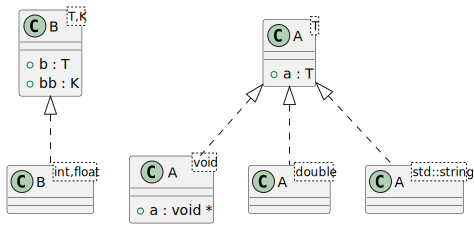

# t00042 - Specialization class template diagram filter test
## Config
```yaml
diagrams:
  t00042_class:
    type: class
    generate_packages: false
    glob:
      - t00042.cc
    using_namespace: clanguml::t00042
    plantuml:
      style:
        instantiation: up
    include:
      specializations:
        - clanguml::t00042::A<T>
        - clanguml::t00042::B<T,K>
      relationships:
        - instantiation
    exclude:
      specializations:
        - clanguml::t00042::C<T>
      namespaces:
        - std
```
## Source code
File `tests/t00042/t00042.cc`
```cpp
#include <string>

namespace clanguml::t00042 {

template <typename T> struct A {
    T a;
};

template <> struct A<void> {
    void *a;
};

template <typename T, typename K> struct B {
    T b;
    K bb;
};

template <typename T> struct C {
    T c;
};

struct R {
    A<double> a_double;
    A<std::string> a_string;

    B<int, float> b_int_float;

    C<int> c_int;
};

} // namespace clanguml::t00042

```
## Generated PlantUML diagrams

## Generated Mermaid diagrams

## Generated JSON models
```json
{
  "diagram_type": "class",
  "elements": [
    {
      "bases": [],
      "display_name": "A<T>",
      "id": "462160951579835462",
      "is_abstract": false,
      "is_nested": false,
      "is_struct": true,
      "is_template": true,
      "is_union": false,
      "members": [
        {
          "access": "public",
          "is_static": false,
          "name": "a",
          "source_location": {
            "column": 7,
            "file": "t00042.cc",
            "line": 6,
            "translation_unit": "t00042.cc"
          },
          "type": "T"
        }
      ],
      "methods": [],
      "name": "A",
      "namespace": "clanguml::t00042",
      "source_location": {
        "column": 30,
        "file": "t00042.cc",
        "line": 5,
        "translation_unit": "t00042.cc"
      },
      "template_parameters": [
        {
          "is_variadic": false,
          "kind": "template_type",
          "name": "T",
          "template_parameters": []
        }
      ],
      "type": "class"
    },
    {
      "bases": [],
      "display_name": "A<void>",
      "id": "1422802342059669545",
      "is_abstract": false,
      "is_nested": false,
      "is_struct": true,
      "is_template": true,
      "is_union": false,
      "members": [
        {
          "access": "public",
          "is_static": false,
          "name": "a",
          "source_location": {
            "column": 11,
            "file": "t00042.cc",
            "line": 10,
            "translation_unit": "t00042.cc"
          },
          "type": "void *"
        }
      ],
      "methods": [],
      "name": "A",
      "namespace": "clanguml::t00042",
      "source_location": {
        "column": 20,
        "file": "t00042.cc",
        "line": 9,
        "translation_unit": "t00042.cc"
      },
      "template_parameters": [
        {
          "is_variadic": false,
          "kind": "argument",
          "template_parameters": [],
          "type": "void"
        }
      ],
      "type": "class"
    },
    {
      "bases": [],
      "display_name": "B<T,K>",
      "id": "1414456934388678010",
      "is_abstract": false,
      "is_nested": false,
      "is_struct": true,
      "is_template": true,
      "is_union": false,
      "members": [
        {
          "access": "public",
          "is_static": false,
          "name": "b",
          "source_location": {
            "column": 7,
            "file": "t00042.cc",
            "line": 14,
            "translation_unit": "t00042.cc"
          },
          "type": "T"
        },
        {
          "access": "public",
          "is_static": false,
          "name": "bb",
          "source_location": {
            "column": 7,
            "file": "t00042.cc",
            "line": 15,
            "translation_unit": "t00042.cc"
          },
          "type": "K"
        }
      ],
      "methods": [],
      "name": "B",
      "namespace": "clanguml::t00042",
      "source_location": {
        "column": 42,
        "file": "t00042.cc",
        "line": 13,
        "translation_unit": "t00042.cc"
      },
      "template_parameters": [
        {
          "is_variadic": false,
          "kind": "template_type",
          "name": "T",
          "template_parameters": []
        },
        {
          "is_variadic": false,
          "kind": "template_type",
          "name": "K",
          "template_parameters": []
        }
      ],
      "type": "class"
    },
    {
      "bases": [],
      "display_name": "A<double>",
      "id": "364538479078826988",
      "is_abstract": false,
      "is_nested": false,
      "is_struct": false,
      "is_template": true,
      "is_union": false,
      "members": [],
      "methods": [],
      "name": "A",
      "namespace": "clanguml::t00042",
      "source_location": {
        "column": 30,
        "file": "t00042.cc",
        "line": 5,
        "translation_unit": "t00042.cc"
      },
      "template_parameters": [
        {
          "is_variadic": false,
          "kind": "argument",
          "template_parameters": [],
          "type": "double"
        }
      ],
      "type": "class"
    },
    {
      "bases": [],
      "display_name": "A<std::string>",
      "id": "496773262538580186",
      "is_abstract": false,
      "is_nested": false,
      "is_struct": false,
      "is_template": true,
      "is_union": false,
      "members": [],
      "methods": [],
      "name": "A",
      "namespace": "clanguml::t00042",
      "source_location": {
        "column": 30,
        "file": "t00042.cc",
        "line": 5,
        "translation_unit": "t00042.cc"
      },
      "template_parameters": [
        {
          "is_variadic": false,
          "kind": "argument",
          "template_parameters": [],
          "type": "std::string"
        }
      ],
      "type": "class"
    },
    {
      "bases": [],
      "display_name": "B<int,float>",
      "id": "1833471931530161359",
      "is_abstract": false,
      "is_nested": false,
      "is_struct": false,
      "is_template": true,
      "is_union": false,
      "members": [],
      "methods": [],
      "name": "B",
      "namespace": "clanguml::t00042",
      "source_location": {
        "column": 42,
        "file": "t00042.cc",
        "line": 13,
        "translation_unit": "t00042.cc"
      },
      "template_parameters": [
        {
          "is_variadic": false,
          "kind": "argument",
          "template_parameters": [],
          "type": "int"
        },
        {
          "is_variadic": false,
          "kind": "argument",
          "template_parameters": [],
          "type": "float"
        }
      ],
      "type": "class"
    }
  ],
  "name": "t00042_class",
  "package_type": "namespace",
  "relationships": [
    {
      "access": "public",
      "destination": "462160951579835462",
      "source": "1422802342059669545",
      "type": "instantiation"
    },
    {
      "access": "public",
      "destination": "462160951579835462",
      "source": "364538479078826988",
      "type": "instantiation"
    },
    {
      "access": "public",
      "destination": "462160951579835462",
      "source": "496773262538580186",
      "type": "instantiation"
    },
    {
      "access": "public",
      "destination": "1414456934388678010",
      "source": "1833471931530161359",
      "type": "instantiation"
    }
  ],
  "using_namespace": "clanguml::t00042"
}
```
