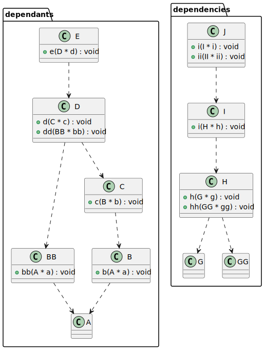

# t00043 - Dependants and dependencies class diagram filter test
## Config
```yaml
compilation_database_dir: ..
output_directory: puml
diagrams:
  t00043_class:
    type: class
    generate_packages: true
    glob:
      - ../../tests/t00043/t00043.cc
    using_namespace:
      - clanguml::t00043
    include:
      dependants:
        - clanguml::t00043::dependants::A
      dependencies:
        - clanguml::t00043::dependencies::J
      relationships:
        - dependency
```
## Source code
File t00043.cc
```cpp
namespace clanguml::t00043 {

namespace dependants {
struct A { };

struct B {
    void b(A *a) { }
};

struct BB {
    void bb(A *a) { }
};

struct C {
    void c(B *b) { }
};

struct D {
    void d(C *c) { }
    void dd(BB *bb) { }
};

struct E {
    void e(D *d) { }
};

struct F { };
} // namespace dependants

namespace dependencies {

struct G { };

struct GG { };

struct H {
    void h(G *g) { }
    void hh(GG *gg) { }
};

struct HH {
    void hh(G *g) { }
};

struct I {
    void i(H *h) { }
};

struct J {
    void i(I *i) { }
};

} // namespace dependencies
} // namespace clanguml::t00043

```
## Generated UML diagrams

## Generated JSON models
```json
{
  "diagram_type": "class",
  "elements": [
    {
      "display_name": "clanguml::t00043::dependants",
      "elements": [
        {
          "bases": [],
          "display_name": "clanguml::t00043::dependants::A",
          "id": "1454679300998460550",
          "is_abstract": false,
          "is_nested": false,
          "is_struct": true,
          "is_template": false,
          "is_union": false,
          "members": [],
          "methods": [],
          "name": "A",
          "namespace": "clanguml::t00043::dependants",
          "source_location": {
            "file": "../../tests/t00043/t00043.cc",
            "line": 4
          },
          "template_parameters": [],
          "type": "class"
        },
        {
          "bases": [],
          "display_name": "clanguml::t00043::dependants::B",
          "id": "1972977265990430931",
          "is_abstract": false,
          "is_nested": false,
          "is_struct": true,
          "is_template": false,
          "is_union": false,
          "members": [],
          "methods": [
            {
              "access": "public",
              "is_const": false,
              "is_defaulted": false,
              "is_implicit": false,
              "is_pure_virtual": false,
              "is_static": false,
              "is_virtual": false,
              "name": "b",
              "parameters": [
                {
                  "name": "a",
                  "type": "clanguml::t00043::dependants::A *"
                }
              ],
              "type": "void"
            }
          ],
          "name": "B",
          "namespace": "clanguml::t00043::dependants",
          "source_location": {
            "file": "../../tests/t00043/t00043.cc",
            "line": 6
          },
          "template_parameters": [],
          "type": "class"
        },
        {
          "bases": [],
          "display_name": "clanguml::t00043::dependants::BB",
          "id": "1906291555025945295",
          "is_abstract": false,
          "is_nested": false,
          "is_struct": true,
          "is_template": false,
          "is_union": false,
          "members": [],
          "methods": [
            {
              "access": "public",
              "is_const": false,
              "is_defaulted": false,
              "is_implicit": false,
              "is_pure_virtual": false,
              "is_static": false,
              "is_virtual": false,
              "name": "bb",
              "parameters": [
                {
                  "name": "a",
                  "type": "clanguml::t00043::dependants::A *"
                }
              ],
              "type": "void"
            }
          ],
          "name": "BB",
          "namespace": "clanguml::t00043::dependants",
          "source_location": {
            "file": "../../tests/t00043/t00043.cc",
            "line": 10
          },
          "template_parameters": [],
          "type": "class"
        },
        {
          "bases": [],
          "display_name": "clanguml::t00043::dependants::C",
          "id": "823759225351121534",
          "is_abstract": false,
          "is_nested": false,
          "is_struct": true,
          "is_template": false,
          "is_union": false,
          "members": [],
          "methods": [
            {
              "access": "public",
              "is_const": false,
              "is_defaulted": false,
              "is_implicit": false,
              "is_pure_virtual": false,
              "is_static": false,
              "is_virtual": false,
              "name": "c",
              "parameters": [
                {
                  "name": "b",
                  "type": "clanguml::t00043::dependants::B *"
                }
              ],
              "type": "void"
            }
          ],
          "name": "C",
          "namespace": "clanguml::t00043::dependants",
          "source_location": {
            "file": "../../tests/t00043/t00043.cc",
            "line": 14
          },
          "template_parameters": [],
          "type": "class"
        },
        {
          "bases": [],
          "display_name": "clanguml::t00043::dependants::D",
          "id": "2277976215348279426",
          "is_abstract": false,
          "is_nested": false,
          "is_struct": true,
          "is_template": false,
          "is_union": false,
          "members": [],
          "methods": [
            {
              "access": "public",
              "is_const": false,
              "is_defaulted": false,
              "is_implicit": false,
              "is_pure_virtual": false,
              "is_static": false,
              "is_virtual": false,
              "name": "d",
              "parameters": [
                {
                  "name": "c",
                  "type": "clanguml::t00043::dependants::C *"
                }
              ],
              "type": "void"
            },
            {
              "access": "public",
              "is_const": false,
              "is_defaulted": false,
              "is_implicit": false,
              "is_pure_virtual": false,
              "is_static": false,
              "is_virtual": false,
              "name": "dd",
              "parameters": [
                {
                  "name": "bb",
                  "type": "clanguml::t00043::dependants::BB *"
                }
              ],
              "type": "void"
            }
          ],
          "name": "D",
          "namespace": "clanguml::t00043::dependants",
          "source_location": {
            "file": "../../tests/t00043/t00043.cc",
            "line": 18
          },
          "template_parameters": [],
          "type": "class"
        },
        {
          "bases": [],
          "display_name": "clanguml::t00043::dependants::E",
          "id": "1694685540293810116",
          "is_abstract": false,
          "is_nested": false,
          "is_struct": true,
          "is_template": false,
          "is_union": false,
          "members": [],
          "methods": [
            {
              "access": "public",
              "is_const": false,
              "is_defaulted": false,
              "is_implicit": false,
              "is_pure_virtual": false,
              "is_static": false,
              "is_virtual": false,
              "name": "e",
              "parameters": [
                {
                  "name": "d",
                  "type": "clanguml::t00043::dependants::D *"
                }
              ],
              "type": "void"
            }
          ],
          "name": "E",
          "namespace": "clanguml::t00043::dependants",
          "source_location": {
            "file": "../../tests/t00043/t00043.cc",
            "line": 23
          },
          "template_parameters": [],
          "type": "class"
        }
      ],
      "name": "dependants",
      "type": "namespace"
    },
    {
      "display_name": "clanguml::t00043::dependencies",
      "elements": [
        {
          "bases": [],
          "display_name": "clanguml::t00043::dependencies::G",
          "id": "736400571183204899",
          "is_abstract": false,
          "is_nested": false,
          "is_struct": true,
          "is_template": false,
          "is_union": false,
          "members": [],
          "methods": [],
          "name": "G",
          "namespace": "clanguml::t00043::dependencies",
          "source_location": {
            "file": "../../tests/t00043/t00043.cc",
            "line": 32
          },
          "template_parameters": [],
          "type": "class"
        },
        {
          "bases": [],
          "display_name": "clanguml::t00043::dependencies::GG",
          "id": "1522297681294871411",
          "is_abstract": false,
          "is_nested": false,
          "is_struct": true,
          "is_template": false,
          "is_union": false,
          "members": [],
          "methods": [],
          "name": "GG",
          "namespace": "clanguml::t00043::dependencies",
          "source_location": {
            "file": "../../tests/t00043/t00043.cc",
            "line": 34
          },
          "template_parameters": [],
          "type": "class"
        },
        {
          "bases": [],
          "display_name": "clanguml::t00043::dependencies::H",
          "id": "1534191494825314170",
          "is_abstract": false,
          "is_nested": false,
          "is_struct": true,
          "is_template": false,
          "is_union": false,
          "members": [],
          "methods": [
            {
              "access": "public",
              "is_const": false,
              "is_defaulted": false,
              "is_implicit": false,
              "is_pure_virtual": false,
              "is_static": false,
              "is_virtual": false,
              "name": "h",
              "parameters": [
                {
                  "name": "g",
                  "type": "clanguml::t00043::dependencies::G *"
                }
              ],
              "type": "void"
            },
            {
              "access": "public",
              "is_const": false,
              "is_defaulted": false,
              "is_implicit": false,
              "is_pure_virtual": false,
              "is_static": false,
              "is_virtual": false,
              "name": "hh",
              "parameters": [
                {
                  "name": "gg",
                  "type": "clanguml::t00043::dependencies::GG *"
                }
              ],
              "type": "void"
            }
          ],
          "name": "H",
          "namespace": "clanguml::t00043::dependencies",
          "source_location": {
            "file": "../../tests/t00043/t00043.cc",
            "line": 36
          },
          "template_parameters": [],
          "type": "class"
        },
        {
          "bases": [],
          "display_name": "clanguml::t00043::dependencies::I",
          "id": "97422543769740359",
          "is_abstract": false,
          "is_nested": false,
          "is_struct": true,
          "is_template": false,
          "is_union": false,
          "members": [],
          "methods": [
            {
              "access": "public",
              "is_const": false,
              "is_defaulted": false,
              "is_implicit": false,
              "is_pure_virtual": false,
              "is_static": false,
              "is_virtual": false,
              "name": "i",
              "parameters": [
                {
                  "name": "h",
                  "type": "clanguml::t00043::dependencies::H *"
                }
              ],
              "type": "void"
            }
          ],
          "name": "I",
          "namespace": "clanguml::t00043::dependencies",
          "source_location": {
            "file": "../../tests/t00043/t00043.cc",
            "line": 45
          },
          "template_parameters": [],
          "type": "class"
        },
        {
          "bases": [],
          "display_name": "clanguml::t00043::dependencies::J",
          "id": "1498530043106438011",
          "is_abstract": false,
          "is_nested": false,
          "is_struct": true,
          "is_template": false,
          "is_union": false,
          "members": [],
          "methods": [
            {
              "access": "public",
              "is_const": false,
              "is_defaulted": false,
              "is_implicit": false,
              "is_pure_virtual": false,
              "is_static": false,
              "is_virtual": false,
              "name": "i",
              "parameters": [
                {
                  "name": "i",
                  "type": "clanguml::t00043::dependencies::I *"
                }
              ],
              "type": "void"
            }
          ],
          "name": "J",
          "namespace": "clanguml::t00043::dependencies",
          "source_location": {
            "file": "../../tests/t00043/t00043.cc",
            "line": 49
          },
          "template_parameters": [],
          "type": "class"
        }
      ],
      "name": "dependencies",
      "type": "namespace"
    }
  ],
  "metadata": {
    "clang_uml_version": "0.3.4-45-gdec4b7b",
    "llvm_version": "Ubuntu clang version 15.0.6",
    "schema_version": 1
  },
  "name": "t00043_class",
  "relationships": [
    {
      "access": "public",
      "destination": "1454679300998460550",
      "source": "1972977265990430931",
      "type": "dependency"
    },
    {
      "access": "public",
      "destination": "1454679300998460550",
      "source": "1906291555025945295",
      "type": "dependency"
    },
    {
      "access": "public",
      "destination": "1972977265990430931",
      "source": "823759225351121534",
      "type": "dependency"
    },
    {
      "access": "public",
      "destination": "823759225351121534",
      "source": "2277976215348279426",
      "type": "dependency"
    },
    {
      "access": "public",
      "destination": "1906291555025945295",
      "source": "2277976215348279426",
      "type": "dependency"
    },
    {
      "access": "public",
      "destination": "2277976215348279426",
      "source": "1694685540293810116",
      "type": "dependency"
    },
    {
      "access": "public",
      "destination": "736400571183204899",
      "source": "1534191494825314170",
      "type": "dependency"
    },
    {
      "access": "public",
      "destination": "1522297681294871411",
      "source": "1534191494825314170",
      "type": "dependency"
    },
    {
      "access": "public",
      "destination": "1534191494825314170",
      "source": "97422543769740359",
      "type": "dependency"
    },
    {
      "access": "public",
      "destination": "97422543769740359",
      "source": "1498530043106438011",
      "type": "dependency"
    }
  ],
  "using_namespace": "clanguml::t00043"
}
```
