# t00043 - Dependants and dependencies class diagram filter test
## Config
```yaml
diagrams:
  t00043_class:
    type: class
    generate_packages: true
    glob:
      - t00043.cc
    using_namespace: clanguml::t00043
    include:
      dependants:
        - clanguml::t00043::dependants::A
      dependencies:
        - clanguml::t00043::dependencies::J
      relationships:
        - dependency
    exclude:
      dependants:
        - clanguml::t00043::dependants::EE
      dependencies:
        - clanguml::t00043::dependencies::II
```
## Source code
File `tests/t00043/t00043.cc`
```cpp
namespace clanguml::t00043 {

namespace dependants {
struct A { };

struct B {
    void b(A *a) { }
};

struct BB {
    void bb(A *a) { }
};

struct C {
    void c(B *b) { }
};

struct D {
    void d(C *c) { }
    void dd(BB *bb) { }
};

struct E {
    void e(D *d) { }
};

struct EE {
    void ee(E *e) { }
};

struct EEE {
    void eee(EE *e) { }
};

struct F { };
} // namespace dependants

namespace dependencies {

struct G { };

struct GG { };

struct H {
    void h(G *g) { }
    void hh(GG *gg) { }
};

struct HH {
    void hh(G *g) { }
};

struct I {
    void i(H *h) { }
};

struct II;
struct III {
    void iii(II *i) { }
};

struct II {
    void ii() { }
};

struct J {
    void i(I *i) { }
    void ii(II *ii) { }
};

} // namespace dependencies
} // namespace clanguml::t00043

```
## Generated PlantUML diagrams

## Generated Mermaid diagrams

## Generated JSON models
```json
{
  "diagram_type": "class",
  "elements": [
    {
      "display_name": "dependants",
      "elements": [
        {
          "bases": [],
          "display_name": "A",
          "id": "11637434407987684404",
          "is_abstract": false,
          "is_nested": false,
          "is_struct": true,
          "is_template": false,
          "is_union": false,
          "members": [],
          "methods": [],
          "name": "A",
          "namespace": "clanguml::t00043::dependants",
          "source_location": {
            "column": 8,
            "file": "t00043.cc",
            "line": 4,
            "translation_unit": "t00043.cc"
          },
          "template_parameters": [],
          "type": "class"
        },
        {
          "bases": [],
          "display_name": "B",
          "id": "15783818127923447452",
          "is_abstract": false,
          "is_nested": false,
          "is_struct": true,
          "is_template": false,
          "is_union": false,
          "members": [],
          "methods": [
            {
              "access": "public",
              "display_name": "b",
              "is_const": false,
              "is_consteval": false,
              "is_constexpr": false,
              "is_constructor": false,
              "is_copy_assignment": false,
              "is_coroutine": false,
              "is_defaulted": false,
              "is_deleted": false,
              "is_move_assignment": false,
              "is_noexcept": false,
              "is_operator": false,
              "is_pure_virtual": false,
              "is_static": false,
              "is_virtual": false,
              "name": "b",
              "parameters": [
                {
                  "name": "a",
                  "type": "A *"
                }
              ],
              "source_location": {
                "column": 10,
                "file": "t00043.cc",
                "line": 7,
                "translation_unit": "t00043.cc"
              },
              "template_parameters": [],
              "type": "void"
            }
          ],
          "name": "B",
          "namespace": "clanguml::t00043::dependants",
          "source_location": {
            "column": 8,
            "file": "t00043.cc",
            "line": 6,
            "translation_unit": "t00043.cc"
          },
          "template_parameters": [],
          "type": "class"
        },
        {
          "bases": [],
          "display_name": "BB",
          "id": "15250332440207562361",
          "is_abstract": false,
          "is_nested": false,
          "is_struct": true,
          "is_template": false,
          "is_union": false,
          "members": [],
          "methods": [
            {
              "access": "public",
              "display_name": "bb",
              "is_const": false,
              "is_consteval": false,
              "is_constexpr": false,
              "is_constructor": false,
              "is_copy_assignment": false,
              "is_coroutine": false,
              "is_defaulted": false,
              "is_deleted": false,
              "is_move_assignment": false,
              "is_noexcept": false,
              "is_operator": false,
              "is_pure_virtual": false,
              "is_static": false,
              "is_virtual": false,
              "name": "bb",
              "parameters": [
                {
                  "name": "a",
                  "type": "A *"
                }
              ],
              "source_location": {
                "column": 10,
                "file": "t00043.cc",
                "line": 11,
                "translation_unit": "t00043.cc"
              },
              "template_parameters": [],
              "type": "void"
            }
          ],
          "name": "BB",
          "namespace": "clanguml::t00043::dependants",
          "source_location": {
            "column": 8,
            "file": "t00043.cc",
            "line": 10,
            "translation_unit": "t00043.cc"
          },
          "template_parameters": [],
          "type": "class"
        },
        {
          "bases": [],
          "display_name": "C",
          "id": "6590073802808972273",
          "is_abstract": false,
          "is_nested": false,
          "is_struct": true,
          "is_template": false,
          "is_union": false,
          "members": [],
          "methods": [
            {
              "access": "public",
              "display_name": "c",
              "is_const": false,
              "is_consteval": false,
              "is_constexpr": false,
              "is_constructor": false,
              "is_copy_assignment": false,
              "is_coroutine": false,
              "is_defaulted": false,
              "is_deleted": false,
              "is_move_assignment": false,
              "is_noexcept": false,
              "is_operator": false,
              "is_pure_virtual": false,
              "is_static": false,
              "is_virtual": false,
              "name": "c",
              "parameters": [
                {
                  "name": "b",
                  "type": "B *"
                }
              ],
              "source_location": {
                "column": 10,
                "file": "t00043.cc",
                "line": 15,
                "translation_unit": "t00043.cc"
              },
              "template_parameters": [],
              "type": "void"
            }
          ],
          "name": "C",
          "namespace": "clanguml::t00043::dependants",
          "source_location": {
            "column": 8,
            "file": "t00043.cc",
            "line": 14,
            "translation_unit": "t00043.cc"
          },
          "template_parameters": [],
          "type": "class"
        },
        {
          "bases": [],
          "display_name": "D",
          "id": "18223809722786235409",
          "is_abstract": false,
          "is_nested": false,
          "is_struct": true,
          "is_template": false,
          "is_union": false,
          "members": [],
          "methods": [
            {
              "access": "public",
              "display_name": "d",
              "is_const": false,
              "is_consteval": false,
              "is_constexpr": false,
              "is_constructor": false,
              "is_copy_assignment": false,
              "is_coroutine": false,
              "is_defaulted": false,
              "is_deleted": false,
              "is_move_assignment": false,
              "is_noexcept": false,
              "is_operator": false,
              "is_pure_virtual": false,
              "is_static": false,
              "is_virtual": false,
              "name": "d",
              "parameters": [
                {
                  "name": "c",
                  "type": "C *"
                }
              ],
              "source_location": {
                "column": 10,
                "file": "t00043.cc",
                "line": 19,
                "translation_unit": "t00043.cc"
              },
              "template_parameters": [],
              "type": "void"
            },
            {
              "access": "public",
              "display_name": "dd",
              "is_const": false,
              "is_consteval": false,
              "is_constexpr": false,
              "is_constructor": false,
              "is_copy_assignment": false,
              "is_coroutine": false,
              "is_defaulted": false,
              "is_deleted": false,
              "is_move_assignment": false,
              "is_noexcept": false,
              "is_operator": false,
              "is_pure_virtual": false,
              "is_static": false,
              "is_virtual": false,
              "name": "dd",
              "parameters": [
                {
                  "name": "bb",
                  "type": "BB *"
                }
              ],
              "source_location": {
                "column": 10,
                "file": "t00043.cc",
                "line": 20,
                "translation_unit": "t00043.cc"
              },
              "template_parameters": [],
              "type": "void"
            }
          ],
          "name": "D",
          "namespace": "clanguml::t00043::dependants",
          "source_location": {
            "column": 8,
            "file": "t00043.cc",
            "line": 18,
            "translation_unit": "t00043.cc"
          },
          "template_parameters": [],
          "type": "class"
        },
        {
          "bases": [],
          "display_name": "E",
          "id": "13557484322350480935",
          "is_abstract": false,
          "is_nested": false,
          "is_struct": true,
          "is_template": false,
          "is_union": false,
          "members": [],
          "methods": [
            {
              "access": "public",
              "display_name": "e",
              "is_const": false,
              "is_consteval": false,
              "is_constexpr": false,
              "is_constructor": false,
              "is_copy_assignment": false,
              "is_coroutine": false,
              "is_defaulted": false,
              "is_deleted": false,
              "is_move_assignment": false,
              "is_noexcept": false,
              "is_operator": false,
              "is_pure_virtual": false,
              "is_static": false,
              "is_virtual": false,
              "name": "e",
              "parameters": [
                {
                  "name": "d",
                  "type": "D *"
                }
              ],
              "source_location": {
                "column": 10,
                "file": "t00043.cc",
                "line": 24,
                "translation_unit": "t00043.cc"
              },
              "template_parameters": [],
              "type": "void"
            }
          ],
          "name": "E",
          "namespace": "clanguml::t00043::dependants",
          "source_location": {
            "column": 8,
            "file": "t00043.cc",
            "line": 23,
            "translation_unit": "t00043.cc"
          },
          "template_parameters": [],
          "type": "class"
        }
      ],
      "name": "dependants",
      "type": "namespace"
    },
    {
      "display_name": "dependencies",
      "elements": [
        {
          "bases": [],
          "display_name": "G",
          "id": "5891204569465639198",
          "is_abstract": false,
          "is_nested": false,
          "is_struct": true,
          "is_template": false,
          "is_union": false,
          "members": [],
          "methods": [],
          "name": "G",
          "namespace": "clanguml::t00043::dependencies",
          "source_location": {
            "column": 8,
            "file": "t00043.cc",
            "line": 40,
            "translation_unit": "t00043.cc"
          },
          "template_parameters": [],
          "type": "class"
        },
        {
          "bases": [],
          "display_name": "GG",
          "id": "12178381450358971290",
          "is_abstract": false,
          "is_nested": false,
          "is_struct": true,
          "is_template": false,
          "is_union": false,
          "members": [],
          "methods": [],
          "name": "GG",
          "namespace": "clanguml::t00043::dependencies",
          "source_location": {
            "column": 8,
            "file": "t00043.cc",
            "line": 42,
            "translation_unit": "t00043.cc"
          },
          "template_parameters": [],
          "type": "class"
        },
        {
          "bases": [],
          "display_name": "H",
          "id": "12273531958602513366",
          "is_abstract": false,
          "is_nested": false,
          "is_struct": true,
          "is_template": false,
          "is_union": false,
          "members": [],
          "methods": [
            {
              "access": "public",
              "display_name": "h",
              "is_const": false,
              "is_consteval": false,
              "is_constexpr": false,
              "is_constructor": false,
              "is_copy_assignment": false,
              "is_coroutine": false,
              "is_defaulted": false,
              "is_deleted": false,
              "is_move_assignment": false,
              "is_noexcept": false,
              "is_operator": false,
              "is_pure_virtual": false,
              "is_static": false,
              "is_virtual": false,
              "name": "h",
              "parameters": [
                {
                  "name": "g",
                  "type": "G *"
                }
              ],
              "source_location": {
                "column": 10,
                "file": "t00043.cc",
                "line": 45,
                "translation_unit": "t00043.cc"
              },
              "template_parameters": [],
              "type": "void"
            },
            {
              "access": "public",
              "display_name": "hh",
              "is_const": false,
              "is_consteval": false,
              "is_constexpr": false,
              "is_constructor": false,
              "is_copy_assignment": false,
              "is_coroutine": false,
              "is_defaulted": false,
              "is_deleted": false,
              "is_move_assignment": false,
              "is_noexcept": false,
              "is_operator": false,
              "is_pure_virtual": false,
              "is_static": false,
              "is_virtual": false,
              "name": "hh",
              "parameters": [
                {
                  "name": "gg",
                  "type": "GG *"
                }
              ],
              "source_location": {
                "column": 10,
                "file": "t00043.cc",
                "line": 46,
                "translation_unit": "t00043.cc"
              },
              "template_parameters": [],
              "type": "void"
            }
          ],
          "name": "H",
          "namespace": "clanguml::t00043::dependencies",
          "source_location": {
            "column": 8,
            "file": "t00043.cc",
            "line": 44,
            "translation_unit": "t00043.cc"
          },
          "template_parameters": [],
          "type": "class"
        },
        {
          "bases": [],
          "display_name": "I",
          "id": "779380350157922875",
          "is_abstract": false,
          "is_nested": false,
          "is_struct": true,
          "is_template": false,
          "is_union": false,
          "members": [],
          "methods": [
            {
              "access": "public",
              "display_name": "i",
              "is_const": false,
              "is_consteval": false,
              "is_constexpr": false,
              "is_constructor": false,
              "is_copy_assignment": false,
              "is_coroutine": false,
              "is_defaulted": false,
              "is_deleted": false,
              "is_move_assignment": false,
              "is_noexcept": false,
              "is_operator": false,
              "is_pure_virtual": false,
              "is_static": false,
              "is_virtual": false,
              "name": "i",
              "parameters": [
                {
                  "name": "h",
                  "type": "H *"
                }
              ],
              "source_location": {
                "column": 10,
                "file": "t00043.cc",
                "line": 54,
                "translation_unit": "t00043.cc"
              },
              "template_parameters": [],
              "type": "void"
            }
          ],
          "name": "I",
          "namespace": "clanguml::t00043::dependencies",
          "source_location": {
            "column": 8,
            "file": "t00043.cc",
            "line": 53,
            "translation_unit": "t00043.cc"
          },
          "template_parameters": [],
          "type": "class"
        },
        {
          "bases": [],
          "display_name": "J",
          "id": "11988240344851504088",
          "is_abstract": false,
          "is_nested": false,
          "is_struct": true,
          "is_template": false,
          "is_union": false,
          "members": [],
          "methods": [
            {
              "access": "public",
              "display_name": "i",
              "is_const": false,
              "is_consteval": false,
              "is_constexpr": false,
              "is_constructor": false,
              "is_copy_assignment": false,
              "is_coroutine": false,
              "is_defaulted": false,
              "is_deleted": false,
              "is_move_assignment": false,
              "is_noexcept": false,
              "is_operator": false,
              "is_pure_virtual": false,
              "is_static": false,
              "is_virtual": false,
              "name": "i",
              "parameters": [
                {
                  "name": "i",
                  "type": "I *"
                }
              ],
              "source_location": {
                "column": 10,
                "file": "t00043.cc",
                "line": 67,
                "translation_unit": "t00043.cc"
              },
              "template_parameters": [],
              "type": "void"
            },
            {
              "access": "public",
              "display_name": "ii",
              "is_const": false,
              "is_consteval": false,
              "is_constexpr": false,
              "is_constructor": false,
              "is_copy_assignment": false,
              "is_coroutine": false,
              "is_defaulted": false,
              "is_deleted": false,
              "is_move_assignment": false,
              "is_noexcept": false,
              "is_operator": false,
              "is_pure_virtual": false,
              "is_static": false,
              "is_virtual": false,
              "name": "ii",
              "parameters": [
                {
                  "name": "ii",
                  "type": "II *"
                }
              ],
              "source_location": {
                "column": 10,
                "file": "t00043.cc",
                "line": 68,
                "translation_unit": "t00043.cc"
              },
              "template_parameters": [],
              "type": "void"
            }
          ],
          "name": "J",
          "namespace": "clanguml::t00043::dependencies",
          "source_location": {
            "column": 8,
            "file": "t00043.cc",
            "line": 66,
            "translation_unit": "t00043.cc"
          },
          "template_parameters": [],
          "type": "class"
        }
      ],
      "name": "dependencies",
      "type": "namespace"
    }
  ],
  "name": "t00043_class",
  "package_type": "namespace",
  "relationships": [
    {
      "access": "public",
      "destination": "11637434407987684404",
      "source": "15783818127923447452",
      "type": "dependency"
    },
    {
      "access": "public",
      "destination": "11637434407987684404",
      "source": "15250332440207562361",
      "type": "dependency"
    },
    {
      "access": "public",
      "destination": "15783818127923447452",
      "source": "6590073802808972273",
      "type": "dependency"
    },
    {
      "access": "public",
      "destination": "6590073802808972273",
      "source": "18223809722786235409",
      "type": "dependency"
    },
    {
      "access": "public",
      "destination": "15250332440207562361",
      "source": "18223809722786235409",
      "type": "dependency"
    },
    {
      "access": "public",
      "destination": "18223809722786235409",
      "source": "13557484322350480935",
      "type": "dependency"
    },
    {
      "access": "public",
      "destination": "5891204569465639198",
      "source": "12273531958602513366",
      "type": "dependency"
    },
    {
      "access": "public",
      "destination": "12178381450358971290",
      "source": "12273531958602513366",
      "type": "dependency"
    },
    {
      "access": "public",
      "destination": "12273531958602513366",
      "source": "779380350157922875",
      "type": "dependency"
    },
    {
      "access": "public",
      "destination": "779380350157922875",
      "source": "11988240344851504088",
      "type": "dependency"
    }
  ],
  "using_namespace": "clanguml::t00043"
}
```
## Generated GraphML models
```xml
<?xml version="1.0"?>
<graphml xmlns="http://graphml.graphdrawing.org/xmlns" xmlns:xsi="http://www.w3.org/2001/XMLSchema-instance" xsi:schemaLocation="http://graphml.graphdrawing.org/xmlns http://graphml.graphdrawing.org/xmlns/1.0/graphml.xsd">
 <key attr.name="id" attr.type="string" for="graph" id="gd0" />
 <key attr.name="diagram_type" attr.type="string" for="graph" id="gd1" />
 <key attr.name="name" attr.type="string" for="graph" id="gd2" />
 <key attr.name="using_namespace" attr.type="string" for="graph" id="gd3" />
 <key attr.name="id" attr.type="string" for="node" id="nd0" />
 <key attr.name="type" attr.type="string" for="node" id="nd1" />
 <key attr.name="name" attr.type="string" for="node" id="nd2" />
 <key attr.name="stereotype" attr.type="string" for="node" id="nd3" />
 <key attr.name="url" attr.type="string" for="node" id="nd4" />
 <key attr.name="tooltip" attr.type="string" for="node" id="nd5" />
 <key attr.name="is_template" attr.type="boolean" for="node" id="nd6" />
 <key attr.name="type" attr.type="string" for="edge" id="ed0" />
 <key attr.name="access" attr.type="string" for="edge" id="ed1" />
 <key attr.name="label" attr.type="string" for="edge" id="ed2" />
 <key attr.name="url" attr.type="string" for="edge" id="ed3" />
 <graph id="g0" edgedefault="directed" parse.nodeids="canonical" parse.edgeids="canonical" parse.order="nodesfirst">
  <data key="gd3">clanguml::t00043</data>
  <node id="n0">
   <data key="nd2">dependants</data>
   <data key="nd1">namespace</data>
   <graph id="g1" edgedefault="directed" parse.nodeids="canonical" parse.edgeids="canonical" parse.order="nodesfirst">
    <node id="n1">
     <data key="nd1">class</data>
     <data key="nd2"><![CDATA[A]]></data>
     <data key="nd6">false</data>
    </node>
    <node id="n2">
     <data key="nd1">class</data>
     <data key="nd2"><![CDATA[B]]></data>
     <data key="nd6">false</data>
    </node>
    <node id="n3">
     <data key="nd1">class</data>
     <data key="nd2"><![CDATA[BB]]></data>
     <data key="nd6">false</data>
    </node>
    <node id="n4">
     <data key="nd1">class</data>
     <data key="nd2"><![CDATA[C]]></data>
     <data key="nd6">false</data>
    </node>
    <node id="n5">
     <data key="nd1">class</data>
     <data key="nd2"><![CDATA[D]]></data>
     <data key="nd6">false</data>
    </node>
    <node id="n6">
     <data key="nd1">class</data>
     <data key="nd2"><![CDATA[E]]></data>
     <data key="nd6">false</data>
    </node>
   </graph>
  </node>
  <node id="n7">
   <data key="nd2">dependencies</data>
   <data key="nd1">namespace</data>
   <graph id="g2" edgedefault="directed" parse.nodeids="canonical" parse.edgeids="canonical" parse.order="nodesfirst">
    <node id="n8">
     <data key="nd1">class</data>
     <data key="nd2"><![CDATA[G]]></data>
     <data key="nd6">false</data>
    </node>
    <node id="n9">
     <data key="nd1">class</data>
     <data key="nd2"><![CDATA[GG]]></data>
     <data key="nd6">false</data>
    </node>
    <node id="n10">
     <data key="nd1">class</data>
     <data key="nd2"><![CDATA[H]]></data>
     <data key="nd6">false</data>
    </node>
    <node id="n11">
     <data key="nd1">class</data>
     <data key="nd2"><![CDATA[I]]></data>
     <data key="nd6">false</data>
    </node>
    <node id="n12">
     <data key="nd1">class</data>
     <data key="nd2"><![CDATA[J]]></data>
     <data key="nd6">false</data>
    </node>
   </graph>
  </node>
  <edge id="e0" source="n2" target="n1">
   <data key="ed0">dependency</data>
   <data key="ed1">public</data>
  </edge>
  <edge id="e1" source="n3" target="n1">
   <data key="ed0">dependency</data>
   <data key="ed1">public</data>
  </edge>
  <edge id="e2" source="n4" target="n2">
   <data key="ed0">dependency</data>
   <data key="ed1">public</data>
  </edge>
  <edge id="e3" source="n5" target="n4">
   <data key="ed0">dependency</data>
   <data key="ed1">public</data>
  </edge>
  <edge id="e4" source="n5" target="n3">
   <data key="ed0">dependency</data>
   <data key="ed1">public</data>
  </edge>
  <edge id="e5" source="n6" target="n5">
   <data key="ed0">dependency</data>
   <data key="ed1">public</data>
  </edge>
  <edge id="e6" source="n10" target="n8">
   <data key="ed0">dependency</data>
   <data key="ed1">public</data>
  </edge>
  <edge id="e7" source="n10" target="n9">
   <data key="ed0">dependency</data>
   <data key="ed1">public</data>
  </edge>
  <edge id="e8" source="n11" target="n10">
   <data key="ed0">dependency</data>
   <data key="ed1">public</data>
  </edge>
  <edge id="e9" source="n12" target="n11">
   <data key="ed0">dependency</data>
   <data key="ed1">public</data>
  </edge>
 </graph>
</graphml>

```
