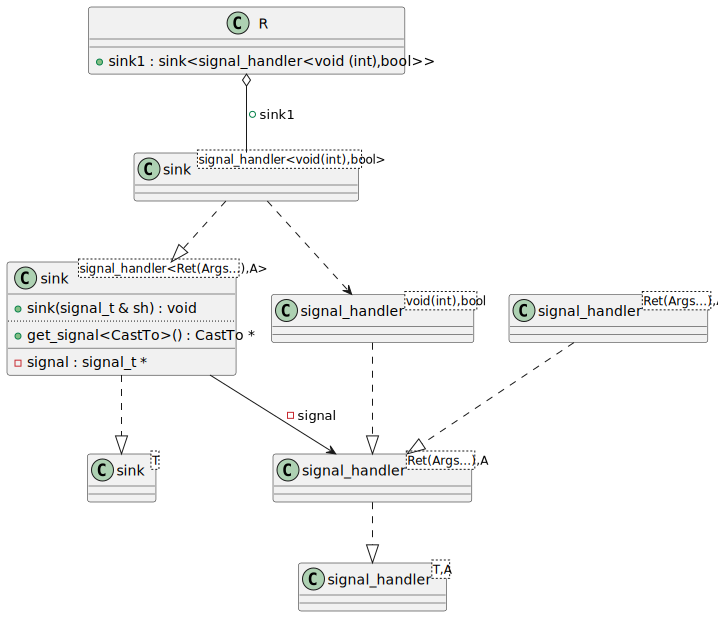

# t00044 - Test case for inner type aliases with parent class template args
## Config
```yaml
diagrams:
  t00044_class:
    type: class
    generate_packages: true
    glob:
      - t00044.cc
    using_namespace: clanguml::t00044
    include:
      namespaces:
        - clanguml::t00044
```
## Source code
File `tests/t00044/t00044.cc`
```cpp
// Inspired by skypjack/entt signal handlers
namespace clanguml::t00044 {

template <typename T> class sink;

template <typename T, typename A> struct signal_handler;

template <typename Ret, typename... Args, typename A>
class sink<signal_handler<Ret(Args...), A>> {
    using signal_t = signal_handler<Ret(Args...), A>;

public:
    sink(signal_t &sh)
        : signal{&sh}
    {
    }

    template <typename CastTo> CastTo *get_signal() { return (CastTo *)signal; }

private:
    signal_t *signal;
};

template <typename Ret, typename... Args, typename A>
struct signal_handler<Ret(Args...), A> { };

template <typename Ret, typename... Args, typename A>
sink(signal_handler<Ret(Args...), A> &)
    -> sink<signal_handler<Ret(Args...), A>>;

signal_handler<void(int), bool> int_handler;

struct R {
    sink<signal_handler<void(int), bool>> sink1{int_handler};
};

} // namespace clanguml::t00044

```
## Generated PlantUML diagrams

## Generated Mermaid diagrams

## Generated JSON models
```json
{
  "diagram_type": "class",
  "elements": [
    {
      "bases": [],
      "display_name": "signal_handler<Ret(Args...),A>",
      "id": "1591729735727316875",
      "is_abstract": false,
      "is_nested": false,
      "is_struct": true,
      "is_template": true,
      "is_union": false,
      "members": [],
      "methods": [],
      "name": "signal_handler",
      "namespace": "clanguml::t00044",
      "source_location": {
        "column": 7,
        "file": "t00044.cc",
        "line": 9,
        "translation_unit": "t00044.cc"
      },
      "template_parameters": [
        {
          "is_variadic": false,
          "kind": "template_type",
          "template_parameters": [
            {
              "is_variadic": false,
              "kind": "template_type",
              "name": "Ret",
              "template_parameters": []
            },
            {
              "is_variadic": true,
              "kind": "template_type",
              "name": "Args...",
              "template_parameters": []
            }
          ]
        },
        {
          "is_variadic": false,
          "kind": "template_type",
          "name": "A",
          "template_parameters": []
        }
      ],
      "type": "class"
    },
    {
      "bases": [],
      "display_name": "sink<signal_handler<Ret(Args...),A>>",
      "id": "559574389062594251",
      "is_abstract": false,
      "is_nested": false,
      "is_struct": false,
      "is_template": true,
      "is_union": false,
      "members": [
        {
          "access": "private",
          "is_static": false,
          "name": "signal",
          "source_location": {
            "column": 15,
            "file": "t00044.cc",
            "line": 21,
            "translation_unit": "t00044.cc"
          },
          "type": "signal_t *"
        }
      ],
      "methods": [
        {
          "access": "public",
          "display_name": "sink",
          "is_const": false,
          "is_consteval": false,
          "is_constexpr": false,
          "is_constructor": true,
          "is_copy_assignment": false,
          "is_coroutine": false,
          "is_defaulted": false,
          "is_deleted": false,
          "is_move_assignment": false,
          "is_noexcept": false,
          "is_operator": false,
          "is_pure_virtual": false,
          "is_static": false,
          "is_virtual": false,
          "name": "sink",
          "parameters": [
            {
              "name": "sh",
              "type": "signal_t &"
            }
          ],
          "source_location": {
            "column": 5,
            "file": "t00044.cc",
            "line": 13,
            "translation_unit": "t00044.cc"
          },
          "template_parameters": [],
          "type": "void"
        },
        {
          "access": "public",
          "display_name": "get_signal<CastTo>",
          "is_const": false,
          "is_consteval": false,
          "is_constexpr": false,
          "is_constructor": false,
          "is_copy_assignment": false,
          "is_coroutine": false,
          "is_defaulted": false,
          "is_deleted": false,
          "is_move_assignment": false,
          "is_noexcept": false,
          "is_operator": false,
          "is_pure_virtual": false,
          "is_static": false,
          "is_virtual": false,
          "name": "get_signal",
          "parameters": [],
          "template_parameters": [
            {
              "is_variadic": false,
              "kind": "template_type",
              "name": "CastTo",
              "template_parameters": []
            }
          ],
          "type": "CastTo *"
        }
      ],
      "name": "sink",
      "namespace": "clanguml::t00044",
      "source_location": {
        "column": 7,
        "file": "t00044.cc",
        "line": 9,
        "translation_unit": "t00044.cc"
      },
      "template_parameters": [
        {
          "is_variadic": false,
          "kind": "argument",
          "template_parameters": [
            {
              "is_variadic": false,
              "kind": "template_type",
              "template_parameters": [
                {
                  "is_variadic": false,
                  "kind": "template_type",
                  "name": "Ret",
                  "template_parameters": []
                },
                {
                  "is_variadic": true,
                  "kind": "template_type",
                  "name": "Args...",
                  "template_parameters": []
                }
              ]
            },
            {
              "is_variadic": false,
              "kind": "template_type",
              "name": "A",
              "template_parameters": []
            }
          ],
          "type": "signal_handler"
        }
      ],
      "type": "class"
    },
    {
      "bases": [],
      "display_name": "signal_handler<void(int),bool>",
      "id": "103559998624864011",
      "is_abstract": false,
      "is_nested": false,
      "is_struct": true,
      "is_template": true,
      "is_union": false,
      "members": [],
      "methods": [],
      "name": "signal_handler",
      "namespace": "clanguml::t00044",
      "source_location": {
        "column": 29,
        "file": "t00044.cc",
        "line": 4,
        "translation_unit": "t00044.cc"
      },
      "template_parameters": [
        {
          "is_variadic": false,
          "kind": "template_type",
          "template_parameters": [
            {
              "is_variadic": false,
              "kind": "argument",
              "template_parameters": [],
              "type": "void"
            },
            {
              "is_variadic": false,
              "kind": "argument",
              "template_parameters": [],
              "type": "int"
            }
          ]
        },
        {
          "is_variadic": false,
          "kind": "argument",
          "template_parameters": [],
          "type": "bool"
        }
      ],
      "type": "class"
    },
    {
      "bases": [],
      "display_name": "sink<signal_handler<void(int),bool>>",
      "id": "1718007222067272862",
      "is_abstract": false,
      "is_nested": false,
      "is_struct": false,
      "is_template": true,
      "is_union": false,
      "members": [],
      "methods": [],
      "name": "sink",
      "namespace": "clanguml::t00044",
      "source_location": {
        "column": 29,
        "file": "t00044.cc",
        "line": 4,
        "translation_unit": "t00044.cc"
      },
      "template_parameters": [
        {
          "is_variadic": false,
          "kind": "argument",
          "template_parameters": [
            {
              "is_variadic": false,
              "kind": "template_type",
              "template_parameters": [
                {
                  "is_variadic": false,
                  "kind": "argument",
                  "template_parameters": [],
                  "type": "void"
                },
                {
                  "is_variadic": false,
                  "kind": "argument",
                  "template_parameters": [],
                  "type": "int"
                }
              ]
            },
            {
              "is_variadic": false,
              "kind": "argument",
              "template_parameters": [],
              "type": "bool"
            }
          ],
          "type": "signal_handler"
        }
      ],
      "type": "class"
    },
    {
      "bases": [],
      "display_name": "R",
      "id": "1644484569399365272",
      "is_abstract": false,
      "is_nested": false,
      "is_struct": true,
      "is_template": false,
      "is_union": false,
      "members": [
        {
          "access": "public",
          "is_static": false,
          "name": "sink1",
          "source_location": {
            "column": 43,
            "file": "t00044.cc",
            "line": 34,
            "translation_unit": "t00044.cc"
          },
          "type": "sink<signal_handler<void (int),bool>>"
        }
      ],
      "methods": [],
      "name": "R",
      "namespace": "clanguml::t00044",
      "source_location": {
        "column": 8,
        "file": "t00044.cc",
        "line": 33,
        "translation_unit": "t00044.cc"
      },
      "template_parameters": [],
      "type": "class"
    },
    {
      "bases": [],
      "display_name": "signal_handler<T,A>",
      "id": "276594465967577895",
      "is_abstract": false,
      "is_nested": false,
      "is_struct": true,
      "is_template": true,
      "is_union": false,
      "members": [],
      "methods": [],
      "name": "signal_handler",
      "namespace": "clanguml::t00044",
      "source_location": {
        "column": 42,
        "file": "t00044.cc",
        "line": 6,
        "translation_unit": "t00044.cc"
      },
      "template_parameters": [
        {
          "is_variadic": false,
          "kind": "template_type",
          "name": "T",
          "template_parameters": []
        },
        {
          "is_variadic": false,
          "kind": "template_type",
          "name": "A",
          "template_parameters": []
        }
      ],
      "type": "class"
    },
    {
      "bases": [],
      "display_name": "sink<T>",
      "id": "1759724482769288325",
      "is_abstract": false,
      "is_nested": false,
      "is_struct": false,
      "is_template": true,
      "is_union": false,
      "members": [],
      "methods": [],
      "name": "sink",
      "namespace": "clanguml::t00044",
      "source_location": {
        "column": 29,
        "file": "t00044.cc",
        "line": 4,
        "translation_unit": "t00044.cc"
      },
      "template_parameters": [
        {
          "is_variadic": false,
          "kind": "template_type",
          "name": "T",
          "template_parameters": []
        }
      ],
      "type": "class"
    }
  ],
  "name": "t00044_class",
  "package_type": "namespace",
  "relationships": [
    {
      "access": "public",
      "destination": "276594465967577895",
      "source": "1591729735727316875",
      "type": "instantiation"
    },
    {
      "access": "private",
      "destination": "1591729735727316875",
      "label": "signal",
      "source": "559574389062594251",
      "type": "association"
    },
    {
      "access": "private",
      "destination": "276594465967577895",
      "label": "signal",
      "source": "559574389062594251",
      "type": "association"
    },
    {
      "access": "public",
      "destination": "1759724482769288325",
      "source": "559574389062594251",
      "type": "instantiation"
    },
    {
      "access": "public",
      "destination": "1591729735727316875",
      "source": "103559998624864011",
      "type": "instantiation"
    },
    {
      "access": "public",
      "destination": "103559998624864011",
      "source": "1718007222067272862",
      "type": "dependency"
    },
    {
      "access": "public",
      "destination": "559574389062594251",
      "source": "1718007222067272862",
      "type": "instantiation"
    },
    {
      "access": "public",
      "destination": "1718007222067272862",
      "label": "sink1",
      "source": "1644484569399365272",
      "type": "aggregation"
    }
  ],
  "using_namespace": "clanguml::t00044"
}
```
