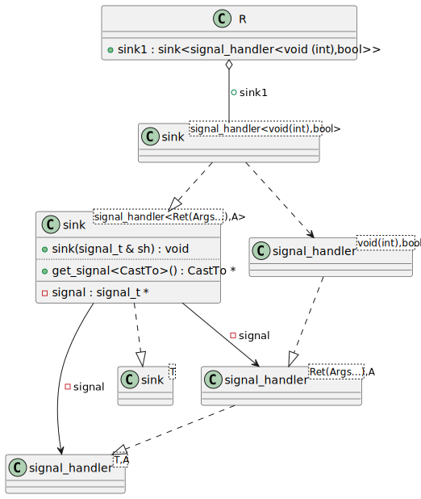

# t00044 - Test case for inner type aliases with parent class template args
## Config
```yaml
compilation_database_dir: ..
output_directory: puml
diagrams:
  t00044_class:
    type: class
    generate_packages: true
    glob:
      - ../../tests/t00044/t00044.cc
    using_namespace:
      - clanguml::t00044
    include:
      namespaces:
        - clanguml::t00044
```
## Source code
File t00044.cc
```cpp
// Inspired by skypjack/entt signal handlers
// This test case checks that at least clang-uml does not crash on this code
namespace clanguml::t00044 {

template <typename T> class sink;

template <typename T, typename A> class signal_handler;

template <typename Ret, typename... Args, typename A>
class sink<signal_handler<Ret(Args...), A>> {
    using signal_t = signal_handler<Ret(Args...), A>;

public:
    sink(signal_t &sh)
        : signal{&sh}
    {
    }

private:
    signal_t *signal;
};

template <typename Ret, typename... Args, typename A>
class signal_handler<Ret(Args...), A> { };

template <typename Ret, typename... Args, typename A>
sink(signal_handler<Ret(Args...), A> &)
    -> sink<signal_handler<Ret(Args...), A>>;

signal_handler<void(int), bool> int_handler;

sink sink1{int_handler};

} // namespace clanguml::t00044

```
## Generated UML diagrams

## Generated JSON models
```json
{
  "diagram_type": "class",
  "elements": [
    {
      "bases": [],
      "display_name": "clanguml::t00044::sink<clanguml::t00044::signal_handler<,type-parameter-0-2>>",
      "id": "1813783008369291713",
      "is_abstract": false,
      "is_nested": false,
      "is_struct": false,
      "is_template": false,
      "is_union": false,
      "members": [],
      "methods": [],
      "name": "sink",
      "namespace": "clanguml::t00044",
      "source_location": {
        "file": "../../tests/t00044/t00044.cc",
        "line": 10
      },
      "template_parameters": [
        {
          "is_variadic": false,
          "kind": "argument",
          "template_parameters": [
            {
              "is_variadic": false,
              "kind": "argument",
              "template_parameters": [],
              "type": ""
            },
            {
              "is_variadic": false,
              "kind": "argument",
              "template_parameters": [],
              "type": "type-parameter-0-2"
            }
          ],
          "type": "clanguml::t00044::signal_handler"
        }
      ],
      "type": "class"
    },
    {
      "bases": [],
      "display_name": "clanguml::t00044::signal_handler<Ret(Args...),A>",
      "id": "1591729735727316875",
      "is_abstract": false,
      "is_nested": false,
      "is_struct": false,
      "is_template": false,
      "is_union": false,
      "members": [],
      "methods": [],
      "name": "signal_handler",
      "namespace": "clanguml::t00044",
      "source_location": {
        "file": "../../tests/t00044/t00044.cc",
        "line": 24
      },
      "template_parameters": [
        {
          "is_variadic": false,
          "kind": "template_type",
          "name": "Ret(Args...)",
          "template_parameters": []
        },
        {
          "is_variadic": false,
          "kind": "template_type",
          "name": "A",
          "template_parameters": []
        }
      ],
      "type": "class"
    },
    {
      "bases": [],
      "display_name": "clanguml::t00044::signal_handler<T,A>",
      "id": "276594465967577895",
      "is_abstract": false,
      "is_nested": false,
      "is_struct": false,
      "is_template": true,
      "is_union": false,
      "members": [],
      "methods": [],
      "name": "signal_handler",
      "namespace": "clanguml::t00044",
      "source_location": {
        "file": "../../tests/t00044/t00044.cc",
        "line": 7
      },
      "template_parameters": [
        {
          "is_variadic": false,
          "kind": "template_type",
          "name": "T",
          "template_parameters": []
        },
        {
          "is_variadic": false,
          "kind": "template_type",
          "name": "A",
          "template_parameters": []
        }
      ],
      "type": "class"
    },
    {
      "bases": [],
      "display_name": "clanguml::t00044::sink<T>",
      "id": "1759724482769288325",
      "is_abstract": false,
      "is_nested": false,
      "is_struct": false,
      "is_template": true,
      "is_union": false,
      "members": [],
      "methods": [],
      "name": "sink",
      "namespace": "clanguml::t00044",
      "source_location": {
        "file": "../../tests/t00044/t00044.cc",
        "line": 5
      },
      "template_parameters": [
        {
          "is_variadic": false,
          "kind": "template_type",
          "name": "T",
          "template_parameters": []
        }
      ],
      "type": "class"
    }
  ],
  "name": "t00044_class",
  "relationships": [
    {
      "access": "public",
      "destination": "1759724482769288325",
      "source": "1813783008369291713",
      "type": "instantiation"
    },
    {
      "access": "public",
      "destination": "276594465967577895",
      "source": "1591729735727316875",
      "type": "instantiation"
    }
  ],
  "using_namespace": "clanguml::t00044"
}
```
