# t00044 - Test case for inner type aliases with parent class template args
## Config
```yaml
diagrams:
  t00044_class:
    type: class
    generate_packages: true
    glob:
      - t00044.cc
    using_namespace: clanguml::t00044
    include:
      namespaces:
        - clanguml::t00044
```
## Source code
File `tests/t00044/t00044.cc`
```cpp
// Inspired by skypjack/entt signal handlers
namespace clanguml::t00044 {

template <typename T> class sink;

template <typename T, typename A> struct signal_handler;

template <typename Ret, typename... Args, typename A>
class sink<signal_handler<Ret(Args...), A>> {
    using signal_t = signal_handler<Ret(Args...), A>;

public:
    sink(signal_t &sh)
        : signal{&sh}
    {
    }

    template <typename CastTo> CastTo *get_signal() { return (CastTo *)signal; }

private:
    signal_t *signal;
};

template <typename Ret, typename... Args, typename A>
struct signal_handler<Ret(Args...), A> { };

template <typename Ret, typename... Args, typename A>
sink(
    signal_handler<Ret(Args...), A> &) -> sink<signal_handler<Ret(Args...), A>>;

signal_handler<void(int), bool> int_handler;

struct R {
    sink<signal_handler<void(int), bool>> sink1{int_handler};
};

} // namespace clanguml::t00044

```
## Generated PlantUML diagrams

## Generated Mermaid diagrams

## Generated JSON models
```json
{
  "diagram_type": "class",
  "elements": [
    {
      "bases": [],
      "display_name": "signal_handler<Ret(Args...),A>",
      "id": "12733837885818535000",
      "is_abstract": false,
      "is_nested": false,
      "is_struct": true,
      "is_template": true,
      "is_union": false,
      "members": [],
      "methods": [],
      "name": "signal_handler",
      "namespace": "clanguml::t00044",
      "source_location": {
        "column": 7,
        "file": "t00044.cc",
        "line": 9,
        "translation_unit": "t00044.cc"
      },
      "template_parameters": [
        {
          "is_variadic": false,
          "kind": "template_type",
          "template_parameters": [
            {
              "is_variadic": false,
              "kind": "template_type",
              "name": "Ret",
              "template_parameters": []
            },
            {
              "is_variadic": true,
              "kind": "template_type",
              "name": "Args...",
              "template_parameters": []
            }
          ]
        },
        {
          "is_variadic": false,
          "kind": "template_type",
          "name": "A",
          "template_parameters": []
        }
      ],
      "type": "class"
    },
    {
      "bases": [],
      "display_name": "sink<signal_handler<Ret(Args...),A>>",
      "id": "4476595112500754008",
      "is_abstract": false,
      "is_nested": false,
      "is_struct": false,
      "is_template": true,
      "is_union": false,
      "members": [
        {
          "access": "private",
          "is_static": false,
          "name": "signal",
          "source_location": {
            "column": 15,
            "file": "t00044.cc",
            "line": 21,
            "translation_unit": "t00044.cc"
          },
          "type": "signal_t *"
        }
      ],
      "methods": [
        {
          "access": "public",
          "display_name": "sink",
          "is_const": false,
          "is_consteval": false,
          "is_constexpr": false,
          "is_constructor": true,
          "is_copy_assignment": false,
          "is_coroutine": false,
          "is_defaulted": false,
          "is_deleted": false,
          "is_move_assignment": false,
          "is_noexcept": false,
          "is_operator": false,
          "is_pure_virtual": false,
          "is_static": false,
          "is_virtual": false,
          "name": "sink",
          "parameters": [
            {
              "name": "sh",
              "type": "signal_t &"
            }
          ],
          "source_location": {
            "column": 5,
            "file": "t00044.cc",
            "line": 13,
            "translation_unit": "t00044.cc"
          },
          "template_parameters": [],
          "type": "void"
        },
        {
          "access": "public",
          "display_name": "get_signal<CastTo>",
          "is_const": false,
          "is_consteval": false,
          "is_constexpr": false,
          "is_constructor": false,
          "is_copy_assignment": false,
          "is_coroutine": false,
          "is_defaulted": false,
          "is_deleted": false,
          "is_move_assignment": false,
          "is_noexcept": false,
          "is_operator": false,
          "is_pure_virtual": false,
          "is_static": false,
          "is_virtual": false,
          "name": "get_signal",
          "parameters": [],
          "template_parameters": [
            {
              "is_variadic": false,
              "kind": "template_type",
              "name": "CastTo",
              "template_parameters": []
            }
          ],
          "type": "CastTo *"
        }
      ],
      "name": "sink",
      "namespace": "clanguml::t00044",
      "source_location": {
        "column": 7,
        "file": "t00044.cc",
        "line": 9,
        "translation_unit": "t00044.cc"
      },
      "template_parameters": [
        {
          "is_variadic": false,
          "kind": "argument",
          "template_parameters": [
            {
              "is_variadic": false,
              "kind": "template_type",
              "template_parameters": [
                {
                  "is_variadic": false,
                  "kind": "template_type",
                  "name": "Ret",
                  "template_parameters": []
                },
                {
                  "is_variadic": true,
                  "kind": "template_type",
                  "name": "Args...",
                  "template_parameters": []
                }
              ]
            },
            {
              "is_variadic": false,
              "kind": "template_type",
              "name": "A",
              "template_parameters": []
            }
          ],
          "type": "signal_handler"
        }
      ],
      "type": "class"
    },
    {
      "bases": [],
      "display_name": "signal_handler<void(int),bool>",
      "id": "828479988998912093",
      "is_abstract": false,
      "is_nested": false,
      "is_struct": true,
      "is_template": true,
      "is_union": false,
      "members": [],
      "methods": [],
      "name": "signal_handler",
      "namespace": "clanguml::t00044",
      "source_location": {
        "column": 29,
        "file": "t00044.cc",
        "line": 4,
        "translation_unit": "t00044.cc"
      },
      "template_parameters": [
        {
          "is_variadic": false,
          "kind": "template_type",
          "template_parameters": [
            {
              "is_variadic": false,
              "kind": "argument",
              "template_parameters": [],
              "type": "void"
            },
            {
              "is_variadic": false,
              "kind": "argument",
              "template_parameters": [],
              "type": "int"
            }
          ]
        },
        {
          "is_variadic": false,
          "kind": "argument",
          "template_parameters": [],
          "type": "bool"
        }
      ],
      "type": "class"
    },
    {
      "bases": [],
      "display_name": "sink<signal_handler<void(int),bool>>",
      "id": "13744057776538182902",
      "is_abstract": false,
      "is_nested": false,
      "is_struct": false,
      "is_template": true,
      "is_union": false,
      "members": [],
      "methods": [],
      "name": "sink",
      "namespace": "clanguml::t00044",
      "source_location": {
        "column": 29,
        "file": "t00044.cc",
        "line": 4,
        "translation_unit": "t00044.cc"
      },
      "template_parameters": [
        {
          "is_variadic": false,
          "kind": "argument",
          "template_parameters": [
            {
              "is_variadic": false,
              "kind": "template_type",
              "template_parameters": [
                {
                  "is_variadic": false,
                  "kind": "argument",
                  "template_parameters": [],
                  "type": "void"
                },
                {
                  "is_variadic": false,
                  "kind": "argument",
                  "template_parameters": [],
                  "type": "int"
                }
              ]
            },
            {
              "is_variadic": false,
              "kind": "argument",
              "template_parameters": [],
              "type": "bool"
            }
          ],
          "type": "signal_handler"
        }
      ],
      "type": "class"
    },
    {
      "bases": [],
      "display_name": "R",
      "id": "13155876555194922183",
      "is_abstract": false,
      "is_nested": false,
      "is_struct": true,
      "is_template": false,
      "is_union": false,
      "members": [
        {
          "access": "public",
          "is_static": false,
          "name": "sink1",
          "source_location": {
            "column": 43,
            "file": "t00044.cc",
            "line": 34,
            "translation_unit": "t00044.cc"
          },
          "type": "sink<signal_handler<void (int),bool>>"
        }
      ],
      "methods": [],
      "name": "R",
      "namespace": "clanguml::t00044",
      "source_location": {
        "column": 8,
        "file": "t00044.cc",
        "line": 33,
        "translation_unit": "t00044.cc"
      },
      "template_parameters": [],
      "type": "class"
    },
    {
      "bases": [],
      "display_name": "signal_handler<T,A>",
      "id": "2212755727740623160",
      "is_abstract": false,
      "is_nested": false,
      "is_struct": true,
      "is_template": true,
      "is_union": false,
      "members": [],
      "methods": [],
      "name": "signal_handler",
      "namespace": "clanguml::t00044",
      "source_location": {
        "column": 42,
        "file": "t00044.cc",
        "line": 6,
        "translation_unit": "t00044.cc"
      },
      "template_parameters": [
        {
          "is_variadic": false,
          "kind": "template_type",
          "name": "T",
          "template_parameters": []
        },
        {
          "is_variadic": false,
          "kind": "template_type",
          "name": "A",
          "template_parameters": []
        }
      ],
      "type": "class"
    },
    {
      "bases": [],
      "display_name": "sink<T>",
      "id": "14077795862154306600",
      "is_abstract": false,
      "is_nested": false,
      "is_struct": false,
      "is_template": true,
      "is_union": false,
      "members": [],
      "methods": [],
      "name": "sink",
      "namespace": "clanguml::t00044",
      "source_location": {
        "column": 29,
        "file": "t00044.cc",
        "line": 4,
        "translation_unit": "t00044.cc"
      },
      "template_parameters": [
        {
          "is_variadic": false,
          "kind": "template_type",
          "name": "T",
          "template_parameters": []
        }
      ],
      "type": "class"
    }
  ],
  "name": "t00044_class",
  "package_type": "namespace",
  "relationships": [
    {
      "access": "public",
      "destination": "2212755727740623160",
      "source": "12733837885818535000",
      "type": "instantiation"
    },
    {
      "access": "private",
      "destination": "12733837885818535000",
      "label": "signal",
      "source": "4476595112500754008",
      "type": "association"
    },
    {
      "access": "private",
      "destination": "2212755727740623160",
      "label": "signal",
      "source": "4476595112500754008",
      "type": "association"
    },
    {
      "access": "public",
      "destination": "14077795862154306600",
      "source": "4476595112500754008",
      "type": "instantiation"
    },
    {
      "access": "public",
      "destination": "12733837885818535000",
      "source": "828479988998912093",
      "type": "instantiation"
    },
    {
      "access": "public",
      "destination": "828479988998912093",
      "source": "13744057776538182902",
      "type": "dependency"
    },
    {
      "access": "public",
      "destination": "4476595112500754008",
      "source": "13744057776538182902",
      "type": "instantiation"
    },
    {
      "access": "public",
      "destination": "13744057776538182902",
      "label": "sink1",
      "source": "13155876555194922183",
      "type": "aggregation"
    }
  ],
  "using_namespace": "clanguml::t00044"
}
```
## Generated GraphML models
```xml
<?xml version="1.0"?>
<graphml xmlns="http://graphml.graphdrawing.org/xmlns" xmlns:xsi="http://www.w3.org/2001/XMLSchema-instance" xsi:schemaLocation="http://graphml.graphdrawing.org/xmlns http://graphml.graphdrawing.org/xmlns/1.0/graphml.xsd">
 <key attr.name="id" attr.type="string" for="graph" id="gd0" />
 <key attr.name="type" attr.type="string" for="graph" id="gd1" />
 <key attr.name="using_namespace" attr.type="string" for="graph" id="gd2" />
 <key attr.name="id" attr.type="string" for="node" id="nd0" />
 <key attr.name="type" attr.type="string" for="node" id="nd1" />
 <key attr.name="name" attr.type="string" for="node" id="nd2" />
 <key attr.name="stereotype" attr.type="string" for="node" id="nd3" />
 <key attr.name="url" attr.type="string" for="node" id="nd4" />
 <key attr.name="tooltip" attr.type="string" for="node" id="nd5" />
 <key attr.name="is_template" attr.type="boolean" for="node" id="nd6" />
 <key attr.name="type" attr.type="string" for="edge" id="ed0" />
 <key attr.name="access" attr.type="string" for="edge" id="ed1" />
 <key attr.name="label" attr.type="string" for="edge" id="ed2" />
 <key attr.name="url" attr.type="string" for="edge" id="ed3" />
 <graph id="g0" edgedefault="directed" parse.nodeids="canonical" parse.edgeids="canonical" parse.order="nodesfirst">
  <data key="gd2">clanguml::t00044</data>
  <node id="n0">
   <data key="nd1">class</data>
   <data key="nd2"><![CDATA[signal_handler<Ret(Args...),A>]]></data>
   <data key="nd6">true</data>
   <data key="nd4">https://github.com/bkryza/clang-uml/blob/974c6f4a38a48a553ba3f79495af6c960d22884f/tests/t00044/t00044.cc#L9</data>
   <data key="nd5">signal_handler</data>
  </node>
  <node id="n1">
   <data key="nd1">class</data>
   <data key="nd2"><![CDATA[sink<signal_handler<Ret(Args...),A>>]]></data>
   <data key="nd6">true</data>
   <data key="nd4">https://github.com/bkryza/clang-uml/blob/974c6f4a38a48a553ba3f79495af6c960d22884f/tests/t00044/t00044.cc#L9</data>
   <data key="nd5">sink</data>
  </node>
  <node id="n2">
   <data key="nd1">class</data>
   <data key="nd2"><![CDATA[signal_handler<void(int),bool>]]></data>
   <data key="nd6">true</data>
   <data key="nd4">https://github.com/bkryza/clang-uml/blob/974c6f4a38a48a553ba3f79495af6c960d22884f/tests/t00044/t00044.cc#L4</data>
   <data key="nd5">signal_handler</data>
  </node>
  <node id="n3">
   <data key="nd1">class</data>
   <data key="nd2"><![CDATA[sink<signal_handler<void(int),bool>>]]></data>
   <data key="nd6">true</data>
   <data key="nd4">https://github.com/bkryza/clang-uml/blob/974c6f4a38a48a553ba3f79495af6c960d22884f/tests/t00044/t00044.cc#L4</data>
   <data key="nd5">sink</data>
  </node>
  <node id="n4">
   <data key="nd1">class</data>
   <data key="nd2"><![CDATA[R]]></data>
   <data key="nd6">false</data>
   <data key="nd4">https://github.com/bkryza/clang-uml/blob/974c6f4a38a48a553ba3f79495af6c960d22884f/tests/t00044/t00044.cc#L33</data>
   <data key="nd5">R</data>
  </node>
  <node id="n5">
   <data key="nd1">class</data>
   <data key="nd2"><![CDATA[signal_handler<T,A>]]></data>
   <data key="nd6">true</data>
   <data key="nd4">https://github.com/bkryza/clang-uml/blob/974c6f4a38a48a553ba3f79495af6c960d22884f/tests/t00044/t00044.cc#L6</data>
   <data key="nd5">signal_handler</data>
  </node>
  <node id="n6">
   <data key="nd1">class</data>
   <data key="nd2"><![CDATA[sink<T>]]></data>
   <data key="nd6">true</data>
   <data key="nd4">https://github.com/bkryza/clang-uml/blob/974c6f4a38a48a553ba3f79495af6c960d22884f/tests/t00044/t00044.cc#L4</data>
   <data key="nd5">sink</data>
  </node>
  <edge id="e0" source="n0" target="n5">
   <data key="ed0">instantiation</data>
   <data key="ed1">public</data>
  </edge>
  <edge id="e1" source="n1" target="n0">
   <data key="ed0">association</data>
   <data key="ed2">signal</data>
   <data key="ed1">private</data>
  </edge>
  <edge id="e2" source="n1" target="n5">
   <data key="ed0">association</data>
   <data key="ed2">signal</data>
   <data key="ed1">private</data>
  </edge>
  <edge id="e3" source="n1" target="n6">
   <data key="ed0">instantiation</data>
   <data key="ed1">public</data>
  </edge>
  <edge id="e4" source="n2" target="n0">
   <data key="ed0">instantiation</data>
   <data key="ed1">public</data>
  </edge>
  <edge id="e5" source="n3" target="n2">
   <data key="ed0">dependency</data>
   <data key="ed1">public</data>
  </edge>
  <edge id="e6" source="n3" target="n1">
   <data key="ed0">instantiation</data>
   <data key="ed1">public</data>
  </edge>
  <edge id="e7" source="n4" target="n3">
   <data key="ed0">aggregation</data>
   <data key="ed2">sink1</data>
   <data key="ed1">public</data>
  </edge>
 </graph>
</graphml>

```
