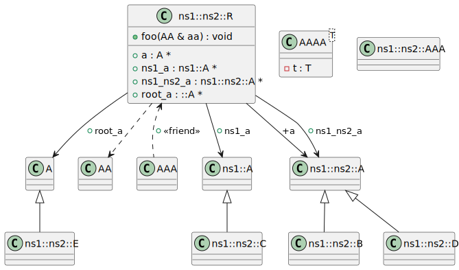

# t00045 - Test case for root namespace handling
## Config
```yaml
diagrams:
  t00045_class:
    type: class
    glob:
      - t00045.cc
    exclude:
      namespaces:
        - std
```
## Source code
File `tests/t00045/t00045.cc`
```cpp
class A { };

class AA { };

class AAA { };

template <typename T> class AAAA {
    T t;
};

namespace ns1 {

class A { };

namespace ns2 {

class A { };

class B : public A { };

class C : public ns1::A { };

class D : public ns1::ns2::A { };

class E : public ::A { };

class AAA { };

class R {
public:
    A *a;
    ns1::A *ns1_a;
    ns1::ns2::A *ns1_ns2_a;
    ::A *root_a;

    friend ::AAA;
    // TODO:
    // template<typename T> friend class ::AAAA;

    void foo(::AA &aa) { (void)aa; }
};
} // namespace ns2
} // namespace ns1

```
## Generated PlantUML diagrams

## Generated Mermaid diagrams

## Generated JSON models
```json
{
  "diagram_type": "class",
  "elements": [
    {
      "bases": [],
      "display_name": "A",
      "id": "6919333181322027406",
      "is_abstract": false,
      "is_nested": false,
      "is_struct": false,
      "is_template": false,
      "is_union": false,
      "members": [],
      "methods": [],
      "name": "A",
      "namespace": "",
      "source_location": {
        "column": 7,
        "file": "t00045.cc",
        "line": 1,
        "translation_unit": "t00045.cc"
      },
      "template_parameters": [],
      "type": "class"
    },
    {
      "bases": [],
      "display_name": "AA",
      "id": "3094982628479217459",
      "is_abstract": false,
      "is_nested": false,
      "is_struct": false,
      "is_template": false,
      "is_union": false,
      "members": [],
      "methods": [],
      "name": "AA",
      "namespace": "",
      "source_location": {
        "column": 7,
        "file": "t00045.cc",
        "line": 3,
        "translation_unit": "t00045.cc"
      },
      "template_parameters": [],
      "type": "class"
    },
    {
      "bases": [],
      "display_name": "AAA",
      "id": "433315220782171707",
      "is_abstract": false,
      "is_nested": false,
      "is_struct": false,
      "is_template": false,
      "is_union": false,
      "members": [],
      "methods": [],
      "name": "AAA",
      "namespace": "",
      "source_location": {
        "column": 7,
        "file": "t00045.cc",
        "line": 5,
        "translation_unit": "t00045.cc"
      },
      "template_parameters": [],
      "type": "class"
    },
    {
      "bases": [],
      "display_name": "AAAA<T>",
      "id": "3007245012555720156",
      "is_abstract": false,
      "is_nested": false,
      "is_struct": false,
      "is_template": true,
      "is_union": false,
      "members": [
        {
          "access": "private",
          "is_static": false,
          "name": "t",
          "source_location": {
            "column": 7,
            "file": "t00045.cc",
            "line": 8,
            "translation_unit": "t00045.cc"
          },
          "type": "T"
        }
      ],
      "methods": [],
      "name": "AAAA",
      "namespace": "",
      "source_location": {
        "column": 29,
        "file": "t00045.cc",
        "line": 7,
        "translation_unit": "t00045.cc"
      },
      "template_parameters": [
        {
          "is_variadic": false,
          "kind": "template_type",
          "name": "T",
          "template_parameters": []
        }
      ],
      "type": "class"
    },
    {
      "bases": [],
      "display_name": "ns1::A",
      "id": "4957137863549307995",
      "is_abstract": false,
      "is_nested": false,
      "is_struct": false,
      "is_template": false,
      "is_union": false,
      "members": [],
      "methods": [],
      "name": "A",
      "namespace": "ns1",
      "source_location": {
        "column": 7,
        "file": "t00045.cc",
        "line": 13,
        "translation_unit": "t00045.cc"
      },
      "template_parameters": [],
      "type": "class"
    },
    {
      "bases": [],
      "display_name": "ns1::ns2::A",
      "id": "17656057552237354746",
      "is_abstract": false,
      "is_nested": false,
      "is_struct": false,
      "is_template": false,
      "is_union": false,
      "members": [],
      "methods": [],
      "name": "A",
      "namespace": "ns1::ns2",
      "source_location": {
        "column": 7,
        "file": "t00045.cc",
        "line": 17,
        "translation_unit": "t00045.cc"
      },
      "template_parameters": [],
      "type": "class"
    },
    {
      "bases": [
        {
          "access": "public",
          "id": "17656057552237354746",
          "is_virtual": false
        }
      ],
      "display_name": "ns1::ns2::B",
      "id": "1632415880994984623",
      "is_abstract": false,
      "is_nested": false,
      "is_struct": false,
      "is_template": false,
      "is_union": false,
      "members": [],
      "methods": [],
      "name": "B",
      "namespace": "ns1::ns2",
      "source_location": {
        "column": 7,
        "file": "t00045.cc",
        "line": 19,
        "translation_unit": "t00045.cc"
      },
      "template_parameters": [],
      "type": "class"
    },
    {
      "bases": [
        {
          "access": "public",
          "id": "4957137863549307995",
          "is_virtual": false
        }
      ],
      "display_name": "ns1::ns2::C",
      "id": "14696076436517940251",
      "is_abstract": false,
      "is_nested": false,
      "is_struct": false,
      "is_template": false,
      "is_union": false,
      "members": [],
      "methods": [],
      "name": "C",
      "namespace": "ns1::ns2",
      "source_location": {
        "column": 7,
        "file": "t00045.cc",
        "line": 21,
        "translation_unit": "t00045.cc"
      },
      "template_parameters": [],
      "type": "class"
    },
    {
      "bases": [
        {
          "access": "public",
          "id": "17656057552237354746",
          "is_virtual": false
        }
      ],
      "display_name": "ns1::ns2::D",
      "id": "16239436487454399847",
      "is_abstract": false,
      "is_nested": false,
      "is_struct": false,
      "is_template": false,
      "is_union": false,
      "members": [],
      "methods": [],
      "name": "D",
      "namespace": "ns1::ns2",
      "source_location": {
        "column": 7,
        "file": "t00045.cc",
        "line": 23,
        "translation_unit": "t00045.cc"
      },
      "template_parameters": [],
      "type": "class"
    },
    {
      "bases": [
        {
          "access": "public",
          "id": "6919333181322027406",
          "is_virtual": false
        }
      ],
      "display_name": "ns1::ns2::E",
      "id": "18442868286060638176",
      "is_abstract": false,
      "is_nested": false,
      "is_struct": false,
      "is_template": false,
      "is_union": false,
      "members": [],
      "methods": [],
      "name": "E",
      "namespace": "ns1::ns2",
      "source_location": {
        "column": 7,
        "file": "t00045.cc",
        "line": 25,
        "translation_unit": "t00045.cc"
      },
      "template_parameters": [],
      "type": "class"
    },
    {
      "bases": [],
      "display_name": "ns1::ns2::AAA",
      "id": "13850113990349490933",
      "is_abstract": false,
      "is_nested": false,
      "is_struct": false,
      "is_template": false,
      "is_union": false,
      "members": [],
      "methods": [],
      "name": "AAA",
      "namespace": "ns1::ns2",
      "source_location": {
        "column": 7,
        "file": "t00045.cc",
        "line": 27,
        "translation_unit": "t00045.cc"
      },
      "template_parameters": [],
      "type": "class"
    },
    {
      "bases": [],
      "display_name": "ns1::ns2::R",
      "id": "7795444762564711929",
      "is_abstract": false,
      "is_nested": false,
      "is_struct": false,
      "is_template": false,
      "is_union": false,
      "members": [
        {
          "access": "public",
          "is_static": false,
          "name": "a",
          "source_location": {
            "column": 8,
            "file": "t00045.cc",
            "line": 31,
            "translation_unit": "t00045.cc"
          },
          "type": "A *"
        },
        {
          "access": "public",
          "is_static": false,
          "name": "ns1_a",
          "source_location": {
            "column": 13,
            "file": "t00045.cc",
            "line": 32,
            "translation_unit": "t00045.cc"
          },
          "type": "ns1::A *"
        },
        {
          "access": "public",
          "is_static": false,
          "name": "ns1_ns2_a",
          "source_location": {
            "column": 18,
            "file": "t00045.cc",
            "line": 33,
            "translation_unit": "t00045.cc"
          },
          "type": "ns1::ns2::A *"
        },
        {
          "access": "public",
          "is_static": false,
          "name": "root_a",
          "source_location": {
            "column": 10,
            "file": "t00045.cc",
            "line": 34,
            "translation_unit": "t00045.cc"
          },
          "type": "::A *"
        }
      ],
      "methods": [
        {
          "access": "public",
          "display_name": "foo",
          "is_const": false,
          "is_consteval": false,
          "is_constexpr": false,
          "is_constructor": false,
          "is_copy_assignment": false,
          "is_coroutine": false,
          "is_defaulted": false,
          "is_deleted": false,
          "is_move_assignment": false,
          "is_noexcept": false,
          "is_operator": false,
          "is_pure_virtual": false,
          "is_static": false,
          "is_virtual": false,
          "name": "foo",
          "parameters": [
            {
              "name": "aa",
              "type": "::AA &"
            }
          ],
          "source_location": {
            "column": 10,
            "file": "t00045.cc",
            "line": 40,
            "translation_unit": "t00045.cc"
          },
          "template_parameters": [],
          "type": "void"
        }
      ],
      "name": "R",
      "namespace": "ns1::ns2",
      "source_location": {
        "column": 7,
        "file": "t00045.cc",
        "line": 29,
        "translation_unit": "t00045.cc"
      },
      "template_parameters": [],
      "type": "class"
    }
  ],
  "name": "t00045_class",
  "package_type": "namespace",
  "relationships": [
    {
      "access": "public",
      "destination": "17656057552237354746",
      "source": "1632415880994984623",
      "type": "extension"
    },
    {
      "access": "public",
      "destination": "4957137863549307995",
      "source": "14696076436517940251",
      "type": "extension"
    },
    {
      "access": "public",
      "destination": "17656057552237354746",
      "source": "16239436487454399847",
      "type": "extension"
    },
    {
      "access": "public",
      "destination": "6919333181322027406",
      "source": "18442868286060638176",
      "type": "extension"
    },
    {
      "access": "public",
      "destination": "3094982628479217459",
      "source": "7795444762564711929",
      "type": "dependency"
    },
    {
      "access": "public",
      "destination": "17656057552237354746",
      "label": "a",
      "source": "7795444762564711929",
      "type": "association"
    },
    {
      "access": "public",
      "destination": "4957137863549307995",
      "label": "ns1_a",
      "source": "7795444762564711929",
      "type": "association"
    },
    {
      "access": "public",
      "destination": "17656057552237354746",
      "label": "ns1_ns2_a",
      "source": "7795444762564711929",
      "type": "association"
    },
    {
      "access": "public",
      "destination": "6919333181322027406",
      "label": "root_a",
      "source": "7795444762564711929",
      "type": "association"
    },
    {
      "access": "public",
      "destination": "433315220782171707",
      "label": "<<friend>>",
      "source": "7795444762564711929",
      "type": "friendship"
    }
  ]
}
```
## Generated GraphML models
```xml
<?xml version="1.0"?>
<graphml xmlns="http://graphml.graphdrawing.org/xmlns" xmlns:xsi="http://www.w3.org/2001/XMLSchema-instance" xsi:schemaLocation="http://graphml.graphdrawing.org/xmlns http://graphml.graphdrawing.org/xmlns/1.0/graphml.xsd">
 <key attr.name="id" attr.type="string" for="graph" id="gd0" />
 <key attr.name="type" attr.type="string" for="graph" id="gd1" />
 <key attr.name="using_namespace" attr.type="string" for="graph" id="gd2" />
 <key attr.name="id" attr.type="string" for="node" id="nd0" />
 <key attr.name="type" attr.type="string" for="node" id="nd1" />
 <key attr.name="name" attr.type="string" for="node" id="nd2" />
 <key attr.name="stereotype" attr.type="string" for="node" id="nd3" />
 <key attr.name="url" attr.type="string" for="node" id="nd4" />
 <key attr.name="tooltip" attr.type="string" for="node" id="nd5" />
 <key attr.name="is_template" attr.type="boolean" for="node" id="nd6" />
 <key attr.name="type" attr.type="string" for="edge" id="ed0" />
 <key attr.name="access" attr.type="string" for="edge" id="ed1" />
 <key attr.name="label" attr.type="string" for="edge" id="ed2" />
 <key attr.name="url" attr.type="string" for="edge" id="ed3" />
 <graph id="g0" edgedefault="directed" parse.nodeids="canonical" parse.edgeids="canonical" parse.order="nodesfirst">
  <node id="n0">
   <data key="nd1">class</data>
   <data key="nd2"><![CDATA[A]]></data>
   <data key="nd6">false</data>
   <data key="nd4">https://github.com/bkryza/clang-uml/blob/974c6f4a38a48a553ba3f79495af6c960d22884f/tests/t00045/t00045.cc#L1</data>
   <data key="nd5">A</data>
  </node>
  <node id="n1">
   <data key="nd1">class</data>
   <data key="nd2"><![CDATA[AA]]></data>
   <data key="nd6">false</data>
   <data key="nd4">https://github.com/bkryza/clang-uml/blob/974c6f4a38a48a553ba3f79495af6c960d22884f/tests/t00045/t00045.cc#L3</data>
   <data key="nd5">AA</data>
  </node>
  <node id="n2">
   <data key="nd1">class</data>
   <data key="nd2"><![CDATA[AAA]]></data>
   <data key="nd6">false</data>
   <data key="nd4">https://github.com/bkryza/clang-uml/blob/974c6f4a38a48a553ba3f79495af6c960d22884f/tests/t00045/t00045.cc#L5</data>
   <data key="nd5">AAA</data>
  </node>
  <node id="n3">
   <data key="nd1">class</data>
   <data key="nd2"><![CDATA[AAAA<T>]]></data>
   <data key="nd6">true</data>
   <data key="nd4">https://github.com/bkryza/clang-uml/blob/974c6f4a38a48a553ba3f79495af6c960d22884f/tests/t00045/t00045.cc#L7</data>
   <data key="nd5">AAAA</data>
  </node>
  <node id="n4">
   <data key="nd1">class</data>
   <data key="nd2"><![CDATA[ns1::A]]></data>
   <data key="nd6">false</data>
   <data key="nd4">https://github.com/bkryza/clang-uml/blob/974c6f4a38a48a553ba3f79495af6c960d22884f/tests/t00045/t00045.cc#L13</data>
   <data key="nd5">A</data>
  </node>
  <node id="n5">
   <data key="nd1">class</data>
   <data key="nd2"><![CDATA[ns1::ns2::A]]></data>
   <data key="nd6">false</data>
   <data key="nd4">https://github.com/bkryza/clang-uml/blob/974c6f4a38a48a553ba3f79495af6c960d22884f/tests/t00045/t00045.cc#L17</data>
   <data key="nd5">A</data>
  </node>
  <node id="n6">
   <data key="nd1">class</data>
   <data key="nd2"><![CDATA[ns1::ns2::B]]></data>
   <data key="nd6">false</data>
   <data key="nd4">https://github.com/bkryza/clang-uml/blob/974c6f4a38a48a553ba3f79495af6c960d22884f/tests/t00045/t00045.cc#L19</data>
   <data key="nd5">B</data>
  </node>
  <node id="n7">
   <data key="nd1">class</data>
   <data key="nd2"><![CDATA[ns1::ns2::C]]></data>
   <data key="nd6">false</data>
   <data key="nd4">https://github.com/bkryza/clang-uml/blob/974c6f4a38a48a553ba3f79495af6c960d22884f/tests/t00045/t00045.cc#L21</data>
   <data key="nd5">C</data>
  </node>
  <node id="n8">
   <data key="nd1">class</data>
   <data key="nd2"><![CDATA[ns1::ns2::D]]></data>
   <data key="nd6">false</data>
   <data key="nd4">https://github.com/bkryza/clang-uml/blob/974c6f4a38a48a553ba3f79495af6c960d22884f/tests/t00045/t00045.cc#L23</data>
   <data key="nd5">D</data>
  </node>
  <node id="n9">
   <data key="nd1">class</data>
   <data key="nd2"><![CDATA[ns1::ns2::E]]></data>
   <data key="nd6">false</data>
   <data key="nd4">https://github.com/bkryza/clang-uml/blob/974c6f4a38a48a553ba3f79495af6c960d22884f/tests/t00045/t00045.cc#L25</data>
   <data key="nd5">E</data>
  </node>
  <node id="n10">
   <data key="nd1">class</data>
   <data key="nd2"><![CDATA[ns1::ns2::AAA]]></data>
   <data key="nd6">false</data>
   <data key="nd4">https://github.com/bkryza/clang-uml/blob/974c6f4a38a48a553ba3f79495af6c960d22884f/tests/t00045/t00045.cc#L27</data>
   <data key="nd5">AAA</data>
  </node>
  <node id="n11">
   <data key="nd1">class</data>
   <data key="nd2"><![CDATA[ns1::ns2::R]]></data>
   <data key="nd6">false</data>
   <data key="nd4">https://github.com/bkryza/clang-uml/blob/974c6f4a38a48a553ba3f79495af6c960d22884f/tests/t00045/t00045.cc#L29</data>
   <data key="nd5">R</data>
  </node>
  <edge id="e0" source="n6" target="n5">
   <data key="ed0">extension</data>
   <data key="ed1">public</data>
  </edge>
  <edge id="e1" source="n7" target="n4">
   <data key="ed0">extension</data>
   <data key="ed1">public</data>
  </edge>
  <edge id="e2" source="n8" target="n5">
   <data key="ed0">extension</data>
   <data key="ed1">public</data>
  </edge>
  <edge id="e3" source="n9" target="n0">
   <data key="ed0">extension</data>
   <data key="ed1">public</data>
  </edge>
  <edge id="e4" source="n11" target="n1">
   <data key="ed0">dependency</data>
   <data key="ed1">public</data>
  </edge>
  <edge id="e5" source="n11" target="n5">
   <data key="ed0">association</data>
   <data key="ed2">a</data>
   <data key="ed1">public</data>
  </edge>
  <edge id="e6" source="n11" target="n4">
   <data key="ed0">association</data>
   <data key="ed2">ns1_a</data>
   <data key="ed1">public</data>
  </edge>
  <edge id="e7" source="n11" target="n5">
   <data key="ed0">association</data>
   <data key="ed2">ns1_ns2_a</data>
   <data key="ed1">public</data>
  </edge>
  <edge id="e8" source="n11" target="n0">
   <data key="ed0">association</data>
   <data key="ed2">root_a</data>
   <data key="ed1">public</data>
  </edge>
  <edge id="e9" source="n11" target="n2">
   <data key="ed0">friendship</data>
   <data key="ed2">&lt;&lt;friend&gt;&gt;</data>
   <data key="ed1">public</data>
  </edge>
 </graph>
</graphml>

```
