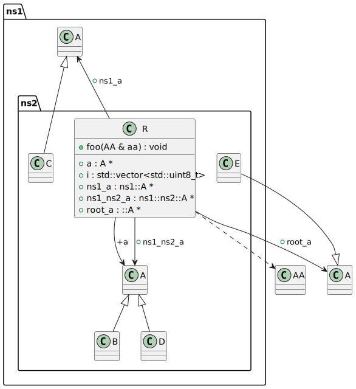

# t00046 - Test case for root namespace handling with packages
## Config
```yaml
diagrams:
  t00046_class:
    type: class
    generate_packages: true
    glob:
      - t00046.cc
    exclude:
      namespaces:
        - std
```
## Source code
File `tests/t00046/t00046.cc`
```cpp
#include <cstdint>
#include <vector>

class A { };

class AA { };

namespace ns1 {

class A { };

namespace ns2 {

class A { };

class B : public A { };

class C : public ns1::A { };

class D : public ns1::ns2::A { };

class E : public ::A { };

class R {
public:
    A *a;
    ns1::A *ns1_a;
    ns1::ns2::A *ns1_ns2_a;
    ::A *root_a;
    std::vector<std::uint8_t> i;

    void foo(::AA &aa) { (void)aa; }
};
} // namespace ns2
} // namespace ns1

```
## Generated PlantUML diagrams

## Generated Mermaid diagrams

## Generated JSON models
```json
{
  "diagram_type": "class",
  "elements": [
    {
      "bases": [],
      "display_name": "A",
      "id": "864916647665253425",
      "is_abstract": false,
      "is_nested": false,
      "is_struct": false,
      "is_template": false,
      "is_union": false,
      "members": [],
      "methods": [],
      "name": "A",
      "namespace": "",
      "source_location": {
        "column": 7,
        "file": "t00046.cc",
        "line": 4,
        "translation_unit": "t00046.cc"
      },
      "template_parameters": [],
      "type": "class"
    },
    {
      "bases": [],
      "display_name": "AA",
      "id": "386872828559902182",
      "is_abstract": false,
      "is_nested": false,
      "is_struct": false,
      "is_template": false,
      "is_union": false,
      "members": [],
      "methods": [],
      "name": "AA",
      "namespace": "",
      "source_location": {
        "column": 7,
        "file": "t00046.cc",
        "line": 6,
        "translation_unit": "t00046.cc"
      },
      "template_parameters": [],
      "type": "class"
    },
    {
      "display_name": "ns1",
      "elements": [
        {
          "bases": [],
          "display_name": "A",
          "id": "619642232943663499",
          "is_abstract": false,
          "is_nested": false,
          "is_struct": false,
          "is_template": false,
          "is_union": false,
          "members": [],
          "methods": [],
          "name": "A",
          "namespace": "ns1",
          "source_location": {
            "column": 7,
            "file": "t00046.cc",
            "line": 10,
            "translation_unit": "t00046.cc"
          },
          "template_parameters": [],
          "type": "class"
        },
        {
          "display_name": "ns2",
          "elements": [
            {
              "bases": [],
              "display_name": "A",
              "id": "2207007194029669343",
              "is_abstract": false,
              "is_nested": false,
              "is_struct": false,
              "is_template": false,
              "is_union": false,
              "members": [],
              "methods": [],
              "name": "A",
              "namespace": "ns1::ns2",
              "source_location": {
                "column": 7,
                "file": "t00046.cc",
                "line": 14,
                "translation_unit": "t00046.cc"
              },
              "template_parameters": [],
              "type": "class"
            },
            {
              "bases": [
                {
                  "access": "public",
                  "id": "2207007194029669343",
                  "is_virtual": false,
                  "name": "ns1::ns2::A"
                }
              ],
              "display_name": "B",
              "id": "204051985124373077",
              "is_abstract": false,
              "is_nested": false,
              "is_struct": false,
              "is_template": false,
              "is_union": false,
              "members": [],
              "methods": [],
              "name": "B",
              "namespace": "ns1::ns2",
              "source_location": {
                "column": 7,
                "file": "t00046.cc",
                "line": 16,
                "translation_unit": "t00046.cc"
              },
              "template_parameters": [],
              "type": "class"
            },
            {
              "bases": [
                {
                  "access": "public",
                  "id": "619642232943663499",
                  "is_virtual": false,
                  "name": "ns1::A"
                }
              ],
              "display_name": "C",
              "id": "1837009554564742531",
              "is_abstract": false,
              "is_nested": false,
              "is_struct": false,
              "is_template": false,
              "is_union": false,
              "members": [],
              "methods": [],
              "name": "C",
              "namespace": "ns1::ns2",
              "source_location": {
                "column": 7,
                "file": "t00046.cc",
                "line": 18,
                "translation_unit": "t00046.cc"
              },
              "template_parameters": [],
              "type": "class"
            },
            {
              "bases": [
                {
                  "access": "public",
                  "id": "2207007194029669343",
                  "is_virtual": false,
                  "name": "ns1::ns2::A"
                }
              ],
              "display_name": "D",
              "id": "2029929560931799980",
              "is_abstract": false,
              "is_nested": false,
              "is_struct": false,
              "is_template": false,
              "is_union": false,
              "members": [],
              "methods": [],
              "name": "D",
              "namespace": "ns1::ns2",
              "source_location": {
                "column": 7,
                "file": "t00046.cc",
                "line": 20,
                "translation_unit": "t00046.cc"
              },
              "template_parameters": [],
              "type": "class"
            },
            {
              "bases": [
                {
                  "access": "public",
                  "id": "864916647665253425",
                  "is_virtual": false,
                  "name": "A"
                }
              ],
              "display_name": "E",
              "id": "2305358535757579772",
              "is_abstract": false,
              "is_nested": false,
              "is_struct": false,
              "is_template": false,
              "is_union": false,
              "members": [],
              "methods": [],
              "name": "E",
              "namespace": "ns1::ns2",
              "source_location": {
                "column": 7,
                "file": "t00046.cc",
                "line": 22,
                "translation_unit": "t00046.cc"
              },
              "template_parameters": [],
              "type": "class"
            },
            {
              "bases": [],
              "display_name": "R",
              "id": "974430595320588991",
              "is_abstract": false,
              "is_nested": false,
              "is_struct": false,
              "is_template": false,
              "is_union": false,
              "members": [
                {
                  "access": "public",
                  "is_static": false,
                  "name": "a",
                  "source_location": {
                    "column": 8,
                    "file": "t00046.cc",
                    "line": 26,
                    "translation_unit": "t00046.cc"
                  },
                  "type": "A *"
                },
                {
                  "access": "public",
                  "is_static": false,
                  "name": "ns1_a",
                  "source_location": {
                    "column": 13,
                    "file": "t00046.cc",
                    "line": 27,
                    "translation_unit": "t00046.cc"
                  },
                  "type": "ns1::A *"
                },
                {
                  "access": "public",
                  "is_static": false,
                  "name": "ns1_ns2_a",
                  "source_location": {
                    "column": 18,
                    "file": "t00046.cc",
                    "line": 28,
                    "translation_unit": "t00046.cc"
                  },
                  "type": "ns1::ns2::A *"
                },
                {
                  "access": "public",
                  "is_static": false,
                  "name": "root_a",
                  "source_location": {
                    "column": 10,
                    "file": "t00046.cc",
                    "line": 29,
                    "translation_unit": "t00046.cc"
                  },
                  "type": "::A *"
                },
                {
                  "access": "public",
                  "is_static": false,
                  "name": "i",
                  "source_location": {
                    "column": 31,
                    "file": "t00046.cc",
                    "line": 30,
                    "translation_unit": "t00046.cc"
                  },
                  "type": "std::vector<std::uint8_t>"
                }
              ],
              "methods": [
                {
                  "access": "public",
                  "display_name": "foo",
                  "is_const": false,
                  "is_consteval": false,
                  "is_constexpr": false,
                  "is_constructor": false,
                  "is_copy_assignment": false,
                  "is_coroutine": false,
                  "is_defaulted": false,
                  "is_deleted": false,
                  "is_move_assignment": false,
                  "is_noexcept": false,
                  "is_operator": false,
                  "is_pure_virtual": false,
                  "is_static": false,
                  "is_virtual": false,
                  "name": "foo",
                  "parameters": [
                    {
                      "name": "aa",
                      "type": "::AA &"
                    }
                  ],
                  "source_location": {
                    "column": 10,
                    "file": "t00046.cc",
                    "line": 32,
                    "translation_unit": "t00046.cc"
                  },
                  "template_parameters": [],
                  "type": "void"
                }
              ],
              "name": "R",
              "namespace": "ns1::ns2",
              "source_location": {
                "column": 7,
                "file": "t00046.cc",
                "line": 24,
                "translation_unit": "t00046.cc"
              },
              "template_parameters": [],
              "type": "class"
            }
          ],
          "name": "ns2",
          "type": "namespace"
        }
      ],
      "name": "ns1",
      "type": "namespace"
    }
  ],
  "name": "t00046_class",
  "package_type": "namespace",
  "relationships": [
    {
      "access": "public",
      "destination": "2207007194029669343",
      "source": "204051985124373077",
      "type": "extension"
    },
    {
      "access": "public",
      "destination": "619642232943663499",
      "source": "1837009554564742531",
      "type": "extension"
    },
    {
      "access": "public",
      "destination": "2207007194029669343",
      "source": "2029929560931799980",
      "type": "extension"
    },
    {
      "access": "public",
      "destination": "864916647665253425",
      "source": "2305358535757579772",
      "type": "extension"
    },
    {
      "access": "public",
      "destination": "386872828559902182",
      "source": "974430595320588991",
      "type": "dependency"
    },
    {
      "access": "public",
      "destination": "2207007194029669343",
      "label": "a",
      "source": "974430595320588991",
      "type": "association"
    },
    {
      "access": "public",
      "destination": "619642232943663499",
      "label": "ns1_a",
      "source": "974430595320588991",
      "type": "association"
    },
    {
      "access": "public",
      "destination": "2207007194029669343",
      "label": "ns1_ns2_a",
      "source": "974430595320588991",
      "type": "association"
    },
    {
      "access": "public",
      "destination": "864916647665253425",
      "label": "root_a",
      "source": "974430595320588991",
      "type": "association"
    }
  ]
}
```
