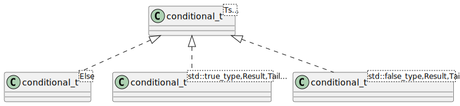

# t00047 - Test case for recursive variadic template
## Config
```yaml
diagrams:
  t00047_class:
    type: class
    glob:
      - t00047.cc
    using_namespace: clanguml::t00047
    plantuml:
      style:
        instantiation: up
    include:
      namespaces:
        - clanguml::t00047
```
## Source code
File `tests/t00047/t00047.cc`
```cpp
#include <type_traits>

namespace clanguml {
namespace t00047 {

template <typename... Ts> struct conditional_t;

template <typename Else> struct conditional_t<Else> {
    using type = Else;
};

template <typename Result, typename... Tail>
struct conditional_t<std::true_type, Result, Tail...> {
    using type = Result;
};

template <typename Result, typename... Tail>
struct conditional_t<std::false_type, Result, Tail...> {
    using type = typename conditional_t<Tail...>::type;
};

template <typename... Ts>
using conditional = typename conditional_t<Ts...>::type;

} // namespace t00047
} // namespace clanguml
```
## Generated PlantUML diagrams

## Generated Mermaid diagrams

## Generated JSON models
```json
{
  "diagram_type": "class",
  "elements": [
    {
      "bases": [],
      "display_name": "conditional_t<Else>",
      "id": "47394280824625133",
      "is_abstract": false,
      "is_nested": false,
      "is_struct": true,
      "is_template": true,
      "is_union": false,
      "members": [],
      "methods": [],
      "name": "conditional_t",
      "namespace": "clanguml::t00047",
      "source_location": {
        "column": 33,
        "file": "t00047.cc",
        "line": 8,
        "translation_unit": "t00047.cc"
      },
      "template_parameters": [
        {
          "is_variadic": false,
          "kind": "template_type",
          "name": "Else",
          "template_parameters": []
        }
      ],
      "type": "class"
    },
    {
      "bases": [],
      "display_name": "conditional_t<std::true_type,Result,Tail...>",
      "id": "599782159389775809",
      "is_abstract": false,
      "is_nested": false,
      "is_struct": true,
      "is_template": true,
      "is_union": false,
      "members": [],
      "methods": [],
      "name": "conditional_t",
      "namespace": "clanguml::t00047",
      "source_location": {
        "column": 8,
        "file": "t00047.cc",
        "line": 13,
        "translation_unit": "t00047.cc"
      },
      "template_parameters": [
        {
          "is_variadic": false,
          "kind": "argument",
          "template_parameters": [],
          "type": "std::true_type"
        },
        {
          "is_variadic": false,
          "kind": "template_type",
          "name": "Result",
          "template_parameters": []
        },
        {
          "is_variadic": true,
          "kind": "template_type",
          "name": "Tail...",
          "template_parameters": []
        }
      ],
      "type": "class"
    },
    {
      "bases": [],
      "display_name": "conditional_t<std::false_type,Result,Tail...>",
      "id": "824938194184364511",
      "is_abstract": false,
      "is_nested": false,
      "is_struct": true,
      "is_template": true,
      "is_union": false,
      "members": [],
      "methods": [],
      "name": "conditional_t",
      "namespace": "clanguml::t00047",
      "source_location": {
        "column": 8,
        "file": "t00047.cc",
        "line": 18,
        "translation_unit": "t00047.cc"
      },
      "template_parameters": [
        {
          "is_variadic": false,
          "kind": "argument",
          "template_parameters": [],
          "type": "std::false_type"
        },
        {
          "is_variadic": false,
          "kind": "template_type",
          "name": "Result",
          "template_parameters": []
        },
        {
          "is_variadic": true,
          "kind": "template_type",
          "name": "Tail...",
          "template_parameters": []
        }
      ],
      "type": "class"
    },
    {
      "bases": [],
      "display_name": "conditional_t<Ts...>",
      "id": "1673692992642087414",
      "is_abstract": false,
      "is_nested": false,
      "is_struct": true,
      "is_template": true,
      "is_union": false,
      "members": [],
      "methods": [],
      "name": "conditional_t",
      "namespace": "clanguml::t00047",
      "source_location": {
        "column": 34,
        "file": "t00047.cc",
        "line": 6,
        "translation_unit": "t00047.cc"
      },
      "template_parameters": [
        {
          "is_variadic": true,
          "kind": "template_type",
          "name": "Ts...",
          "template_parameters": []
        }
      ],
      "type": "class"
    }
  ],
  "name": "t00047_class",
  "package_type": "namespace",
  "relationships": [
    {
      "access": "public",
      "destination": "1673692992642087414",
      "source": "47394280824625133",
      "type": "instantiation"
    },
    {
      "access": "public",
      "destination": "1673692992642087414",
      "source": "599782159389775809",
      "type": "instantiation"
    },
    {
      "access": "public",
      "destination": "1673692992642087414",
      "source": "824938194184364511",
      "type": "instantiation"
    }
  ],
  "using_namespace": "clanguml::t00047"
}
```
