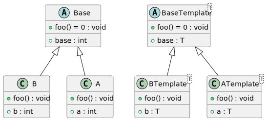

# t00048 - Test case for unique entity id with multiple translation units
## Config
```yaml
diagrams:
  t00048_class:
    type: class
    glob:
      - b_t00048.cc
      - a_t00048.cc
      - t00048.cc
    using_namespace: clanguml::t00048
    include:
      namespaces:
        - clanguml::t00048
```
## Source code
File `tests/t00048/b_t00048.h`
```cpp
#include "t00048.h"

#pragma once

namespace clanguml {
namespace t00048 {

struct B : public Base {
    int b;

    void foo() override;
};

template <typename T> struct BTemplate : public BaseTemplate<T> {
    T b;

    void foo() override { }
};

}
}
```
File `tests/t00048/b_t00048.cc`
```cpp
#include "b_t00048.h"

namespace clanguml {
namespace t00048 {

void B::foo() { }

}
}
```
File `tests/t00048/t00048.cc`
```cpp
#include "t00048.h"

namespace clanguml {
namespace t00048 {
}
}
```
File `tests/t00048/a_t00048.h`
```cpp
#include "t00048.h"

#pragma once

namespace clanguml {
namespace t00048 {

struct A : public Base {
    int a;

    void foo() override;
};

template <typename T> struct ATemplate : public BaseTemplate<T> {
    T a;

    void foo() override { }
};

}
}
```
File `tests/t00048/a_t00048.cc`
```cpp
#include "a_t00048.h"

namespace clanguml {
namespace t00048 {

void A::foo() { }

}
}
```
File `tests/t00048/t00048.h`
```cpp
#pragma once

namespace clanguml {
namespace t00048 {

struct Base {
    int base;

    virtual void foo() = 0;
};

template <typename T> struct BaseTemplate {
    T base;

    virtual void foo() = 0;
};

}
}
```
## Generated PlantUML diagrams

## Generated Mermaid diagrams

## Generated JSON models
```json
{
  "diagram_type": "class",
  "elements": [
    {
      "bases": [],
      "display_name": "Base",
      "id": "10200626899013233",
      "is_abstract": true,
      "is_nested": false,
      "is_struct": true,
      "is_template": false,
      "is_union": false,
      "members": [
        {
          "access": "public",
          "is_static": false,
          "name": "base",
          "source_location": {
            "column": 9,
            "file": "t00048.h",
            "line": 7,
            "translation_unit": "b_t00048.cc"
          },
          "type": "int"
        }
      ],
      "methods": [
        {
          "access": "public",
          "display_name": "foo",
          "is_const": false,
          "is_consteval": false,
          "is_constexpr": false,
          "is_constructor": false,
          "is_copy_assignment": false,
          "is_coroutine": false,
          "is_defaulted": false,
          "is_deleted": false,
          "is_move_assignment": false,
          "is_noexcept": false,
          "is_operator": false,
          "is_pure_virtual": true,
          "is_static": false,
          "is_virtual": true,
          "name": "foo",
          "parameters": [],
          "source_location": {
            "column": 18,
            "file": "t00048.h",
            "line": 9,
            "translation_unit": "b_t00048.cc"
          },
          "template_parameters": [],
          "type": "void"
        }
      ],
      "name": "Base",
      "namespace": "clanguml::t00048",
      "source_location": {
        "column": 8,
        "file": "t00048.h",
        "line": 6,
        "translation_unit": "b_t00048.cc"
      },
      "template_parameters": [],
      "type": "class"
    },
    {
      "bases": [],
      "display_name": "BaseTemplate<T>",
      "id": "630197772543569536",
      "is_abstract": true,
      "is_nested": false,
      "is_struct": true,
      "is_template": true,
      "is_union": false,
      "members": [
        {
          "access": "public",
          "is_static": false,
          "name": "base",
          "source_location": {
            "column": 7,
            "file": "t00048.h",
            "line": 13,
            "translation_unit": "b_t00048.cc"
          },
          "type": "T"
        }
      ],
      "methods": [
        {
          "access": "public",
          "display_name": "foo",
          "is_const": false,
          "is_consteval": false,
          "is_constexpr": false,
          "is_constructor": false,
          "is_copy_assignment": false,
          "is_coroutine": false,
          "is_defaulted": false,
          "is_deleted": false,
          "is_move_assignment": false,
          "is_noexcept": false,
          "is_operator": false,
          "is_pure_virtual": true,
          "is_static": false,
          "is_virtual": true,
          "name": "foo",
          "parameters": [],
          "source_location": {
            "column": 18,
            "file": "t00048.h",
            "line": 15,
            "translation_unit": "b_t00048.cc"
          },
          "template_parameters": [],
          "type": "void"
        }
      ],
      "name": "BaseTemplate",
      "namespace": "clanguml::t00048",
      "source_location": {
        "column": 30,
        "file": "t00048.h",
        "line": 12,
        "translation_unit": "b_t00048.cc"
      },
      "template_parameters": [
        {
          "is_variadic": false,
          "kind": "template_type",
          "name": "T",
          "template_parameters": []
        }
      ],
      "type": "class"
    },
    {
      "bases": [
        {
          "access": "public",
          "id": "10200626899013233",
          "is_virtual": false,
          "name": "clanguml::t00048::Base"
        }
      ],
      "display_name": "B",
      "id": "59336049758992190",
      "is_abstract": false,
      "is_nested": false,
      "is_struct": true,
      "is_template": false,
      "is_union": false,
      "members": [
        {
          "access": "public",
          "is_static": false,
          "name": "b",
          "source_location": {
            "column": 9,
            "file": "b_t00048.h",
            "line": 9,
            "translation_unit": "b_t00048.cc"
          },
          "type": "int"
        }
      ],
      "methods": [
        {
          "access": "public",
          "display_name": "foo",
          "is_const": false,
          "is_consteval": false,
          "is_constexpr": false,
          "is_constructor": false,
          "is_copy_assignment": false,
          "is_coroutine": false,
          "is_defaulted": false,
          "is_deleted": false,
          "is_move_assignment": false,
          "is_noexcept": false,
          "is_operator": false,
          "is_pure_virtual": false,
          "is_static": false,
          "is_virtual": true,
          "name": "foo",
          "parameters": [],
          "source_location": {
            "column": 10,
            "file": "b_t00048.h",
            "line": 11,
            "translation_unit": "b_t00048.cc"
          },
          "template_parameters": [],
          "type": "void"
        }
      ],
      "name": "B",
      "namespace": "clanguml::t00048",
      "source_location": {
        "column": 8,
        "file": "b_t00048.h",
        "line": 8,
        "translation_unit": "b_t00048.cc"
      },
      "template_parameters": [],
      "type": "class"
    },
    {
      "bases": [
        {
          "access": "public",
          "id": "630197772543569536",
          "is_virtual": false,
          "name": "clanguml::t00048::BaseTemplate<T>"
        }
      ],
      "display_name": "BTemplate<T>",
      "id": "1635850649347735305",
      "is_abstract": false,
      "is_nested": false,
      "is_struct": true,
      "is_template": true,
      "is_union": false,
      "members": [
        {
          "access": "public",
          "is_static": false,
          "name": "b",
          "source_location": {
            "column": 7,
            "file": "b_t00048.h",
            "line": 15,
            "translation_unit": "b_t00048.cc"
          },
          "type": "T"
        }
      ],
      "methods": [
        {
          "access": "public",
          "display_name": "foo",
          "is_const": false,
          "is_consteval": false,
          "is_constexpr": false,
          "is_constructor": false,
          "is_copy_assignment": false,
          "is_coroutine": false,
          "is_defaulted": false,
          "is_deleted": false,
          "is_move_assignment": false,
          "is_noexcept": false,
          "is_operator": false,
          "is_pure_virtual": false,
          "is_static": false,
          "is_virtual": false,
          "name": "foo",
          "parameters": [],
          "source_location": {
            "column": 10,
            "file": "b_t00048.h",
            "line": 17,
            "translation_unit": "b_t00048.cc"
          },
          "template_parameters": [],
          "type": "void"
        }
      ],
      "name": "BTemplate",
      "namespace": "clanguml::t00048",
      "source_location": {
        "column": 30,
        "file": "b_t00048.h",
        "line": 14,
        "translation_unit": "b_t00048.cc"
      },
      "template_parameters": [
        {
          "is_variadic": false,
          "kind": "template_type",
          "name": "T",
          "template_parameters": []
        }
      ],
      "type": "class"
    },
    {
      "bases": [
        {
          "access": "public",
          "id": "10200626899013233",
          "is_virtual": false,
          "name": "clanguml::t00048::Base"
        }
      ],
      "display_name": "A",
      "id": "199333691834211223",
      "is_abstract": false,
      "is_nested": false,
      "is_struct": true,
      "is_template": false,
      "is_union": false,
      "members": [
        {
          "access": "public",
          "is_static": false,
          "name": "a",
          "source_location": {
            "column": 9,
            "file": "a_t00048.h",
            "line": 9,
            "translation_unit": "a_t00048.cc"
          },
          "type": "int"
        }
      ],
      "methods": [
        {
          "access": "public",
          "display_name": "foo",
          "is_const": false,
          "is_consteval": false,
          "is_constexpr": false,
          "is_constructor": false,
          "is_copy_assignment": false,
          "is_coroutine": false,
          "is_defaulted": false,
          "is_deleted": false,
          "is_move_assignment": false,
          "is_noexcept": false,
          "is_operator": false,
          "is_pure_virtual": false,
          "is_static": false,
          "is_virtual": true,
          "name": "foo",
          "parameters": [],
          "source_location": {
            "column": 10,
            "file": "a_t00048.h",
            "line": 11,
            "translation_unit": "a_t00048.cc"
          },
          "template_parameters": [],
          "type": "void"
        }
      ],
      "name": "A",
      "namespace": "clanguml::t00048",
      "source_location": {
        "column": 8,
        "file": "a_t00048.h",
        "line": 8,
        "translation_unit": "a_t00048.cc"
      },
      "template_parameters": [],
      "type": "class"
    },
    {
      "bases": [
        {
          "access": "public",
          "id": "630197772543569536",
          "is_virtual": false,
          "name": "clanguml::t00048::BaseTemplate<T>"
        }
      ],
      "display_name": "ATemplate<T>",
      "id": "1025697108404463905",
      "is_abstract": false,
      "is_nested": false,
      "is_struct": true,
      "is_template": true,
      "is_union": false,
      "members": [
        {
          "access": "public",
          "is_static": false,
          "name": "a",
          "source_location": {
            "column": 7,
            "file": "a_t00048.h",
            "line": 15,
            "translation_unit": "a_t00048.cc"
          },
          "type": "T"
        }
      ],
      "methods": [
        {
          "access": "public",
          "display_name": "foo",
          "is_const": false,
          "is_consteval": false,
          "is_constexpr": false,
          "is_constructor": false,
          "is_copy_assignment": false,
          "is_coroutine": false,
          "is_defaulted": false,
          "is_deleted": false,
          "is_move_assignment": false,
          "is_noexcept": false,
          "is_operator": false,
          "is_pure_virtual": false,
          "is_static": false,
          "is_virtual": false,
          "name": "foo",
          "parameters": [],
          "source_location": {
            "column": 10,
            "file": "a_t00048.h",
            "line": 17,
            "translation_unit": "a_t00048.cc"
          },
          "template_parameters": [],
          "type": "void"
        }
      ],
      "name": "ATemplate",
      "namespace": "clanguml::t00048",
      "source_location": {
        "column": 30,
        "file": "a_t00048.h",
        "line": 14,
        "translation_unit": "a_t00048.cc"
      },
      "template_parameters": [
        {
          "is_variadic": false,
          "kind": "template_type",
          "name": "T",
          "template_parameters": []
        }
      ],
      "type": "class"
    }
  ],
  "name": "t00048_class",
  "package_type": "namespace",
  "relationships": [
    {
      "access": "public",
      "destination": "10200626899013233",
      "source": "59336049758992190",
      "type": "extension"
    },
    {
      "access": "public",
      "destination": "630197772543569536",
      "source": "1635850649347735305",
      "type": "extension"
    },
    {
      "access": "public",
      "destination": "10200626899013233",
      "source": "199333691834211223",
      "type": "extension"
    },
    {
      "access": "public",
      "destination": "630197772543569536",
      "source": "1025697108404463905",
      "type": "extension"
    }
  ],
  "using_namespace": "clanguml::t00048"
}
```
