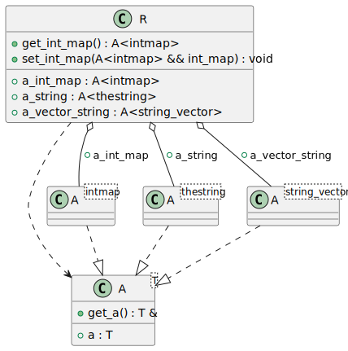

# t00049 - Test case configurable type aliases
## Config
```yaml
diagrams:
  t00049_class:
    type: class
    using_namespace: clanguml::t00049
    type_aliases:
      "std::basic_string<char>": thestring
      "std::string": thestring
      "std::vector<std::string>": string_vector
      "std::vector<thestring>": string_vector
      "std::map<int,int>": intmap
    glob:
      - t00049.cc
    include:
      namespaces:
        - clanguml::t00049
```
## Source code
File `tests/t00049/t00049.cc`
```cpp
#include <map>
#include <string>
#include <vector>

namespace clanguml {
namespace t00049 {
template <typename T> struct A {
    T a;

    T &get_a() { return a; }
};

struct R {
    A<std::basic_string<char>> a_string;
    A<std::vector<std::string>> a_vector_string;
    A<std::map<int, int>> a_int_map;

    A<std::map<int, int>> get_int_map() { return a_int_map; }

    void set_int_map(A<std::map<int, int>> &&int_map) { a_int_map = int_map; }
};
} // namespace t00049
} // namespace clanguml
```
## Generated PlantUML diagrams

## Generated Mermaid diagrams

## Generated JSON models
```json
{
  "diagram_type": "class",
  "elements": [
    {
      "bases": [],
      "display_name": "A<T>",
      "id": "372971769516871577",
      "is_abstract": false,
      "is_nested": false,
      "is_struct": true,
      "is_template": true,
      "is_union": false,
      "members": [
        {
          "access": "public",
          "is_static": false,
          "name": "a",
          "source_location": {
            "column": 7,
            "file": "t00049.cc",
            "line": 8,
            "translation_unit": "t00049.cc"
          },
          "type": "T"
        }
      ],
      "methods": [
        {
          "access": "public",
          "display_name": "get_a",
          "is_const": false,
          "is_consteval": false,
          "is_constexpr": false,
          "is_constructor": false,
          "is_copy_assignment": false,
          "is_coroutine": false,
          "is_defaulted": false,
          "is_deleted": false,
          "is_move_assignment": false,
          "is_noexcept": false,
          "is_operator": false,
          "is_pure_virtual": false,
          "is_static": false,
          "is_virtual": false,
          "name": "get_a",
          "parameters": [],
          "source_location": {
            "column": 8,
            "file": "t00049.cc",
            "line": 10,
            "translation_unit": "t00049.cc"
          },
          "template_parameters": [],
          "type": "T &"
        }
      ],
      "name": "A",
      "namespace": "clanguml::t00049",
      "source_location": {
        "column": 30,
        "file": "t00049.cc",
        "line": 7,
        "translation_unit": "t00049.cc"
      },
      "template_parameters": [
        {
          "is_variadic": false,
          "kind": "template_type",
          "name": "T",
          "template_parameters": []
        }
      ],
      "type": "class"
    },
    {
      "bases": [],
      "display_name": "A<intmap>",
      "id": "654829353386288443",
      "is_abstract": false,
      "is_nested": false,
      "is_struct": false,
      "is_template": true,
      "is_union": false,
      "members": [],
      "methods": [],
      "name": "A",
      "namespace": "clanguml::t00049",
      "source_location": {
        "column": 30,
        "file": "t00049.cc",
        "line": 7,
        "translation_unit": "t00049.cc"
      },
      "template_parameters": [
        {
          "is_variadic": false,
          "kind": "argument",
          "template_parameters": [],
          "type": "intmap"
        }
      ],
      "type": "class"
    },
    {
      "bases": [],
      "display_name": "A<thestring>",
      "id": "973058255816844469",
      "is_abstract": false,
      "is_nested": false,
      "is_struct": false,
      "is_template": true,
      "is_union": false,
      "members": [],
      "methods": [],
      "name": "A",
      "namespace": "clanguml::t00049",
      "source_location": {
        "column": 30,
        "file": "t00049.cc",
        "line": 7,
        "translation_unit": "t00049.cc"
      },
      "template_parameters": [
        {
          "is_variadic": false,
          "kind": "argument",
          "template_parameters": [],
          "type": "thestring"
        }
      ],
      "type": "class"
    },
    {
      "bases": [],
      "display_name": "A<string_vector>",
      "id": "562074851310302010",
      "is_abstract": false,
      "is_nested": false,
      "is_struct": false,
      "is_template": true,
      "is_union": false,
      "members": [],
      "methods": [],
      "name": "A",
      "namespace": "clanguml::t00049",
      "source_location": {
        "column": 30,
        "file": "t00049.cc",
        "line": 7,
        "translation_unit": "t00049.cc"
      },
      "template_parameters": [
        {
          "is_variadic": false,
          "kind": "argument",
          "template_parameters": [],
          "type": "string_vector"
        }
      ],
      "type": "class"
    },
    {
      "bases": [],
      "display_name": "R",
      "id": "2288024073053091226",
      "is_abstract": false,
      "is_nested": false,
      "is_struct": true,
      "is_template": false,
      "is_union": false,
      "members": [
        {
          "access": "public",
          "is_static": false,
          "name": "a_string",
          "source_location": {
            "column": 32,
            "file": "t00049.cc",
            "line": 14,
            "translation_unit": "t00049.cc"
          },
          "type": "A<thestring>"
        },
        {
          "access": "public",
          "is_static": false,
          "name": "a_vector_string",
          "source_location": {
            "column": 33,
            "file": "t00049.cc",
            "line": 15,
            "translation_unit": "t00049.cc"
          },
          "type": "A<string_vector>"
        },
        {
          "access": "public",
          "is_static": false,
          "name": "a_int_map",
          "source_location": {
            "column": 27,
            "file": "t00049.cc",
            "line": 16,
            "translation_unit": "t00049.cc"
          },
          "type": "A<intmap>"
        }
      ],
      "methods": [
        {
          "access": "public",
          "display_name": "get_int_map",
          "is_const": false,
          "is_consteval": false,
          "is_constexpr": false,
          "is_constructor": false,
          "is_copy_assignment": false,
          "is_coroutine": false,
          "is_defaulted": false,
          "is_deleted": false,
          "is_move_assignment": false,
          "is_noexcept": false,
          "is_operator": false,
          "is_pure_virtual": false,
          "is_static": false,
          "is_virtual": false,
          "name": "get_int_map",
          "parameters": [],
          "source_location": {
            "column": 27,
            "file": "t00049.cc",
            "line": 18,
            "translation_unit": "t00049.cc"
          },
          "template_parameters": [],
          "type": "clanguml::t00049::A<intmap>"
        },
        {
          "access": "public",
          "display_name": "set_int_map",
          "is_const": false,
          "is_consteval": false,
          "is_constexpr": false,
          "is_constructor": false,
          "is_copy_assignment": false,
          "is_coroutine": false,
          "is_defaulted": false,
          "is_deleted": false,
          "is_move_assignment": false,
          "is_noexcept": false,
          "is_operator": false,
          "is_pure_virtual": false,
          "is_static": false,
          "is_virtual": false,
          "name": "set_int_map",
          "parameters": [
            {
              "name": "int_map",
              "type": "clanguml::t00049::A<std::map<int,int>> &&"
            }
          ],
          "source_location": {
            "column": 10,
            "file": "t00049.cc",
            "line": 20,
            "translation_unit": "t00049.cc"
          },
          "template_parameters": [],
          "type": "void"
        }
      ],
      "name": "R",
      "namespace": "clanguml::t00049",
      "source_location": {
        "column": 8,
        "file": "t00049.cc",
        "line": 13,
        "translation_unit": "t00049.cc"
      },
      "template_parameters": [],
      "type": "class"
    }
  ],
  "name": "t00049_class",
  "package_type": "namespace",
  "relationships": [
    {
      "access": "public",
      "destination": "372971769516871577",
      "source": "654829353386288443",
      "type": "instantiation"
    },
    {
      "access": "public",
      "destination": "372971769516871577",
      "source": "973058255816844469",
      "type": "instantiation"
    },
    {
      "access": "public",
      "destination": "372971769516871577",
      "source": "562074851310302010",
      "type": "instantiation"
    },
    {
      "access": "public",
      "destination": "372971769516871577",
      "source": "2288024073053091226",
      "type": "dependency"
    },
    {
      "access": "public",
      "destination": "973058255816844469",
      "label": "a_string",
      "source": "2288024073053091226",
      "type": "aggregation"
    },
    {
      "access": "public",
      "destination": "562074851310302010",
      "label": "a_vector_string",
      "source": "2288024073053091226",
      "type": "aggregation"
    },
    {
      "access": "public",
      "destination": "654829353386288443",
      "label": "a_int_map",
      "source": "2288024073053091226",
      "type": "aggregation"
    }
  ],
  "using_namespace": "clanguml::t00049"
}
```
