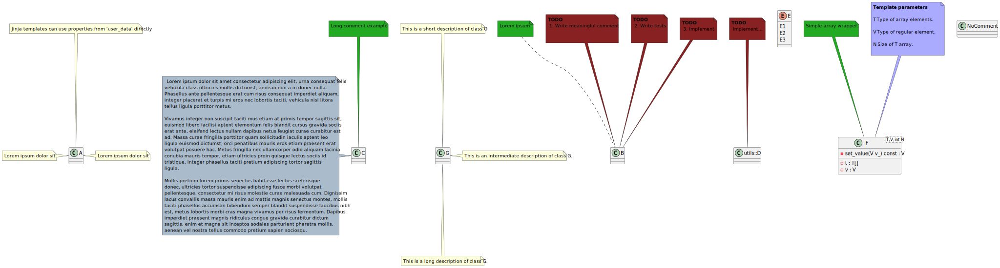

# t00050 - Test case for generating notes from comments using jinja templates
## Config
```yaml
diagrams:
  t00050_class:
    type: class
    glob:
      - t00050.cc
    comment_parser: clang
    include:
      namespaces:
        - clanguml::t00050
    using_namespace: clanguml::t00050
    plantuml:
      after:
        - >
          note left of {{ alias("NoSuchClass") }}
             {{ comment("NoSuchClass").formatted }}
          end note
        - >
          note left of {{ alias("A") }}
             {{ comment("clanguml::t00050::A").formatted }}
          end note
        - >
          note right of {{ element("clanguml::t00050::A").alias }}
              {{ e.comment.formatted }}          
          end note
        - >
          note left of {{ alias("C") }} #AABBCC                 
             {{ trim(comment("clanguml::t00050::C").text) }}          
          end note
        - >
          
          note top of {{ alias("G") }}
             {{ trim(cmt.0) }}
          end note

          note right of {{ alias("G") }}
             {{ trim(cmt.1) }}
          end note

          note bottom of {{ alias("G") }}
             {{ trim(cmt.2) }}
          end note
        - >
          {# Render brief comments and todos, if any were written for an element #}
          
          
  
          note top of {{ e.alias }}  #22AA22  #2222AA 
              {{ c.brief.0 }}
          end note
          
          
          
           
          
          note top of {{ e.alias }} #882222           
             **TODO**
             {{ t }}
          end note
          
          

          
          {# Render template parameters if any #}
          
           

          note top of {{ e.alias }} #AAAAFF           
             **Template parameters**
             
             //{{ tp.name }}// {{ trim(tp.description) }}        
             
          end note

          
          
    mermaid:
      after:
        - |
          note for {{ alias("NoSuchClass") }} "{{ comment("NoSuchClass").formatted }}"
        - |
          note for {{ alias("A") }} "{{ comment("clanguml::t00050::A").formatted }}"
        - |
          note for {{ element("clanguml::t00050::A").alias }}  "{{ e.comment.formatted }}"
          note for {{ alias("C") }} "{{ trim(comment("clanguml::t00050::C").text) }}"
          
          note for {{ alias("G") }} "{{ trim(cmt.0) }}"
          note for {{ alias("G") }} "{{ trim(cmt.1) }}"
          note for {{ alias("G") }} "{{ trim(cmt.2) }}"
        - |
          {# Render brief comments and todos, if any were written for an element #}
          
          
          note for {{ e.alias }}  "{{ c.brief.0 }}"
          
          
          
          
          note for {{ e.alias }} "**TODO** {{ t }}"
          
          
          

```
## Source code
File `tests/t00050/t00050.cc`
```cpp
namespace clanguml {

/// Vivamus integer non suscipit taciti mus
class A { };

namespace t00050 {

/// Lorem ipsum dolor sit
class A { };

/**
 * \brief Lorem ipsum
 *
 * Lorem ipsum dolor sit amet consectetur adipiscing elit, urna consequat felis
 * vehicula class ultricies mollis dictumst, aenean non a in donec nulla.
 * Phasellus ante pellentesque erat cum risus consequat imperdiet aliquam,
 * integer placerat et turpis mi eros nec lobortis taciti, vehicula nisl litora
 * tellus ligula porttitor metus.
 *
 * \todo 1. Write meaningful comment
 * \todo 2. Write tests
 * \todo 3. Implement
 */
class B { };

/// \brief Long comment example
///
/// Lorem ipsum dolor sit amet consectetur adipiscing elit, urna consequat felis
/// vehicula class ultricies mollis dictumst, aenean non a in donec nulla.
/// Phasellus ante pellentesque erat cum risus consequat imperdiet aliquam,
/// integer placerat et turpis mi eros nec lobortis taciti, vehicula nisl litora
/// tellus ligula porttitor metus.
///
/// Vivamus integer non suscipit taciti mus etiam at primis tempor sagittis sit,
/// euismod libero facilisi aptent elementum felis blandit cursus gravida sociis
/// erat ante, eleifend lectus nullam dapibus netus feugiat curae curabitur est
/// ad. Massa curae fringilla porttitor quam sollicitudin iaculis aptent leo
/// ligula euismod dictumst, orci penatibus mauris eros etiam praesent erat
/// volutpat posuere hac. Metus fringilla nec ullamcorper odio aliquam lacinia
/// conubia mauris tempor, etiam ultricies proin quisque lectus sociis id
/// tristique, integer phasellus taciti pretium adipiscing tortor sagittis
/// ligula.
///
/// Mollis pretium lorem primis senectus habitasse lectus scelerisque
/// donec, ultricies tortor suspendisse adipiscing fusce morbi volutpat
/// pellentesque, consectetur mi risus molestie curae malesuada cum. Dignissim
/// lacus convallis massa mauris enim ad mattis magnis senectus montes, mollis
/// taciti phasellus accumsan bibendum semper blandit suspendisse faucibus nibh
/// est, metus lobortis morbi cras magna vivamus per risus fermentum. Dapibus
/// imperdiet praesent magnis ridiculus congue gravida curabitur dictum
/// sagittis, enim et magna sit inceptos sodales parturient pharetra mollis,
/// aenean vel nostra tellus commodo pretium sapien sociosqu.
class C { };

/// Mollis pretium lorem primis
namespace utils {

/// Lorem ipsum dolor sit amet consectetur adipiscing elit, urna consequat felis
/// vehicula class ultricies mollis dictumst, aenean non a in donec nulla.
/// Phasellus ante pellentesque erat cum risus consequat imperdiet aliquam,
/// integer placerat et turpis mi eros nec lobortis taciti, vehicula nisl litora
/// tellus ligula porttitor metus.
///
/// \todo Implement...
class D { };

} // namespace utils

/// Mollis pretium lorem primis
enum class E { E1, E2, E3 };

/// \brief Simple array wrapper.
///
/// This class is just for testing tparam parsing, it serves no other
/// purpose.
///
/// \tparam T Type of array elements.
/// \tparam V Type of regular element.
/// \tparam N Size of T array.
///
template <typename T, typename V, int N> class F {
    T t[N];
    V v;
};

/// This is a short description of class G.
///
/// This is an intermediate description of class G.
///
/// This is a long description of class G.
class G { };

class NoComment { };

} // namespace t00050
} // namespace clanguml
```
## Generated PlantUML diagrams

## Generated Mermaid diagrams

## Generated JSON models
```json
{
  "diagram_type": "class",
  "elements": [
    {
      "bases": [],
      "comment": {
        "formatted": "Lorem ipsum dolor sit",
        "paragraph": [
          " Lorem ipsum dolor sit\n"
        ],
        "raw": "/// Lorem ipsum dolor sit",
        "text": "\n Lorem ipsum dolor sit\n"
      },
      "display_name": "A",
      "id": "1885563213397742674",
      "is_abstract": false,
      "is_nested": false,
      "is_struct": false,
      "is_template": false,
      "is_union": false,
      "members": [],
      "methods": [],
      "name": "A",
      "namespace": "clanguml::t00050",
      "source_location": {
        "column": 7,
        "file": "t00050.cc",
        "line": 9,
        "translation_unit": "t00050.cc"
      },
      "template_parameters": [],
      "type": "class"
    },
    {
      "bases": [],
      "comment": {
        "brief": [
          " Lorem ipsum\n"
        ],
        "formatted": "\n \\brief Lorem ipsum\n\n Lorem ipsum dolor sit amet consectetur adipiscing elit, urna consequat felis\n vehicula class ultricies mollis dictumst, aenean non a in donec nulla.\n Phasellus ante pellentesque erat cum risus consequat imperdiet aliquam,\n integer placerat et turpis mi eros nec lobortis taciti, vehicula nisl litora\n tellus ligula porttitor metus.\n\n \\todo 1. Write meaningful comment\n \\todo 2. Write tests\n \\todo 3. Implement\n ",
        "paragraph": [
          " \n",
          " Lorem ipsum dolor sit amet consectetur adipiscing elit, urna consequat felis\n vehicula class ultricies mollis dictumst, aenean non a in donec nulla.\n Phasellus ante pellentesque erat cum risus consequat imperdiet aliquam,\n integer placerat et turpis mi eros nec lobortis taciti, vehicula nisl litora\n tellus ligula porttitor metus.\n",
          " \n"
        ],
        "raw": "/**\n * \\brief Lorem ipsum\n *\n * Lorem ipsum dolor sit amet consectetur adipiscing elit, urna consequat felis\n * vehicula class ultricies mollis dictumst, aenean non a in donec nulla.\n * Phasellus ante pellentesque erat cum risus consequat imperdiet aliquam,\n * integer placerat et turpis mi eros nec lobortis taciti, vehicula nisl litora\n * tellus ligula porttitor metus.\n *\n * \\todo 1. Write meaningful comment\n * \\todo 2. Write tests\n * \\todo 3. Implement\n */",
        "text": "\n \n\n Lorem ipsum dolor sit amet consectetur adipiscing elit, urna consequat felis\n vehicula class ultricies mollis dictumst, aenean non a in donec nulla.\n Phasellus ante pellentesque erat cum risus consequat imperdiet aliquam,\n integer placerat et turpis mi eros nec lobortis taciti, vehicula nisl litora\n tellus ligula porttitor metus.\n\n \n",
        "todo": [
          " 1. Write meaningful comment\n \n",
          " 2. Write tests\n \n",
          " 3. Implement\n"
        ]
      },
      "display_name": "B",
      "id": "500262098409836244",
      "is_abstract": false,
      "is_nested": false,
      "is_struct": false,
      "is_template": false,
      "is_union": false,
      "members": [],
      "methods": [],
      "name": "B",
      "namespace": "clanguml::t00050",
      "source_location": {
        "column": 7,
        "file": "t00050.cc",
        "line": 24,
        "translation_unit": "t00050.cc"
      },
      "template_parameters": [],
      "type": "class"
    },
    {
      "bases": [],
      "comment": {
        "brief": [
          " Long comment example\n"
        ],
        "formatted": "\\brief Long comment example\n\nLorem ipsum dolor sit amet consectetur adipiscing elit, urna consequat felis\nvehicula class ultricies mollis dictumst, aenean non a in donec nulla.\nPhasellus ante pellentesque erat cum risus consequat imperdiet aliquam,\ninteger placerat et turpis mi eros nec lobortis taciti, vehicula nisl litora\ntellus ligula porttitor metus.\n\nVivamus integer non suscipit taciti mus etiam at primis tempor sagittis sit,\neuismod libero facilisi aptent elementum felis blandit cursus gravida sociis\nerat ante, eleifend lectus nullam dapibus netus feugiat curae curabitur est\nad. Massa curae fringilla porttitor quam sollicitudin iaculis aptent leo\nligula euismod dictumst, orci penatibus mauris eros etiam praesent erat\nvolutpat posuere hac. Metus fringilla nec ullamcorper odio aliquam lacinia\nconubia mauris tempor, etiam ultricies proin quisque lectus sociis id\ntristique, integer phasellus taciti pretium adipiscing tortor sagittis\nligula.\n\nMollis pretium lorem primis senectus habitasse lectus scelerisque\ndonec, ultricies tortor suspendisse adipiscing fusce morbi volutpat\npellentesque, consectetur mi risus molestie curae malesuada cum. Dignissim\nlacus convallis massa mauris enim ad mattis magnis senectus montes, mollis\ntaciti phasellus accumsan bibendum semper blandit suspendisse faucibus nibh\nest, metus lobortis morbi cras magna vivamus per risus fermentum. Dapibus\nimperdiet praesent magnis ridiculus congue gravida curabitur dictum\nsagittis, enim et magna sit inceptos sodales parturient pharetra mollis,\naenean vel nostra tellus commodo pretium sapien sociosqu.",
        "paragraph": [
          " \n",
          " Lorem ipsum dolor sit amet consectetur adipiscing elit, urna consequat felis\n vehicula class ultricies mollis dictumst, aenean non a in donec nulla.\n Phasellus ante pellentesque erat cum risus consequat imperdiet aliquam,\n integer placerat et turpis mi eros nec lobortis taciti, vehicula nisl litora\n tellus ligula porttitor metus.\n",
          " Vivamus integer non suscipit taciti mus etiam at primis tempor sagittis sit,\n euismod libero facilisi aptent elementum felis blandit cursus gravida sociis\n erat ante, eleifend lectus nullam dapibus netus feugiat curae curabitur est\n ad. Massa curae fringilla porttitor quam sollicitudin iaculis aptent leo\n ligula euismod dictumst, orci penatibus mauris eros etiam praesent erat\n volutpat posuere hac. Metus fringilla nec ullamcorper odio aliquam lacinia\n conubia mauris tempor, etiam ultricies proin quisque lectus sociis id\n tristique, integer phasellus taciti pretium adipiscing tortor sagittis\n ligula.\n",
          " Mollis pretium lorem primis senectus habitasse lectus scelerisque\n donec, ultricies tortor suspendisse adipiscing fusce morbi volutpat\n pellentesque, consectetur mi risus molestie curae malesuada cum. Dignissim\n lacus convallis massa mauris enim ad mattis magnis senectus montes, mollis\n taciti phasellus accumsan bibendum semper blandit suspendisse faucibus nibh\n est, metus lobortis morbi cras magna vivamus per risus fermentum. Dapibus\n imperdiet praesent magnis ridiculus congue gravida curabitur dictum\n sagittis, enim et magna sit inceptos sodales parturient pharetra mollis,\n aenean vel nostra tellus commodo pretium sapien sociosqu.\n"
        ],
        "raw": "/// \\brief Long comment example\n///\n/// Lorem ipsum dolor sit amet consectetur adipiscing elit, urna consequat felis\n/// vehicula class ultricies mollis dictumst, aenean non a in donec nulla.\n/// Phasellus ante pellentesque erat cum risus consequat imperdiet aliquam,\n/// integer placerat et turpis mi eros nec lobortis taciti, vehicula nisl litora\n/// tellus ligula porttitor metus.\n///\n/// Vivamus integer non suscipit taciti mus etiam at primis tempor sagittis sit,\n/// euismod libero facilisi aptent elementum felis blandit cursus gravida sociis\n/// erat ante, eleifend lectus nullam dapibus netus feugiat curae curabitur est\n/// ad. Massa curae fringilla porttitor quam sollicitudin iaculis aptent leo\n/// ligula euismod dictumst, orci penatibus mauris eros etiam praesent erat\n/// volutpat posuere hac. Metus fringilla nec ullamcorper odio aliquam lacinia\n/// conubia mauris tempor, etiam ultricies proin quisque lectus sociis id\n/// tristique, integer phasellus taciti pretium adipiscing tortor sagittis\n/// ligula.\n///\n/// Mollis pretium lorem primis senectus habitasse lectus scelerisque\n/// donec, ultricies tortor suspendisse adipiscing fusce morbi volutpat\n/// pellentesque, consectetur mi risus molestie curae malesuada cum. Dignissim\n/// lacus convallis massa mauris enim ad mattis magnis senectus montes, mollis\n/// taciti phasellus accumsan bibendum semper blandit suspendisse faucibus nibh\n/// est, metus lobortis morbi cras magna vivamus per risus fermentum. Dapibus\n/// imperdiet praesent magnis ridiculus congue gravida curabitur dictum\n/// sagittis, enim et magna sit inceptos sodales parturient pharetra mollis,\n/// aenean vel nostra tellus commodo pretium sapien sociosqu.",
        "text": "\n \n\n Lorem ipsum dolor sit amet consectetur adipiscing elit, urna consequat felis\n vehicula class ultricies mollis dictumst, aenean non a in donec nulla.\n Phasellus ante pellentesque erat cum risus consequat imperdiet aliquam,\n integer placerat et turpis mi eros nec lobortis taciti, vehicula nisl litora\n tellus ligula porttitor metus.\n\n Vivamus integer non suscipit taciti mus etiam at primis tempor sagittis sit,\n euismod libero facilisi aptent elementum felis blandit cursus gravida sociis\n erat ante, eleifend lectus nullam dapibus netus feugiat curae curabitur est\n ad. Massa curae fringilla porttitor quam sollicitudin iaculis aptent leo\n ligula euismod dictumst, orci penatibus mauris eros etiam praesent erat\n volutpat posuere hac. Metus fringilla nec ullamcorper odio aliquam lacinia\n conubia mauris tempor, etiam ultricies proin quisque lectus sociis id\n tristique, integer phasellus taciti pretium adipiscing tortor sagittis\n ligula.\n\n Mollis pretium lorem primis senectus habitasse lectus scelerisque\n donec, ultricies tortor suspendisse adipiscing fusce morbi volutpat\n pellentesque, consectetur mi risus molestie curae malesuada cum. Dignissim\n lacus convallis massa mauris enim ad mattis magnis senectus montes, mollis\n taciti phasellus accumsan bibendum semper blandit suspendisse faucibus nibh\n est, metus lobortis morbi cras magna vivamus per risus fermentum. Dapibus\n imperdiet praesent magnis ridiculus congue gravida curabitur dictum\n sagittis, enim et magna sit inceptos sodales parturient pharetra mollis,\n aenean vel nostra tellus commodo pretium sapien sociosqu.\n"
      },
      "display_name": "C",
      "id": "1663081653671078922",
      "is_abstract": false,
      "is_nested": false,
      "is_struct": false,
      "is_template": false,
      "is_union": false,
      "members": [],
      "methods": [],
      "name": "C",
      "namespace": "clanguml::t00050",
      "source_location": {
        "column": 7,
        "file": "t00050.cc",
        "line": 53,
        "translation_unit": "t00050.cc"
      },
      "template_parameters": [],
      "type": "class"
    },
    {
      "bases": [],
      "comment": {
        "formatted": "Lorem ipsum dolor sit amet consectetur adipiscing elit, urna consequat felis\nvehicula class ultricies mollis dictumst, aenean non a in donec nulla.\nPhasellus ante pellentesque erat cum risus consequat imperdiet aliquam,\ninteger placerat et turpis mi eros nec lobortis taciti, vehicula nisl litora\ntellus ligula porttitor metus.\n\n\\todo Implement...",
        "paragraph": [
          " Lorem ipsum dolor sit amet consectetur adipiscing elit, urna consequat felis\n vehicula class ultricies mollis dictumst, aenean non a in donec nulla.\n Phasellus ante pellentesque erat cum risus consequat imperdiet aliquam,\n integer placerat et turpis mi eros nec lobortis taciti, vehicula nisl litora\n tellus ligula porttitor metus.\n",
          " \n"
        ],
        "raw": "/// Lorem ipsum dolor sit amet consectetur adipiscing elit, urna consequat felis\n/// vehicula class ultricies mollis dictumst, aenean non a in donec nulla.\n/// Phasellus ante pellentesque erat cum risus consequat imperdiet aliquam,\n/// integer placerat et turpis mi eros nec lobortis taciti, vehicula nisl litora\n/// tellus ligula porttitor metus.\n///\n/// \\todo Implement...",
        "text": "\n Lorem ipsum dolor sit amet consectetur adipiscing elit, urna consequat felis\n vehicula class ultricies mollis dictumst, aenean non a in donec nulla.\n Phasellus ante pellentesque erat cum risus consequat imperdiet aliquam,\n integer placerat et turpis mi eros nec lobortis taciti, vehicula nisl litora\n tellus ligula porttitor metus.\n\n \n",
        "todo": [
          " Implement...\n"
        ]
      },
      "display_name": "utils::D",
      "id": "1492514566602019299",
      "is_abstract": false,
      "is_nested": false,
      "is_struct": false,
      "is_template": false,
      "is_union": false,
      "members": [],
      "methods": [],
      "name": "D",
      "namespace": "clanguml::t00050::utils",
      "source_location": {
        "column": 7,
        "file": "t00050.cc",
        "line": 65,
        "translation_unit": "t00050.cc"
      },
      "template_parameters": [],
      "type": "class"
    },
    {
      "comment": {
        "formatted": "Mollis pretium lorem primis",
        "paragraph": [
          " Mollis pretium lorem primis\n"
        ],
        "raw": "/// Mollis pretium lorem primis",
        "text": "\n Mollis pretium lorem primis\n"
      },
      "constants": [
        "E1",
        "E2",
        "E3"
      ],
      "display_name": "E",
      "id": "2027344031570117998",
      "is_nested": false,
      "name": "E",
      "namespace": "clanguml::t00050",
      "source_location": {
        "column": 12,
        "file": "t00050.cc",
        "line": 70,
        "translation_unit": "t00050.cc"
      },
      "type": "enum"
    },
    {
      "bases": [],
      "comment": {
        "brief": [
          " Simple array wrapper.\n"
        ],
        "formatted": "\\brief Simple array wrapper.\n\nThis class is just for testing tparam parsing, it serves no other\npurpose.\n\n\\tparam T Type of array elements.\n\\tparam V Type of regular element.\n\\tparam N Size of T array.",
        "paragraph": [
          " \n",
          " This class is just for testing tparam parsing, it serves no other\n purpose.\n",
          " \n"
        ],
        "raw": "/// \\brief Simple array wrapper.\n///\n/// This class is just for testing tparam parsing, it serves no other\n/// purpose.\n///\n/// \\tparam T Type of array elements.\n/// \\tparam V Type of regular element.\n/// \\tparam N Size of T array.\n///",
        "text": "\n \n\n This class is just for testing tparam parsing, it serves no other\n purpose.\n\n \n",
        "tparam": [
          {
            "description": " Type of array elements.\n \n",
            "name": "T"
          },
          {
            "description": " Type of regular element.\n \n",
            "name": "V"
          },
          {
            "description": " Size of T array.\n",
            "name": "N"
          }
        ]
      },
      "display_name": "F<T,V,int N>",
      "id": "793698410848959592",
      "is_abstract": false,
      "is_nested": false,
      "is_struct": false,
      "is_template": true,
      "is_union": false,
      "members": [
        {
          "access": "private",
          "is_static": false,
          "name": "t",
          "source_location": {
            "column": 7,
            "file": "t00050.cc",
            "line": 82,
            "translation_unit": "t00050.cc"
          },
          "type": "T[]"
        },
        {
          "access": "private",
          "is_static": false,
          "name": "v",
          "source_location": {
            "column": 7,
            "file": "t00050.cc",
            "line": 83,
            "translation_unit": "t00050.cc"
          },
          "type": "V"
        }
      ],
      "methods": [],
      "name": "F",
      "namespace": "clanguml::t00050",
      "source_location": {
        "column": 48,
        "file": "t00050.cc",
        "line": 81,
        "translation_unit": "t00050.cc"
      },
      "template_parameters": [
        {
          "is_variadic": false,
          "kind": "template_type",
          "name": "T",
          "template_parameters": []
        },
        {
          "is_variadic": false,
          "kind": "template_type",
          "name": "V",
          "template_parameters": []
        },
        {
          "is_variadic": false,
          "kind": "non_type_template",
          "name": "N",
          "template_parameters": [],
          "type": "int"
        }
      ],
      "type": "class"
    },
    {
      "bases": [],
      "comment": {
        "formatted": "This is a short description of class G.\n\nThis is an intermediate description of class G.\n\nThis is a long description of class G.",
        "paragraph": [
          " This is a short description of class G.\n",
          " This is an intermediate description of class G.\n",
          " This is a long description of class G.\n"
        ],
        "raw": "/// This is a short description of class G.\n///\n/// This is an intermediate description of class G.\n///\n/// This is a long description of class G.",
        "text": "\n This is a short description of class G.\n\n This is an intermediate description of class G.\n\n This is a long description of class G.\n"
      },
      "display_name": "G",
      "id": "449485154531299941",
      "is_abstract": false,
      "is_nested": false,
      "is_struct": false,
      "is_template": false,
      "is_union": false,
      "members": [],
      "methods": [],
      "name": "G",
      "namespace": "clanguml::t00050",
      "source_location": {
        "column": 7,
        "file": "t00050.cc",
        "line": 91,
        "translation_unit": "t00050.cc"
      },
      "template_parameters": [],
      "type": "class"
    },
    {
      "bases": [],
      "display_name": "NoComment",
      "id": "1832693799357996932",
      "is_abstract": false,
      "is_nested": false,
      "is_struct": false,
      "is_template": false,
      "is_union": false,
      "members": [],
      "methods": [],
      "name": "NoComment",
      "namespace": "clanguml::t00050",
      "source_location": {
        "column": 7,
        "file": "t00050.cc",
        "line": 93,
        "translation_unit": "t00050.cc"
      },
      "template_parameters": [],
      "type": "class"
    }
  ],
  "name": "t00050_class",
  "package_type": "namespace",
  "relationships": [],
  "using_namespace": "clanguml::t00050"
}
```
