# t00051 - Test case for relative paths in lambda names
## Config
```yaml
diagrams:
  t00051_class:
    type: class
    glob:
      - t00051.cc
    include:
      namespaces:
        - clanguml::t00051
    using_namespace: clanguml::t00051
```
## Source code
File `tests/t00051/t00051.cc`
```cpp
#include <thread>

namespace clanguml {
namespace t00051 {

template <typename F, typename FF = F> struct B : private std::thread {
    B(F &&f, FF &&ff)
        : f_{std::move(f)}
        , ff_{std::move(ff)}
    {
    }

    void f() { f_(); }
    void ff() { ff_(); }

    F f_;
    FF ff_;
};

class A {
public:
private:
    class custom_thread1 : private std::thread {
    public:
        template <class Function, class... Args>
        explicit custom_thread1(Function &&f, Args &&...args)
            : std::thread::thread(
                  std::forward<Function>(f), std::forward<Args>(args)...)
        {
        }
    };

    static custom_thread1 start_thread1();

    class custom_thread2 : private std::thread {
        using std::thread::thread;
    };

    static custom_thread2 start_thread2();

    auto start_thread3()
    {
        return B{[]() {}, []() {}};
    }

    auto get_function()
    {
        return []() {};
    }
};

A::custom_thread1 A::start_thread1()
{
    return custom_thread1{[]() {}};
}

A::custom_thread2 A::start_thread2()
{
    return custom_thread2{[]() {}};
}

}
}

```
## Generated PlantUML diagrams

## Generated Mermaid diagrams

## Generated JSON models
```json
{
  "diagram_type": "class",
  "elements": [
    {
      "bases": [
        {
          "access": "private",
          "id": "15292512913378933439",
          "is_virtual": false
        }
      ],
      "display_name": "B<F,FF=F>",
      "id": "3893405395576401653",
      "is_abstract": false,
      "is_nested": false,
      "is_struct": true,
      "is_template": true,
      "is_union": false,
      "members": [
        {
          "access": "public",
          "is_static": false,
          "name": "f_",
          "source_location": {
            "column": 7,
            "file": "t00051.cc",
            "line": 16,
            "translation_unit": "t00051.cc"
          },
          "type": "F"
        },
        {
          "access": "public",
          "is_static": false,
          "name": "ff_",
          "source_location": {
            "column": 8,
            "file": "t00051.cc",
            "line": 17,
            "translation_unit": "t00051.cc"
          },
          "type": "FF"
        }
      ],
      "methods": [
        {
          "access": "public",
          "display_name": "B",
          "is_const": false,
          "is_consteval": false,
          "is_constexpr": false,
          "is_constructor": true,
          "is_copy_assignment": false,
          "is_coroutine": false,
          "is_defaulted": false,
          "is_deleted": false,
          "is_move_assignment": false,
          "is_noexcept": false,
          "is_operator": false,
          "is_pure_virtual": false,
          "is_static": false,
          "is_virtual": false,
          "name": "B",
          "parameters": [
            {
              "name": "f",
              "type": "F &&"
            },
            {
              "name": "ff",
              "type": "FF &&"
            }
          ],
          "source_location": {
            "column": 5,
            "file": "t00051.cc",
            "line": 7,
            "translation_unit": "t00051.cc"
          },
          "template_parameters": [],
          "type": "void"
        },
        {
          "access": "public",
          "display_name": "f",
          "is_const": false,
          "is_consteval": false,
          "is_constexpr": false,
          "is_constructor": false,
          "is_copy_assignment": false,
          "is_coroutine": false,
          "is_defaulted": false,
          "is_deleted": false,
          "is_move_assignment": false,
          "is_noexcept": false,
          "is_operator": false,
          "is_pure_virtual": false,
          "is_static": false,
          "is_virtual": false,
          "name": "f",
          "parameters": [],
          "source_location": {
            "column": 10,
            "file": "t00051.cc",
            "line": 13,
            "translation_unit": "t00051.cc"
          },
          "template_parameters": [],
          "type": "void"
        },
        {
          "access": "public",
          "display_name": "ff",
          "is_const": false,
          "is_consteval": false,
          "is_constexpr": false,
          "is_constructor": false,
          "is_copy_assignment": false,
          "is_coroutine": false,
          "is_defaulted": false,
          "is_deleted": false,
          "is_move_assignment": false,
          "is_noexcept": false,
          "is_operator": false,
          "is_pure_virtual": false,
          "is_static": false,
          "is_virtual": false,
          "name": "ff",
          "parameters": [],
          "source_location": {
            "column": 10,
            "file": "t00051.cc",
            "line": 14,
            "translation_unit": "t00051.cc"
          },
          "template_parameters": [],
          "type": "void"
        }
      ],
      "name": "B",
      "namespace": "clanguml::t00051",
      "source_location": {
        "column": 47,
        "file": "t00051.cc",
        "line": 6,
        "translation_unit": "t00051.cc"
      },
      "template_parameters": [
        {
          "is_variadic": false,
          "kind": "template_type",
          "name": "F",
          "template_parameters": []
        },
        {
          "default": "F",
          "is_variadic": false,
          "kind": "template_type",
          "name": "FF",
          "template_parameters": []
        }
      ],
      "type": "class"
    },
    {
      "bases": [
        {
          "access": "private",
          "id": "15292512913378933439",
          "is_virtual": false
        }
      ],
      "display_name": "B<(lambda at t00051.cc:43:18),(lambda at t00051.cc:43:27)>",
      "id": "15756021897900635813",
      "is_abstract": false,
      "is_nested": false,
      "is_struct": true,
      "is_template": true,
      "is_union": false,
      "members": [
        {
          "access": "public",
          "is_static": false,
          "name": "f_",
          "source_location": {
            "column": 7,
            "file": "t00051.cc",
            "line": 16,
            "translation_unit": "t00051.cc"
          },
          "type": "(lambda at t00051.cc:43:18)"
        },
        {
          "access": "public",
          "is_static": false,
          "name": "ff_",
          "source_location": {
            "column": 8,
            "file": "t00051.cc",
            "line": 17,
            "translation_unit": "t00051.cc"
          },
          "type": "(lambda at t00051.cc:43:27)"
        }
      ],
      "methods": [
        {
          "access": "public",
          "display_name": "B",
          "is_const": false,
          "is_consteval": false,
          "is_constexpr": false,
          "is_constructor": true,
          "is_copy_assignment": false,
          "is_coroutine": false,
          "is_defaulted": false,
          "is_deleted": false,
          "is_move_assignment": false,
          "is_noexcept": false,
          "is_operator": false,
          "is_pure_virtual": false,
          "is_static": false,
          "is_virtual": false,
          "name": "B",
          "parameters": [
            {
              "name": "f",
              "type": "(lambda at t00051.cc:43:18) &&"
            },
            {
              "name": "ff",
              "type": "(lambda at t00051.cc:43:27) &&"
            }
          ],
          "source_location": {
            "column": 5,
            "file": "t00051.cc",
            "line": 7,
            "translation_unit": "t00051.cc"
          },
          "template_parameters": [],
          "type": "void"
        },
        {
          "access": "public",
          "display_name": "f",
          "is_const": false,
          "is_consteval": false,
          "is_constexpr": false,
          "is_constructor": false,
          "is_copy_assignment": false,
          "is_coroutine": false,
          "is_defaulted": false,
          "is_deleted": false,
          "is_move_assignment": false,
          "is_noexcept": false,
          "is_operator": false,
          "is_pure_virtual": false,
          "is_static": false,
          "is_virtual": false,
          "name": "f",
          "parameters": [],
          "source_location": {
            "column": 10,
            "file": "t00051.cc",
            "line": 13,
            "translation_unit": "t00051.cc"
          },
          "template_parameters": [],
          "type": "void"
        },
        {
          "access": "public",
          "display_name": "ff",
          "is_const": false,
          "is_consteval": false,
          "is_constexpr": false,
          "is_constructor": false,
          "is_copy_assignment": false,
          "is_coroutine": false,
          "is_defaulted": false,
          "is_deleted": false,
          "is_move_assignment": false,
          "is_noexcept": false,
          "is_operator": false,
          "is_pure_virtual": false,
          "is_static": false,
          "is_virtual": false,
          "name": "ff",
          "parameters": [],
          "source_location": {
            "column": 10,
            "file": "t00051.cc",
            "line": 14,
            "translation_unit": "t00051.cc"
          },
          "template_parameters": [],
          "type": "void"
        }
      ],
      "name": "B",
      "namespace": "clanguml::t00051",
      "source_location": {
        "column": 47,
        "file": "t00051.cc",
        "line": 6,
        "translation_unit": "t00051.cc"
      },
      "template_parameters": [
        {
          "is_variadic": false,
          "kind": "argument",
          "template_parameters": [],
          "type": "(lambda at t00051.cc:43:18)"
        },
        {
          "is_variadic": false,
          "kind": "argument",
          "template_parameters": [],
          "type": "(lambda at t00051.cc:43:27)"
        }
      ],
      "type": "class"
    },
    {
      "bases": [],
      "display_name": "A",
      "id": "8517308902178609395",
      "is_abstract": false,
      "is_nested": false,
      "is_struct": false,
      "is_template": false,
      "is_union": false,
      "members": [],
      "methods": [
        {
          "access": "private",
          "display_name": "start_thread1",
          "is_const": false,
          "is_consteval": false,
          "is_constexpr": false,
          "is_constructor": false,
          "is_copy_assignment": false,
          "is_coroutine": false,
          "is_defaulted": false,
          "is_deleted": false,
          "is_move_assignment": false,
          "is_noexcept": false,
          "is_operator": false,
          "is_pure_virtual": false,
          "is_static": true,
          "is_virtual": false,
          "name": "start_thread1",
          "parameters": [],
          "source_location": {
            "column": 27,
            "file": "t00051.cc",
            "line": 33,
            "translation_unit": "t00051.cc"
          },
          "template_parameters": [],
          "type": "custom_thread1"
        },
        {
          "access": "private",
          "display_name": "start_thread2",
          "is_const": false,
          "is_consteval": false,
          "is_constexpr": false,
          "is_constructor": false,
          "is_copy_assignment": false,
          "is_coroutine": false,
          "is_defaulted": false,
          "is_deleted": false,
          "is_move_assignment": false,
          "is_noexcept": false,
          "is_operator": false,
          "is_pure_virtual": false,
          "is_static": true,
          "is_virtual": false,
          "name": "start_thread2",
          "parameters": [],
          "source_location": {
            "column": 27,
            "file": "t00051.cc",
            "line": 39,
            "translation_unit": "t00051.cc"
          },
          "template_parameters": [],
          "type": "custom_thread2"
        },
        {
          "access": "private",
          "display_name": "start_thread3",
          "is_const": false,
          "is_consteval": false,
          "is_constexpr": false,
          "is_constructor": false,
          "is_copy_assignment": false,
          "is_coroutine": false,
          "is_defaulted": false,
          "is_deleted": false,
          "is_move_assignment": false,
          "is_noexcept": false,
          "is_operator": false,
          "is_pure_virtual": false,
          "is_static": false,
          "is_virtual": false,
          "name": "start_thread3",
          "parameters": [],
          "source_location": {
            "column": 10,
            "file": "t00051.cc",
            "line": 41,
            "translation_unit": "t00051.cc"
          },
          "template_parameters": [],
          "type": "clanguml::t00051::B<(lambda at t00051.cc:43:18),(lambda at t00051.cc:43:27)>"
        },
        {
          "access": "private",
          "display_name": "get_function",
          "is_const": false,
          "is_consteval": false,
          "is_constexpr": false,
          "is_constructor": false,
          "is_copy_assignment": false,
          "is_coroutine": false,
          "is_defaulted": false,
          "is_deleted": false,
          "is_move_assignment": false,
          "is_noexcept": false,
          "is_operator": false,
          "is_pure_virtual": false,
          "is_static": false,
          "is_virtual": false,
          "name": "get_function",
          "parameters": [],
          "source_location": {
            "column": 10,
            "file": "t00051.cc",
            "line": 46,
            "translation_unit": "t00051.cc"
          },
          "template_parameters": [],
          "type": "(lambda at t00051.cc:48:16)"
        }
      ],
      "name": "A",
      "namespace": "clanguml::t00051",
      "source_location": {
        "column": 7,
        "file": "t00051.cc",
        "line": 20,
        "translation_unit": "t00051.cc"
      },
      "template_parameters": [],
      "type": "class"
    },
    {
      "bases": [
        {
          "access": "private",
          "id": "15292512913378933439",
          "is_virtual": false
        }
      ],
      "display_name": "A::custom_thread1",
      "id": "2142096945777718118",
      "is_abstract": false,
      "is_nested": true,
      "is_struct": false,
      "is_template": false,
      "is_union": false,
      "members": [],
      "methods": [
        {
          "access": "public",
          "display_name": "custom_thread1<Function,Args...>",
          "is_const": false,
          "is_consteval": false,
          "is_constexpr": false,
          "is_constructor": false,
          "is_copy_assignment": false,
          "is_coroutine": false,
          "is_defaulted": false,
          "is_deleted": false,
          "is_move_assignment": false,
          "is_noexcept": false,
          "is_operator": false,
          "is_pure_virtual": false,
          "is_static": false,
          "is_virtual": false,
          "name": "custom_thread1",
          "parameters": [
            {
              "name": "f",
              "type": "Function &&"
            },
            {
              "name": "args",
              "type": "Args &&..."
            }
          ],
          "template_parameters": [
            {
              "is_variadic": false,
              "kind": "template_type",
              "name": "Function",
              "template_parameters": []
            },
            {
              "is_variadic": true,
              "kind": "template_type",
              "name": "Args...",
              "template_parameters": []
            }
          ],
          "type": "void"
        }
      ],
      "name": "A##custom_thread1",
      "namespace": "clanguml::t00051",
      "source_location": {
        "column": 11,
        "file": "t00051.cc",
        "line": 23,
        "translation_unit": "t00051.cc"
      },
      "template_parameters": [],
      "type": "class"
    },
    {
      "bases": [
        {
          "access": "private",
          "id": "15292512913378933439",
          "is_virtual": false
        }
      ],
      "display_name": "A::custom_thread2",
      "id": "5828010557987819764",
      "is_abstract": false,
      "is_nested": true,
      "is_struct": false,
      "is_template": false,
      "is_union": false,
      "members": [],
      "methods": [
        {
          "access": "public",
          "display_name": "thread",
          "is_const": false,
          "is_consteval": false,
          "is_constexpr": false,
          "is_constructor": false,
          "is_copy_assignment": false,
          "is_coroutine": false,
          "is_defaulted": false,
          "is_deleted": false,
          "is_move_assignment": false,
          "is_noexcept": false,
          "is_operator": false,
          "is_pure_virtual": false,
          "is_static": false,
          "is_virtual": false,
          "name": "thread",
          "parameters": [
            {
              "name": "",
              "type": "(lambda at t00051.cc:59:27) &&"
            }
          ],
          "source_location": {
            "column": 28,
            "file": "t00051.cc",
            "line": 36,
            "translation_unit": "t00051.cc"
          },
          "template_parameters": [],
          "type": "void"
        }
      ],
      "name": "A##custom_thread2",
      "namespace": "clanguml::t00051",
      "source_location": {
        "column": 11,
        "file": "t00051.cc",
        "line": 35,
        "translation_unit": "t00051.cc"
      },
      "template_parameters": [],
      "type": "class"
    }
  ],
  "name": "t00051_class",
  "package_type": "namespace",
  "relationships": [
    {
      "access": "public",
      "destination": "3893405395576401653",
      "source": "15756021897900635813",
      "type": "instantiation"
    },
    {
      "access": "public",
      "destination": "2142096945777718118",
      "source": "8517308902178609395",
      "type": "dependency"
    },
    {
      "access": "public",
      "destination": "5828010557987819764",
      "source": "8517308902178609395",
      "type": "dependency"
    },
    {
      "access": "public",
      "destination": "15756021897900635813",
      "source": "8517308902178609395",
      "type": "dependency"
    },
    {
      "access": "public",
      "destination": "8517308902178609395",
      "source": "2142096945777718118",
      "type": "containment"
    },
    {
      "access": "public",
      "destination": "8517308902178609395",
      "source": "5828010557987819764",
      "type": "containment"
    }
  ],
  "using_namespace": "clanguml::t00051"
}
```
## Generated GraphML models
```xml
<?xml version="1.0"?>
<graphml xmlns="http://graphml.graphdrawing.org/xmlns" xmlns:xsi="http://www.w3.org/2001/XMLSchema-instance" xsi:schemaLocation="http://graphml.graphdrawing.org/xmlns http://graphml.graphdrawing.org/xmlns/1.0/graphml.xsd">
 <key attr.name="id" attr.type="string" for="graph" id="gd0" />
 <key attr.name="diagram_type" attr.type="string" for="graph" id="gd1" />
 <key attr.name="name" attr.type="string" for="graph" id="gd2" />
 <key attr.name="using_namespace" attr.type="string" for="graph" id="gd3" />
 <key attr.name="id" attr.type="string" for="node" id="nd0" />
 <key attr.name="type" attr.type="string" for="node" id="nd1" />
 <key attr.name="name" attr.type="string" for="node" id="nd2" />
 <key attr.name="stereotype" attr.type="string" for="node" id="nd3" />
 <key attr.name="url" attr.type="string" for="node" id="nd4" />
 <key attr.name="tooltip" attr.type="string" for="node" id="nd5" />
 <key attr.name="is_template" attr.type="boolean" for="node" id="nd6" />
 <key attr.name="type" attr.type="string" for="edge" id="ed0" />
 <key attr.name="access" attr.type="string" for="edge" id="ed1" />
 <key attr.name="label" attr.type="string" for="edge" id="ed2" />
 <key attr.name="url" attr.type="string" for="edge" id="ed3" />
 <graph id="g0" edgedefault="directed" parse.nodeids="canonical" parse.edgeids="canonical" parse.order="nodesfirst">
  <data key="gd3">clanguml::t00051</data>
  <node id="n0">
   <data key="nd1">class</data>
   <data key="nd2"><![CDATA[B<F,FF=F>]]></data>
   <data key="nd6">true</data>
  </node>
  <node id="n1">
   <data key="nd1">class</data>
   <data key="nd2"><![CDATA[B<(lambda at t00051.cc:43:18),(lambda at t00051.cc:43:27)>]]></data>
   <data key="nd6">true</data>
  </node>
  <node id="n2">
   <data key="nd1">class</data>
   <data key="nd2"><![CDATA[A]]></data>
   <data key="nd6">false</data>
  </node>
  <node id="n3">
   <data key="nd1">class</data>
   <data key="nd2"><![CDATA[A::custom_thread1]]></data>
   <data key="nd6">false</data>
  </node>
  <node id="n4">
   <data key="nd1">class</data>
   <data key="nd2"><![CDATA[A::custom_thread2]]></data>
   <data key="nd6">false</data>
  </node>
  <edge id="e0" source="n1" target="n0">
   <data key="ed0">instantiation</data>
   <data key="ed1">public</data>
  </edge>
  <edge id="e1" source="n2" target="n3">
   <data key="ed0">dependency</data>
   <data key="ed1">public</data>
  </edge>
  <edge id="e2" source="n2" target="n4">
   <data key="ed0">dependency</data>
   <data key="ed1">public</data>
  </edge>
  <edge id="e3" source="n2" target="n1">
   <data key="ed0">dependency</data>
   <data key="ed1">public</data>
  </edge>
  <edge id="e4" source="n3" target="n2">
   <data key="ed0">containment</data>
   <data key="ed1">public</data>
  </edge>
  <edge id="e5" source="n4" target="n2">
   <data key="ed0">containment</data>
   <data key="ed1">public</data>
  </edge>
 </graph>
</graphml>

```
