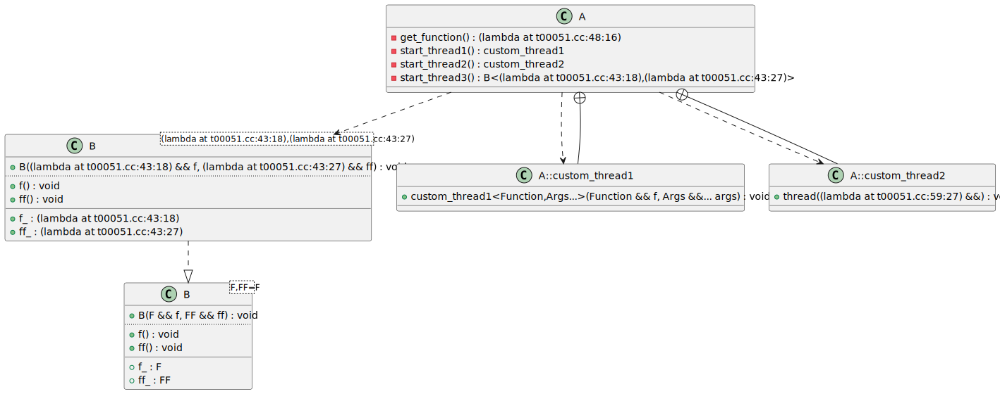

# t00051 - Test case for relative paths in lambda names
## Config
```yaml
compilation_database_dir: ..
output_directory: puml
diagrams:
  t00051_class:
    type: class
    glob:
      - ../../tests/t00051/t00051.cc
    include:
      namespaces:
        - clanguml::t00051
    using_namespace:
      - clanguml::t00051
```
## Source code
File t00051.cc
```cpp
#include <thread>

namespace clanguml {
namespace t00051 {

template <typename F, typename FF = F> struct B : private std::thread {
    B(F &&f, FF &&ff)
        : f_{std::move(f)}
        , ff_{std::move(ff)}
    {
    }

    void f() { f_(); }
    void ff() { ff_(); }

    F f_;
    FF ff_;
};

class A {
public:
private:
    class custom_thread1 : private std::thread {
    public:
        template <class Function, class... Args>
        explicit custom_thread1(Function &&f, Args &&...args)
            : std::thread::thread(
                  std::forward<Function>(f), std::forward<Args>(args)...)
        {
        }
    };

    static custom_thread1 start_thread1();

    class custom_thread2 : private std::thread {
        using std::thread::thread;
    };

    static custom_thread2 start_thread2();

    auto start_thread3()
    {
        return B{[]() {}, []() {}};
    }

    auto get_function()
    {
        return []() {};
    }
};

A::custom_thread1 A::start_thread1()
{
    return custom_thread1{[]() {}};
}

A::custom_thread2 A::start_thread2()
{
    return custom_thread2{[]() {}};
}

}
}

```
## Generated UML diagrams

## Generated JSON models
```json
{
  "diagram_type": "class",
  "elements": [
    {
      "bases": [
        {
          "access": "private",
          "id": "1911564114172366679",
          "is_virtual": false,
          "name": "std::thread"
        }
      ],
      "display_name": "clanguml::t00051::B<F,FF=F>",
      "id": "486675674447050206",
      "is_abstract": false,
      "is_nested": false,
      "is_struct": true,
      "is_template": true,
      "is_union": false,
      "members": [
        {
          "access": "public",
          "is_static": false,
          "name": "f_",
          "source_location": {
            "file": "../../tests/t00051/t00051.cc",
            "line": 16
          },
          "type": "F"
        },
        {
          "access": "public",
          "is_static": false,
          "name": "ff_",
          "source_location": {
            "file": "../../tests/t00051/t00051.cc",
            "line": 17
          },
          "type": "FF"
        }
      ],
      "methods": [
        {
          "access": "public",
          "is_const": false,
          "is_defaulted": false,
          "is_implicit": false,
          "is_pure_virtual": false,
          "is_static": false,
          "is_virtual": false,
          "name": "B<F, FF>",
          "parameters": [
            {
              "name": "f",
              "type": "F &&"
            },
            {
              "name": "ff",
              "type": "FF &&"
            }
          ],
          "type": "void"
        },
        {
          "access": "public",
          "is_const": false,
          "is_defaulted": false,
          "is_implicit": false,
          "is_pure_virtual": false,
          "is_static": false,
          "is_virtual": false,
          "name": "f",
          "parameters": [],
          "type": "void"
        },
        {
          "access": "public",
          "is_const": false,
          "is_defaulted": false,
          "is_implicit": false,
          "is_pure_virtual": false,
          "is_static": false,
          "is_virtual": false,
          "name": "ff",
          "parameters": [],
          "type": "void"
        }
      ],
      "name": "B",
      "namespace": "clanguml::t00051",
      "source_location": {
        "file": "../../tests/t00051/t00051.cc",
        "line": 6
      },
      "template_parameters": [
        {
          "is_variadic": false,
          "kind": "template_type",
          "name": "F",
          "template_parameters": []
        },
        {
          "default": "F",
          "is_variadic": false,
          "kind": "template_type",
          "name": "FF",
          "template_parameters": []
        }
      ],
      "type": "class"
    },
    {
      "bases": [
        {
          "access": "private",
          "id": "1911564114172366679",
          "is_virtual": false,
          "name": "std::thread"
        }
      ],
      "display_name": "clanguml::t00051::B<(lambda at ../../tests/t00051/t00051.cc:43:18),(lambda at ../../tests/t00051/t00051.cc:43:27)>",
      "id": "129489662928342298",
      "is_abstract": false,
      "is_nested": false,
      "is_struct": true,
      "is_template": true,
      "is_union": false,
      "members": [],
      "methods": [],
      "name": "B",
      "namespace": "clanguml::t00051",
      "source_location": {
        "file": "../../tests/t00051/t00051.cc",
        "line": 6
      },
      "template_parameters": [
        {
          "is_variadic": false,
          "kind": "argument",
          "template_parameters": [],
          "type": "(lambda at ../../tests/t00051/t00051.cc:43:18)"
        },
        {
          "is_variadic": false,
          "kind": "argument",
          "template_parameters": [],
          "type": "(lambda at ../../tests/t00051/t00051.cc:43:27)"
        }
      ],
      "type": "class"
    },
    {
      "bases": [],
      "display_name": "clanguml::t00051::A",
      "id": "1064663612772326174",
      "is_abstract": false,
      "is_nested": false,
      "is_struct": false,
      "is_template": false,
      "is_union": false,
      "members": [],
      "methods": [
        {
          "access": "private",
          "is_const": false,
          "is_defaulted": false,
          "is_implicit": false,
          "is_pure_virtual": false,
          "is_static": true,
          "is_virtual": false,
          "name": "start_thread1",
          "parameters": [],
          "type": "clanguml::t00051::A::custom_thread1"
        },
        {
          "access": "private",
          "is_const": false,
          "is_defaulted": false,
          "is_implicit": false,
          "is_pure_virtual": false,
          "is_static": true,
          "is_virtual": false,
          "name": "start_thread2",
          "parameters": [],
          "type": "clanguml::t00051::A::custom_thread2"
        },
        {
          "access": "private",
          "is_const": false,
          "is_defaulted": false,
          "is_implicit": false,
          "is_pure_virtual": false,
          "is_static": false,
          "is_virtual": false,
          "name": "start_thread3",
          "parameters": [],
          "type": "clanguml::t00051::B<(lambda at ../../tests/t00051/t00051.cc:43:18),(lambda at ../../tests/t00051/t00051.cc:43:27)>"
        },
        {
          "access": "private",
          "is_const": false,
          "is_defaulted": false,
          "is_implicit": false,
          "is_pure_virtual": false,
          "is_static": false,
          "is_virtual": false,
          "name": "get_function",
          "parameters": [],
          "type": "(lambda at ../../tests/t00051/t00051.cc:48:16)"
        }
      ],
      "name": "A",
      "namespace": "clanguml::t00051",
      "source_location": {
        "file": "../../tests/t00051/t00051.cc",
        "line": 20
      },
      "template_parameters": [],
      "type": "class"
    },
    {
      "bases": [
        {
          "access": "private",
          "id": "1911564114172366679",
          "is_virtual": false,
          "name": "std::thread"
        }
      ],
      "display_name": "clanguml::t00051::A::custom_thread1",
      "id": "267762118222214764",
      "is_abstract": false,
      "is_nested": true,
      "is_struct": false,
      "is_template": false,
      "is_union": false,
      "members": [],
      "methods": [
        {
          "access": "public",
          "is_const": false,
          "is_defaulted": false,
          "is_implicit": false,
          "is_pure_virtual": false,
          "is_static": false,
          "is_virtual": false,
          "name": "custom_thread1",
          "parameters": [
            {
              "name": "f",
              "type": "Function &&"
            },
            {
              "name": "args",
              "type": "Args &&..."
            }
          ],
          "type": "void"
        }
      ],
      "name": "A::custom_thread1",
      "namespace": "clanguml::t00051",
      "source_location": {
        "file": "../../tests/t00051/t00051.cc",
        "line": 23
      },
      "template_parameters": [],
      "type": "class"
    },
    {
      "bases": [
        {
          "access": "private",
          "id": "1911564114172366679",
          "is_virtual": false,
          "name": "std::thread"
        }
      ],
      "display_name": "clanguml::t00051::A::custom_thread2",
      "id": "728501319748477470",
      "is_abstract": false,
      "is_nested": true,
      "is_struct": false,
      "is_template": false,
      "is_union": false,
      "members": [],
      "methods": [
        {
          "access": "public",
          "is_const": false,
          "is_defaulted": false,
          "is_implicit": false,
          "is_pure_virtual": false,
          "is_static": false,
          "is_virtual": false,
          "name": "thread",
          "parameters": [
            {
              "name": "",
              "type": "(lambda at ../../tests/t00051/t00051.cc:59:27) &&"
            }
          ],
          "type": "void"
        }
      ],
      "name": "A::custom_thread2",
      "namespace": "clanguml::t00051",
      "source_location": {
        "file": "../../tests/t00051/t00051.cc",
        "line": 35
      },
      "template_parameters": [],
      "type": "class"
    }
  ],
  "name": "t00051_class",
  "relationships": [
    {
      "access": "private",
      "destination": "1911564114172366679",
      "source": "486675674447050206",
      "type": "extension"
    },
    {
      "access": "public",
      "destination": "486675674447050206",
      "source": "129489662928342298",
      "type": "instantiation"
    },
    {
      "access": "private",
      "destination": "1911564114172366679",
      "source": "129489662928342298",
      "type": "extension"
    },
    {
      "access": "public",
      "destination": "129489662928342298",
      "source": "1064663612772326174",
      "type": "dependency"
    },
    {
      "access": "public",
      "destination": "1064663612772326174",
      "source": "267762118222214764",
      "type": "containment"
    },
    {
      "access": "private",
      "destination": "1911564114172366679",
      "source": "267762118222214764",
      "type": "extension"
    },
    {
      "access": "public",
      "destination": "1064663612772326174",
      "source": "728501319748477470",
      "type": "containment"
    },
    {
      "access": "private",
      "destination": "1911564114172366679",
      "source": "728501319748477470",
      "type": "extension"
    }
  ],
  "using_namespace": "clanguml::t00051"
}
```
