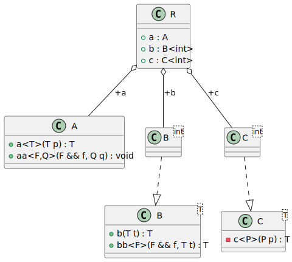

# t00052 - Test case for template methods rendering
## Config
```yaml
diagrams:
  t00052_class:
    type: class
    glob:
      - t00052.cc
    include:
      namespaces:
        - clanguml::t00052
    using_namespace: clanguml::t00052
```
## Source code
File `tests/t00052/t00052.cc`
```cpp
#include <cmath>

namespace clanguml {
namespace t00052 {

class A {
public:
    template <typename T> T a(T p) { return p; }

    template <typename F, typename Q> void aa(F &&f, Q q) { f(q); }
};

template <typename T> class B {
public:
    T b(T t) { return t; }

    template <typename F> T bb(F &&f, T t) { return f(t); }
};

template <typename T> class C {
    template <typename P> T c(P p) { return static_cast<T>(p); }
};

template <> template <> int C<int>::c<double>(double p)
{
    return std::floor(p);
}

struct R {
    A a;
    B<int> b;
    C<int> c;
};
}
}
```
## Generated PlantUML diagrams

## Generated Mermaid diagrams

## Generated JSON models
```json
{
  "diagram_type": "class",
  "elements": [
    {
      "bases": [],
      "display_name": "A",
      "id": "2200853067459698271",
      "is_abstract": false,
      "is_nested": false,
      "is_struct": false,
      "is_template": false,
      "is_union": false,
      "members": [],
      "methods": [
        {
          "access": "public",
          "display_name": "a<T>",
          "is_const": false,
          "is_consteval": false,
          "is_constexpr": false,
          "is_constructor": false,
          "is_copy_assignment": false,
          "is_coroutine": false,
          "is_defaulted": false,
          "is_deleted": false,
          "is_move_assignment": false,
          "is_noexcept": false,
          "is_operator": false,
          "is_pure_virtual": false,
          "is_static": false,
          "is_virtual": false,
          "name": "a",
          "parameters": [
            {
              "name": "p",
              "type": "T"
            }
          ],
          "template_parameters": [
            {
              "is_variadic": false,
              "kind": "template_type",
              "name": "T",
              "template_parameters": []
            }
          ],
          "type": "T"
        },
        {
          "access": "public",
          "display_name": "aa<F,Q>",
          "is_const": false,
          "is_consteval": false,
          "is_constexpr": false,
          "is_constructor": false,
          "is_copy_assignment": false,
          "is_coroutine": false,
          "is_defaulted": false,
          "is_deleted": false,
          "is_move_assignment": false,
          "is_noexcept": false,
          "is_operator": false,
          "is_pure_virtual": false,
          "is_static": false,
          "is_virtual": false,
          "name": "aa",
          "parameters": [
            {
              "name": "f",
              "type": "F &&"
            },
            {
              "name": "q",
              "type": "Q"
            }
          ],
          "template_parameters": [
            {
              "is_variadic": false,
              "kind": "template_type",
              "name": "F",
              "template_parameters": []
            },
            {
              "is_variadic": false,
              "kind": "template_type",
              "name": "Q",
              "template_parameters": []
            }
          ],
          "type": "void"
        }
      ],
      "name": "A",
      "namespace": "clanguml::t00052",
      "source_location": {
        "column": 7,
        "file": "t00052.cc",
        "line": 6,
        "translation_unit": "t00052.cc"
      },
      "template_parameters": [],
      "type": "class"
    },
    {
      "bases": [],
      "display_name": "B<T>",
      "id": "1737293776724790064",
      "is_abstract": false,
      "is_nested": false,
      "is_struct": false,
      "is_template": true,
      "is_union": false,
      "members": [],
      "methods": [
        {
          "access": "public",
          "display_name": "b",
          "is_const": false,
          "is_consteval": false,
          "is_constexpr": false,
          "is_constructor": false,
          "is_copy_assignment": false,
          "is_coroutine": false,
          "is_defaulted": false,
          "is_deleted": false,
          "is_move_assignment": false,
          "is_noexcept": false,
          "is_operator": false,
          "is_pure_virtual": false,
          "is_static": false,
          "is_virtual": false,
          "name": "b",
          "parameters": [
            {
              "name": "t",
              "type": "T"
            }
          ],
          "source_location": {
            "column": 7,
            "file": "t00052.cc",
            "line": 15,
            "translation_unit": "t00052.cc"
          },
          "template_parameters": [],
          "type": "T"
        },
        {
          "access": "public",
          "display_name": "bb<F>",
          "is_const": false,
          "is_consteval": false,
          "is_constexpr": false,
          "is_constructor": false,
          "is_copy_assignment": false,
          "is_coroutine": false,
          "is_defaulted": false,
          "is_deleted": false,
          "is_move_assignment": false,
          "is_noexcept": false,
          "is_operator": false,
          "is_pure_virtual": false,
          "is_static": false,
          "is_virtual": false,
          "name": "bb",
          "parameters": [
            {
              "name": "f",
              "type": "F &&"
            },
            {
              "name": "t",
              "type": "T"
            }
          ],
          "template_parameters": [
            {
              "is_variadic": false,
              "kind": "template_type",
              "name": "F",
              "template_parameters": []
            }
          ],
          "type": "T"
        }
      ],
      "name": "B",
      "namespace": "clanguml::t00052",
      "source_location": {
        "column": 29,
        "file": "t00052.cc",
        "line": 13,
        "translation_unit": "t00052.cc"
      },
      "template_parameters": [
        {
          "is_variadic": false,
          "kind": "template_type",
          "name": "T",
          "template_parameters": []
        }
      ],
      "type": "class"
    },
    {
      "bases": [],
      "display_name": "C<T>",
      "id": "687756639884832524",
      "is_abstract": false,
      "is_nested": false,
      "is_struct": false,
      "is_template": true,
      "is_union": false,
      "members": [],
      "methods": [
        {
          "access": "private",
          "display_name": "c<P>",
          "is_const": false,
          "is_consteval": false,
          "is_constexpr": false,
          "is_constructor": false,
          "is_copy_assignment": false,
          "is_coroutine": false,
          "is_defaulted": false,
          "is_deleted": false,
          "is_move_assignment": false,
          "is_noexcept": false,
          "is_operator": false,
          "is_pure_virtual": false,
          "is_static": false,
          "is_virtual": false,
          "name": "c",
          "parameters": [
            {
              "name": "p",
              "type": "P"
            }
          ],
          "template_parameters": [
            {
              "is_variadic": false,
              "kind": "template_type",
              "name": "P",
              "template_parameters": []
            }
          ],
          "type": "T"
        }
      ],
      "name": "C",
      "namespace": "clanguml::t00052",
      "source_location": {
        "column": 29,
        "file": "t00052.cc",
        "line": 20,
        "translation_unit": "t00052.cc"
      },
      "template_parameters": [
        {
          "is_variadic": false,
          "kind": "template_type",
          "name": "T",
          "template_parameters": []
        }
      ],
      "type": "class"
    },
    {
      "bases": [],
      "display_name": "B<int>",
      "id": "1043027222809675776",
      "is_abstract": false,
      "is_nested": false,
      "is_struct": false,
      "is_template": true,
      "is_union": false,
      "members": [],
      "methods": [],
      "name": "B",
      "namespace": "clanguml::t00052",
      "source_location": {
        "column": 29,
        "file": "t00052.cc",
        "line": 13,
        "translation_unit": "t00052.cc"
      },
      "template_parameters": [
        {
          "is_variadic": false,
          "kind": "argument",
          "template_parameters": [],
          "type": "int"
        }
      ],
      "type": "class"
    },
    {
      "bases": [],
      "display_name": "C<int>",
      "id": "492968837554438176",
      "is_abstract": false,
      "is_nested": false,
      "is_struct": false,
      "is_template": true,
      "is_union": false,
      "members": [],
      "methods": [],
      "name": "C",
      "namespace": "clanguml::t00052",
      "source_location": {
        "column": 29,
        "file": "t00052.cc",
        "line": 20,
        "translation_unit": "t00052.cc"
      },
      "template_parameters": [
        {
          "is_variadic": false,
          "kind": "argument",
          "template_parameters": [],
          "type": "int"
        }
      ],
      "type": "class"
    },
    {
      "bases": [],
      "display_name": "R",
      "id": "1157978668683299226",
      "is_abstract": false,
      "is_nested": false,
      "is_struct": true,
      "is_template": false,
      "is_union": false,
      "members": [
        {
          "access": "public",
          "is_static": false,
          "name": "a",
          "source_location": {
            "column": 7,
            "file": "t00052.cc",
            "line": 30,
            "translation_unit": "t00052.cc"
          },
          "type": "A"
        },
        {
          "access": "public",
          "is_static": false,
          "name": "b",
          "source_location": {
            "column": 12,
            "file": "t00052.cc",
            "line": 31,
            "translation_unit": "t00052.cc"
          },
          "type": "B<int>"
        },
        {
          "access": "public",
          "is_static": false,
          "name": "c",
          "source_location": {
            "column": 12,
            "file": "t00052.cc",
            "line": 32,
            "translation_unit": "t00052.cc"
          },
          "type": "C<int>"
        }
      ],
      "methods": [],
      "name": "R",
      "namespace": "clanguml::t00052",
      "source_location": {
        "column": 8,
        "file": "t00052.cc",
        "line": 29,
        "translation_unit": "t00052.cc"
      },
      "template_parameters": [],
      "type": "class"
    }
  ],
  "name": "t00052_class",
  "package_type": "namespace",
  "relationships": [
    {
      "access": "public",
      "destination": "1737293776724790064",
      "source": "1043027222809675776",
      "type": "instantiation"
    },
    {
      "access": "public",
      "destination": "687756639884832524",
      "source": "492968837554438176",
      "type": "instantiation"
    },
    {
      "access": "public",
      "destination": "2200853067459698271",
      "label": "a",
      "source": "1157978668683299226",
      "type": "aggregation"
    },
    {
      "access": "public",
      "destination": "1043027222809675776",
      "label": "b",
      "source": "1157978668683299226",
      "type": "aggregation"
    },
    {
      "access": "public",
      "destination": "492968837554438176",
      "label": "c",
      "source": "1157978668683299226",
      "type": "aggregation"
    }
  ],
  "using_namespace": "clanguml::t00052"
}
```
