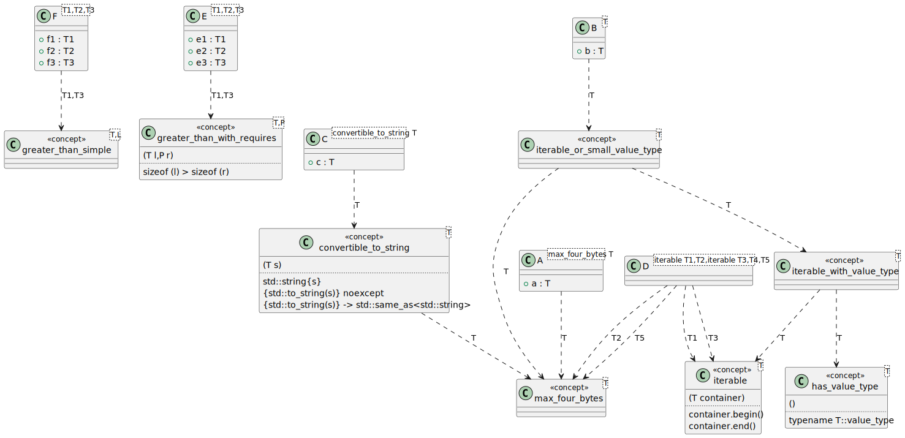

# t00056 - Basic C++20 concepts test case
## Config
```yaml
diagrams:
  t00056_class:
    type: class
    glob:
      - t00056.cc
    include:
      namespaces:
        - clanguml::t00056
    using_namespace: clanguml::t00056
```
## Source code
File `tests/t00056/t00056.cc`
```cpp
#include <concepts>
#include <string>

namespace clanguml {
namespace t00056 {

template <typename T, typename L>
concept greater_than_simple = sizeof(T) > sizeof(L);

template <typename T, typename P>
concept greater_than_with_requires =
    requires(T l, P r) { sizeof(l) > sizeof(r); };

// Constraint expression
template <typename T>
concept max_four_bytes = sizeof(T) <= 4;

// Simple requirement
template <typename T>
concept iterable = requires(T container) {
                       container.begin();
                       container.end();
                   };

// Type requirement
template <typename T>
concept has_value_type = requires { typename T::value_type; };

template <typename T>
concept convertible_to_string =
    max_four_bytes<T> && requires(T s) {
                             std::string{s};
                             {
                                 std::to_string(s)
                             } noexcept;
                             {
                                 std::to_string(s)
                                 } -> std::same_as<std::string>;
                         };

// Compound requirement
// ...

// Combined concept
template <typename T>
concept iterable_with_value_type = iterable<T> && has_value_type<T>;

template <typename T>
concept iterable_or_small_value_type =
    iterable_with_value_type<T> || max_four_bytes<T>;

// Simple type constraint
template <max_four_bytes T> struct A {
    T a;
};

// Requires constant expression
template <typename T>
    requires iterable_or_small_value_type<T>
struct B {
    T b;
};

// Anonymous concept requirement (TODO)
template <convertible_to_string T>
    requires requires(T t) {
                 --t;
                 t--;
             }
struct C {
    T c;
};

template <iterable T1, typename T2, iterable T3, typename T4, typename T5>
    requires max_four_bytes<T2> && max_four_bytes<T5>
struct D { };

template <typename T1, typename T2, typename T3>
    requires greater_than_with_requires<T1, T3>
struct E {
    T1 e1;
    T2 e2;
    T3 e3;
};

template <typename T1, typename T2, typename T3>
    requires greater_than_simple<T1, T3>
struct F {
    T1 f1;
    T2 f2;
    T3 f3;
};
}
}
```
## Generated PlantUML diagrams

## Generated Mermaid diagrams

## Generated JSON models
```json
{
  "diagram_type": "class",
  "elements": [
    {
      "display_name": "greater_than_simple<T,L>",
      "id": "902541696362244204",
      "name": "greater_than_simple",
      "namespace": "clanguml::t00056",
      "parameters": [],
      "source_location": {
        "column": 9,
        "file": "t00056.cc",
        "line": 8,
        "translation_unit": "t00056.cc"
      },
      "statements": [],
      "type": "concept"
    },
    {
      "display_name": "greater_than_with_requires<T,P>",
      "id": "1830716585637735576",
      "name": "greater_than_with_requires",
      "namespace": "clanguml::t00056",
      "parameters": [
        {
          "name": "l",
          "type": "T"
        },
        {
          "name": "r",
          "type": "P"
        }
      ],
      "source_location": {
        "column": 9,
        "file": "t00056.cc",
        "line": 11,
        "translation_unit": "t00056.cc"
      },
      "statements": [
        "sizeof (l) > sizeof (r)"
      ],
      "type": "concept"
    },
    {
      "display_name": "max_four_bytes<T>",
      "id": "385255522691733325",
      "name": "max_four_bytes",
      "namespace": "clanguml::t00056",
      "parameters": [],
      "source_location": {
        "column": 9,
        "file": "t00056.cc",
        "line": 16,
        "translation_unit": "t00056.cc"
      },
      "statements": [],
      "type": "concept"
    },
    {
      "display_name": "iterable<T>",
      "id": "392540961352249242",
      "name": "iterable",
      "namespace": "clanguml::t00056",
      "parameters": [
        {
          "name": "container",
          "type": "T"
        }
      ],
      "source_location": {
        "column": 9,
        "file": "t00056.cc",
        "line": 20,
        "translation_unit": "t00056.cc"
      },
      "statements": [
        "container.begin()",
        "container.end()"
      ],
      "type": "concept"
    },
    {
      "display_name": "has_value_type<T>",
      "id": "1850394311226276678",
      "name": "has_value_type",
      "namespace": "clanguml::t00056",
      "parameters": [],
      "source_location": {
        "column": 9,
        "file": "t00056.cc",
        "line": 27,
        "translation_unit": "t00056.cc"
      },
      "statements": [
        "typename T::value_type"
      ],
      "type": "concept"
    },
    {
      "display_name": "convertible_to_string<T>",
      "id": "137304962071054497",
      "name": "convertible_to_string",
      "namespace": "clanguml::t00056",
      "parameters": [
        {
          "name": "s",
          "type": "T"
        }
      ],
      "source_location": {
        "column": 9,
        "file": "t00056.cc",
        "line": 30,
        "translation_unit": "t00056.cc"
      },
      "statements": [
        "std::string{s}",
        "{std::to_string(s)} noexcept",
        "{std::to_string(s)} -> std::same_as<std::string>"
      ],
      "type": "concept"
    },
    {
      "display_name": "iterable_with_value_type<T>",
      "id": "1043398062146751019",
      "name": "iterable_with_value_type",
      "namespace": "clanguml::t00056",
      "parameters": [],
      "source_location": {
        "column": 9,
        "file": "t00056.cc",
        "line": 46,
        "translation_unit": "t00056.cc"
      },
      "statements": [],
      "type": "concept"
    },
    {
      "display_name": "iterable_or_small_value_type<T>",
      "id": "866345615551223718",
      "name": "iterable_or_small_value_type",
      "namespace": "clanguml::t00056",
      "parameters": [],
      "source_location": {
        "column": 9,
        "file": "t00056.cc",
        "line": 49,
        "translation_unit": "t00056.cc"
      },
      "statements": [],
      "type": "concept"
    },
    {
      "bases": [],
      "display_name": "A<max_four_bytes T>",
      "id": "1418333499545421661",
      "is_abstract": false,
      "is_nested": false,
      "is_struct": true,
      "is_template": true,
      "is_union": false,
      "members": [
        {
          "access": "public",
          "is_static": false,
          "name": "a",
          "source_location": {
            "column": 7,
            "file": "t00056.cc",
            "line": 54,
            "translation_unit": "t00056.cc"
          },
          "type": "T"
        }
      ],
      "methods": [],
      "name": "A",
      "namespace": "clanguml::t00056",
      "source_location": {
        "column": 36,
        "file": "t00056.cc",
        "line": 53,
        "translation_unit": "t00056.cc"
      },
      "template_parameters": [
        {
          "is_variadic": false,
          "kind": "template_type",
          "name": "T",
          "template_parameters": []
        }
      ],
      "type": "class"
    },
    {
      "bases": [],
      "display_name": "B<T>",
      "id": "1814355496814977880",
      "is_abstract": false,
      "is_nested": false,
      "is_struct": true,
      "is_template": true,
      "is_union": false,
      "members": [
        {
          "access": "public",
          "is_static": false,
          "name": "b",
          "source_location": {
            "column": 7,
            "file": "t00056.cc",
            "line": 61,
            "translation_unit": "t00056.cc"
          },
          "type": "T"
        }
      ],
      "methods": [],
      "name": "B",
      "namespace": "clanguml::t00056",
      "source_location": {
        "column": 8,
        "file": "t00056.cc",
        "line": 60,
        "translation_unit": "t00056.cc"
      },
      "template_parameters": [
        {
          "is_variadic": false,
          "kind": "template_type",
          "name": "T",
          "template_parameters": []
        }
      ],
      "type": "class"
    },
    {
      "bases": [],
      "display_name": "C<convertible_to_string T>",
      "id": "1512618198241549089",
      "is_abstract": false,
      "is_nested": false,
      "is_struct": true,
      "is_template": true,
      "is_union": false,
      "members": [
        {
          "access": "public",
          "is_static": false,
          "name": "c",
          "source_location": {
            "column": 7,
            "file": "t00056.cc",
            "line": 71,
            "translation_unit": "t00056.cc"
          },
          "type": "T"
        }
      ],
      "methods": [],
      "name": "C",
      "namespace": "clanguml::t00056",
      "source_location": {
        "column": 8,
        "file": "t00056.cc",
        "line": 70,
        "translation_unit": "t00056.cc"
      },
      "template_parameters": [
        {
          "is_variadic": false,
          "kind": "template_type",
          "name": "T",
          "template_parameters": []
        }
      ],
      "type": "class"
    },
    {
      "bases": [],
      "display_name": "D<iterable T1,T2,iterable T3,T4,T5>",
      "id": "1635109601630198093",
      "is_abstract": false,
      "is_nested": false,
      "is_struct": true,
      "is_template": true,
      "is_union": false,
      "members": [],
      "methods": [],
      "name": "D",
      "namespace": "clanguml::t00056",
      "source_location": {
        "column": 8,
        "file": "t00056.cc",
        "line": 76,
        "translation_unit": "t00056.cc"
      },
      "template_parameters": [
        {
          "is_variadic": false,
          "kind": "template_type",
          "name": "T1",
          "template_parameters": []
        },
        {
          "is_variadic": false,
          "kind": "template_type",
          "name": "T2",
          "template_parameters": []
        },
        {
          "is_variadic": false,
          "kind": "template_type",
          "name": "T3",
          "template_parameters": []
        },
        {
          "is_variadic": false,
          "kind": "template_type",
          "name": "T4",
          "template_parameters": []
        },
        {
          "is_variadic": false,
          "kind": "template_type",
          "name": "T5",
          "template_parameters": []
        }
      ],
      "type": "class"
    },
    {
      "bases": [],
      "display_name": "E<T1,T2,T3>",
      "id": "1429225801945621089",
      "is_abstract": false,
      "is_nested": false,
      "is_struct": true,
      "is_template": true,
      "is_union": false,
      "members": [
        {
          "access": "public",
          "is_static": false,
          "name": "e1",
          "source_location": {
            "column": 8,
            "file": "t00056.cc",
            "line": 81,
            "translation_unit": "t00056.cc"
          },
          "type": "T1"
        },
        {
          "access": "public",
          "is_static": false,
          "name": "e2",
          "source_location": {
            "column": 8,
            "file": "t00056.cc",
            "line": 82,
            "translation_unit": "t00056.cc"
          },
          "type": "T2"
        },
        {
          "access": "public",
          "is_static": false,
          "name": "e3",
          "source_location": {
            "column": 8,
            "file": "t00056.cc",
            "line": 83,
            "translation_unit": "t00056.cc"
          },
          "type": "T3"
        }
      ],
      "methods": [],
      "name": "E",
      "namespace": "clanguml::t00056",
      "source_location": {
        "column": 8,
        "file": "t00056.cc",
        "line": 80,
        "translation_unit": "t00056.cc"
      },
      "template_parameters": [
        {
          "is_variadic": false,
          "kind": "template_type",
          "name": "T1",
          "template_parameters": []
        },
        {
          "is_variadic": false,
          "kind": "template_type",
          "name": "T2",
          "template_parameters": []
        },
        {
          "is_variadic": false,
          "kind": "template_type",
          "name": "T3",
          "template_parameters": []
        }
      ],
      "type": "class"
    },
    {
      "bases": [],
      "display_name": "F<T1,T2,T3>",
      "id": "856301122972546034",
      "is_abstract": false,
      "is_nested": false,
      "is_struct": true,
      "is_template": true,
      "is_union": false,
      "members": [
        {
          "access": "public",
          "is_static": false,
          "name": "f1",
          "source_location": {
            "column": 8,
            "file": "t00056.cc",
            "line": 89,
            "translation_unit": "t00056.cc"
          },
          "type": "T1"
        },
        {
          "access": "public",
          "is_static": false,
          "name": "f2",
          "source_location": {
            "column": 8,
            "file": "t00056.cc",
            "line": 90,
            "translation_unit": "t00056.cc"
          },
          "type": "T2"
        },
        {
          "access": "public",
          "is_static": false,
          "name": "f3",
          "source_location": {
            "column": 8,
            "file": "t00056.cc",
            "line": 91,
            "translation_unit": "t00056.cc"
          },
          "type": "T3"
        }
      ],
      "methods": [],
      "name": "F",
      "namespace": "clanguml::t00056",
      "source_location": {
        "column": 8,
        "file": "t00056.cc",
        "line": 88,
        "translation_unit": "t00056.cc"
      },
      "template_parameters": [
        {
          "is_variadic": false,
          "kind": "template_type",
          "name": "T1",
          "template_parameters": []
        },
        {
          "is_variadic": false,
          "kind": "template_type",
          "name": "T2",
          "template_parameters": []
        },
        {
          "is_variadic": false,
          "kind": "template_type",
          "name": "T3",
          "template_parameters": []
        }
      ],
      "type": "class"
    }
  ],
  "name": "t00056_class",
  "package_type": "namespace",
  "relationships": [
    {
      "destination": "385255522691733325",
      "label": "T",
      "source": "137304962071054497",
      "type": "constraint"
    },
    {
      "destination": "392540961352249242",
      "label": "T",
      "source": "1043398062146751019",
      "type": "constraint"
    },
    {
      "destination": "1850394311226276678",
      "label": "T",
      "source": "1043398062146751019",
      "type": "constraint"
    },
    {
      "destination": "1043398062146751019",
      "label": "T",
      "source": "866345615551223718",
      "type": "constraint"
    },
    {
      "destination": "385255522691733325",
      "label": "T",
      "source": "866345615551223718",
      "type": "constraint"
    },
    {
      "destination": "385255522691733325",
      "label": "T",
      "source": "1418333499545421661",
      "type": "constraint"
    },
    {
      "destination": "866345615551223718",
      "label": "T",
      "source": "1814355496814977880",
      "type": "constraint"
    },
    {
      "destination": "137304962071054497",
      "label": "T",
      "source": "1512618198241549089",
      "type": "constraint"
    },
    {
      "destination": "392540961352249242",
      "label": "T1",
      "source": "1635109601630198093",
      "type": "constraint"
    },
    {
      "destination": "392540961352249242",
      "label": "T3",
      "source": "1635109601630198093",
      "type": "constraint"
    },
    {
      "destination": "385255522691733325",
      "label": "T2",
      "source": "1635109601630198093",
      "type": "constraint"
    },
    {
      "destination": "385255522691733325",
      "label": "T5",
      "source": "1635109601630198093",
      "type": "constraint"
    },
    {
      "destination": "1830716585637735576",
      "label": "T1,T3",
      "source": "1429225801945621089",
      "type": "constraint"
    },
    {
      "destination": "902541696362244204",
      "label": "T1,T3",
      "source": "856301122972546034",
      "type": "constraint"
    }
  ],
  "using_namespace": "clanguml::t00056"
}
```
