# t00057 - Test case C99/C11 translation units with structs and unions
## Config
```yaml
diagrams:
  t00057_class:
    type: class
    glob:
      - t00057.c
      - src/t00057_impl.c
```
## Source code
File `tests/t00057/t00057.c`
```cpp
#include "include/t00057.h"

struct t00057_A {
    int a1;
};

typedef struct t00057_B {
    int b1;
} t00057_B;

struct t00057_C {
    int c1;
};

union t00057_D {
    int d1;
    float d2;
};

struct t00057_E {
    int e;
    struct {
        int x;
        int y;
    } coordinates;
    union {
        int z;
        double t;
    } height;
};

typedef struct {
    int g1;
} t00057_G;

struct t00057_R {
    struct t00057_A a;
    t00057_B b;
    struct t00057_C *c;
    union t00057_D d;
    struct t00057_E *e;
    struct t00057_F *f;
    struct t00057_G *g;
};

```
File `tests/t00057/src/t00057_impl.c`
```cpp
#include "../include/t00057.h"

struct t00057_F {
    int f1;
};
```
File `tests/t00057/include/t00057.h`
```cpp
#pragma once

struct t00057_F;
```
## Generated PlantUML diagrams

## Generated Mermaid diagrams

## Generated JSON models
```json
{
  "diagram_type": "class",
  "elements": [
    {
      "bases": [],
      "display_name": "t00057_A",
      "id": "940295970488928395",
      "is_abstract": false,
      "is_nested": false,
      "is_struct": true,
      "is_template": false,
      "is_union": false,
      "members": [
        {
          "access": "public",
          "is_static": false,
          "name": "a1",
          "source_location": {
            "column": 9,
            "file": "t00057.c",
            "line": 4,
            "translation_unit": "t00057.c"
          },
          "type": "int"
        }
      ],
      "methods": [],
      "name": "t00057_A",
      "namespace": "",
      "source_location": {
        "column": 8,
        "file": "t00057.c",
        "line": 3,
        "translation_unit": "t00057.c"
      },
      "template_parameters": [],
      "type": "class"
    },
    {
      "bases": [],
      "display_name": "t00057_B",
      "id": "1030391494410415852",
      "is_abstract": false,
      "is_nested": false,
      "is_struct": true,
      "is_template": false,
      "is_union": false,
      "members": [
        {
          "access": "public",
          "is_static": false,
          "name": "b1",
          "source_location": {
            "column": 9,
            "file": "t00057.c",
            "line": 8,
            "translation_unit": "t00057.c"
          },
          "type": "int"
        }
      ],
      "methods": [],
      "name": "t00057_B",
      "namespace": "",
      "source_location": {
        "column": 16,
        "file": "t00057.c",
        "line": 7,
        "translation_unit": "t00057.c"
      },
      "template_parameters": [],
      "type": "class"
    },
    {
      "bases": [],
      "display_name": "t00057_C",
      "id": "388213894542327772",
      "is_abstract": false,
      "is_nested": false,
      "is_struct": true,
      "is_template": false,
      "is_union": false,
      "members": [
        {
          "access": "public",
          "is_static": false,
          "name": "c1",
          "source_location": {
            "column": 9,
            "file": "t00057.c",
            "line": 12,
            "translation_unit": "t00057.c"
          },
          "type": "int"
        }
      ],
      "methods": [],
      "name": "t00057_C",
      "namespace": "",
      "source_location": {
        "column": 8,
        "file": "t00057.c",
        "line": 11,
        "translation_unit": "t00057.c"
      },
      "template_parameters": [],
      "type": "class"
    },
    {
      "bases": [],
      "display_name": "t00057_D",
      "id": "784667124248020371",
      "is_abstract": false,
      "is_nested": false,
      "is_struct": false,
      "is_template": false,
      "is_union": true,
      "members": [
        {
          "access": "public",
          "is_static": false,
          "name": "d1",
          "source_location": {
            "column": 9,
            "file": "t00057.c",
            "line": 16,
            "translation_unit": "t00057.c"
          },
          "type": "int"
        },
        {
          "access": "public",
          "is_static": false,
          "name": "d2",
          "source_location": {
            "column": 11,
            "file": "t00057.c",
            "line": 17,
            "translation_unit": "t00057.c"
          },
          "type": "float"
        }
      ],
      "methods": [],
      "name": "t00057_D",
      "namespace": "",
      "source_location": {
        "column": 7,
        "file": "t00057.c",
        "line": 15,
        "translation_unit": "t00057.c"
      },
      "template_parameters": [],
      "type": "class"
    },
    {
      "bases": [],
      "display_name": "t00057_E",
      "id": "682873132844345324",
      "is_abstract": false,
      "is_nested": false,
      "is_struct": true,
      "is_template": false,
      "is_union": false,
      "members": [
        {
          "access": "public",
          "is_static": false,
          "name": "e",
          "source_location": {
            "column": 9,
            "file": "t00057.c",
            "line": 21,
            "translation_unit": "t00057.c"
          },
          "type": "int"
        },
        {
          "access": "public",
          "is_static": false,
          "name": "coordinates",
          "source_location": {
            "column": 7,
            "file": "t00057.c",
            "line": 25,
            "translation_unit": "t00057.c"
          },
          "type": "t00057_E::(coordinates)"
        },
        {
          "access": "public",
          "is_static": false,
          "name": "height",
          "source_location": {
            "column": 7,
            "file": "t00057.c",
            "line": 29,
            "translation_unit": "t00057.c"
          },
          "type": "t00057_E::(height)"
        }
      ],
      "methods": [],
      "name": "t00057_E",
      "namespace": "",
      "source_location": {
        "column": 8,
        "file": "t00057.c",
        "line": 20,
        "translation_unit": "t00057.c"
      },
      "template_parameters": [],
      "type": "class"
    },
    {
      "bases": [],
      "display_name": "t00057_E::(coordinates)",
      "id": "161676142413826748",
      "is_abstract": false,
      "is_nested": true,
      "is_struct": true,
      "is_template": false,
      "is_union": false,
      "members": [
        {
          "access": "public",
          "is_static": false,
          "name": "x",
          "source_location": {
            "column": 13,
            "file": "t00057.c",
            "line": 23,
            "translation_unit": "t00057.c"
          },
          "type": "int"
        },
        {
          "access": "public",
          "is_static": false,
          "name": "y",
          "source_location": {
            "column": 13,
            "file": "t00057.c",
            "line": 24,
            "translation_unit": "t00057.c"
          },
          "type": "int"
        }
      ],
      "methods": [],
      "name": "t00057_E::(coordinates)",
      "namespace": "",
      "source_location": {
        "column": 5,
        "file": "t00057.c",
        "line": 22,
        "translation_unit": "t00057.c"
      },
      "template_parameters": [],
      "type": "class"
    },
    {
      "bases": [],
      "display_name": "t00057_E::(height)",
      "id": "2265335931722752750",
      "is_abstract": false,
      "is_nested": true,
      "is_struct": false,
      "is_template": false,
      "is_union": true,
      "members": [
        {
          "access": "public",
          "is_static": false,
          "name": "z",
          "source_location": {
            "column": 13,
            "file": "t00057.c",
            "line": 27,
            "translation_unit": "t00057.c"
          },
          "type": "int"
        },
        {
          "access": "public",
          "is_static": false,
          "name": "t",
          "source_location": {
            "column": 16,
            "file": "t00057.c",
            "line": 28,
            "translation_unit": "t00057.c"
          },
          "type": "double"
        }
      ],
      "methods": [],
      "name": "t00057_E::(height)",
      "namespace": "",
      "source_location": {
        "column": 5,
        "file": "t00057.c",
        "line": 26,
        "translation_unit": "t00057.c"
      },
      "template_parameters": [],
      "type": "class"
    },
    {
      "bases": [],
      "display_name": "t00057_G",
      "id": "1592909736406415155",
      "is_abstract": false,
      "is_nested": false,
      "is_struct": true,
      "is_template": false,
      "is_union": false,
      "members": [
        {
          "access": "public",
          "is_static": false,
          "name": "g1",
          "source_location": {
            "column": 9,
            "file": "t00057.c",
            "line": 33,
            "translation_unit": "t00057.c"
          },
          "type": "int"
        }
      ],
      "methods": [],
      "name": "t00057_G",
      "namespace": "",
      "source_location": {
        "column": 9,
        "file": "t00057.c",
        "line": 32,
        "translation_unit": "t00057.c"
      },
      "template_parameters": [],
      "type": "class"
    },
    {
      "bases": [],
      "display_name": "t00057_R",
      "id": "370583978606928327",
      "is_abstract": false,
      "is_nested": false,
      "is_struct": true,
      "is_template": false,
      "is_union": false,
      "members": [
        {
          "access": "public",
          "is_static": false,
          "name": "a",
          "source_location": {
            "column": 21,
            "file": "t00057.c",
            "line": 37,
            "translation_unit": "t00057.c"
          },
          "type": "struct t00057_A"
        },
        {
          "access": "public",
          "is_static": false,
          "name": "b",
          "source_location": {
            "column": 14,
            "file": "t00057.c",
            "line": 38,
            "translation_unit": "t00057.c"
          },
          "type": "t00057_B"
        },
        {
          "access": "public",
          "is_static": false,
          "name": "c",
          "source_location": {
            "column": 22,
            "file": "t00057.c",
            "line": 39,
            "translation_unit": "t00057.c"
          },
          "type": "struct t00057_C *"
        },
        {
          "access": "public",
          "is_static": false,
          "name": "d",
          "source_location": {
            "column": 20,
            "file": "t00057.c",
            "line": 40,
            "translation_unit": "t00057.c"
          },
          "type": "union t00057_D"
        },
        {
          "access": "public",
          "is_static": false,
          "name": "e",
          "source_location": {
            "column": 22,
            "file": "t00057.c",
            "line": 41,
            "translation_unit": "t00057.c"
          },
          "type": "struct t00057_E *"
        },
        {
          "access": "public",
          "is_static": false,
          "name": "f",
          "source_location": {
            "column": 22,
            "file": "t00057.c",
            "line": 42,
            "translation_unit": "t00057.c"
          },
          "type": "struct t00057_F *"
        },
        {
          "access": "public",
          "is_static": false,
          "name": "g",
          "source_location": {
            "column": 22,
            "file": "t00057.c",
            "line": 43,
            "translation_unit": "t00057.c"
          },
          "type": "struct t00057_G *"
        }
      ],
      "methods": [],
      "name": "t00057_R",
      "namespace": "",
      "source_location": {
        "column": 8,
        "file": "t00057.c",
        "line": 36,
        "translation_unit": "t00057.c"
      },
      "template_parameters": [],
      "type": "class"
    },
    {
      "bases": [],
      "display_name": "t00057_F",
      "id": "85797106299568719",
      "is_abstract": false,
      "is_nested": false,
      "is_struct": true,
      "is_template": false,
      "is_union": false,
      "members": [
        {
          "access": "public",
          "is_static": false,
          "name": "f1",
          "source_location": {
            "column": 9,
            "file": "src/t00057_impl.c",
            "line": 4,
            "translation_unit": "src/t00057_impl.c"
          },
          "type": "int"
        }
      ],
      "methods": [],
      "name": "t00057_F",
      "namespace": "",
      "source_location": {
        "column": 8,
        "file": "include/t00057.h",
        "line": 3,
        "translation_unit": "t00057.c"
      },
      "template_parameters": [],
      "type": "class"
    }
  ],
  "name": "t00057_class",
  "package_type": "namespace",
  "relationships": [
    {
      "access": "public",
      "destination": "161676142413826748",
      "label": "coordinates",
      "source": "682873132844345324",
      "type": "aggregation"
    },
    {
      "access": "public",
      "destination": "2265335931722752750",
      "label": "height",
      "source": "682873132844345324",
      "type": "aggregation"
    },
    {
      "access": "public",
      "destination": "940295970488928395",
      "label": "a",
      "source": "370583978606928327",
      "type": "aggregation"
    },
    {
      "access": "public",
      "destination": "1030391494410415852",
      "label": "b",
      "source": "370583978606928327",
      "type": "aggregation"
    },
    {
      "access": "public",
      "destination": "388213894542327772",
      "label": "c",
      "source": "370583978606928327",
      "type": "association"
    },
    {
      "access": "public",
      "destination": "784667124248020371",
      "label": "d",
      "source": "370583978606928327",
      "type": "aggregation"
    },
    {
      "access": "public",
      "destination": "682873132844345324",
      "label": "e",
      "source": "370583978606928327",
      "type": "association"
    },
    {
      "access": "public",
      "destination": "85797106299568719",
      "label": "f",
      "source": "370583978606928327",
      "type": "association"
    },
    {
      "access": "public",
      "destination": "1592909736406415155",
      "label": "g",
      "source": "370583978606928327",
      "type": "association"
    }
  ]
}
```
