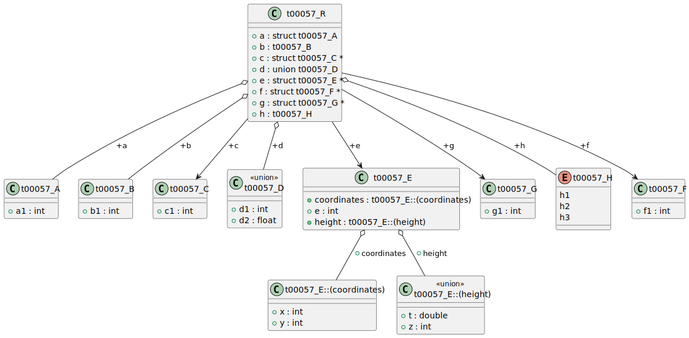

# t00057 - Test case C99/C11 translation units with structs and unions
## Config
```yaml
diagrams:
  t00057_class:
    type: class
    glob:
      - t00057.c
      - src/t00057_impl.c
```
## Source code
File `tests/t00057/t00057.c`
```cpp
#include "include/t00057.h"

struct t00057_A {
    int a1;
};

typedef struct t00057_B {
    int b1;
} t00057_B;

struct t00057_C {
    int c1;
};

union t00057_D {
    int d1;
    float d2;
};

struct t00057_E {
    int e;
    struct {
        int x;
        int y;
    } coordinates;
    union {
        int z;
        double t;
    } height;
};

typedef struct {
    int g1;
} t00057_G;

typedef enum { h1, h2, h3 } t00057_H;

struct t00057_R {
    struct t00057_A a;
    t00057_B b;
    struct t00057_C *c;
    union t00057_D d;
    struct t00057_E *e;
    struct t00057_F *f;
    struct t00057_G *g;
    t00057_H h;
};

```
File `tests/t00057/src/t00057_impl.c`
```cpp
#include "../include/t00057.h"

struct t00057_F {
    int f1;
};
```
File `tests/t00057/include/t00057.h`
```cpp
#pragma once

struct t00057_F;
```
## Generated PlantUML diagrams

## Generated Mermaid diagrams

## Generated JSON models
```json
{
  "diagram_type": "class",
  "elements": [
    {
      "bases": [],
      "display_name": "t00057_A",
      "id": "7522367763911427167",
      "is_abstract": false,
      "is_nested": false,
      "is_struct": true,
      "is_template": false,
      "is_union": false,
      "members": [
        {
          "access": "public",
          "is_static": false,
          "name": "a1",
          "source_location": {
            "column": 9,
            "file": "t00057.c",
            "line": 4,
            "translation_unit": "t00057.c"
          },
          "type": "int"
        }
      ],
      "methods": [],
      "name": "t00057_A",
      "namespace": "",
      "source_location": {
        "column": 8,
        "file": "t00057.c",
        "line": 3,
        "translation_unit": "t00057.c"
      },
      "template_parameters": [],
      "type": "class"
    },
    {
      "bases": [],
      "display_name": "t00057_B",
      "id": "8243131955283326817",
      "is_abstract": false,
      "is_nested": false,
      "is_struct": true,
      "is_template": false,
      "is_union": false,
      "members": [
        {
          "access": "public",
          "is_static": false,
          "name": "b1",
          "source_location": {
            "column": 9,
            "file": "t00057.c",
            "line": 8,
            "translation_unit": "t00057.c"
          },
          "type": "int"
        }
      ],
      "methods": [],
      "name": "t00057_B",
      "namespace": "",
      "source_location": {
        "column": 16,
        "file": "t00057.c",
        "line": 7,
        "translation_unit": "t00057.c"
      },
      "template_parameters": [],
      "type": "class"
    },
    {
      "bases": [],
      "display_name": "t00057_C",
      "id": "3105711156338622177",
      "is_abstract": false,
      "is_nested": false,
      "is_struct": true,
      "is_template": false,
      "is_union": false,
      "members": [
        {
          "access": "public",
          "is_static": false,
          "name": "c1",
          "source_location": {
            "column": 9,
            "file": "t00057.c",
            "line": 12,
            "translation_unit": "t00057.c"
          },
          "type": "int"
        }
      ],
      "methods": [],
      "name": "t00057_C",
      "namespace": "",
      "source_location": {
        "column": 8,
        "file": "t00057.c",
        "line": 11,
        "translation_unit": "t00057.c"
      },
      "template_parameters": [],
      "type": "class"
    },
    {
      "bases": [],
      "display_name": "t00057_D",
      "id": "6277336993984162970",
      "is_abstract": false,
      "is_nested": false,
      "is_struct": false,
      "is_template": false,
      "is_union": true,
      "members": [
        {
          "access": "public",
          "is_static": false,
          "name": "d1",
          "source_location": {
            "column": 9,
            "file": "t00057.c",
            "line": 16,
            "translation_unit": "t00057.c"
          },
          "type": "int"
        },
        {
          "access": "public",
          "is_static": false,
          "name": "d2",
          "source_location": {
            "column": 11,
            "file": "t00057.c",
            "line": 17,
            "translation_unit": "t00057.c"
          },
          "type": "float"
        }
      ],
      "methods": [],
      "name": "t00057_D",
      "namespace": "",
      "source_location": {
        "column": 7,
        "file": "t00057.c",
        "line": 15,
        "translation_unit": "t00057.c"
      },
      "template_parameters": [],
      "type": "class"
    },
    {
      "bases": [],
      "display_name": "t00057_E",
      "id": "5462985062754762593",
      "is_abstract": false,
      "is_nested": false,
      "is_struct": true,
      "is_template": false,
      "is_union": false,
      "members": [
        {
          "access": "public",
          "is_static": false,
          "name": "e",
          "source_location": {
            "column": 9,
            "file": "t00057.c",
            "line": 21,
            "translation_unit": "t00057.c"
          },
          "type": "int"
        },
        {
          "access": "public",
          "is_static": false,
          "name": "coordinates",
          "source_location": {
            "column": 7,
            "file": "t00057.c",
            "line": 25,
            "translation_unit": "t00057.c"
          },
          "type": "t00057_E::(coordinates)"
        },
        {
          "access": "public",
          "is_static": false,
          "name": "height",
          "source_location": {
            "column": 7,
            "file": "t00057.c",
            "line": 29,
            "translation_unit": "t00057.c"
          },
          "type": "t00057_E::(height)"
        }
      ],
      "methods": [],
      "name": "t00057_E",
      "namespace": "",
      "source_location": {
        "column": 8,
        "file": "t00057.c",
        "line": 20,
        "translation_unit": "t00057.c"
      },
      "template_parameters": [],
      "type": "class"
    },
    {
      "bases": [],
      "display_name": "t00057_E::(coordinates)",
      "id": "1293409139310613986",
      "is_abstract": false,
      "is_nested": true,
      "is_struct": true,
      "is_template": false,
      "is_union": false,
      "members": [
        {
          "access": "public",
          "is_static": false,
          "name": "x",
          "source_location": {
            "column": 13,
            "file": "t00057.c",
            "line": 23,
            "translation_unit": "t00057.c"
          },
          "type": "int"
        },
        {
          "access": "public",
          "is_static": false,
          "name": "y",
          "source_location": {
            "column": 13,
            "file": "t00057.c",
            "line": 24,
            "translation_unit": "t00057.c"
          },
          "type": "int"
        }
      ],
      "methods": [],
      "name": "t00057_E##(coordinates)",
      "namespace": "",
      "source_location": {
        "column": 5,
        "file": "t00057.c",
        "line": 22,
        "translation_unit": "t00057.c"
      },
      "template_parameters": [],
      "type": "class"
    },
    {
      "bases": [],
      "display_name": "t00057_E::(height)",
      "id": "18122687453782022004",
      "is_abstract": false,
      "is_nested": true,
      "is_struct": false,
      "is_template": false,
      "is_union": true,
      "members": [
        {
          "access": "public",
          "is_static": false,
          "name": "z",
          "source_location": {
            "column": 13,
            "file": "t00057.c",
            "line": 27,
            "translation_unit": "t00057.c"
          },
          "type": "int"
        },
        {
          "access": "public",
          "is_static": false,
          "name": "t",
          "source_location": {
            "column": 16,
            "file": "t00057.c",
            "line": 28,
            "translation_unit": "t00057.c"
          },
          "type": "double"
        }
      ],
      "methods": [],
      "name": "t00057_E##(height)",
      "namespace": "",
      "source_location": {
        "column": 5,
        "file": "t00057.c",
        "line": 26,
        "translation_unit": "t00057.c"
      },
      "template_parameters": [],
      "type": "class"
    },
    {
      "bases": [],
      "display_name": "t00057_G",
      "id": "12743277891251321247",
      "is_abstract": false,
      "is_nested": false,
      "is_struct": true,
      "is_template": false,
      "is_union": false,
      "members": [
        {
          "access": "public",
          "is_static": false,
          "name": "g1",
          "source_location": {
            "column": 9,
            "file": "t00057.c",
            "line": 33,
            "translation_unit": "t00057.c"
          },
          "type": "int"
        }
      ],
      "methods": [],
      "name": "t00057_G",
      "namespace": "",
      "source_location": {
        "column": 9,
        "file": "t00057.c",
        "line": 32,
        "translation_unit": "t00057.c"
      },
      "template_parameters": [],
      "type": "class"
    },
    {
      "constants": [
        "h1",
        "h2",
        "h3"
      ],
      "display_name": "t00057_H",
      "id": "17431248493676918487",
      "is_nested": false,
      "name": "t00057_H",
      "namespace": "",
      "source_location": {
        "column": 9,
        "file": "t00057.c",
        "line": 36,
        "translation_unit": "t00057.c"
      },
      "type": "enum"
    },
    {
      "bases": [],
      "display_name": "t00057_R",
      "id": "2964671828855426619",
      "is_abstract": false,
      "is_nested": false,
      "is_struct": true,
      "is_template": false,
      "is_union": false,
      "members": [
        {
          "access": "public",
          "is_static": false,
          "name": "a",
          "source_location": {
            "column": 21,
            "file": "t00057.c",
            "line": 39,
            "translation_unit": "t00057.c"
          },
          "type": "struct t00057_A"
        },
        {
          "access": "public",
          "is_static": false,
          "name": "b",
          "source_location": {
            "column": 14,
            "file": "t00057.c",
            "line": 40,
            "translation_unit": "t00057.c"
          },
          "type": "t00057_B"
        },
        {
          "access": "public",
          "is_static": false,
          "name": "c",
          "source_location": {
            "column": 22,
            "file": "t00057.c",
            "line": 41,
            "translation_unit": "t00057.c"
          },
          "type": "struct t00057_C *"
        },
        {
          "access": "public",
          "is_static": false,
          "name": "d",
          "source_location": {
            "column": 20,
            "file": "t00057.c",
            "line": 42,
            "translation_unit": "t00057.c"
          },
          "type": "union t00057_D"
        },
        {
          "access": "public",
          "is_static": false,
          "name": "e",
          "source_location": {
            "column": 22,
            "file": "t00057.c",
            "line": 43,
            "translation_unit": "t00057.c"
          },
          "type": "struct t00057_E *"
        },
        {
          "access": "public",
          "is_static": false,
          "name": "f",
          "source_location": {
            "column": 22,
            "file": "t00057.c",
            "line": 44,
            "translation_unit": "t00057.c"
          },
          "type": "struct t00057_F *"
        },
        {
          "access": "public",
          "is_static": false,
          "name": "g",
          "source_location": {
            "column": 22,
            "file": "t00057.c",
            "line": 45,
            "translation_unit": "t00057.c"
          },
          "type": "struct t00057_G *"
        },
        {
          "access": "public",
          "is_static": false,
          "name": "h",
          "source_location": {
            "column": 14,
            "file": "t00057.c",
            "line": 46,
            "translation_unit": "t00057.c"
          },
          "type": "t00057_H"
        }
      ],
      "methods": [],
      "name": "t00057_R",
      "namespace": "",
      "source_location": {
        "column": 8,
        "file": "t00057.c",
        "line": 38,
        "translation_unit": "t00057.c"
      },
      "template_parameters": [],
      "type": "class"
    },
    {
      "bases": [],
      "display_name": "t00057_F",
      "id": "686376850396549754",
      "is_abstract": false,
      "is_nested": false,
      "is_struct": true,
      "is_template": false,
      "is_union": false,
      "members": [],
      "methods": [],
      "name": "t00057_F",
      "namespace": "",
      "source_location": {
        "column": 8,
        "file": "include/t00057.h",
        "line": 3,
        "translation_unit": "t00057.c"
      },
      "template_parameters": [],
      "type": "class"
    }
  ],
  "name": "t00057_class",
  "package_type": "namespace",
  "relationships": [
    {
      "access": "public",
      "destination": "1293409139310613986",
      "label": "coordinates",
      "source": "5462985062754762593",
      "type": "aggregation"
    },
    {
      "access": "public",
      "destination": "18122687453782022004",
      "label": "height",
      "source": "5462985062754762593",
      "type": "aggregation"
    },
    {
      "access": "public",
      "destination": "7522367763911427167",
      "label": "a",
      "source": "2964671828855426619",
      "type": "aggregation"
    },
    {
      "access": "public",
      "destination": "8243131955283326817",
      "label": "b",
      "source": "2964671828855426619",
      "type": "aggregation"
    },
    {
      "access": "public",
      "destination": "3105711156338622177",
      "label": "c",
      "source": "2964671828855426619",
      "type": "association"
    },
    {
      "access": "public",
      "destination": "6277336993984162970",
      "label": "d",
      "source": "2964671828855426619",
      "type": "aggregation"
    },
    {
      "access": "public",
      "destination": "5462985062754762593",
      "label": "e",
      "source": "2964671828855426619",
      "type": "association"
    },
    {
      "access": "public",
      "destination": "686376850396549754",
      "label": "f",
      "source": "2964671828855426619",
      "type": "association"
    },
    {
      "access": "public",
      "destination": "12743277891251321247",
      "label": "g",
      "source": "2964671828855426619",
      "type": "association"
    },
    {
      "access": "public",
      "destination": "17431248493676918487",
      "label": "h",
      "source": "2964671828855426619",
      "type": "aggregation"
    }
  ]
}
```
## Generated GraphML models
```xml
<?xml version="1.0"?>
<graphml xmlns="http://graphml.graphdrawing.org/xmlns" xmlns:xsi="http://www.w3.org/2001/XMLSchema-instance" xsi:schemaLocation="http://graphml.graphdrawing.org/xmlns http://graphml.graphdrawing.org/xmlns/1.0/graphml.xsd">
 <key attr.name="id" attr.type="string" for="graph" id="gd0" />
 <key attr.name="diagram_type" attr.type="string" for="graph" id="gd1" />
 <key attr.name="name" attr.type="string" for="graph" id="gd2" />
 <key attr.name="using_namespace" attr.type="string" for="graph" id="gd3" />
 <key attr.name="id" attr.type="string" for="node" id="nd0" />
 <key attr.name="type" attr.type="string" for="node" id="nd1" />
 <key attr.name="name" attr.type="string" for="node" id="nd2" />
 <key attr.name="stereotype" attr.type="string" for="node" id="nd3" />
 <key attr.name="url" attr.type="string" for="node" id="nd4" />
 <key attr.name="tooltip" attr.type="string" for="node" id="nd5" />
 <key attr.name="is_template" attr.type="boolean" for="node" id="nd6" />
 <key attr.name="type" attr.type="string" for="edge" id="ed0" />
 <key attr.name="access" attr.type="string" for="edge" id="ed1" />
 <key attr.name="label" attr.type="string" for="edge" id="ed2" />
 <key attr.name="url" attr.type="string" for="edge" id="ed3" />
 <graph id="g0" edgedefault="directed" parse.nodeids="canonical" parse.edgeids="canonical" parse.order="nodesfirst">
  <node id="n0">
   <data key="nd1">class</data>
   <data key="nd2"><![CDATA[t00057_A]]></data>
   <data key="nd6">false</data>
  </node>
  <node id="n1">
   <data key="nd1">class</data>
   <data key="nd2"><![CDATA[t00057_B]]></data>
   <data key="nd6">false</data>
  </node>
  <node id="n2">
   <data key="nd1">class</data>
   <data key="nd2"><![CDATA[t00057_C]]></data>
   <data key="nd6">false</data>
  </node>
  <node id="n3">
   <data key="nd1">class</data>
   <data key="nd2"><![CDATA[t00057_D]]></data>
   <data key="nd3">union</data>
   <data key="nd6">false</data>
  </node>
  <node id="n4">
   <data key="nd1">class</data>
   <data key="nd2"><![CDATA[t00057_E]]></data>
   <data key="nd6">false</data>
  </node>
  <node id="n5">
   <data key="nd1">class</data>
   <data key="nd2"><![CDATA[t00057_E::(coordinates)]]></data>
   <data key="nd6">false</data>
  </node>
  <node id="n6">
   <data key="nd1">class</data>
   <data key="nd2"><![CDATA[t00057_E::(height)]]></data>
   <data key="nd3">union</data>
   <data key="nd6">false</data>
  </node>
  <node id="n7">
   <data key="nd1">class</data>
   <data key="nd2"><![CDATA[t00057_G]]></data>
   <data key="nd6">false</data>
  </node>
  <node id="n8">
   <data key="nd1">enum</data>
   <data key="nd2"><![CDATA[t00057_H]]></data>
  </node>
  <node id="n9">
   <data key="nd1">class</data>
   <data key="nd2"><![CDATA[t00057_R]]></data>
   <data key="nd6">false</data>
  </node>
  <node id="n10">
   <data key="nd1">class</data>
   <data key="nd2"><![CDATA[t00057_F]]></data>
   <data key="nd6">false</data>
  </node>
  <edge id="e0" source="n4" target="n5">
   <data key="ed0">aggregation</data>
   <data key="ed2">coordinates</data>
   <data key="ed1">public</data>
  </edge>
  <edge id="e1" source="n4" target="n6">
   <data key="ed0">aggregation</data>
   <data key="ed2">height</data>
   <data key="ed1">public</data>
  </edge>
  <edge id="e2" source="n9" target="n0">
   <data key="ed0">aggregation</data>
   <data key="ed2">a</data>
   <data key="ed1">public</data>
  </edge>
  <edge id="e3" source="n9" target="n1">
   <data key="ed0">aggregation</data>
   <data key="ed2">b</data>
   <data key="ed1">public</data>
  </edge>
  <edge id="e4" source="n9" target="n2">
   <data key="ed0">association</data>
   <data key="ed2">c</data>
   <data key="ed1">public</data>
  </edge>
  <edge id="e5" source="n9" target="n3">
   <data key="ed0">aggregation</data>
   <data key="ed2">d</data>
   <data key="ed1">public</data>
  </edge>
  <edge id="e6" source="n9" target="n4">
   <data key="ed0">association</data>
   <data key="ed2">e</data>
   <data key="ed1">public</data>
  </edge>
  <edge id="e7" source="n9" target="n10">
   <data key="ed0">association</data>
   <data key="ed2">f</data>
   <data key="ed1">public</data>
  </edge>
  <edge id="e8" source="n9" target="n7">
   <data key="ed0">association</data>
   <data key="ed2">g</data>
   <data key="ed1">public</data>
  </edge>
  <edge id="e9" source="n9" target="n8">
   <data key="ed0">aggregation</data>
   <data key="ed2">h</data>
   <data key="ed1">public</data>
  </edge>
 </graph>
</graphml>

```
