# t00058 - Test case for concepts with variadic parameters and type aliases
## Config
```yaml
diagrams:
  t00058_class:
    type: class
    glob:
      - t00058.cc
    include:
      namespaces:
        - clanguml::t00058
    using_namespace: clanguml::t00058
    plantuml:
      after:
        - '{{ alias("same_as_first_type<T,Args...>") }} ..> {{ alias("first_type<T,Args...>") }}'
    mermaid:
      after:
        - '{{ alias("same_as_first_type<T,Args...>") }} ..> {{ alias("first_type<T,Args...>") }}'
```
## Source code
File `tests/t00058/t00058.cc`
```cpp
#include <string>
#include <type_traits>
#include <vector>

// Based on a blog post:
// https://andreasfertig.blog/2020/08/cpp20-concepts-testing-constrained-functions/

namespace clanguml {
namespace t00058 {

template <typename T, typename... Args> struct first_type {
    using type = T;
};

template <typename... Args>
using first_type_t = typename first_type<Args...>::type;

// TODO: Dependency of this concept on first_type<> template does not currently
//       work due to the fact that I don't know how to extract that information
//       from clang::DependentNameType to which first_type_t<> resolves to...
template <typename T, typename... Args>
concept same_as_first_type = std::is_same_v<std::remove_cvref_t<T>,
    std::remove_cvref_t<first_type_t<Args...>>>;

template <typename T, typename... Args>
    requires same_as_first_type<T, Args...>
struct A {
    std::vector<T> a;
};

template <typename T, typename P, typename... Args>
    requires same_as_first_type<T, Args...>
struct B {
    std::vector<T> b;
    P bb;
};

struct R {
    A<int, int, double, std::string> aa;
    B<int, std::string, int, double, A<int, int>> bb;
};

}
}
```
## Generated PlantUML diagrams

## Generated Mermaid diagrams

## Generated JSON models
```json
{
  "diagram_type": "class",
  "elements": [
    {
      "bases": [],
      "display_name": "first_type<T,Args...>",
      "id": "315695546090157538",
      "is_abstract": false,
      "is_nested": false,
      "is_struct": true,
      "is_template": true,
      "is_union": false,
      "members": [],
      "methods": [],
      "name": "first_type",
      "namespace": "clanguml::t00058",
      "source_location": {
        "column": 48,
        "file": "t00058.cc",
        "line": 11,
        "translation_unit": "t00058.cc"
      },
      "template_parameters": [
        {
          "is_variadic": false,
          "kind": "template_type",
          "name": "T",
          "template_parameters": []
        },
        {
          "is_variadic": true,
          "kind": "template_type",
          "name": "Args...",
          "template_parameters": []
        }
      ],
      "type": "class"
    },
    {
      "display_name": "same_as_first_type<T,Args...>",
      "id": "13806561892589130461",
      "name": "same_as_first_type",
      "namespace": "clanguml::t00058",
      "parameters": [],
      "source_location": {
        "column": 9,
        "file": "t00058.cc",
        "line": 22,
        "translation_unit": "t00058.cc"
      },
      "statements": [],
      "type": "concept"
    },
    {
      "bases": [],
      "display_name": "A<T,Args...>",
      "id": "6388954776038573618",
      "is_abstract": false,
      "is_nested": false,
      "is_struct": true,
      "is_template": true,
      "is_union": false,
      "members": [
        {
          "access": "public",
          "is_static": false,
          "name": "a",
          "source_location": {
            "column": 20,
            "file": "t00058.cc",
            "line": 28,
            "translation_unit": "t00058.cc"
          },
          "type": "std::vector<T>"
        }
      ],
      "methods": [],
      "name": "A",
      "namespace": "clanguml::t00058",
      "source_location": {
        "column": 8,
        "file": "t00058.cc",
        "line": 27,
        "translation_unit": "t00058.cc"
      },
      "template_parameters": [
        {
          "is_variadic": false,
          "kind": "template_type",
          "name": "T",
          "template_parameters": []
        },
        {
          "is_variadic": true,
          "kind": "template_type",
          "name": "Args...",
          "template_parameters": []
        }
      ],
      "type": "class"
    },
    {
      "bases": [],
      "display_name": "B<T,P,Args...>",
      "id": "3364759117572731240",
      "is_abstract": false,
      "is_nested": false,
      "is_struct": true,
      "is_template": true,
      "is_union": false,
      "members": [
        {
          "access": "public",
          "is_static": false,
          "name": "b",
          "source_location": {
            "column": 20,
            "file": "t00058.cc",
            "line": 34,
            "translation_unit": "t00058.cc"
          },
          "type": "std::vector<T>"
        },
        {
          "access": "public",
          "is_static": false,
          "name": "bb",
          "source_location": {
            "column": 7,
            "file": "t00058.cc",
            "line": 35,
            "translation_unit": "t00058.cc"
          },
          "type": "P"
        }
      ],
      "methods": [],
      "name": "B",
      "namespace": "clanguml::t00058",
      "source_location": {
        "column": 8,
        "file": "t00058.cc",
        "line": 33,
        "translation_unit": "t00058.cc"
      },
      "template_parameters": [
        {
          "is_variadic": false,
          "kind": "template_type",
          "name": "T",
          "template_parameters": []
        },
        {
          "is_variadic": false,
          "kind": "template_type",
          "name": "P",
          "template_parameters": []
        },
        {
          "is_variadic": true,
          "kind": "template_type",
          "name": "Args...",
          "template_parameters": []
        }
      ],
      "type": "class"
    },
    {
      "bases": [],
      "display_name": "A<int,int,double,std::string>",
      "id": "13792017467641431843",
      "is_abstract": false,
      "is_nested": false,
      "is_struct": false,
      "is_template": true,
      "is_union": false,
      "members": [],
      "methods": [],
      "name": "A",
      "namespace": "clanguml::t00058",
      "source_location": {
        "column": 38,
        "file": "t00058.cc",
        "line": 39,
        "translation_unit": "t00058.cc"
      },
      "template_parameters": [
        {
          "is_variadic": false,
          "kind": "argument",
          "template_parameters": [],
          "type": "int"
        },
        {
          "is_variadic": false,
          "kind": "argument",
          "template_parameters": [],
          "type": "int"
        },
        {
          "is_variadic": false,
          "kind": "argument",
          "template_parameters": [],
          "type": "double"
        },
        {
          "is_variadic": false,
          "kind": "argument",
          "template_parameters": [],
          "type": "std::string"
        }
      ],
      "type": "class"
    },
    {
      "bases": [],
      "display_name": "A<int,int>",
      "id": "10979049855252162226",
      "is_abstract": false,
      "is_nested": false,
      "is_struct": true,
      "is_template": true,
      "is_union": false,
      "members": [],
      "methods": [],
      "name": "A",
      "namespace": "clanguml::t00058",
      "source_location": {
        "column": 51,
        "file": "t00058.cc",
        "line": 40,
        "translation_unit": "t00058.cc"
      },
      "template_parameters": [
        {
          "is_variadic": false,
          "kind": "argument",
          "template_parameters": [],
          "type": "int"
        },
        {
          "is_variadic": false,
          "kind": "argument",
          "template_parameters": [],
          "type": "int"
        }
      ],
      "type": "class"
    },
    {
      "bases": [],
      "display_name": "B<int,std::string,int,double,A<int,int>>",
      "id": "2323064644481041066",
      "is_abstract": false,
      "is_nested": false,
      "is_struct": false,
      "is_template": true,
      "is_union": false,
      "members": [],
      "methods": [],
      "name": "B",
      "namespace": "clanguml::t00058",
      "source_location": {
        "column": 51,
        "file": "t00058.cc",
        "line": 40,
        "translation_unit": "t00058.cc"
      },
      "template_parameters": [
        {
          "is_variadic": false,
          "kind": "argument",
          "template_parameters": [],
          "type": "int"
        },
        {
          "is_variadic": false,
          "kind": "argument",
          "template_parameters": [],
          "type": "std::string"
        },
        {
          "is_variadic": false,
          "kind": "argument",
          "template_parameters": [],
          "type": "int"
        },
        {
          "is_variadic": false,
          "kind": "argument",
          "template_parameters": [],
          "type": "double"
        },
        {
          "is_variadic": false,
          "kind": "argument",
          "template_parameters": [
            {
              "is_variadic": false,
              "kind": "argument",
              "template_parameters": [],
              "type": "int"
            },
            {
              "is_variadic": false,
              "kind": "argument",
              "template_parameters": [],
              "type": "int"
            }
          ],
          "type": "A"
        }
      ],
      "type": "class"
    },
    {
      "bases": [],
      "display_name": "R",
      "id": "8120865277594080075",
      "is_abstract": false,
      "is_nested": false,
      "is_struct": true,
      "is_template": false,
      "is_union": false,
      "members": [
        {
          "access": "public",
          "is_static": false,
          "name": "aa",
          "source_location": {
            "column": 38,
            "file": "t00058.cc",
            "line": 39,
            "translation_unit": "t00058.cc"
          },
          "type": "A<int,int,double,std::string>"
        },
        {
          "access": "public",
          "is_static": false,
          "name": "bb",
          "source_location": {
            "column": 51,
            "file": "t00058.cc",
            "line": 40,
            "translation_unit": "t00058.cc"
          },
          "type": "B<int,std::string,int,double,A<int,int>>"
        }
      ],
      "methods": [],
      "name": "R",
      "namespace": "clanguml::t00058",
      "source_location": {
        "column": 8,
        "file": "t00058.cc",
        "line": 38,
        "translation_unit": "t00058.cc"
      },
      "template_parameters": [],
      "type": "class"
    }
  ],
  "name": "t00058_class",
  "package_type": "namespace",
  "relationships": [
    {
      "destination": "13806561892589130461",
      "label": "T,Args...",
      "source": "6388954776038573618",
      "type": "constraint"
    },
    {
      "destination": "13806561892589130461",
      "label": "T,Args...",
      "source": "3364759117572731240",
      "type": "constraint"
    },
    {
      "access": "public",
      "destination": "6388954776038573618",
      "source": "13792017467641431843",
      "type": "instantiation"
    },
    {
      "access": "public",
      "destination": "6388954776038573618",
      "source": "10979049855252162226",
      "type": "instantiation"
    },
    {
      "access": "public",
      "destination": "10979049855252162226",
      "source": "2323064644481041066",
      "type": "dependency"
    },
    {
      "access": "public",
      "destination": "3364759117572731240",
      "source": "2323064644481041066",
      "type": "instantiation"
    },
    {
      "access": "public",
      "destination": "13792017467641431843",
      "label": "aa",
      "source": "8120865277594080075",
      "type": "aggregation"
    },
    {
      "access": "public",
      "destination": "2323064644481041066",
      "label": "bb",
      "source": "8120865277594080075",
      "type": "aggregation"
    }
  ],
  "using_namespace": "clanguml::t00058"
}
```
## Generated GraphML models
```xml
<?xml version="1.0"?>
<graphml xmlns="http://graphml.graphdrawing.org/xmlns" xmlns:xsi="http://www.w3.org/2001/XMLSchema-instance" xsi:schemaLocation="http://graphml.graphdrawing.org/xmlns http://graphml.graphdrawing.org/xmlns/1.0/graphml.xsd">
 <key attr.name="id" attr.type="string" for="graph" id="gd0" />
 <key attr.name="diagram_type" attr.type="string" for="graph" id="gd1" />
 <key attr.name="name" attr.type="string" for="graph" id="gd2" />
 <key attr.name="using_namespace" attr.type="string" for="graph" id="gd3" />
 <key attr.name="id" attr.type="string" for="node" id="nd0" />
 <key attr.name="type" attr.type="string" for="node" id="nd1" />
 <key attr.name="name" attr.type="string" for="node" id="nd2" />
 <key attr.name="stereotype" attr.type="string" for="node" id="nd3" />
 <key attr.name="url" attr.type="string" for="node" id="nd4" />
 <key attr.name="tooltip" attr.type="string" for="node" id="nd5" />
 <key attr.name="is_template" attr.type="boolean" for="node" id="nd6" />
 <key attr.name="type" attr.type="string" for="edge" id="ed0" />
 <key attr.name="access" attr.type="string" for="edge" id="ed1" />
 <key attr.name="label" attr.type="string" for="edge" id="ed2" />
 <key attr.name="url" attr.type="string" for="edge" id="ed3" />
 <graph id="g0" edgedefault="directed" parse.nodeids="canonical" parse.edgeids="canonical" parse.order="nodesfirst">
  <data key="gd3">clanguml::t00058</data>
  <node id="n0">
   <data key="nd1">class</data>
   <data key="nd2"><![CDATA[first_type<T,Args...>]]></data>
   <data key="nd6">true</data>
  </node>
  <node id="n1">
   <data key="nd1">concept</data>
   <data key="nd2"><![CDATA[same_as_first_type<T,Args...>]]></data>
  </node>
  <node id="n2">
   <data key="nd1">class</data>
   <data key="nd2"><![CDATA[A<T,Args...>]]></data>
   <data key="nd6">true</data>
  </node>
  <node id="n3">
   <data key="nd1">class</data>
   <data key="nd2"><![CDATA[B<T,P,Args...>]]></data>
   <data key="nd6">true</data>
  </node>
  <node id="n4">
   <data key="nd1">class</data>
   <data key="nd2"><![CDATA[A<int,int,double,std::string>]]></data>
   <data key="nd6">true</data>
  </node>
  <node id="n5">
   <data key="nd1">class</data>
   <data key="nd2"><![CDATA[A<int,int>]]></data>
   <data key="nd6">true</data>
  </node>
  <node id="n6">
   <data key="nd1">class</data>
   <data key="nd2"><![CDATA[B<int,std::string,int,double,A<int,int>>]]></data>
   <data key="nd6">true</data>
  </node>
  <node id="n7">
   <data key="nd1">class</data>
   <data key="nd2"><![CDATA[R]]></data>
   <data key="nd6">false</data>
  </node>
  <edge id="e0" source="n2" target="n1">
   <data key="ed0">constraint</data>
   <data key="ed2">T,Args...</data>
  </edge>
  <edge id="e1" source="n3" target="n1">
   <data key="ed0">constraint</data>
   <data key="ed2">T,Args...</data>
  </edge>
  <edge id="e2" source="n4" target="n2">
   <data key="ed0">instantiation</data>
   <data key="ed1">public</data>
  </edge>
  <edge id="e3" source="n5" target="n2">
   <data key="ed0">instantiation</data>
   <data key="ed1">public</data>
  </edge>
  <edge id="e4" source="n6" target="n5">
   <data key="ed0">dependency</data>
   <data key="ed1">public</data>
  </edge>
  <edge id="e5" source="n6" target="n3">
   <data key="ed0">instantiation</data>
   <data key="ed1">public</data>
  </edge>
  <edge id="e6" source="n7" target="n4">
   <data key="ed0">aggregation</data>
   <data key="ed2">aa</data>
   <data key="ed1">public</data>
  </edge>
  <edge id="e7" source="n7" target="n6">
   <data key="ed0">aggregation</data>
   <data key="ed2">bb</data>
   <data key="ed1">public</data>
  </edge>
 </graph>
</graphml>

```
