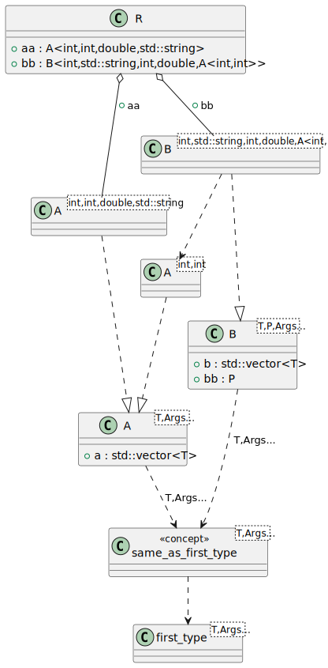

# t00058 - Test case for concepts with variadic parameters and type aliases
## Config
```yaml
compilation_database_dir: ..
output_directory: puml
diagrams:
  t00058_class:
    type: class
    glob:
      - ../../tests/t00058/t00058.cc
    include:
      namespaces:
        - clanguml::t00058
    using_namespace:
      - clanguml::t00058
    plantuml:
      after:
        - '{{ alias("same_as_first_type<T,Args...>") }} ..> {{ alias("first_type<T,Args...>") }}'
```
## Source code
File t00058.cc
```cpp
#include <string>
#include <type_traits>
#include <vector>

// Based on a blog post:
// https://andreasfertig.blog/2020/08/cpp20-concepts-testing-constrained-functions/

namespace clanguml {
namespace t00058 {

template <typename T, typename... Args> struct first_type {
    using type = T;
};

template <typename... Args>
using first_type_t = typename first_type<Args...>::type;

// TODO: Dependency of this concept on first_type<> template does not currently
//       work due to the fact that I don't know how to extract that information
//       from clang::DependentNameType to which first_type_t<> resolves to...
template <typename T, typename... Args>
concept same_as_first_type = std::is_same_v<std::remove_cvref_t<T>,
    std::remove_cvref_t<first_type_t<Args...>>>;

template <typename T, typename... Args>
    requires same_as_first_type<T, Args...>
struct A {
    std::vector<T> a;
};

template <typename T, typename P, typename... Args>
    requires same_as_first_type<T, Args...>
struct B {
    std::vector<T> b;
    P bb;
};

struct R {
    A<int, int, double, std::string> aa;
    B<int, std::string, int, double, A<int, int>> bb;
};

}
}
```
## Generated UML diagrams

## Generated JSON models
```json
{
  "diagram_type": "class",
  "elements": [
    {
      "bases": [],
      "display_name": "clanguml::t00058::first_type<T,Args...>",
      "id": "39461943261269692",
      "is_abstract": false,
      "is_nested": false,
      "is_struct": true,
      "is_template": true,
      "is_union": false,
      "members": [],
      "methods": [],
      "name": "first_type",
      "namespace": "clanguml::t00058",
      "source_location": {
        "column": 48,
        "file": "../../tests/t00058/t00058.cc",
        "line": 11,
        "translation_unit": "../../tests/t00058/t00058.cc"
      },
      "template_parameters": [
        {
          "is_variadic": false,
          "kind": "template_type",
          "name": "T",
          "template_parameters": []
        },
        {
          "is_variadic": true,
          "kind": "template_type",
          "name": "Args...",
          "template_parameters": []
        }
      ],
      "type": "class"
    },
    {
      "display_name": "clanguml::t00058::same_as_first_type<T,Args...>",
      "id": "1725820236573641307",
      "name": "same_as_first_type",
      "namespace": "clanguml::t00058",
      "parameters": [],
      "source_location": {
        "column": 9,
        "file": "../../tests/t00058/t00058.cc",
        "line": 22,
        "translation_unit": "../../tests/t00058/t00058.cc"
      },
      "statements": [],
      "type": "concept"
    },
    {
      "bases": [],
      "display_name": "clanguml::t00058::A<T,Args...>",
      "id": "798619347004821702",
      "is_abstract": false,
      "is_nested": false,
      "is_struct": true,
      "is_template": true,
      "is_union": false,
      "members": [
        {
          "access": "public",
          "is_static": false,
          "name": "a",
          "source_location": {
            "column": 20,
            "file": "../../tests/t00058/t00058.cc",
            "line": 28,
            "translation_unit": "../../tests/t00058/t00058.cc"
          },
          "type": "std::vector<T>"
        }
      ],
      "methods": [],
      "name": "A",
      "namespace": "clanguml::t00058",
      "source_location": {
        "column": 8,
        "file": "../../tests/t00058/t00058.cc",
        "line": 27,
        "translation_unit": "../../tests/t00058/t00058.cc"
      },
      "template_parameters": [
        {
          "is_variadic": false,
          "kind": "template_type",
          "name": "T",
          "template_parameters": []
        },
        {
          "is_variadic": true,
          "kind": "template_type",
          "name": "Args...",
          "template_parameters": []
        }
      ],
      "type": "class"
    },
    {
      "bases": [],
      "display_name": "clanguml::t00058::B<T,P,Args...>",
      "id": "420594889696591405",
      "is_abstract": false,
      "is_nested": false,
      "is_struct": true,
      "is_template": true,
      "is_union": false,
      "members": [
        {
          "access": "public",
          "is_static": false,
          "name": "b",
          "source_location": {
            "column": 20,
            "file": "../../tests/t00058/t00058.cc",
            "line": 34,
            "translation_unit": "../../tests/t00058/t00058.cc"
          },
          "type": "std::vector<T>"
        },
        {
          "access": "public",
          "is_static": false,
          "name": "bb",
          "source_location": {
            "column": 7,
            "file": "../../tests/t00058/t00058.cc",
            "line": 35,
            "translation_unit": "../../tests/t00058/t00058.cc"
          },
          "type": "P"
        }
      ],
      "methods": [],
      "name": "B",
      "namespace": "clanguml::t00058",
      "source_location": {
        "column": 8,
        "file": "../../tests/t00058/t00058.cc",
        "line": 33,
        "translation_unit": "../../tests/t00058/t00058.cc"
      },
      "template_parameters": [
        {
          "is_variadic": false,
          "kind": "template_type",
          "name": "T",
          "template_parameters": []
        },
        {
          "is_variadic": false,
          "kind": "template_type",
          "name": "P",
          "template_parameters": []
        },
        {
          "is_variadic": true,
          "kind": "template_type",
          "name": "Args...",
          "template_parameters": []
        }
      ],
      "type": "class"
    },
    {
      "bases": [],
      "display_name": "clanguml::t00058::A<int,int,double,std::string>",
      "id": "1724002183455178980",
      "is_abstract": false,
      "is_nested": false,
      "is_struct": false,
      "is_template": true,
      "is_union": false,
      "members": [],
      "methods": [],
      "name": "A",
      "namespace": "clanguml::t00058",
      "source_location": {
        "column": 8,
        "file": "../../tests/t00058/t00058.cc",
        "line": 27,
        "translation_unit": "../../tests/t00058/t00058.cc"
      },
      "template_parameters": [
        {
          "is_variadic": false,
          "kind": "argument",
          "template_parameters": [],
          "type": "int"
        },
        {
          "is_variadic": false,
          "kind": "argument",
          "template_parameters": [],
          "type": "int"
        },
        {
          "is_variadic": false,
          "kind": "argument",
          "template_parameters": [],
          "type": "double"
        },
        {
          "is_variadic": false,
          "kind": "argument",
          "template_parameters": [],
          "type": "std::string"
        }
      ],
      "type": "class"
    },
    {
      "bases": [],
      "display_name": "clanguml::t00058::A<int,int>",
      "id": "1372381231906520278",
      "is_abstract": false,
      "is_nested": false,
      "is_struct": false,
      "is_template": true,
      "is_union": false,
      "members": [],
      "methods": [],
      "name": "A",
      "namespace": "clanguml::t00058",
      "source_location": {
        "column": 8,
        "file": "../../tests/t00058/t00058.cc",
        "line": 33,
        "translation_unit": "../../tests/t00058/t00058.cc"
      },
      "template_parameters": [
        {
          "is_variadic": false,
          "kind": "argument",
          "template_parameters": [],
          "type": "int"
        },
        {
          "is_variadic": false,
          "kind": "argument",
          "template_parameters": [],
          "type": "int"
        }
      ],
      "type": "class"
    },
    {
      "bases": [],
      "display_name": "clanguml::t00058::B<int,std::string,int,double,clanguml::t00058::A<int,int>>",
      "id": "290383080560130133",
      "is_abstract": false,
      "is_nested": false,
      "is_struct": false,
      "is_template": true,
      "is_union": false,
      "members": [],
      "methods": [],
      "name": "B",
      "namespace": "clanguml::t00058",
      "source_location": {
        "column": 8,
        "file": "../../tests/t00058/t00058.cc",
        "line": 33,
        "translation_unit": "../../tests/t00058/t00058.cc"
      },
      "template_parameters": [
        {
          "is_variadic": false,
          "kind": "argument",
          "template_parameters": [],
          "type": "int"
        },
        {
          "is_variadic": false,
          "kind": "argument",
          "template_parameters": [],
          "type": "std::string"
        },
        {
          "is_variadic": false,
          "kind": "argument",
          "template_parameters": [],
          "type": "int"
        },
        {
          "is_variadic": false,
          "kind": "argument",
          "template_parameters": [],
          "type": "double"
        },
        {
          "is_variadic": false,
          "kind": "argument",
          "template_parameters": [
            {
              "is_variadic": false,
              "kind": "argument",
              "template_parameters": [],
              "type": "int"
            },
            {
              "is_variadic": false,
              "kind": "argument",
              "template_parameters": [],
              "type": "int"
            }
          ],
          "type": "clanguml::t00058::A"
        }
      ],
      "type": "class"
    },
    {
      "bases": [],
      "display_name": "clanguml::t00058::R",
      "id": "1015108159699260009",
      "is_abstract": false,
      "is_nested": false,
      "is_struct": true,
      "is_template": false,
      "is_union": false,
      "members": [
        {
          "access": "public",
          "is_static": false,
          "name": "aa",
          "source_location": {
            "column": 38,
            "file": "../../tests/t00058/t00058.cc",
            "line": 39,
            "translation_unit": "../../tests/t00058/t00058.cc"
          },
          "type": "A<int,int,double,std::string>"
        },
        {
          "access": "public",
          "is_static": false,
          "name": "bb",
          "source_location": {
            "column": 51,
            "file": "../../tests/t00058/t00058.cc",
            "line": 40,
            "translation_unit": "../../tests/t00058/t00058.cc"
          },
          "type": "B<int,std::string,int,double,A<int,int>>"
        }
      ],
      "methods": [],
      "name": "R",
      "namespace": "clanguml::t00058",
      "source_location": {
        "column": 8,
        "file": "../../tests/t00058/t00058.cc",
        "line": 38,
        "translation_unit": "../../tests/t00058/t00058.cc"
      },
      "template_parameters": [],
      "type": "class"
    }
  ],
  "metadata": {
    "clang_uml_version": "0.3.7-47-g2104d93",
    "llvm_version": "Ubuntu clang version 15.0.6",
    "schema_version": 1
  },
  "name": "t00058_class",
  "relationships": [
    {
      "destination": "1725820236573641307",
      "label": "T,Args...",
      "source": "798619347004821702",
      "type": "constraint"
    },
    {
      "destination": "1725820236573641307",
      "label": "T,Args...",
      "source": "420594889696591405",
      "type": "constraint"
    },
    {
      "access": "public",
      "destination": "798619347004821702",
      "source": "1724002183455178980",
      "type": "instantiation"
    },
    {
      "access": "public",
      "destination": "798619347004821702",
      "source": "1372381231906520278",
      "type": "instantiation"
    },
    {
      "access": "public",
      "destination": "1372381231906520278",
      "source": "290383080560130133",
      "type": "dependency"
    },
    {
      "access": "public",
      "destination": "420594889696591405",
      "source": "290383080560130133",
      "type": "instantiation"
    },
    {
      "access": "public",
      "destination": "1724002183455178980",
      "label": "aa",
      "source": "1015108159699260009",
      "type": "aggregation"
    },
    {
      "access": "public",
      "destination": "290383080560130133",
      "label": "bb",
      "source": "1015108159699260009",
      "type": "aggregation"
    }
  ],
  "using_namespace": "clanguml::t00058"
}
```
