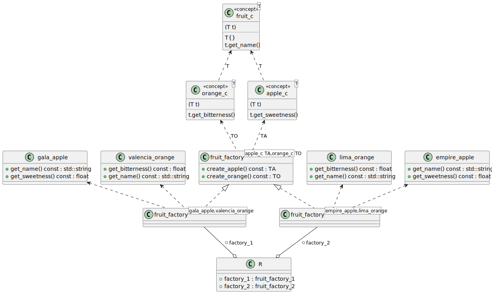

# t00059 - Non-virtual abstract factory pattern using concepts test case
## Config
```yaml
diagrams:
  t00059_class:
    type: class
    glob:
      - t00059.cc
    include:
      namespaces:
        - clanguml::t00059
    plantuml:
      style:
        instantiation: up
        association: up
        aggregation: up
        dependency: up
        constraint: up
    using_namespace: clanguml::t00059
```
## Source code
File `tests/t00059/t00059.cc`
```cpp
#include <string>

namespace clanguml {
namespace t00059 {

template <typename T>
concept fruit_c = requires(T t) {
                      T{};
                      t.get_name();
                  };

template <typename T>
concept apple_c = fruit_c<T> && requires(T t) { t.get_sweetness(); };

template <typename T>
concept orange_c = fruit_c<T> && requires(T t) { t.get_bitterness(); };

class gala_apple {
public:
    auto get_name() const -> std::string { return "gala"; }
    auto get_sweetness() const -> float { return 0.8; }
};

class empire_apple {
public:
    auto get_name() const -> std::string { return "empire"; }
    auto get_sweetness() const -> float { return 0.6; }
};

class lima_orange {
public:
    auto get_name() const -> std::string { return "lima"; }
    auto get_bitterness() const -> float { return 0.8; }
};

class valencia_orange {
public:
    auto get_name() const -> std::string { return "valencia"; }
    auto get_bitterness() const -> float { return 0.6; }
};

template <apple_c TA, orange_c TO> class fruit_factory {
public:
    auto create_apple() const -> TA { return TA{}; }
    auto create_orange() const -> TO { return TO{}; }
};

using fruit_factory_1 = fruit_factory<gala_apple, valencia_orange>;
using fruit_factory_2 = fruit_factory<empire_apple, lima_orange>;

struct R {
    fruit_factory_1 factory_1;
    fruit_factory_2 factory_2;
};
}
}
```
## Generated PlantUML diagrams

## Generated Mermaid diagrams

## Generated JSON models
```json
{
  "diagram_type": "class",
  "elements": [
    {
      "display_name": "fruit_c<T>",
      "id": "1926201868069460340",
      "name": "fruit_c",
      "namespace": "clanguml::t00059",
      "parameters": [
        {
          "name": "t",
          "type": "T"
        }
      ],
      "source_location": {
        "column": 9,
        "file": "t00059.cc",
        "line": 7,
        "translation_unit": "t00059.cc"
      },
      "statements": [
        "T{}",
        "t.get_name()"
      ],
      "type": "concept"
    },
    {
      "display_name": "apple_c<T>",
      "id": "1932582371736186409",
      "name": "apple_c",
      "namespace": "clanguml::t00059",
      "parameters": [
        {
          "name": "t",
          "type": "T"
        }
      ],
      "source_location": {
        "column": 9,
        "file": "t00059.cc",
        "line": 13,
        "translation_unit": "t00059.cc"
      },
      "statements": [
        "t.get_sweetness()"
      ],
      "type": "concept"
    },
    {
      "display_name": "orange_c<T>",
      "id": "1483904441065806133",
      "name": "orange_c",
      "namespace": "clanguml::t00059",
      "parameters": [
        {
          "name": "t",
          "type": "T"
        }
      ],
      "source_location": {
        "column": 9,
        "file": "t00059.cc",
        "line": 16,
        "translation_unit": "t00059.cc"
      },
      "statements": [
        "t.get_bitterness()"
      ],
      "type": "concept"
    },
    {
      "bases": [],
      "display_name": "gala_apple",
      "id": "399997161214328320",
      "is_abstract": false,
      "is_nested": false,
      "is_struct": false,
      "is_template": false,
      "is_union": false,
      "members": [],
      "methods": [
        {
          "access": "public",
          "display_name": "get_name",
          "is_const": true,
          "is_consteval": false,
          "is_constexpr": false,
          "is_constructor": false,
          "is_copy_assignment": false,
          "is_coroutine": false,
          "is_defaulted": false,
          "is_deleted": false,
          "is_move_assignment": false,
          "is_noexcept": false,
          "is_operator": false,
          "is_pure_virtual": false,
          "is_static": false,
          "is_virtual": false,
          "name": "get_name",
          "parameters": [],
          "source_location": {
            "column": 10,
            "file": "t00059.cc",
            "line": 20,
            "translation_unit": "t00059.cc"
          },
          "template_parameters": [],
          "type": "std::string"
        },
        {
          "access": "public",
          "display_name": "get_sweetness",
          "is_const": true,
          "is_consteval": false,
          "is_constexpr": false,
          "is_constructor": false,
          "is_copy_assignment": false,
          "is_coroutine": false,
          "is_defaulted": false,
          "is_deleted": false,
          "is_move_assignment": false,
          "is_noexcept": false,
          "is_operator": false,
          "is_pure_virtual": false,
          "is_static": false,
          "is_virtual": false,
          "name": "get_sweetness",
          "parameters": [],
          "source_location": {
            "column": 10,
            "file": "t00059.cc",
            "line": 21,
            "translation_unit": "t00059.cc"
          },
          "template_parameters": [],
          "type": "float"
        }
      ],
      "name": "gala_apple",
      "namespace": "clanguml::t00059",
      "source_location": {
        "column": 7,
        "file": "t00059.cc",
        "line": 18,
        "translation_unit": "t00059.cc"
      },
      "template_parameters": [],
      "type": "class"
    },
    {
      "bases": [],
      "display_name": "empire_apple",
      "id": "660406972347773654",
      "is_abstract": false,
      "is_nested": false,
      "is_struct": false,
      "is_template": false,
      "is_union": false,
      "members": [],
      "methods": [
        {
          "access": "public",
          "display_name": "get_name",
          "is_const": true,
          "is_consteval": false,
          "is_constexpr": false,
          "is_constructor": false,
          "is_copy_assignment": false,
          "is_coroutine": false,
          "is_defaulted": false,
          "is_deleted": false,
          "is_move_assignment": false,
          "is_noexcept": false,
          "is_operator": false,
          "is_pure_virtual": false,
          "is_static": false,
          "is_virtual": false,
          "name": "get_name",
          "parameters": [],
          "source_location": {
            "column": 10,
            "file": "t00059.cc",
            "line": 26,
            "translation_unit": "t00059.cc"
          },
          "template_parameters": [],
          "type": "std::string"
        },
        {
          "access": "public",
          "display_name": "get_sweetness",
          "is_const": true,
          "is_consteval": false,
          "is_constexpr": false,
          "is_constructor": false,
          "is_copy_assignment": false,
          "is_coroutine": false,
          "is_defaulted": false,
          "is_deleted": false,
          "is_move_assignment": false,
          "is_noexcept": false,
          "is_operator": false,
          "is_pure_virtual": false,
          "is_static": false,
          "is_virtual": false,
          "name": "get_sweetness",
          "parameters": [],
          "source_location": {
            "column": 10,
            "file": "t00059.cc",
            "line": 27,
            "translation_unit": "t00059.cc"
          },
          "template_parameters": [],
          "type": "float"
        }
      ],
      "name": "empire_apple",
      "namespace": "clanguml::t00059",
      "source_location": {
        "column": 7,
        "file": "t00059.cc",
        "line": 24,
        "translation_unit": "t00059.cc"
      },
      "template_parameters": [],
      "type": "class"
    },
    {
      "bases": [],
      "display_name": "lima_orange",
      "id": "1649295452510454080",
      "is_abstract": false,
      "is_nested": false,
      "is_struct": false,
      "is_template": false,
      "is_union": false,
      "members": [],
      "methods": [
        {
          "access": "public",
          "display_name": "get_name",
          "is_const": true,
          "is_consteval": false,
          "is_constexpr": false,
          "is_constructor": false,
          "is_copy_assignment": false,
          "is_coroutine": false,
          "is_defaulted": false,
          "is_deleted": false,
          "is_move_assignment": false,
          "is_noexcept": false,
          "is_operator": false,
          "is_pure_virtual": false,
          "is_static": false,
          "is_virtual": false,
          "name": "get_name",
          "parameters": [],
          "source_location": {
            "column": 10,
            "file": "t00059.cc",
            "line": 32,
            "translation_unit": "t00059.cc"
          },
          "template_parameters": [],
          "type": "std::string"
        },
        {
          "access": "public",
          "display_name": "get_bitterness",
          "is_const": true,
          "is_consteval": false,
          "is_constexpr": false,
          "is_constructor": false,
          "is_copy_assignment": false,
          "is_coroutine": false,
          "is_defaulted": false,
          "is_deleted": false,
          "is_move_assignment": false,
          "is_noexcept": false,
          "is_operator": false,
          "is_pure_virtual": false,
          "is_static": false,
          "is_virtual": false,
          "name": "get_bitterness",
          "parameters": [],
          "source_location": {
            "column": 10,
            "file": "t00059.cc",
            "line": 33,
            "translation_unit": "t00059.cc"
          },
          "template_parameters": [],
          "type": "float"
        }
      ],
      "name": "lima_orange",
      "namespace": "clanguml::t00059",
      "source_location": {
        "column": 7,
        "file": "t00059.cc",
        "line": 30,
        "translation_unit": "t00059.cc"
      },
      "template_parameters": [],
      "type": "class"
    },
    {
      "bases": [],
      "display_name": "valencia_orange",
      "id": "802727760415733923",
      "is_abstract": false,
      "is_nested": false,
      "is_struct": false,
      "is_template": false,
      "is_union": false,
      "members": [],
      "methods": [
        {
          "access": "public",
          "display_name": "get_name",
          "is_const": true,
          "is_consteval": false,
          "is_constexpr": false,
          "is_constructor": false,
          "is_copy_assignment": false,
          "is_coroutine": false,
          "is_defaulted": false,
          "is_deleted": false,
          "is_move_assignment": false,
          "is_noexcept": false,
          "is_operator": false,
          "is_pure_virtual": false,
          "is_static": false,
          "is_virtual": false,
          "name": "get_name",
          "parameters": [],
          "source_location": {
            "column": 10,
            "file": "t00059.cc",
            "line": 38,
            "translation_unit": "t00059.cc"
          },
          "template_parameters": [],
          "type": "std::string"
        },
        {
          "access": "public",
          "display_name": "get_bitterness",
          "is_const": true,
          "is_consteval": false,
          "is_constexpr": false,
          "is_constructor": false,
          "is_copy_assignment": false,
          "is_coroutine": false,
          "is_defaulted": false,
          "is_deleted": false,
          "is_move_assignment": false,
          "is_noexcept": false,
          "is_operator": false,
          "is_pure_virtual": false,
          "is_static": false,
          "is_virtual": false,
          "name": "get_bitterness",
          "parameters": [],
          "source_location": {
            "column": 10,
            "file": "t00059.cc",
            "line": 39,
            "translation_unit": "t00059.cc"
          },
          "template_parameters": [],
          "type": "float"
        }
      ],
      "name": "valencia_orange",
      "namespace": "clanguml::t00059",
      "source_location": {
        "column": 7,
        "file": "t00059.cc",
        "line": 36,
        "translation_unit": "t00059.cc"
      },
      "template_parameters": [],
      "type": "class"
    },
    {
      "bases": [],
      "display_name": "fruit_factory<apple_c TA,orange_c TO>",
      "id": "2301786483822933456",
      "is_abstract": false,
      "is_nested": false,
      "is_struct": false,
      "is_template": true,
      "is_union": false,
      "members": [],
      "methods": [
        {
          "access": "public",
          "display_name": "create_apple",
          "is_const": true,
          "is_consteval": false,
          "is_constexpr": false,
          "is_constructor": false,
          "is_copy_assignment": false,
          "is_coroutine": false,
          "is_defaulted": false,
          "is_deleted": false,
          "is_move_assignment": false,
          "is_noexcept": false,
          "is_operator": false,
          "is_pure_virtual": false,
          "is_static": false,
          "is_virtual": false,
          "name": "create_apple",
          "parameters": [],
          "source_location": {
            "column": 10,
            "file": "t00059.cc",
            "line": 44,
            "translation_unit": "t00059.cc"
          },
          "template_parameters": [],
          "type": "TA"
        },
        {
          "access": "public",
          "display_name": "create_orange",
          "is_const": true,
          "is_consteval": false,
          "is_constexpr": false,
          "is_constructor": false,
          "is_copy_assignment": false,
          "is_coroutine": false,
          "is_defaulted": false,
          "is_deleted": false,
          "is_move_assignment": false,
          "is_noexcept": false,
          "is_operator": false,
          "is_pure_virtual": false,
          "is_static": false,
          "is_virtual": false,
          "name": "create_orange",
          "parameters": [],
          "source_location": {
            "column": 10,
            "file": "t00059.cc",
            "line": 45,
            "translation_unit": "t00059.cc"
          },
          "template_parameters": [],
          "type": "TO"
        }
      ],
      "name": "fruit_factory",
      "namespace": "clanguml::t00059",
      "source_location": {
        "column": 42,
        "file": "t00059.cc",
        "line": 42,
        "translation_unit": "t00059.cc"
      },
      "template_parameters": [
        {
          "is_variadic": false,
          "kind": "template_type",
          "name": "TA",
          "template_parameters": []
        },
        {
          "is_variadic": false,
          "kind": "template_type",
          "name": "TO",
          "template_parameters": []
        }
      ],
      "type": "class"
    },
    {
      "bases": [],
      "display_name": "fruit_factory<gala_apple,valencia_orange>",
      "id": "551278102444647278",
      "is_abstract": false,
      "is_nested": false,
      "is_struct": false,
      "is_template": true,
      "is_union": false,
      "members": [],
      "methods": [],
      "name": "fruit_factory",
      "namespace": "clanguml::t00059",
      "source_location": {
        "column": 42,
        "file": "t00059.cc",
        "line": 42,
        "translation_unit": "t00059.cc"
      },
      "template_parameters": [
        {
          "is_variadic": false,
          "kind": "argument",
          "template_parameters": [],
          "type": "gala_apple"
        },
        {
          "is_variadic": false,
          "kind": "argument",
          "template_parameters": [],
          "type": "valencia_orange"
        }
      ],
      "type": "class"
    },
    {
      "bases": [],
      "display_name": "fruit_factory<empire_apple,lima_orange>",
      "id": "536390279563541226",
      "is_abstract": false,
      "is_nested": false,
      "is_struct": false,
      "is_template": true,
      "is_union": false,
      "members": [],
      "methods": [],
      "name": "fruit_factory",
      "namespace": "clanguml::t00059",
      "source_location": {
        "column": 42,
        "file": "t00059.cc",
        "line": 42,
        "translation_unit": "t00059.cc"
      },
      "template_parameters": [
        {
          "is_variadic": false,
          "kind": "argument",
          "template_parameters": [],
          "type": "empire_apple"
        },
        {
          "is_variadic": false,
          "kind": "argument",
          "template_parameters": [],
          "type": "lima_orange"
        }
      ],
      "type": "class"
    },
    {
      "bases": [],
      "display_name": "R",
      "id": "1128300671453354325",
      "is_abstract": false,
      "is_nested": false,
      "is_struct": true,
      "is_template": false,
      "is_union": false,
      "members": [
        {
          "access": "public",
          "is_static": false,
          "name": "factory_1",
          "source_location": {
            "column": 21,
            "file": "t00059.cc",
            "line": 52,
            "translation_unit": "t00059.cc"
          },
          "type": "fruit_factory_1"
        },
        {
          "access": "public",
          "is_static": false,
          "name": "factory_2",
          "source_location": {
            "column": 21,
            "file": "t00059.cc",
            "line": 53,
            "translation_unit": "t00059.cc"
          },
          "type": "fruit_factory_2"
        }
      ],
      "methods": [],
      "name": "R",
      "namespace": "clanguml::t00059",
      "source_location": {
        "column": 8,
        "file": "t00059.cc",
        "line": 51,
        "translation_unit": "t00059.cc"
      },
      "template_parameters": [],
      "type": "class"
    }
  ],
  "name": "t00059_class",
  "package_type": "namespace",
  "relationships": [
    {
      "destination": "1926201868069460340",
      "label": "T",
      "source": "1932582371736186409",
      "type": "constraint"
    },
    {
      "destination": "1926201868069460340",
      "label": "T",
      "source": "1483904441065806133",
      "type": "constraint"
    },
    {
      "destination": "1932582371736186409",
      "label": "TA",
      "source": "2301786483822933456",
      "type": "constraint"
    },
    {
      "destination": "1483904441065806133",
      "label": "TO",
      "source": "2301786483822933456",
      "type": "constraint"
    },
    {
      "access": "public",
      "destination": "399997161214328320",
      "source": "551278102444647278",
      "type": "dependency"
    },
    {
      "access": "public",
      "destination": "802727760415733923",
      "source": "551278102444647278",
      "type": "dependency"
    },
    {
      "access": "public",
      "destination": "2301786483822933456",
      "source": "551278102444647278",
      "type": "instantiation"
    },
    {
      "access": "public",
      "destination": "660406972347773654",
      "source": "536390279563541226",
      "type": "dependency"
    },
    {
      "access": "public",
      "destination": "1649295452510454080",
      "source": "536390279563541226",
      "type": "dependency"
    },
    {
      "access": "public",
      "destination": "2301786483822933456",
      "source": "536390279563541226",
      "type": "instantiation"
    },
    {
      "access": "public",
      "destination": "551278102444647278",
      "label": "factory_1",
      "source": "1128300671453354325",
      "type": "aggregation"
    },
    {
      "access": "public",
      "destination": "536390279563541226",
      "label": "factory_2",
      "source": "1128300671453354325",
      "type": "aggregation"
    }
  ],
  "using_namespace": "clanguml::t00059"
}
```
