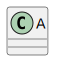

# t00061 - Paths diagram filter test case
## Config
```yaml
diagrams:
  t00061_class:
    type: class
    glob:
      - t00061.cc
    include:
      namespaces:
        - clanguml::t00061
      paths:
        - include/*_a.h
    using_namespace: clanguml::t00061
```
## Source code
File `tests/t00061/t00061.cc`
```cpp
#include "include/t00061_a.h"
#include "include/t00061_b.h"

namespace clanguml {
namespace t00061 {
struct C {
    A *a;
    B *b;
};
}
}
```
File `tests/t00061/include/t00061_a.h`
```cpp
namespace clanguml {
namespace t00061 {
struct A { };
}
}
```
File `tests/t00061/include/t00061_b.h`
```cpp
namespace clanguml {
namespace t00061 {
struct B { };
}
}
```
## Generated PlantUML diagrams

## Generated Mermaid diagrams

## Generated JSON models
```json
{
  "diagram_type": "class",
  "elements": [
    {
      "bases": [],
      "display_name": "A",
      "id": "1010204727957329423",
      "is_abstract": false,
      "is_nested": false,
      "is_struct": true,
      "is_template": false,
      "is_union": false,
      "members": [],
      "methods": [],
      "name": "A",
      "namespace": "clanguml::t00061",
      "source_location": {
        "column": 8,
        "file": "include/t00061_a.h",
        "line": 3,
        "translation_unit": "t00061.cc"
      },
      "template_parameters": [],
      "type": "class"
    }
  ],
  "name": "t00061_class",
  "package_type": "namespace",
  "relationships": [],
  "using_namespace": "clanguml::t00061"
}
```
