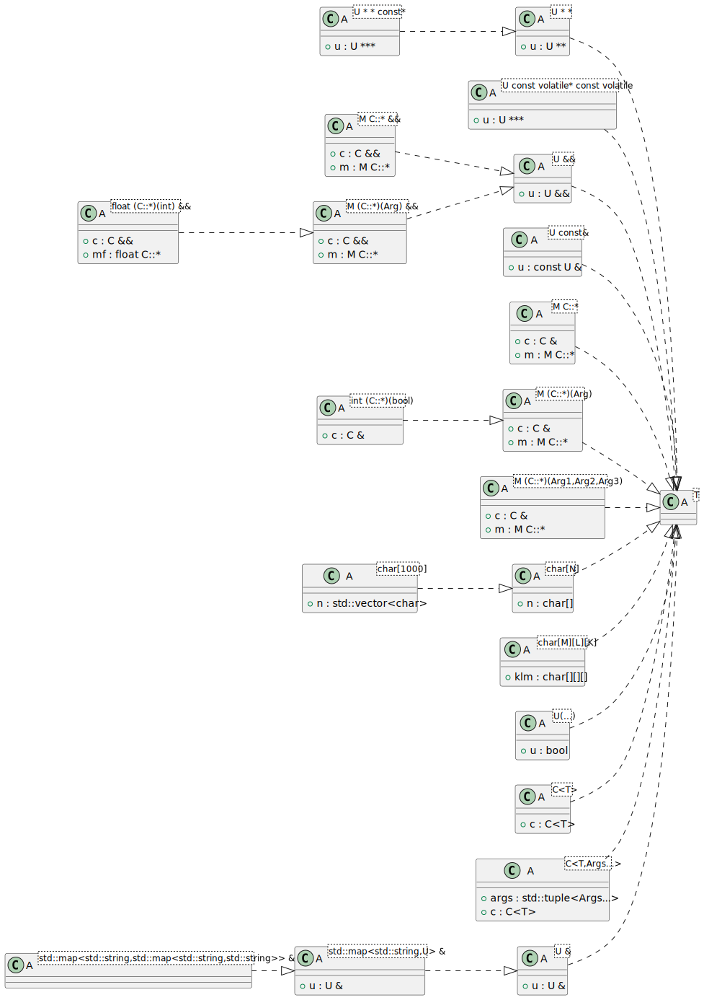

# t00062 - Template specialization matching based on deduced context
## Config
```yaml
diagrams:
  t00062_class:
    type: class
    glob:
      - t00062.cc
    include:
      namespaces:
        - clanguml::t00062
    using_namespace: clanguml::t00062
    plantuml:
      before:
        - left to right direction
```
## Source code
File `tests/t00062/t00062.cc`
```cpp
#include <map>
#include <string>
#include <vector>

namespace clanguml {
namespace t00062 {
template <typename T> struct A;

template <typename U> struct A<U &> {
    U &u;
};

template <typename U> struct A<std::map<std::string, U> &> {
    U &u;
};

template <>
struct A<std::map<std::string, std::map<std::string, std::string>> &> { };

template <typename U> struct A<U **> {
    U **u;
};

template <typename U> struct A<U **const *> {
    U ***u;
};

template <typename U> struct A<U const *const volatile> {
    U ***u;
};

template <typename U> struct A<U &&> {
    U &&u;
};

template <typename U> struct A<U const &> {
    U const &u;
};

template <typename M, typename C> struct A<M C::*> {
    C &c;
    M C::*m;
};

template <typename M, typename C> struct A<M C::*&&> {
    C &&c;
    M C::*m;
};

template <typename M, typename C, typename Arg> struct A<M (C::*)(Arg)> {
    C &c;
    M C::*m;
};

template <typename C> struct A<int (C::*)(bool)> {
    C &c;
};

template <typename M, typename C, typename Arg> struct A<M (C::*)(Arg) &&> {
    C &&c;
    M C::*m;
};

template <typename C> struct A<float (C::*)(int) &&> {
    C &&c;
    float C::*mf;
};

template <typename M, typename C, typename Arg1, typename Arg2, typename Arg3>
struct A<M (C::*)(Arg1, Arg2, Arg3)> {
    C &c;
    M C::*m;
};

template <int N> struct A<char[N]> {
    char n[N];
};

template <> struct A<char[1000]> {
    std::vector<char> n;
};

template <int K, int L, int M> struct A<char[K][L][M]> { char klm[K][L][M]; };

template <typename U> struct A<U(...)> {
    bool u;
};

template <template <typename> class C, typename T> struct A<C<T>> {
    C<T> c;
};

template <template <typename, typename...> class C, typename T,
    typename... Args>
struct A<C<T, Args...>> {
    C<T> c;
    std::tuple<Args...> args;
};

}
}
```
## Generated PlantUML diagrams

## Generated Mermaid diagrams

## Generated JSON models
```json
{
  "diagram_type": "class",
  "elements": [
    {
      "bases": [],
      "display_name": "A<U &>",
      "id": "1046827200300090710",
      "is_abstract": false,
      "is_nested": false,
      "is_struct": true,
      "is_template": true,
      "is_union": false,
      "members": [
        {
          "access": "public",
          "is_static": false,
          "name": "u",
          "source_location": {
            "column": 8,
            "file": "t00062.cc",
            "line": 10,
            "translation_unit": "t00062.cc"
          },
          "type": "U &"
        }
      ],
      "methods": [],
      "name": "A",
      "namespace": "clanguml::t00062",
      "source_location": {
        "column": 30,
        "file": "t00062.cc",
        "line": 9,
        "translation_unit": "t00062.cc"
      },
      "template_parameters": [
        {
          "is_variadic": false,
          "kind": "template_type",
          "name": "U",
          "template_parameters": []
        }
      ],
      "type": "class"
    },
    {
      "bases": [],
      "display_name": "A<std::map<std::string,U> &>",
      "id": "1099548178945911245",
      "is_abstract": false,
      "is_nested": false,
      "is_struct": true,
      "is_template": true,
      "is_union": false,
      "members": [
        {
          "access": "public",
          "is_static": false,
          "name": "u",
          "source_location": {
            "column": 8,
            "file": "t00062.cc",
            "line": 14,
            "translation_unit": "t00062.cc"
          },
          "type": "U &"
        }
      ],
      "methods": [],
      "name": "A",
      "namespace": "clanguml::t00062",
      "source_location": {
        "column": 30,
        "file": "t00062.cc",
        "line": 13,
        "translation_unit": "t00062.cc"
      },
      "template_parameters": [
        {
          "is_variadic": false,
          "kind": "argument",
          "template_parameters": [
            {
              "is_variadic": false,
              "kind": "argument",
              "template_parameters": [],
              "type": "std::string"
            },
            {
              "is_variadic": false,
              "kind": "template_type",
              "name": "U",
              "template_parameters": []
            }
          ],
          "type": "std::map"
        }
      ],
      "type": "class"
    },
    {
      "bases": [],
      "display_name": "A<std::map<std::string,std::map<std::string,std::string>> &>",
      "id": "1239388209995793547",
      "is_abstract": false,
      "is_nested": false,
      "is_struct": true,
      "is_template": true,
      "is_union": false,
      "members": [],
      "methods": [],
      "name": "A",
      "namespace": "clanguml::t00062",
      "source_location": {
        "column": 8,
        "file": "t00062.cc",
        "line": 18,
        "translation_unit": "t00062.cc"
      },
      "template_parameters": [
        {
          "is_variadic": false,
          "kind": "argument",
          "template_parameters": [
            {
              "is_variadic": false,
              "kind": "argument",
              "template_parameters": [],
              "type": "std::string"
            },
            {
              "is_variadic": false,
              "kind": "argument",
              "template_parameters": [
                {
                  "is_variadic": false,
                  "kind": "argument",
                  "template_parameters": [],
                  "type": "std::string"
                },
                {
                  "is_variadic": false,
                  "kind": "argument",
                  "template_parameters": [],
                  "type": "std::string"
                }
              ],
              "type": "std::map"
            }
          ],
          "type": "std::map"
        }
      ],
      "type": "class"
    },
    {
      "bases": [],
      "display_name": "A<U * *>",
      "id": "45701897814162098",
      "is_abstract": false,
      "is_nested": false,
      "is_struct": true,
      "is_template": true,
      "is_union": false,
      "members": [
        {
          "access": "public",
          "is_static": false,
          "name": "u",
          "source_location": {
            "column": 9,
            "file": "t00062.cc",
            "line": 21,
            "translation_unit": "t00062.cc"
          },
          "type": "U **"
        }
      ],
      "methods": [],
      "name": "A",
      "namespace": "clanguml::t00062",
      "source_location": {
        "column": 30,
        "file": "t00062.cc",
        "line": 20,
        "translation_unit": "t00062.cc"
      },
      "template_parameters": [
        {
          "is_variadic": false,
          "kind": "template_type",
          "name": "U",
          "template_parameters": []
        }
      ],
      "type": "class"
    },
    {
      "bases": [],
      "display_name": "A<U * * const*>",
      "id": "1379193770802992785",
      "is_abstract": false,
      "is_nested": false,
      "is_struct": true,
      "is_template": true,
      "is_union": false,
      "members": [
        {
          "access": "public",
          "is_static": false,
          "name": "u",
          "source_location": {
            "column": 10,
            "file": "t00062.cc",
            "line": 25,
            "translation_unit": "t00062.cc"
          },
          "type": "U ***"
        }
      ],
      "methods": [],
      "name": "A",
      "namespace": "clanguml::t00062",
      "source_location": {
        "column": 30,
        "file": "t00062.cc",
        "line": 24,
        "translation_unit": "t00062.cc"
      },
      "template_parameters": [
        {
          "is_variadic": false,
          "kind": "template_type",
          "name": "U",
          "template_parameters": []
        }
      ],
      "type": "class"
    },
    {
      "bases": [],
      "display_name": "A<U const volatile* const volatile>",
      "id": "1407865337446777280",
      "is_abstract": false,
      "is_nested": false,
      "is_struct": true,
      "is_template": true,
      "is_union": false,
      "members": [
        {
          "access": "public",
          "is_static": false,
          "name": "u",
          "source_location": {
            "column": 10,
            "file": "t00062.cc",
            "line": 29,
            "translation_unit": "t00062.cc"
          },
          "type": "U ***"
        }
      ],
      "methods": [],
      "name": "A",
      "namespace": "clanguml::t00062",
      "source_location": {
        "column": 30,
        "file": "t00062.cc",
        "line": 28,
        "translation_unit": "t00062.cc"
      },
      "template_parameters": [
        {
          "is_variadic": false,
          "kind": "template_type",
          "name": "U",
          "template_parameters": []
        }
      ],
      "type": "class"
    },
    {
      "bases": [],
      "display_name": "A<U &&>",
      "id": "1034483227649400416",
      "is_abstract": false,
      "is_nested": false,
      "is_struct": true,
      "is_template": true,
      "is_union": false,
      "members": [
        {
          "access": "public",
          "is_static": false,
          "name": "u",
          "source_location": {
            "column": 9,
            "file": "t00062.cc",
            "line": 33,
            "translation_unit": "t00062.cc"
          },
          "type": "U &&"
        }
      ],
      "methods": [],
      "name": "A",
      "namespace": "clanguml::t00062",
      "source_location": {
        "column": 30,
        "file": "t00062.cc",
        "line": 32,
        "translation_unit": "t00062.cc"
      },
      "template_parameters": [
        {
          "is_variadic": false,
          "kind": "template_type",
          "name": "U",
          "template_parameters": []
        }
      ],
      "type": "class"
    },
    {
      "bases": [],
      "display_name": "A<U const&>",
      "id": "352457857519671117",
      "is_abstract": false,
      "is_nested": false,
      "is_struct": true,
      "is_template": true,
      "is_union": false,
      "members": [
        {
          "access": "public",
          "is_static": false,
          "name": "u",
          "source_location": {
            "column": 14,
            "file": "t00062.cc",
            "line": 37,
            "translation_unit": "t00062.cc"
          },
          "type": "const U &"
        }
      ],
      "methods": [],
      "name": "A",
      "namespace": "clanguml::t00062",
      "source_location": {
        "column": 30,
        "file": "t00062.cc",
        "line": 36,
        "translation_unit": "t00062.cc"
      },
      "template_parameters": [
        {
          "is_variadic": false,
          "kind": "template_type",
          "name": "U",
          "template_parameters": []
        }
      ],
      "type": "class"
    },
    {
      "bases": [],
      "display_name": "A<M C::*>",
      "id": "314708288320430272",
      "is_abstract": false,
      "is_nested": false,
      "is_struct": true,
      "is_template": true,
      "is_union": false,
      "members": [
        {
          "access": "public",
          "is_static": false,
          "name": "c",
          "source_location": {
            "column": 8,
            "file": "t00062.cc",
            "line": 41,
            "translation_unit": "t00062.cc"
          },
          "type": "C &"
        },
        {
          "access": "public",
          "is_static": false,
          "name": "m",
          "source_location": {
            "column": 11,
            "file": "t00062.cc",
            "line": 42,
            "translation_unit": "t00062.cc"
          },
          "type": "M C::*"
        }
      ],
      "methods": [],
      "name": "A",
      "namespace": "clanguml::t00062",
      "source_location": {
        "column": 42,
        "file": "t00062.cc",
        "line": 40,
        "translation_unit": "t00062.cc"
      },
      "template_parameters": [
        {
          "is_variadic": false,
          "kind": "template_type",
          "template_parameters": [
            {
              "is_variadic": false,
              "kind": "template_type",
              "name": "M",
              "template_parameters": []
            },
            {
              "is_variadic": false,
              "kind": "template_type",
              "name": "C",
              "template_parameters": []
            }
          ]
        }
      ],
      "type": "class"
    },
    {
      "bases": [],
      "display_name": "A<M C::* &&>",
      "id": "827753335392390402",
      "is_abstract": false,
      "is_nested": false,
      "is_struct": true,
      "is_template": true,
      "is_union": false,
      "members": [
        {
          "access": "public",
          "is_static": false,
          "name": "c",
          "source_location": {
            "column": 9,
            "file": "t00062.cc",
            "line": 46,
            "translation_unit": "t00062.cc"
          },
          "type": "C &&"
        },
        {
          "access": "public",
          "is_static": false,
          "name": "m",
          "source_location": {
            "column": 11,
            "file": "t00062.cc",
            "line": 47,
            "translation_unit": "t00062.cc"
          },
          "type": "M C::*"
        }
      ],
      "methods": [],
      "name": "A",
      "namespace": "clanguml::t00062",
      "source_location": {
        "column": 42,
        "file": "t00062.cc",
        "line": 45,
        "translation_unit": "t00062.cc"
      },
      "template_parameters": [
        {
          "is_variadic": false,
          "kind": "template_type",
          "template_parameters": [
            {
              "is_variadic": false,
              "kind": "template_type",
              "name": "M",
              "template_parameters": []
            },
            {
              "is_variadic": false,
              "kind": "template_type",
              "name": "C",
              "template_parameters": []
            }
          ]
        }
      ],
      "type": "class"
    },
    {
      "bases": [],
      "display_name": "A<M (C::*)(Arg)>",
      "id": "395583480407686249",
      "is_abstract": false,
      "is_nested": false,
      "is_struct": true,
      "is_template": true,
      "is_union": false,
      "members": [
        {
          "access": "public",
          "is_static": false,
          "name": "c",
          "source_location": {
            "column": 8,
            "file": "t00062.cc",
            "line": 51,
            "translation_unit": "t00062.cc"
          },
          "type": "C &"
        },
        {
          "access": "public",
          "is_static": false,
          "name": "m",
          "source_location": {
            "column": 11,
            "file": "t00062.cc",
            "line": 52,
            "translation_unit": "t00062.cc"
          },
          "type": "M C::*"
        }
      ],
      "methods": [],
      "name": "A",
      "namespace": "clanguml::t00062",
      "source_location": {
        "column": 56,
        "file": "t00062.cc",
        "line": 50,
        "translation_unit": "t00062.cc"
      },
      "template_parameters": [
        {
          "is_variadic": false,
          "kind": "template_type",
          "template_parameters": [
            {
              "is_variadic": false,
              "kind": "template_type",
              "name": "M",
              "template_parameters": []
            },
            {
              "is_variadic": false,
              "kind": "template_type",
              "name": "C",
              "template_parameters": []
            },
            {
              "is_variadic": false,
              "kind": "template_type",
              "name": "Arg",
              "template_parameters": []
            }
          ]
        }
      ],
      "type": "class"
    },
    {
      "bases": [],
      "display_name": "A<int (C::*)(bool)>",
      "id": "476497055497873078",
      "is_abstract": false,
      "is_nested": false,
      "is_struct": true,
      "is_template": true,
      "is_union": false,
      "members": [
        {
          "access": "public",
          "is_static": false,
          "name": "c",
          "source_location": {
            "column": 8,
            "file": "t00062.cc",
            "line": 56,
            "translation_unit": "t00062.cc"
          },
          "type": "C &"
        }
      ],
      "methods": [],
      "name": "A",
      "namespace": "clanguml::t00062",
      "source_location": {
        "column": 30,
        "file": "t00062.cc",
        "line": 55,
        "translation_unit": "t00062.cc"
      },
      "template_parameters": [
        {
          "is_variadic": false,
          "kind": "template_type",
          "template_parameters": [
            {
              "is_variadic": false,
              "kind": "argument",
              "template_parameters": [],
              "type": "int"
            },
            {
              "is_variadic": false,
              "kind": "template_type",
              "name": "C",
              "template_parameters": []
            },
            {
              "is_variadic": false,
              "kind": "argument",
              "template_parameters": [],
              "type": "bool"
            }
          ]
        }
      ],
      "type": "class"
    },
    {
      "bases": [],
      "display_name": "A<M (C::*)(Arg) &&>",
      "id": "1619634759668095904",
      "is_abstract": false,
      "is_nested": false,
      "is_struct": true,
      "is_template": true,
      "is_union": false,
      "members": [
        {
          "access": "public",
          "is_static": false,
          "name": "c",
          "source_location": {
            "column": 9,
            "file": "t00062.cc",
            "line": 60,
            "translation_unit": "t00062.cc"
          },
          "type": "C &&"
        },
        {
          "access": "public",
          "is_static": false,
          "name": "m",
          "source_location": {
            "column": 11,
            "file": "t00062.cc",
            "line": 61,
            "translation_unit": "t00062.cc"
          },
          "type": "M C::*"
        }
      ],
      "methods": [],
      "name": "A",
      "namespace": "clanguml::t00062",
      "source_location": {
        "column": 56,
        "file": "t00062.cc",
        "line": 59,
        "translation_unit": "t00062.cc"
      },
      "template_parameters": [
        {
          "is_variadic": false,
          "kind": "template_type",
          "template_parameters": [
            {
              "is_variadic": false,
              "kind": "template_type",
              "name": "M",
              "template_parameters": []
            },
            {
              "is_variadic": false,
              "kind": "template_type",
              "name": "C",
              "template_parameters": []
            },
            {
              "is_variadic": false,
              "kind": "template_type",
              "name": "Arg",
              "template_parameters": []
            }
          ]
        }
      ],
      "type": "class"
    },
    {
      "bases": [],
      "display_name": "A<float (C::*)(int) &&>",
      "id": "1357746808315142717",
      "is_abstract": false,
      "is_nested": false,
      "is_struct": true,
      "is_template": true,
      "is_union": false,
      "members": [
        {
          "access": "public",
          "is_static": false,
          "name": "c",
          "source_location": {
            "column": 9,
            "file": "t00062.cc",
            "line": 65,
            "translation_unit": "t00062.cc"
          },
          "type": "C &&"
        },
        {
          "access": "public",
          "is_static": false,
          "name": "mf",
          "source_location": {
            "column": 15,
            "file": "t00062.cc",
            "line": 66,
            "translation_unit": "t00062.cc"
          },
          "type": "float C::*"
        }
      ],
      "methods": [],
      "name": "A",
      "namespace": "clanguml::t00062",
      "source_location": {
        "column": 30,
        "file": "t00062.cc",
        "line": 64,
        "translation_unit": "t00062.cc"
      },
      "template_parameters": [
        {
          "is_variadic": false,
          "kind": "template_type",
          "template_parameters": [
            {
              "is_variadic": false,
              "kind": "argument",
              "template_parameters": [],
              "type": "float"
            },
            {
              "is_variadic": false,
              "kind": "template_type",
              "name": "C",
              "template_parameters": []
            },
            {
              "is_variadic": false,
              "kind": "argument",
              "template_parameters": [],
              "type": "int"
            }
          ]
        }
      ],
      "type": "class"
    },
    {
      "bases": [],
      "display_name": "A<M (C::*)(Arg1,Arg2,Arg3)>",
      "id": "544335779197078982",
      "is_abstract": false,
      "is_nested": false,
      "is_struct": true,
      "is_template": true,
      "is_union": false,
      "members": [
        {
          "access": "public",
          "is_static": false,
          "name": "c",
          "source_location": {
            "column": 8,
            "file": "t00062.cc",
            "line": 71,
            "translation_unit": "t00062.cc"
          },
          "type": "C &"
        },
        {
          "access": "public",
          "is_static": false,
          "name": "m",
          "source_location": {
            "column": 11,
            "file": "t00062.cc",
            "line": 72,
            "translation_unit": "t00062.cc"
          },
          "type": "M C::*"
        }
      ],
      "methods": [],
      "name": "A",
      "namespace": "clanguml::t00062",
      "source_location": {
        "column": 8,
        "file": "t00062.cc",
        "line": 70,
        "translation_unit": "t00062.cc"
      },
      "template_parameters": [
        {
          "is_variadic": false,
          "kind": "template_type",
          "template_parameters": [
            {
              "is_variadic": false,
              "kind": "template_type",
              "name": "M",
              "template_parameters": []
            },
            {
              "is_variadic": false,
              "kind": "template_type",
              "name": "C",
              "template_parameters": []
            },
            {
              "is_variadic": false,
              "kind": "template_type",
              "name": "Arg1",
              "template_parameters": []
            },
            {
              "is_variadic": false,
              "kind": "template_type",
              "name": "Arg2",
              "template_parameters": []
            },
            {
              "is_variadic": false,
              "kind": "template_type",
              "name": "Arg3",
              "template_parameters": []
            }
          ]
        }
      ],
      "type": "class"
    },
    {
      "bases": [],
      "display_name": "A<char[N]>",
      "id": "602066980416477930",
      "is_abstract": false,
      "is_nested": false,
      "is_struct": true,
      "is_template": true,
      "is_union": false,
      "members": [
        {
          "access": "public",
          "is_static": false,
          "name": "n",
          "source_location": {
            "column": 10,
            "file": "t00062.cc",
            "line": 76,
            "translation_unit": "t00062.cc"
          },
          "type": "char[]"
        }
      ],
      "methods": [],
      "name": "A",
      "namespace": "clanguml::t00062",
      "source_location": {
        "column": 25,
        "file": "t00062.cc",
        "line": 75,
        "translation_unit": "t00062.cc"
      },
      "template_parameters": [
        {
          "is_variadic": false,
          "kind": "template_type",
          "template_parameters": [
            {
              "is_variadic": false,
              "kind": "argument",
              "template_parameters": [],
              "type": "char"
            },
            {
              "is_variadic": false,
              "kind": "template_type",
              "name": "N",
              "template_parameters": []
            }
          ]
        }
      ],
      "type": "class"
    },
    {
      "bases": [],
      "display_name": "A<char[1000]>",
      "id": "1318419672443856415",
      "is_abstract": false,
      "is_nested": false,
      "is_struct": true,
      "is_template": true,
      "is_union": false,
      "members": [
        {
          "access": "public",
          "is_static": false,
          "name": "n",
          "source_location": {
            "column": 23,
            "file": "t00062.cc",
            "line": 80,
            "translation_unit": "t00062.cc"
          },
          "type": "std::vector<char>"
        }
      ],
      "methods": [],
      "name": "A",
      "namespace": "clanguml::t00062",
      "source_location": {
        "column": 20,
        "file": "t00062.cc",
        "line": 79,
        "translation_unit": "t00062.cc"
      },
      "template_parameters": [
        {
          "is_variadic": false,
          "kind": "template_type",
          "template_parameters": [
            {
              "is_variadic": false,
              "kind": "argument",
              "template_parameters": [],
              "type": "char"
            },
            {
              "is_variadic": false,
              "kind": "argument",
              "template_parameters": [],
              "type": "1000"
            }
          ]
        }
      ],
      "type": "class"
    },
    {
      "bases": [],
      "display_name": "A<char[M][L][K]>",
      "id": "599593856979463652",
      "is_abstract": false,
      "is_nested": false,
      "is_struct": true,
      "is_template": true,
      "is_union": false,
      "members": [
        {
          "access": "public",
          "is_static": false,
          "name": "klm",
          "source_location": {
            "column": 63,
            "file": "t00062.cc",
            "line": 83,
            "translation_unit": "t00062.cc"
          },
          "type": "char[][][]"
        }
      ],
      "methods": [],
      "name": "A",
      "namespace": "clanguml::t00062",
      "source_location": {
        "column": 39,
        "file": "t00062.cc",
        "line": 83,
        "translation_unit": "t00062.cc"
      },
      "template_parameters": [
        {
          "is_variadic": false,
          "kind": "template_type",
          "template_parameters": [
            {
              "is_variadic": false,
              "kind": "template_type",
              "template_parameters": [
                {
                  "is_variadic": false,
                  "kind": "template_type",
                  "template_parameters": [
                    {
                      "is_variadic": false,
                      "kind": "argument",
                      "template_parameters": [],
                      "type": "char"
                    },
                    {
                      "is_variadic": false,
                      "kind": "template_type",
                      "name": "M",
                      "template_parameters": []
                    }
                  ]
                },
                {
                  "is_variadic": false,
                  "kind": "template_type",
                  "name": "L",
                  "template_parameters": []
                }
              ]
            },
            {
              "is_variadic": false,
              "kind": "template_type",
              "name": "K",
              "template_parameters": []
            }
          ]
        }
      ],
      "type": "class"
    },
    {
      "bases": [],
      "display_name": "A<U(...)>",
      "id": "15395295268000991",
      "is_abstract": false,
      "is_nested": false,
      "is_struct": true,
      "is_template": true,
      "is_union": false,
      "members": [
        {
          "access": "public",
          "is_static": false,
          "name": "u",
          "source_location": {
            "column": 10,
            "file": "t00062.cc",
            "line": 86,
            "translation_unit": "t00062.cc"
          },
          "type": "bool"
        }
      ],
      "methods": [],
      "name": "A",
      "namespace": "clanguml::t00062",
      "source_location": {
        "column": 30,
        "file": "t00062.cc",
        "line": 85,
        "translation_unit": "t00062.cc"
      },
      "template_parameters": [
        {
          "is_variadic": false,
          "kind": "template_type",
          "template_parameters": [
            {
              "is_variadic": false,
              "kind": "template_type",
              "name": "U",
              "template_parameters": []
            },
            {
              "is_variadic": false,
              "kind": "argument",
              "template_parameters": [],
              "type": ""
            }
          ]
        }
      ],
      "type": "class"
    },
    {
      "bases": [],
      "display_name": "A<C<T>>",
      "id": "1603321863498552207",
      "is_abstract": false,
      "is_nested": false,
      "is_struct": true,
      "is_template": true,
      "is_union": false,
      "members": [
        {
          "access": "public",
          "is_static": false,
          "name": "c",
          "source_location": {
            "column": 10,
            "file": "t00062.cc",
            "line": 90,
            "translation_unit": "t00062.cc"
          },
          "type": "C<T>"
        }
      ],
      "methods": [],
      "name": "A",
      "namespace": "clanguml::t00062",
      "source_location": {
        "column": 59,
        "file": "t00062.cc",
        "line": 89,
        "translation_unit": "t00062.cc"
      },
      "template_parameters": [
        {
          "is_variadic": false,
          "kind": "argument",
          "template_parameters": [
            {
              "is_variadic": false,
              "kind": "template_type",
              "name": "T",
              "template_parameters": []
            }
          ],
          "type": "C"
        }
      ],
      "type": "class"
    },
    {
      "bases": [],
      "display_name": "A<C<T,Args...>>",
      "id": "232518961342221670",
      "is_abstract": false,
      "is_nested": false,
      "is_struct": true,
      "is_template": true,
      "is_union": false,
      "members": [
        {
          "access": "public",
          "is_static": false,
          "name": "c",
          "source_location": {
            "column": 10,
            "file": "t00062.cc",
            "line": 96,
            "translation_unit": "t00062.cc"
          },
          "type": "C<T>"
        },
        {
          "access": "public",
          "is_static": false,
          "name": "args",
          "source_location": {
            "column": 25,
            "file": "t00062.cc",
            "line": 97,
            "translation_unit": "t00062.cc"
          },
          "type": "std::tuple<Args...>"
        }
      ],
      "methods": [],
      "name": "A",
      "namespace": "clanguml::t00062",
      "source_location": {
        "column": 8,
        "file": "t00062.cc",
        "line": 95,
        "translation_unit": "t00062.cc"
      },
      "template_parameters": [
        {
          "is_variadic": false,
          "kind": "argument",
          "template_parameters": [
            {
              "is_variadic": false,
              "kind": "template_type",
              "name": "T",
              "template_parameters": []
            },
            {
              "is_variadic": true,
              "kind": "template_type",
              "name": "Args...",
              "template_parameters": []
            }
          ],
          "type": "C"
        }
      ],
      "type": "class"
    },
    {
      "bases": [],
      "display_name": "A<T>",
      "id": "121103565834936476",
      "is_abstract": false,
      "is_nested": false,
      "is_struct": true,
      "is_template": true,
      "is_union": false,
      "members": [],
      "methods": [],
      "name": "A",
      "namespace": "clanguml::t00062",
      "source_location": {
        "column": 30,
        "file": "t00062.cc",
        "line": 7,
        "translation_unit": "t00062.cc"
      },
      "template_parameters": [
        {
          "is_variadic": false,
          "kind": "template_type",
          "name": "T",
          "template_parameters": []
        }
      ],
      "type": "class"
    }
  ],
  "name": "t00062_class",
  "package_type": "namespace",
  "relationships": [
    {
      "access": "public",
      "destination": "121103565834936476",
      "source": "1046827200300090710",
      "type": "instantiation"
    },
    {
      "access": "public",
      "destination": "1046827200300090710",
      "source": "1099548178945911245",
      "type": "instantiation"
    },
    {
      "access": "public",
      "destination": "1099548178945911245",
      "source": "1239388209995793547",
      "type": "instantiation"
    },
    {
      "access": "public",
      "destination": "121103565834936476",
      "source": "45701897814162098",
      "type": "instantiation"
    },
    {
      "access": "public",
      "destination": "45701897814162098",
      "source": "1379193770802992785",
      "type": "instantiation"
    },
    {
      "access": "public",
      "destination": "121103565834936476",
      "source": "1407865337446777280",
      "type": "instantiation"
    },
    {
      "access": "public",
      "destination": "121103565834936476",
      "source": "1034483227649400416",
      "type": "instantiation"
    },
    {
      "access": "public",
      "destination": "121103565834936476",
      "source": "352457857519671117",
      "type": "instantiation"
    },
    {
      "access": "public",
      "destination": "121103565834936476",
      "source": "314708288320430272",
      "type": "instantiation"
    },
    {
      "access": "public",
      "destination": "1034483227649400416",
      "source": "827753335392390402",
      "type": "instantiation"
    },
    {
      "access": "public",
      "destination": "121103565834936476",
      "source": "395583480407686249",
      "type": "instantiation"
    },
    {
      "access": "public",
      "destination": "395583480407686249",
      "source": "476497055497873078",
      "type": "instantiation"
    },
    {
      "access": "public",
      "destination": "1034483227649400416",
      "source": "1619634759668095904",
      "type": "instantiation"
    },
    {
      "access": "public",
      "destination": "1619634759668095904",
      "source": "1357746808315142717",
      "type": "instantiation"
    },
    {
      "access": "public",
      "destination": "121103565834936476",
      "source": "544335779197078982",
      "type": "instantiation"
    },
    {
      "access": "public",
      "destination": "121103565834936476",
      "source": "602066980416477930",
      "type": "instantiation"
    },
    {
      "access": "public",
      "destination": "602066980416477930",
      "source": "1318419672443856415",
      "type": "instantiation"
    },
    {
      "access": "public",
      "destination": "121103565834936476",
      "source": "599593856979463652",
      "type": "instantiation"
    },
    {
      "access": "public",
      "destination": "121103565834936476",
      "source": "15395295268000991",
      "type": "instantiation"
    },
    {
      "access": "public",
      "destination": "121103565834936476",
      "source": "1603321863498552207",
      "type": "instantiation"
    },
    {
      "access": "public",
      "destination": "121103565834936476",
      "source": "232518961342221670",
      "type": "instantiation"
    }
  ],
  "using_namespace": "clanguml::t00062"
}
```
