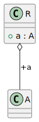

# t00063 - Element types diagram filter test case
## Config
```yaml
compilation_database_dir: ..
output_directory: diagrams
diagrams:
  t00063_class:
    type: class
    glob:
      - ../../tests/t00063/t00063.cc
    include:
      namespaces:
        - clanguml::t00063
    exclude:
      element_types:
        - enum
    using_namespace:
      - clanguml::t00063
```
## Source code
File t00063.cc
```cpp
namespace clanguml {
namespace t00063 {
class A { };

enum B { b1, b2, b3 };

enum class C { c1, c2, c3 };
}
}
```
## Generated PlantUML diagrams

## Generated Mermaid diagrams

## Generated JSON models
```json
{
  "diagram_type": "class",
  "elements": [
    {
      "bases": [],
      "display_name": "clanguml::t00063::A",
      "id": "1518171774798799557",
      "is_abstract": false,
      "is_nested": false,
      "is_struct": false,
      "is_template": false,
      "is_union": false,
      "members": [],
      "methods": [],
      "name": "A",
      "namespace": "clanguml::t00063",
      "source_location": {
        "column": 7,
        "file": "../../tests/t00063/t00063.cc",
        "line": 3,
        "translation_unit": "../../tests/t00063/t00063.cc"
      },
      "template_parameters": [],
      "type": "class"
    }
  ],
  "metadata": {
    "clang_uml_version": "0.4.0-2-g4ab0d29",
    "llvm_version": "Ubuntu clang version 16.0.6 (++20230710042027+7cbf1a259152-1~exp1~20230710162048.105)",
    "schema_version": 1
  },
  "name": "t00063_class",
  "relationships": [],
  "using_namespace": "clanguml::t00063"
}
```
