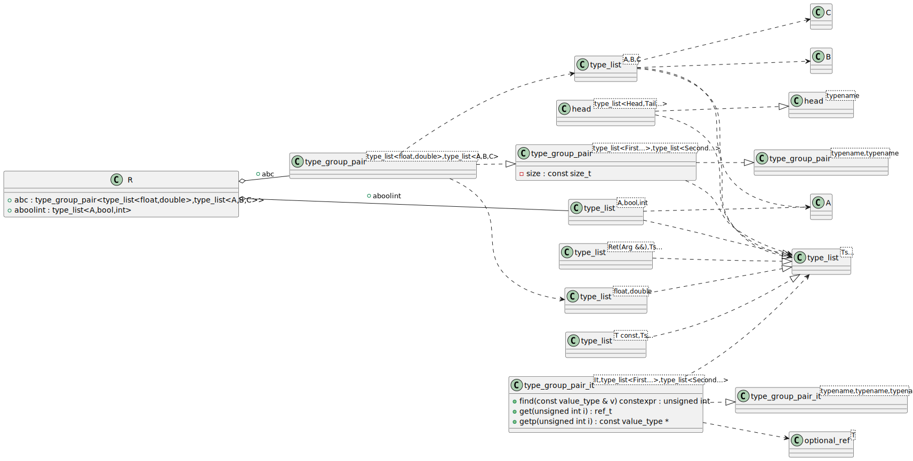

# t00064 - Template type list test case
## Config
```yaml
diagrams:
  t00064_class:
    type: class
    glob:
      - t00064.cc
    include:
      namespaces:
        - clanguml::t00064
    using_namespace: clanguml::t00064
    plantuml:
      before:
        - left to right direction
```
## Source code
File `tests/t00064/t00064.cc`
```cpp
#include <cstddef>
#include <tuple>

namespace clanguml {
namespace t00064 {

// Loosely based on
template <typename... Ts> struct type_list { };

template <typename Ret, typename Arg, typename... Ts>
struct type_list<Ret (*)(Arg &&), Ts...> { };

template <typename T, typename... Ts> struct type_list<const T, Ts...> { };

template <typename> struct head;
template <typename Head, typename... Tail>
struct head<type_list<Head, Tail...>> {
    using type = Head;
};

template <typename... Type> using first_t = type_list<Type...>;

template <typename... Type> using second_t = type_list<Type...>;

template <typename, typename> class type_group_pair;
template <typename... First, typename... Second>
class type_group_pair<first_t<First...>, second_t<Second...>> {
    static constexpr size_t size = sizeof...(First) + sizeof...(Second);
};

template <typename T> struct optional_ref { };

template <typename, typename, typename> class type_group_pair_it;
template <typename It, typename... First, typename... Second>
class type_group_pair_it<It, first_t<First...>, second_t<Second...>> {
public:
    using value_type =
        decltype(std::tuple_cat(std::make_tuple(*std::declval<It>()),
            std::declval<First>().get_as_tuple({})...,
            std::declval<Second>().get_as_tuple({})...));

    using ref_t = optional_ref<value_type>;

    ref_t get(unsigned i) { return {}; }

    const value_type *getp(unsigned i) { return nullptr; }

    constexpr unsigned find(value_type const &v) { return 0; }
};

struct A { };
struct B { };
struct C { };

class R {
public:
    type_list<A, bool, int> aboolint;
    type_group_pair<type_list<float, double>, type_list<A, B, C>> abc;
};
}
}
```
## Generated PlantUML diagrams

## Generated Mermaid diagrams

## Generated JSON models
```json
{
  "diagram_type": "class",
  "elements": [
    {
      "bases": [],
      "display_name": "type_list<Ts...>",
      "id": "2055044356505752139",
      "is_abstract": false,
      "is_nested": false,
      "is_struct": true,
      "is_template": true,
      "is_union": false,
      "members": [],
      "methods": [],
      "name": "type_list",
      "namespace": "clanguml::t00064",
      "source_location": {
        "column": 34,
        "file": "t00064.cc",
        "line": 8,
        "translation_unit": "t00064.cc"
      },
      "template_parameters": [
        {
          "is_variadic": true,
          "kind": "template_type",
          "name": "Ts...",
          "template_parameters": []
        }
      ],
      "type": "class"
    },
    {
      "bases": [],
      "display_name": "type_list<Ret(Arg &&),Ts...>",
      "id": "1536403088019105838",
      "is_abstract": false,
      "is_nested": false,
      "is_struct": true,
      "is_template": true,
      "is_union": false,
      "members": [],
      "methods": [],
      "name": "type_list",
      "namespace": "clanguml::t00064",
      "source_location": {
        "column": 8,
        "file": "t00064.cc",
        "line": 11,
        "translation_unit": "t00064.cc"
      },
      "template_parameters": [
        {
          "is_variadic": false,
          "kind": "template_type",
          "template_parameters": [
            {
              "is_variadic": false,
              "kind": "template_type",
              "name": "Ret",
              "template_parameters": []
            },
            {
              "is_variadic": false,
              "kind": "template_type",
              "name": "Arg",
              "template_parameters": []
            }
          ]
        },
        {
          "is_variadic": true,
          "kind": "template_type",
          "name": "Ts...",
          "template_parameters": []
        }
      ],
      "type": "class"
    },
    {
      "bases": [],
      "display_name": "type_list<T const,Ts...>",
      "id": "1613293628874851145",
      "is_abstract": false,
      "is_nested": false,
      "is_struct": true,
      "is_template": true,
      "is_union": false,
      "members": [],
      "methods": [],
      "name": "type_list",
      "namespace": "clanguml::t00064",
      "source_location": {
        "column": 46,
        "file": "t00064.cc",
        "line": 13,
        "translation_unit": "t00064.cc"
      },
      "template_parameters": [
        {
          "is_variadic": false,
          "kind": "template_type",
          "name": "T",
          "template_parameters": []
        },
        {
          "is_variadic": true,
          "kind": "template_type",
          "name": "Ts...",
          "template_parameters": []
        }
      ],
      "type": "class"
    },
    {
      "bases": [],
      "display_name": "type_list<Head,Tail...>",
      "id": "96201031647373215",
      "is_abstract": false,
      "is_nested": false,
      "is_struct": true,
      "is_template": true,
      "is_union": false,
      "members": [],
      "methods": [],
      "name": "type_list",
      "namespace": "clanguml::t00064",
      "source_location": {
        "column": 8,
        "file": "t00064.cc",
        "line": 17,
        "translation_unit": "t00064.cc"
      },
      "template_parameters": [
        {
          "is_variadic": false,
          "kind": "template_type",
          "name": "Head",
          "template_parameters": []
        },
        {
          "is_variadic": true,
          "kind": "template_type",
          "name": "Tail...",
          "template_parameters": []
        }
      ],
      "type": "class"
    },
    {
      "bases": [],
      "display_name": "head<type_list<Head,Tail...>>",
      "id": "1342666740698875376",
      "is_abstract": false,
      "is_nested": false,
      "is_struct": true,
      "is_template": true,
      "is_union": false,
      "members": [],
      "methods": [],
      "name": "head",
      "namespace": "clanguml::t00064",
      "source_location": {
        "column": 8,
        "file": "t00064.cc",
        "line": 17,
        "translation_unit": "t00064.cc"
      },
      "template_parameters": [
        {
          "is_variadic": false,
          "kind": "argument",
          "template_parameters": [
            {
              "is_variadic": false,
              "kind": "template_type",
              "name": "Head",
              "template_parameters": []
            },
            {
              "is_variadic": true,
              "kind": "template_type",
              "name": "Tail...",
              "template_parameters": []
            }
          ],
          "type": "type_list"
        }
      ],
      "type": "class"
    },
    {
      "bases": [],
      "display_name": "type_list<Type...>",
      "id": "74655005329778311",
      "is_abstract": false,
      "is_nested": false,
      "is_struct": false,
      "is_template": true,
      "is_union": false,
      "members": [],
      "methods": [],
      "name": "type_list",
      "namespace": "clanguml::t00064",
      "source_location": {
        "column": 29,
        "file": "t00064.cc",
        "line": 21,
        "translation_unit": "t00064.cc"
      },
      "template_parameters": [
        {
          "is_variadic": true,
          "kind": "template_type",
          "name": "Type...",
          "template_parameters": []
        }
      ],
      "type": "class"
    },
    {
      "bases": [],
      "display_name": "type_list<First...>",
      "id": "1877705309010128195",
      "is_abstract": false,
      "is_nested": false,
      "is_struct": true,
      "is_template": true,
      "is_union": false,
      "members": [],
      "methods": [],
      "name": "type_list",
      "namespace": "clanguml::t00064",
      "source_location": {
        "column": 7,
        "file": "t00064.cc",
        "line": 27,
        "translation_unit": "t00064.cc"
      },
      "template_parameters": [
        {
          "is_variadic": true,
          "kind": "template_type",
          "name": "First...",
          "template_parameters": []
        }
      ],
      "type": "class"
    },
    {
      "bases": [],
      "display_name": "type_list<Second...>",
      "id": "1737554639587928188",
      "is_abstract": false,
      "is_nested": false,
      "is_struct": true,
      "is_template": true,
      "is_union": false,
      "members": [],
      "methods": [],
      "name": "type_list",
      "namespace": "clanguml::t00064",
      "source_location": {
        "column": 7,
        "file": "t00064.cc",
        "line": 27,
        "translation_unit": "t00064.cc"
      },
      "template_parameters": [
        {
          "is_variadic": true,
          "kind": "template_type",
          "name": "Second...",
          "template_parameters": []
        }
      ],
      "type": "class"
    },
    {
      "bases": [],
      "display_name": "type_group_pair<type_list<First...>,type_list<Second...>>",
      "id": "1313421318785708660",
      "is_abstract": false,
      "is_nested": false,
      "is_struct": false,
      "is_template": true,
      "is_union": false,
      "members": [
        {
          "access": "private",
          "is_static": true,
          "name": "size",
          "source_location": {
            "column": 29,
            "file": "t00064.cc",
            "line": 28,
            "translation_unit": "t00064.cc"
          },
          "type": "const size_t"
        }
      ],
      "methods": [],
      "name": "type_group_pair",
      "namespace": "clanguml::t00064",
      "source_location": {
        "column": 7,
        "file": "t00064.cc",
        "line": 27,
        "translation_unit": "t00064.cc"
      },
      "template_parameters": [
        {
          "is_variadic": false,
          "kind": "argument",
          "template_parameters": [
            {
              "is_variadic": true,
              "kind": "template_type",
              "name": "First...",
              "template_parameters": []
            }
          ],
          "type": "type_list"
        },
        {
          "is_variadic": false,
          "kind": "argument",
          "template_parameters": [
            {
              "is_variadic": true,
              "kind": "template_type",
              "name": "Second...",
              "template_parameters": []
            }
          ],
          "type": "type_list"
        }
      ],
      "type": "class"
    },
    {
      "bases": [],
      "display_name": "optional_ref<T>",
      "id": "2110316024454672764",
      "is_abstract": false,
      "is_nested": false,
      "is_struct": true,
      "is_template": true,
      "is_union": false,
      "members": [],
      "methods": [],
      "name": "optional_ref",
      "namespace": "clanguml::t00064",
      "source_location": {
        "column": 30,
        "file": "t00064.cc",
        "line": 31,
        "translation_unit": "t00064.cc"
      },
      "template_parameters": [
        {
          "is_variadic": false,
          "kind": "template_type",
          "name": "T",
          "template_parameters": []
        }
      ],
      "type": "class"
    },
    {
      "bases": [],
      "display_name": "optional_ref<type_group_pair_it<It,type_list<First...>,type_list<Second...>>::value_type>",
      "id": "476531044436856932",
      "is_abstract": false,
      "is_nested": false,
      "is_struct": false,
      "is_template": true,
      "is_union": false,
      "members": [],
      "methods": [],
      "name": "optional_ref",
      "namespace": "clanguml::t00064",
      "source_location": {
        "column": 30,
        "file": "t00064.cc",
        "line": 31,
        "translation_unit": "t00064.cc"
      },
      "template_parameters": [
        {
          "is_variadic": false,
          "kind": "argument",
          "template_parameters": [],
          "type": "type_group_pair_it<It,type_list<First...>,type_list<Second...>>::value_type"
        }
      ],
      "type": "class"
    },
    {
      "bases": [],
      "display_name": "type_group_pair_it<It,type_list<First...>,type_list<Second...>>",
      "id": "1024383802991748694",
      "is_abstract": false,
      "is_nested": false,
      "is_struct": false,
      "is_template": true,
      "is_union": false,
      "members": [],
      "methods": [
        {
          "access": "public",
          "display_name": "get",
          "is_const": false,
          "is_consteval": false,
          "is_constexpr": false,
          "is_constructor": false,
          "is_copy_assignment": false,
          "is_coroutine": false,
          "is_defaulted": false,
          "is_deleted": false,
          "is_move_assignment": false,
          "is_noexcept": false,
          "is_operator": false,
          "is_pure_virtual": false,
          "is_static": false,
          "is_virtual": false,
          "name": "get",
          "parameters": [
            {
              "name": "i",
              "type": "unsigned int"
            }
          ],
          "source_location": {
            "column": 11,
            "file": "t00064.cc",
            "line": 44,
            "translation_unit": "t00064.cc"
          },
          "template_parameters": [],
          "type": "ref_t"
        },
        {
          "access": "public",
          "display_name": "getp",
          "is_const": false,
          "is_consteval": false,
          "is_constexpr": false,
          "is_constructor": false,
          "is_copy_assignment": false,
          "is_coroutine": false,
          "is_defaulted": false,
          "is_deleted": false,
          "is_move_assignment": false,
          "is_noexcept": false,
          "is_operator": false,
          "is_pure_virtual": false,
          "is_static": false,
          "is_virtual": false,
          "name": "getp",
          "parameters": [
            {
              "name": "i",
              "type": "unsigned int"
            }
          ],
          "source_location": {
            "column": 23,
            "file": "t00064.cc",
            "line": 46,
            "translation_unit": "t00064.cc"
          },
          "template_parameters": [],
          "type": "const value_type *"
        },
        {
          "access": "public",
          "display_name": "find",
          "is_const": false,
          "is_consteval": false,
          "is_constexpr": true,
          "is_constructor": false,
          "is_copy_assignment": false,
          "is_coroutine": false,
          "is_defaulted": false,
          "is_deleted": false,
          "is_move_assignment": false,
          "is_noexcept": false,
          "is_operator": false,
          "is_pure_virtual": false,
          "is_static": false,
          "is_virtual": false,
          "name": "find",
          "parameters": [
            {
              "name": "v",
              "type": "const value_type &"
            }
          ],
          "source_location": {
            "column": 24,
            "file": "t00064.cc",
            "line": 48,
            "translation_unit": "t00064.cc"
          },
          "template_parameters": [],
          "type": "unsigned int"
        }
      ],
      "name": "type_group_pair_it",
      "namespace": "clanguml::t00064",
      "source_location": {
        "column": 7,
        "file": "t00064.cc",
        "line": 35,
        "translation_unit": "t00064.cc"
      },
      "template_parameters": [
        {
          "is_variadic": false,
          "kind": "template_type",
          "name": "It",
          "template_parameters": []
        },
        {
          "is_variadic": false,
          "kind": "argument",
          "template_parameters": [
            {
              "is_variadic": true,
              "kind": "template_type",
              "name": "First...",
              "template_parameters": []
            }
          ],
          "type": "type_list"
        },
        {
          "is_variadic": false,
          "kind": "argument",
          "template_parameters": [
            {
              "is_variadic": true,
              "kind": "template_type",
              "name": "Second...",
              "template_parameters": []
            }
          ],
          "type": "type_list"
        }
      ],
      "type": "class"
    },
    {
      "bases": [],
      "display_name": "A",
      "id": "586286676481245707",
      "is_abstract": false,
      "is_nested": false,
      "is_struct": true,
      "is_template": false,
      "is_union": false,
      "members": [],
      "methods": [],
      "name": "A",
      "namespace": "clanguml::t00064",
      "source_location": {
        "column": 8,
        "file": "t00064.cc",
        "line": 51,
        "translation_unit": "t00064.cc"
      },
      "template_parameters": [],
      "type": "class"
    },
    {
      "bases": [],
      "display_name": "B",
      "id": "1353306307770366167",
      "is_abstract": false,
      "is_nested": false,
      "is_struct": true,
      "is_template": false,
      "is_union": false,
      "members": [],
      "methods": [],
      "name": "B",
      "namespace": "clanguml::t00064",
      "source_location": {
        "column": 8,
        "file": "t00064.cc",
        "line": 52,
        "translation_unit": "t00064.cc"
      },
      "template_parameters": [],
      "type": "class"
    },
    {
      "bases": [],
      "display_name": "C",
      "id": "598044391549147725",
      "is_abstract": false,
      "is_nested": false,
      "is_struct": true,
      "is_template": false,
      "is_union": false,
      "members": [],
      "methods": [],
      "name": "C",
      "namespace": "clanguml::t00064",
      "source_location": {
        "column": 8,
        "file": "t00064.cc",
        "line": 53,
        "translation_unit": "t00064.cc"
      },
      "template_parameters": [],
      "type": "class"
    },
    {
      "bases": [],
      "display_name": "type_list<A,bool,int>",
      "id": "425551452299939770",
      "is_abstract": false,
      "is_nested": false,
      "is_struct": false,
      "is_template": true,
      "is_union": false,
      "members": [],
      "methods": [],
      "name": "type_list",
      "namespace": "clanguml::t00064",
      "source_location": {
        "column": 34,
        "file": "t00064.cc",
        "line": 8,
        "translation_unit": "t00064.cc"
      },
      "template_parameters": [
        {
          "is_variadic": false,
          "kind": "argument",
          "template_parameters": [],
          "type": "A"
        },
        {
          "is_variadic": false,
          "kind": "argument",
          "template_parameters": [],
          "type": "bool"
        },
        {
          "is_variadic": false,
          "kind": "argument",
          "template_parameters": [],
          "type": "int"
        }
      ],
      "type": "class"
    },
    {
      "bases": [],
      "display_name": "type_list<float,double>",
      "id": "179850898515269194",
      "is_abstract": false,
      "is_nested": false,
      "is_struct": true,
      "is_template": true,
      "is_union": false,
      "members": [],
      "methods": [],
      "name": "type_list",
      "namespace": "clanguml::t00064",
      "source_location": {
        "column": 37,
        "file": "t00064.cc",
        "line": 25,
        "translation_unit": "t00064.cc"
      },
      "template_parameters": [
        {
          "is_variadic": false,
          "kind": "argument",
          "template_parameters": [],
          "type": "float"
        },
        {
          "is_variadic": false,
          "kind": "argument",
          "template_parameters": [],
          "type": "double"
        }
      ],
      "type": "class"
    },
    {
      "bases": [],
      "display_name": "type_list<A,B,C>",
      "id": "1070380438303872295",
      "is_abstract": false,
      "is_nested": false,
      "is_struct": true,
      "is_template": true,
      "is_union": false,
      "members": [],
      "methods": [],
      "name": "type_list",
      "namespace": "clanguml::t00064",
      "source_location": {
        "column": 37,
        "file": "t00064.cc",
        "line": 25,
        "translation_unit": "t00064.cc"
      },
      "template_parameters": [
        {
          "is_variadic": false,
          "kind": "argument",
          "template_parameters": [],
          "type": "A"
        },
        {
          "is_variadic": false,
          "kind": "argument",
          "template_parameters": [],
          "type": "B"
        },
        {
          "is_variadic": false,
          "kind": "argument",
          "template_parameters": [],
          "type": "C"
        }
      ],
      "type": "class"
    },
    {
      "bases": [],
      "display_name": "type_group_pair<type_list<float,double>,type_list<A,B,C>>",
      "id": "1854055939974723413",
      "is_abstract": false,
      "is_nested": false,
      "is_struct": false,
      "is_template": true,
      "is_union": false,
      "members": [],
      "methods": [],
      "name": "type_group_pair",
      "namespace": "clanguml::t00064",
      "source_location": {
        "column": 37,
        "file": "t00064.cc",
        "line": 25,
        "translation_unit": "t00064.cc"
      },
      "template_parameters": [
        {
          "is_variadic": false,
          "kind": "argument",
          "template_parameters": [
            {
              "is_variadic": false,
              "kind": "argument",
              "template_parameters": [],
              "type": "float"
            },
            {
              "is_variadic": false,
              "kind": "argument",
              "template_parameters": [],
              "type": "double"
            }
          ],
          "type": "type_list"
        },
        {
          "is_variadic": false,
          "kind": "argument",
          "template_parameters": [
            {
              "is_variadic": false,
              "kind": "argument",
              "template_parameters": [],
              "type": "clanguml::t00064::A"
            },
            {
              "is_variadic": false,
              "kind": "argument",
              "template_parameters": [],
              "type": "clanguml::t00064::B"
            },
            {
              "is_variadic": false,
              "kind": "argument",
              "template_parameters": [],
              "type": "clanguml::t00064::C"
            }
          ],
          "type": "type_list"
        }
      ],
      "type": "class"
    },
    {
      "bases": [],
      "display_name": "R",
      "id": "2161425587790795236",
      "is_abstract": false,
      "is_nested": false,
      "is_struct": false,
      "is_template": false,
      "is_union": false,
      "members": [
        {
          "access": "public",
          "is_static": false,
          "name": "aboolint",
          "source_location": {
            "column": 29,
            "file": "t00064.cc",
            "line": 57,
            "translation_unit": "t00064.cc"
          },
          "type": "type_list<A,bool,int>"
        },
        {
          "access": "public",
          "is_static": false,
          "name": "abc",
          "source_location": {
            "column": 67,
            "file": "t00064.cc",
            "line": 58,
            "translation_unit": "t00064.cc"
          },
          "type": "type_group_pair<type_list<float,double>,type_list<A,B,C>>"
        }
      ],
      "methods": [],
      "name": "R",
      "namespace": "clanguml::t00064",
      "source_location": {
        "column": 7,
        "file": "t00064.cc",
        "line": 55,
        "translation_unit": "t00064.cc"
      },
      "template_parameters": [],
      "type": "class"
    },
    {
      "bases": [],
      "display_name": "type_group_pair<typename,typename>",
      "id": "271990753639572557",
      "is_abstract": false,
      "is_nested": false,
      "is_struct": false,
      "is_template": true,
      "is_union": false,
      "members": [],
      "methods": [],
      "name": "type_group_pair",
      "namespace": "clanguml::t00064",
      "source_location": {
        "column": 37,
        "file": "t00064.cc",
        "line": 25,
        "translation_unit": "t00064.cc"
      },
      "template_parameters": [
        {
          "is_variadic": false,
          "kind": "template_type",
          "name": "typename",
          "template_parameters": []
        },
        {
          "is_variadic": false,
          "kind": "template_type",
          "name": "typename",
          "template_parameters": []
        }
      ],
      "type": "class"
    },
    {
      "bases": [],
      "display_name": "type_group_pair_it<typename,typename,typename>",
      "id": "1057906395469156958",
      "is_abstract": false,
      "is_nested": false,
      "is_struct": false,
      "is_template": true,
      "is_union": false,
      "members": [],
      "methods": [],
      "name": "type_group_pair_it",
      "namespace": "clanguml::t00064",
      "source_location": {
        "column": 47,
        "file": "t00064.cc",
        "line": 33,
        "translation_unit": "t00064.cc"
      },
      "template_parameters": [
        {
          "is_variadic": false,
          "kind": "template_type",
          "name": "typename",
          "template_parameters": []
        },
        {
          "is_variadic": false,
          "kind": "template_type",
          "name": "typename",
          "template_parameters": []
        },
        {
          "is_variadic": false,
          "kind": "template_type",
          "name": "typename",
          "template_parameters": []
        }
      ],
      "type": "class"
    },
    {
      "bases": [],
      "display_name": "head<typename>",
      "id": "1317314479884183399",
      "is_abstract": false,
      "is_nested": false,
      "is_struct": true,
      "is_template": true,
      "is_union": false,
      "members": [],
      "methods": [],
      "name": "head",
      "namespace": "clanguml::t00064",
      "source_location": {
        "column": 28,
        "file": "t00064.cc",
        "line": 15,
        "translation_unit": "t00064.cc"
      },
      "template_parameters": [
        {
          "is_variadic": false,
          "kind": "template_type",
          "name": "typename",
          "template_parameters": []
        }
      ],
      "type": "class"
    }
  ],
  "name": "t00064_class",
  "package_type": "namespace",
  "relationships": [
    {
      "access": "public",
      "destination": "2055044356505752139",
      "source": "1536403088019105838",
      "type": "instantiation"
    },
    {
      "access": "public",
      "destination": "2055044356505752139",
      "source": "1613293628874851145",
      "type": "instantiation"
    },
    {
      "access": "public",
      "destination": "2055044356505752139",
      "source": "96201031647373215",
      "type": "instantiation"
    },
    {
      "access": "public",
      "destination": "96201031647373215",
      "source": "1342666740698875376",
      "type": "dependency"
    },
    {
      "access": "public",
      "destination": "1317314479884183399",
      "source": "1342666740698875376",
      "type": "instantiation"
    },
    {
      "access": "public",
      "destination": "2055044356505752139",
      "source": "74655005329778311",
      "type": "instantiation"
    },
    {
      "access": "public",
      "destination": "2055044356505752139",
      "source": "1877705309010128195",
      "type": "instantiation"
    },
    {
      "access": "public",
      "destination": "2055044356505752139",
      "source": "1737554639587928188",
      "type": "instantiation"
    },
    {
      "access": "public",
      "destination": "1877705309010128195",
      "source": "1313421318785708660",
      "type": "dependency"
    },
    {
      "access": "public",
      "destination": "1737554639587928188",
      "source": "1313421318785708660",
      "type": "dependency"
    },
    {
      "access": "public",
      "destination": "271990753639572557",
      "source": "1313421318785708660",
      "type": "instantiation"
    },
    {
      "access": "public",
      "destination": "2110316024454672764",
      "source": "476531044436856932",
      "type": "instantiation"
    },
    {
      "access": "public",
      "destination": "1877705309010128195",
      "source": "1024383802991748694",
      "type": "dependency"
    },
    {
      "access": "public",
      "destination": "1737554639587928188",
      "source": "1024383802991748694",
      "type": "dependency"
    },
    {
      "access": "public",
      "destination": "476531044436856932",
      "source": "1024383802991748694",
      "type": "dependency"
    },
    {
      "access": "public",
      "destination": "2110316024454672764",
      "source": "1024383802991748694",
      "type": "dependency"
    },
    {
      "access": "public",
      "destination": "1057906395469156958",
      "source": "1024383802991748694",
      "type": "instantiation"
    },
    {
      "access": "public",
      "destination": "586286676481245707",
      "source": "425551452299939770",
      "type": "dependency"
    },
    {
      "access": "public",
      "destination": "2055044356505752139",
      "source": "425551452299939770",
      "type": "instantiation"
    },
    {
      "access": "public",
      "destination": "2055044356505752139",
      "source": "179850898515269194",
      "type": "instantiation"
    },
    {
      "access": "public",
      "destination": "586286676481245707",
      "source": "1070380438303872295",
      "type": "dependency"
    },
    {
      "access": "public",
      "destination": "1353306307770366167",
      "source": "1070380438303872295",
      "type": "dependency"
    },
    {
      "access": "public",
      "destination": "598044391549147725",
      "source": "1070380438303872295",
      "type": "dependency"
    },
    {
      "access": "public",
      "destination": "2055044356505752139",
      "source": "1070380438303872295",
      "type": "instantiation"
    },
    {
      "access": "public",
      "destination": "179850898515269194",
      "source": "1854055939974723413",
      "type": "dependency"
    },
    {
      "access": "public",
      "destination": "1070380438303872295",
      "source": "1854055939974723413",
      "type": "dependency"
    },
    {
      "access": "public",
      "destination": "1313421318785708660",
      "source": "1854055939974723413",
      "type": "instantiation"
    },
    {
      "access": "public",
      "destination": "425551452299939770",
      "label": "aboolint",
      "source": "2161425587790795236",
      "type": "aggregation"
    },
    {
      "access": "public",
      "destination": "1854055939974723413",
      "label": "abc",
      "source": "2161425587790795236",
      "type": "aggregation"
    }
  ],
  "using_namespace": "clanguml::t00064"
}
```
