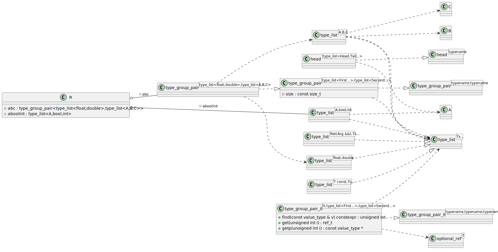

# t00064 - Template type list test case
## Config
```yaml
diagrams:
  t00064_class:
    type: class
    glob:
      - t00064.cc
    include:
      namespaces:
        - clanguml::t00064
    using_namespace: clanguml::t00064
    plantuml:
      before:
        - left to right direction
```
## Source code
File `tests/t00064/t00064.cc`
```cpp
#include <cstddef>
#include <tuple>

namespace clanguml {
namespace t00064 {

// Loosely based on
template <typename... Ts> struct type_list { };

template <typename Ret, typename Arg, typename... Ts>
struct type_list<Ret (*)(Arg &&), Ts...> { };

template <typename T, typename... Ts> struct type_list<const T, Ts...> { };

template <typename> struct head;
template <typename Head, typename... Tail>
struct head<type_list<Head, Tail...>> {
    using type = Head;
};

template <typename... Type> using first_t = type_list<Type...>;

template <typename... Type> using second_t = type_list<Type...>;

template <typename, typename> class type_group_pair;
template <typename... First, typename... Second>
class type_group_pair<first_t<First...>, second_t<Second...>> {
    static constexpr size_t size = sizeof...(First) + sizeof...(Second);
};

template <typename T> struct optional_ref { };

template <typename, typename, typename> class type_group_pair_it;
template <typename It, typename... First, typename... Second>
class type_group_pair_it<It, first_t<First...>, second_t<Second...>> {
public:
    using value_type =
        decltype(std::tuple_cat(std::make_tuple(*std::declval<It>()),
            std::declval<First>().get_as_tuple({})...,
            std::declval<Second>().get_as_tuple({})...));

    using ref_t = optional_ref<value_type>;

    ref_t get(unsigned i) { return {}; }

    const value_type *getp(unsigned i) { return nullptr; }

    constexpr unsigned find(value_type const &v) { return 0; }
};

struct A { };
struct B { };
struct C { };

class R {
public:
    type_list<A, bool, int> aboolint;
    type_group_pair<type_list<float, double>, type_list<A, B, C>> abc;
};
}
}
```
## Generated PlantUML diagrams

## Generated Mermaid diagrams

## Generated JSON models
```json
{
  "diagram_type": "class",
  "elements": [
    {
      "bases": [],
      "display_name": "type_list<Ts...>",
      "id": "8000981386582760744",
      "is_abstract": false,
      "is_nested": false,
      "is_struct": true,
      "is_template": true,
      "is_union": false,
      "members": [],
      "methods": [],
      "name": "type_list",
      "namespace": "clanguml::t00064",
      "source_location": {
        "column": 34,
        "file": "t00064.cc",
        "line": 8,
        "translation_unit": "t00064.cc"
      },
      "template_parameters": [
        {
          "is_variadic": true,
          "kind": "template_type",
          "name": "Ts...",
          "template_parameters": []
        }
      ],
      "type": "class"
    },
    {
      "bases": [],
      "display_name": "type_list<Ret(Arg &&),Ts...>",
      "id": "15801315655665282535",
      "is_abstract": false,
      "is_nested": false,
      "is_struct": true,
      "is_template": true,
      "is_union": false,
      "members": [],
      "methods": [],
      "name": "type_list",
      "namespace": "clanguml::t00064",
      "source_location": {
        "column": 8,
        "file": "t00064.cc",
        "line": 11,
        "translation_unit": "t00064.cc"
      },
      "template_parameters": [
        {
          "is_variadic": false,
          "kind": "template_type",
          "template_parameters": [
            {
              "is_variadic": false,
              "kind": "template_type",
              "name": "Ret",
              "template_parameters": []
            },
            {
              "is_variadic": false,
              "kind": "template_type",
              "name": "Arg",
              "template_parameters": []
            }
          ]
        },
        {
          "is_variadic": true,
          "kind": "template_type",
          "name": "Ts...",
          "template_parameters": []
        }
      ],
      "type": "class"
    },
    {
      "bases": [],
      "display_name": "type_list<T const,Ts...>",
      "id": "16816979880368021941",
      "is_abstract": false,
      "is_nested": false,
      "is_struct": true,
      "is_template": true,
      "is_union": false,
      "members": [],
      "methods": [],
      "name": "type_list",
      "namespace": "clanguml::t00064",
      "source_location": {
        "column": 46,
        "file": "t00064.cc",
        "line": 13,
        "translation_unit": "t00064.cc"
      },
      "template_parameters": [
        {
          "is_variadic": false,
          "kind": "template_type",
          "name": "T",
          "template_parameters": []
        },
        {
          "is_variadic": true,
          "kind": "template_type",
          "name": "Ts...",
          "template_parameters": []
        }
      ],
      "type": "class"
    },
    {
      "bases": [],
      "display_name": "head<type_list<Head,Tail...>>",
      "id": "13973522376589280661",
      "is_abstract": false,
      "is_nested": false,
      "is_struct": true,
      "is_template": true,
      "is_union": false,
      "members": [],
      "methods": [],
      "name": "head",
      "namespace": "clanguml::t00064",
      "source_location": {
        "column": 8,
        "file": "t00064.cc",
        "line": 17,
        "translation_unit": "t00064.cc"
      },
      "template_parameters": [
        {
          "is_variadic": false,
          "kind": "argument",
          "template_parameters": [
            {
              "is_variadic": false,
              "kind": "template_type",
              "name": "Head",
              "template_parameters": []
            },
            {
              "is_variadic": true,
              "kind": "template_type",
              "name": "Tail...",
              "template_parameters": []
            }
          ],
          "type": "type_list"
        }
      ],
      "type": "class"
    },
    {
      "bases": [],
      "display_name": "type_group_pair<type_list<First...>,type_list<Second...>>",
      "id": "2797770904917842425",
      "is_abstract": false,
      "is_nested": false,
      "is_struct": false,
      "is_template": true,
      "is_union": false,
      "members": [
        {
          "access": "private",
          "is_static": true,
          "name": "size",
          "source_location": {
            "column": 29,
            "file": "t00064.cc",
            "line": 28,
            "translation_unit": "t00064.cc"
          },
          "type": "const size_t"
        }
      ],
      "methods": [],
      "name": "type_group_pair",
      "namespace": "clanguml::t00064",
      "source_location": {
        "column": 7,
        "file": "t00064.cc",
        "line": 27,
        "translation_unit": "t00064.cc"
      },
      "template_parameters": [
        {
          "is_variadic": false,
          "kind": "argument",
          "template_parameters": [
            {
              "is_variadic": true,
              "kind": "template_type",
              "name": "First...",
              "template_parameters": []
            }
          ],
          "type": "type_list"
        },
        {
          "is_variadic": false,
          "kind": "argument",
          "template_parameters": [
            {
              "is_variadic": true,
              "kind": "template_type",
              "name": "Second...",
              "template_parameters": []
            }
          ],
          "type": "type_list"
        }
      ],
      "type": "class"
    },
    {
      "bases": [],
      "display_name": "optional_ref<T>",
      "id": "12246923096141838504",
      "is_abstract": false,
      "is_nested": false,
      "is_struct": true,
      "is_template": true,
      "is_union": false,
      "members": [],
      "methods": [],
      "name": "optional_ref",
      "namespace": "clanguml::t00064",
      "source_location": {
        "column": 30,
        "file": "t00064.cc",
        "line": 31,
        "translation_unit": "t00064.cc"
      },
      "template_parameters": [
        {
          "is_variadic": false,
          "kind": "template_type",
          "name": "T",
          "template_parameters": []
        }
      ],
      "type": "class"
    },
    {
      "bases": [],
      "display_name": "type_group_pair_it<It,type_list<First...>,type_list<Second...>>",
      "id": "734168785743256370",
      "is_abstract": false,
      "is_nested": false,
      "is_struct": false,
      "is_template": true,
      "is_union": false,
      "members": [],
      "methods": [
        {
          "access": "public",
          "display_name": "get",
          "is_const": false,
          "is_consteval": false,
          "is_constexpr": false,
          "is_constructor": false,
          "is_copy_assignment": false,
          "is_coroutine": false,
          "is_defaulted": false,
          "is_deleted": false,
          "is_move_assignment": false,
          "is_noexcept": false,
          "is_operator": false,
          "is_pure_virtual": false,
          "is_static": false,
          "is_virtual": false,
          "name": "get",
          "parameters": [
            {
              "name": "i",
              "type": "unsigned int"
            }
          ],
          "source_location": {
            "column": 11,
            "file": "t00064.cc",
            "line": 44,
            "translation_unit": "t00064.cc"
          },
          "template_parameters": [],
          "type": "ref_t"
        },
        {
          "access": "public",
          "display_name": "getp",
          "is_const": false,
          "is_consteval": false,
          "is_constexpr": false,
          "is_constructor": false,
          "is_copy_assignment": false,
          "is_coroutine": false,
          "is_defaulted": false,
          "is_deleted": false,
          "is_move_assignment": false,
          "is_noexcept": false,
          "is_operator": false,
          "is_pure_virtual": false,
          "is_static": false,
          "is_virtual": false,
          "name": "getp",
          "parameters": [
            {
              "name": "i",
              "type": "unsigned int"
            }
          ],
          "source_location": {
            "column": 23,
            "file": "t00064.cc",
            "line": 46,
            "translation_unit": "t00064.cc"
          },
          "template_parameters": [],
          "type": "const value_type *"
        },
        {
          "access": "public",
          "display_name": "find",
          "is_const": false,
          "is_consteval": false,
          "is_constexpr": true,
          "is_constructor": false,
          "is_copy_assignment": false,
          "is_coroutine": false,
          "is_defaulted": false,
          "is_deleted": false,
          "is_move_assignment": false,
          "is_noexcept": false,
          "is_operator": false,
          "is_pure_virtual": false,
          "is_static": false,
          "is_virtual": false,
          "name": "find",
          "parameters": [
            {
              "name": "v",
              "type": "const value_type &"
            }
          ],
          "source_location": {
            "column": 24,
            "file": "t00064.cc",
            "line": 48,
            "translation_unit": "t00064.cc"
          },
          "template_parameters": [],
          "type": "unsigned int"
        }
      ],
      "name": "type_group_pair_it",
      "namespace": "clanguml::t00064",
      "source_location": {
        "column": 7,
        "file": "t00064.cc",
        "line": 35,
        "translation_unit": "t00064.cc"
      },
      "template_parameters": [
        {
          "is_variadic": false,
          "kind": "template_type",
          "name": "It",
          "template_parameters": []
        },
        {
          "is_variadic": false,
          "kind": "argument",
          "template_parameters": [
            {
              "is_variadic": true,
              "kind": "template_type",
              "name": "First...",
              "template_parameters": []
            }
          ],
          "type": "type_list"
        },
        {
          "is_variadic": false,
          "kind": "argument",
          "template_parameters": [
            {
              "is_variadic": true,
              "kind": "template_type",
              "name": "Second...",
              "template_parameters": []
            }
          ],
          "type": "type_list"
        }
      ],
      "type": "class"
    },
    {
      "bases": [],
      "display_name": "A",
      "id": "10081129431842279328",
      "is_abstract": false,
      "is_nested": false,
      "is_struct": true,
      "is_template": false,
      "is_union": false,
      "members": [],
      "methods": [],
      "name": "A",
      "namespace": "clanguml::t00064",
      "source_location": {
        "column": 8,
        "file": "t00064.cc",
        "line": 51,
        "translation_unit": "t00064.cc"
      },
      "template_parameters": [],
      "type": "class"
    },
    {
      "bases": [],
      "display_name": "B",
      "id": "17776175840846748234",
      "is_abstract": false,
      "is_nested": false,
      "is_struct": true,
      "is_template": false,
      "is_union": false,
      "members": [],
      "methods": [],
      "name": "B",
      "namespace": "clanguml::t00064",
      "source_location": {
        "column": 8,
        "file": "t00064.cc",
        "line": 52,
        "translation_unit": "t00064.cc"
      },
      "template_parameters": [],
      "type": "class"
    },
    {
      "bases": [],
      "display_name": "C",
      "id": "15200888418428112076",
      "is_abstract": false,
      "is_nested": false,
      "is_struct": true,
      "is_template": false,
      "is_union": false,
      "members": [],
      "methods": [],
      "name": "C",
      "namespace": "clanguml::t00064",
      "source_location": {
        "column": 8,
        "file": "t00064.cc",
        "line": 53,
        "translation_unit": "t00064.cc"
      },
      "template_parameters": [],
      "type": "class"
    },
    {
      "bases": [],
      "display_name": "type_list<A,bool,int>",
      "id": "4452566413859138742",
      "is_abstract": false,
      "is_nested": false,
      "is_struct": false,
      "is_template": true,
      "is_union": false,
      "members": [],
      "methods": [],
      "name": "type_list",
      "namespace": "clanguml::t00064",
      "source_location": {
        "column": 29,
        "file": "t00064.cc",
        "line": 57,
        "translation_unit": "t00064.cc"
      },
      "template_parameters": [
        {
          "is_variadic": false,
          "kind": "argument",
          "template_parameters": [],
          "type": "A"
        },
        {
          "is_variadic": false,
          "kind": "argument",
          "template_parameters": [],
          "type": "bool"
        },
        {
          "is_variadic": false,
          "kind": "argument",
          "template_parameters": [],
          "type": "int"
        }
      ],
      "type": "class"
    },
    {
      "bases": [],
      "display_name": "type_list<float,double>",
      "id": "16997840582613449404",
      "is_abstract": false,
      "is_nested": false,
      "is_struct": true,
      "is_template": true,
      "is_union": false,
      "members": [],
      "methods": [],
      "name": "type_list",
      "namespace": "clanguml::t00064",
      "source_location": {
        "column": 67,
        "file": "t00064.cc",
        "line": 58,
        "translation_unit": "t00064.cc"
      },
      "template_parameters": [
        {
          "is_variadic": false,
          "kind": "argument",
          "template_parameters": [],
          "type": "float"
        },
        {
          "is_variadic": false,
          "kind": "argument",
          "template_parameters": [],
          "type": "double"
        }
      ],
      "type": "class"
    },
    {
      "bases": [],
      "display_name": "type_list<A,B,C>",
      "id": "5878569548072247963",
      "is_abstract": false,
      "is_nested": false,
      "is_struct": true,
      "is_template": true,
      "is_union": false,
      "members": [],
      "methods": [],
      "name": "type_list",
      "namespace": "clanguml::t00064",
      "source_location": {
        "column": 67,
        "file": "t00064.cc",
        "line": 58,
        "translation_unit": "t00064.cc"
      },
      "template_parameters": [
        {
          "is_variadic": false,
          "kind": "argument",
          "template_parameters": [],
          "type": "A"
        },
        {
          "is_variadic": false,
          "kind": "argument",
          "template_parameters": [],
          "type": "B"
        },
        {
          "is_variadic": false,
          "kind": "argument",
          "template_parameters": [],
          "type": "C"
        }
      ],
      "type": "class"
    },
    {
      "bases": [],
      "display_name": "type_group_pair<type_list<float,double>,type_list<A,B,C>>",
      "id": "3505158087052633453",
      "is_abstract": false,
      "is_nested": false,
      "is_struct": false,
      "is_template": true,
      "is_union": false,
      "members": [],
      "methods": [],
      "name": "type_group_pair",
      "namespace": "clanguml::t00064",
      "source_location": {
        "column": 67,
        "file": "t00064.cc",
        "line": 58,
        "translation_unit": "t00064.cc"
      },
      "template_parameters": [
        {
          "is_variadic": false,
          "kind": "argument",
          "template_parameters": [
            {
              "is_variadic": false,
              "kind": "argument",
              "template_parameters": [],
              "type": "float"
            },
            {
              "is_variadic": false,
              "kind": "argument",
              "template_parameters": [],
              "type": "double"
            }
          ],
          "type": "type_list"
        },
        {
          "is_variadic": false,
          "kind": "argument",
          "template_parameters": [
            {
              "is_variadic": false,
              "kind": "argument",
              "template_parameters": [],
              "type": "clanguml::t00064::A"
            },
            {
              "is_variadic": false,
              "kind": "argument",
              "template_parameters": [],
              "type": "clanguml::t00064::B"
            },
            {
              "is_variadic": false,
              "kind": "argument",
              "template_parameters": [],
              "type": "clanguml::t00064::C"
            }
          ],
          "type": "type_list"
        }
      ],
      "type": "class"
    },
    {
      "bases": [],
      "display_name": "R",
      "id": "7128732223932378834",
      "is_abstract": false,
      "is_nested": false,
      "is_struct": false,
      "is_template": false,
      "is_union": false,
      "members": [
        {
          "access": "public",
          "is_static": false,
          "name": "aboolint",
          "source_location": {
            "column": 29,
            "file": "t00064.cc",
            "line": 57,
            "translation_unit": "t00064.cc"
          },
          "type": "type_list<A,bool,int>"
        },
        {
          "access": "public",
          "is_static": false,
          "name": "abc",
          "source_location": {
            "column": 67,
            "file": "t00064.cc",
            "line": 58,
            "translation_unit": "t00064.cc"
          },
          "type": "type_group_pair<type_list<float,double>,type_list<A,B,C>>"
        }
      ],
      "methods": [],
      "name": "R",
      "namespace": "clanguml::t00064",
      "source_location": {
        "column": 7,
        "file": "t00064.cc",
        "line": 55,
        "translation_unit": "t00064.cc"
      },
      "template_parameters": [],
      "type": "class"
    },
    {
      "bases": [],
      "display_name": "head<typename>",
      "id": "12936330527004869158",
      "is_abstract": false,
      "is_nested": false,
      "is_struct": true,
      "is_template": true,
      "is_union": false,
      "members": [],
      "methods": [],
      "name": "head",
      "namespace": "clanguml::t00064",
      "source_location": {
        "column": 28,
        "file": "t00064.cc",
        "line": 15,
        "translation_unit": "t00064.cc"
      },
      "template_parameters": [
        {
          "is_variadic": false,
          "kind": "template_type",
          "name": "typename",
          "template_parameters": []
        }
      ],
      "type": "class"
    },
    {
      "bases": [],
      "display_name": "type_group_pair<typename,typename>",
      "id": "16504717788458008059",
      "is_abstract": false,
      "is_nested": false,
      "is_struct": false,
      "is_template": true,
      "is_union": false,
      "members": [],
      "methods": [],
      "name": "type_group_pair",
      "namespace": "clanguml::t00064",
      "source_location": {
        "column": 37,
        "file": "t00064.cc",
        "line": 25,
        "translation_unit": "t00064.cc"
      },
      "template_parameters": [
        {
          "is_variadic": false,
          "kind": "template_type",
          "name": "typename",
          "template_parameters": []
        },
        {
          "is_variadic": false,
          "kind": "template_type",
          "name": "typename",
          "template_parameters": []
        }
      ],
      "type": "class"
    },
    {
      "bases": [],
      "display_name": "type_group_pair_it<typename,typename,typename>",
      "id": "18384337109945102724",
      "is_abstract": false,
      "is_nested": false,
      "is_struct": false,
      "is_template": true,
      "is_union": false,
      "members": [],
      "methods": [],
      "name": "type_group_pair_it",
      "namespace": "clanguml::t00064",
      "source_location": {
        "column": 47,
        "file": "t00064.cc",
        "line": 33,
        "translation_unit": "t00064.cc"
      },
      "template_parameters": [
        {
          "is_variadic": false,
          "kind": "template_type",
          "name": "typename",
          "template_parameters": []
        },
        {
          "is_variadic": false,
          "kind": "template_type",
          "name": "typename",
          "template_parameters": []
        },
        {
          "is_variadic": false,
          "kind": "template_type",
          "name": "typename",
          "template_parameters": []
        }
      ],
      "type": "class"
    }
  ],
  "name": "t00064_class",
  "package_type": "namespace",
  "relationships": [
    {
      "access": "public",
      "destination": "8000981386582760744",
      "source": "15801315655665282535",
      "type": "instantiation"
    },
    {
      "access": "public",
      "destination": "8000981386582760744",
      "source": "16816979880368021941",
      "type": "instantiation"
    },
    {
      "access": "public",
      "destination": "8000981386582760744",
      "source": "13973522376589280661",
      "type": "dependency"
    },
    {
      "access": "public",
      "destination": "12936330527004869158",
      "source": "13973522376589280661",
      "type": "instantiation"
    },
    {
      "access": "public",
      "destination": "8000981386582760744",
      "source": "2797770904917842425",
      "type": "dependency"
    },
    {
      "access": "public",
      "destination": "16504717788458008059",
      "source": "2797770904917842425",
      "type": "instantiation"
    },
    {
      "access": "public",
      "destination": "8000981386582760744",
      "source": "734168785743256370",
      "type": "dependency"
    },
    {
      "access": "public",
      "destination": "18384337109945102724",
      "source": "734168785743256370",
      "type": "instantiation"
    },
    {
      "access": "public",
      "destination": "12246923096141838504",
      "source": "734168785743256370",
      "type": "dependency"
    },
    {
      "access": "public",
      "destination": "10081129431842279328",
      "source": "4452566413859138742",
      "type": "dependency"
    },
    {
      "access": "public",
      "destination": "8000981386582760744",
      "source": "4452566413859138742",
      "type": "instantiation"
    },
    {
      "access": "public",
      "destination": "8000981386582760744",
      "source": "16997840582613449404",
      "type": "instantiation"
    },
    {
      "access": "public",
      "destination": "10081129431842279328",
      "source": "5878569548072247963",
      "type": "dependency"
    },
    {
      "access": "public",
      "destination": "17776175840846748234",
      "source": "5878569548072247963",
      "type": "dependency"
    },
    {
      "access": "public",
      "destination": "15200888418428112076",
      "source": "5878569548072247963",
      "type": "dependency"
    },
    {
      "access": "public",
      "destination": "8000981386582760744",
      "source": "5878569548072247963",
      "type": "instantiation"
    },
    {
      "access": "public",
      "destination": "16997840582613449404",
      "source": "3505158087052633453",
      "type": "dependency"
    },
    {
      "access": "public",
      "destination": "5878569548072247963",
      "source": "3505158087052633453",
      "type": "dependency"
    },
    {
      "access": "public",
      "destination": "2797770904917842425",
      "source": "3505158087052633453",
      "type": "instantiation"
    },
    {
      "access": "public",
      "destination": "4452566413859138742",
      "label": "aboolint",
      "source": "7128732223932378834",
      "type": "aggregation"
    },
    {
      "access": "public",
      "destination": "3505158087052633453",
      "label": "abc",
      "source": "7128732223932378834",
      "type": "aggregation"
    }
  ],
  "using_namespace": "clanguml::t00064"
}
```
## Generated GraphML models
```xml
<?xml version="1.0"?>
<graphml xmlns="http://graphml.graphdrawing.org/xmlns" xmlns:xsi="http://www.w3.org/2001/XMLSchema-instance" xsi:schemaLocation="http://graphml.graphdrawing.org/xmlns http://graphml.graphdrawing.org/xmlns/1.0/graphml.xsd">
 <key attr.name="id" attr.type="string" for="graph" id="gd0" />
 <key attr.name="diagram_type" attr.type="string" for="graph" id="gd1" />
 <key attr.name="name" attr.type="string" for="graph" id="gd2" />
 <key attr.name="using_namespace" attr.type="string" for="graph" id="gd3" />
 <key attr.name="id" attr.type="string" for="node" id="nd0" />
 <key attr.name="type" attr.type="string" for="node" id="nd1" />
 <key attr.name="name" attr.type="string" for="node" id="nd2" />
 <key attr.name="stereotype" attr.type="string" for="node" id="nd3" />
 <key attr.name="url" attr.type="string" for="node" id="nd4" />
 <key attr.name="tooltip" attr.type="string" for="node" id="nd5" />
 <key attr.name="is_template" attr.type="boolean" for="node" id="nd6" />
 <key attr.name="type" attr.type="string" for="edge" id="ed0" />
 <key attr.name="access" attr.type="string" for="edge" id="ed1" />
 <key attr.name="label" attr.type="string" for="edge" id="ed2" />
 <key attr.name="url" attr.type="string" for="edge" id="ed3" />
 <graph id="g0" edgedefault="directed" parse.nodeids="canonical" parse.edgeids="canonical" parse.order="nodesfirst">
  <data key="gd3">clanguml::t00064</data>
  <node id="n0">
   <data key="nd1">class</data>
   <data key="nd2"><![CDATA[type_list<Ts...>]]></data>
   <data key="nd6">true</data>
  </node>
  <node id="n1">
   <data key="nd1">class</data>
   <data key="nd2"><![CDATA[type_list<Ret(Arg &&),Ts...>]]></data>
   <data key="nd6">true</data>
  </node>
  <node id="n2">
   <data key="nd1">class</data>
   <data key="nd2"><![CDATA[type_list<T const,Ts...>]]></data>
   <data key="nd6">true</data>
  </node>
  <node id="n3">
   <data key="nd1">class</data>
   <data key="nd2"><![CDATA[head<type_list<Head,Tail...>>]]></data>
   <data key="nd6">true</data>
  </node>
  <node id="n4">
   <data key="nd1">class</data>
   <data key="nd2"><![CDATA[type_group_pair<type_list<First...>,type_list<Second...>>]]></data>
   <data key="nd6">true</data>
  </node>
  <node id="n5">
   <data key="nd1">class</data>
   <data key="nd2"><![CDATA[optional_ref<T>]]></data>
   <data key="nd6">true</data>
  </node>
  <node id="n6">
   <data key="nd1">class</data>
   <data key="nd2"><![CDATA[type_group_pair_it<It,type_list<First...>,type_list<Second...>>]]></data>
   <data key="nd6">true</data>
  </node>
  <node id="n7">
   <data key="nd1">class</data>
   <data key="nd2"><![CDATA[A]]></data>
   <data key="nd6">false</data>
  </node>
  <node id="n8">
   <data key="nd1">class</data>
   <data key="nd2"><![CDATA[B]]></data>
   <data key="nd6">false</data>
  </node>
  <node id="n9">
   <data key="nd1">class</data>
   <data key="nd2"><![CDATA[C]]></data>
   <data key="nd6">false</data>
  </node>
  <node id="n10">
   <data key="nd1">class</data>
   <data key="nd2"><![CDATA[type_list<A,bool,int>]]></data>
   <data key="nd6">true</data>
  </node>
  <node id="n11">
   <data key="nd1">class</data>
   <data key="nd2"><![CDATA[type_list<float,double>]]></data>
   <data key="nd6">true</data>
  </node>
  <node id="n12">
   <data key="nd1">class</data>
   <data key="nd2"><![CDATA[type_list<A,B,C>]]></data>
   <data key="nd6">true</data>
  </node>
  <node id="n13">
   <data key="nd1">class</data>
   <data key="nd2"><![CDATA[type_group_pair<type_list<float,double>,type_list<A,B,C>>]]></data>
   <data key="nd6">true</data>
  </node>
  <node id="n14">
   <data key="nd1">class</data>
   <data key="nd2"><![CDATA[R]]></data>
   <data key="nd6">false</data>
  </node>
  <node id="n15">
   <data key="nd1">class</data>
   <data key="nd2"><![CDATA[head<typename>]]></data>
   <data key="nd6">true</data>
  </node>
  <node id="n16">
   <data key="nd1">class</data>
   <data key="nd2"><![CDATA[type_group_pair<typename,typename>]]></data>
   <data key="nd6">true</data>
  </node>
  <node id="n17">
   <data key="nd1">class</data>
   <data key="nd2"><![CDATA[type_group_pair_it<typename,typename,typename>]]></data>
   <data key="nd6">true</data>
  </node>
  <edge id="e0" source="n1" target="n0">
   <data key="ed0">instantiation</data>
   <data key="ed1">public</data>
  </edge>
  <edge id="e1" source="n2" target="n0">
   <data key="ed0">instantiation</data>
   <data key="ed1">public</data>
  </edge>
  <edge id="e2" source="n3" target="n0">
   <data key="ed0">dependency</data>
   <data key="ed1">public</data>
  </edge>
  <edge id="e3" source="n3" target="n15">
   <data key="ed0">instantiation</data>
   <data key="ed1">public</data>
  </edge>
  <edge id="e4" source="n4" target="n0">
   <data key="ed0">dependency</data>
   <data key="ed1">public</data>
  </edge>
  <edge id="e5" source="n4" target="n16">
   <data key="ed0">instantiation</data>
   <data key="ed1">public</data>
  </edge>
  <edge id="e6" source="n6" target="n0">
   <data key="ed0">dependency</data>
   <data key="ed1">public</data>
  </edge>
  <edge id="e7" source="n6" target="n17">
   <data key="ed0">instantiation</data>
   <data key="ed1">public</data>
  </edge>
  <edge id="e8" source="n6" target="n5">
   <data key="ed0">dependency</data>
   <data key="ed1">public</data>
  </edge>
  <edge id="e9" source="n10" target="n7">
   <data key="ed0">dependency</data>
   <data key="ed1">public</data>
  </edge>
  <edge id="e10" source="n10" target="n0">
   <data key="ed0">instantiation</data>
   <data key="ed1">public</data>
  </edge>
  <edge id="e11" source="n11" target="n0">
   <data key="ed0">instantiation</data>
   <data key="ed1">public</data>
  </edge>
  <edge id="e12" source="n12" target="n7">
   <data key="ed0">dependency</data>
   <data key="ed1">public</data>
  </edge>
  <edge id="e13" source="n12" target="n8">
   <data key="ed0">dependency</data>
   <data key="ed1">public</data>
  </edge>
  <edge id="e14" source="n12" target="n9">
   <data key="ed0">dependency</data>
   <data key="ed1">public</data>
  </edge>
  <edge id="e15" source="n12" target="n0">
   <data key="ed0">instantiation</data>
   <data key="ed1">public</data>
  </edge>
  <edge id="e16" source="n13" target="n11">
   <data key="ed0">dependency</data>
   <data key="ed1">public</data>
  </edge>
  <edge id="e17" source="n13" target="n12">
   <data key="ed0">dependency</data>
   <data key="ed1">public</data>
  </edge>
  <edge id="e18" source="n13" target="n4">
   <data key="ed0">instantiation</data>
   <data key="ed1">public</data>
  </edge>
  <edge id="e19" source="n14" target="n10">
   <data key="ed0">aggregation</data>
   <data key="ed2">aboolint</data>
   <data key="ed1">public</data>
  </edge>
  <edge id="e20" source="n14" target="n13">
   <data key="ed0">aggregation</data>
   <data key="ed2">abc</data>
   <data key="ed1">public</data>
  </edge>
 </graph>
</graphml>

```
