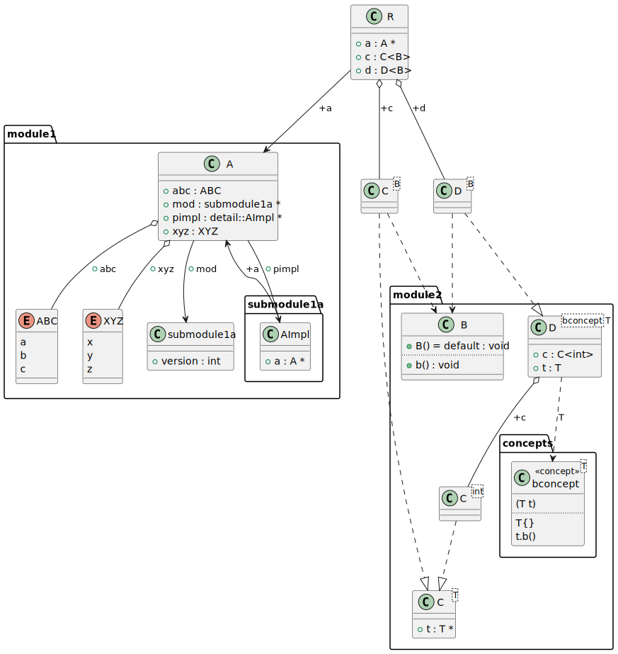

# t00065 - Class diagram with packages from directory structure
## Config
```yaml
diagrams:
  t00065_class:
    type: class
    glob:
      - module1/submodule1a/submodule1a.cc
      - module1/submodule1/module1.cc
      - t00065.cc
    generate_packages: true
    package_type: directory
    include:
      namespaces:
        - clanguml::t00065
    using_namespace: clanguml::t00065
```
## Source code
File `tests/t00065/t00065.cc`
```cpp
#include "module1/module1.h"
#include "module2/module2.h"

namespace clanguml {
namespace t00065 {
struct R {
    A *a;
    C<B> c;
    D<B> d;
};
}
}
```
File `tests/t00065/module2/module2.h`
```cpp
#pragma once

#include "concepts/concepts.h"

namespace clanguml {
namespace t00065 {
struct B {
    B() = default;
    void b() { }
};

template <typename T> struct C {
    T *t;
};

template <bconcept T> struct D {
    T t;
    C<int> c;
};

}
}
```
File `tests/t00065/module2/concepts/concepts.h`
```cpp
#pragma once

namespace clanguml {
namespace t00065 {

template <typename T>
concept bconcept = requires(T t) {
    T{};
    t.b();
};

}
}
```
File `tests/t00065/module1/module1.cc`
```cpp
#include "module1.h"
```
File `tests/t00065/module1/module1.h`
```cpp
#pragma once

#include "submodule1a/submodule1a.h"

namespace clanguml {
namespace t00065 {

enum class ABC { a, b, c };

enum XYZ { x, y, z };

struct A {
    ABC abc;
    XYZ xyz;
    detail::AImpl *pimpl;
};
}
}
```
File `tests/t00065/module1/submodule1a/submodule1a.h`
```cpp
#pragma once

namespace clanguml {
namespace t00065 {
struct A;
namespace detail {
struct AImpl {
    A *a;
};
}
}
}
```
File `tests/t00065/module1/submodule1a/submodule1a.cc`
```cpp
#include "submodule1a.h"
```
## Generated PlantUML diagrams

## Generated Mermaid diagrams

## Generated JSON models
```json
{
  "diagram_type": "class",
  "elements": [
    {
      "display_name": "module1",
      "elements": [
        {
          "display_name": "submodule1a",
          "elements": [
            {
              "bases": [],
              "display_name": "AImpl",
              "id": "5398059314469894043",
              "is_abstract": false,
              "is_nested": false,
              "is_struct": true,
              "is_template": false,
              "is_union": false,
              "members": [
                {
                  "access": "public",
                  "is_static": false,
                  "name": "a",
                  "source_location": {
                    "column": 8,
                    "file": "module1/submodule1a/submodule1a.h",
                    "line": 8,
                    "translation_unit": "module1/submodule1a/submodule1a.cc"
                  },
                  "type": "A *"
                }
              ],
              "methods": [],
              "name": "AImpl",
              "namespace": "clanguml::t00065::detail",
              "source_location": {
                "column": 8,
                "file": "module1/submodule1a/submodule1a.h",
                "line": 7,
                "translation_unit": "module1/submodule1a/submodule1a.cc"
              },
              "template_parameters": [],
              "type": "class"
            },
            {
              "bases": [],
              "display_name": "A",
              "id": "9425556339266405903",
              "is_abstract": false,
              "is_nested": false,
              "is_struct": true,
              "is_template": false,
              "is_union": false,
              "members": [
                {
                  "access": "public",
                  "is_static": false,
                  "name": "abc",
                  "source_location": {
                    "column": 9,
                    "file": "module1/module1.h",
                    "line": 13,
                    "translation_unit": "t00065.cc"
                  },
                  "type": "ABC"
                },
                {
                  "access": "public",
                  "is_static": false,
                  "name": "xyz",
                  "source_location": {
                    "column": 9,
                    "file": "module1/module1.h",
                    "line": 14,
                    "translation_unit": "t00065.cc"
                  },
                  "type": "XYZ"
                },
                {
                  "access": "public",
                  "is_static": false,
                  "name": "pimpl",
                  "source_location": {
                    "column": 20,
                    "file": "module1/module1.h",
                    "line": 15,
                    "translation_unit": "t00065.cc"
                  },
                  "type": "detail::AImpl *"
                }
              ],
              "methods": [],
              "name": "A",
              "namespace": "clanguml::t00065",
              "source_location": {
                "column": 8,
                "file": "module1/submodule1a/submodule1a.h",
                "line": 5,
                "translation_unit": "module1/submodule1a/submodule1a.cc"
              },
              "template_parameters": [],
              "type": "class"
            }
          ],
          "name": "submodule1a",
          "type": "directory"
        },
        {
          "constants": [
            "a",
            "b",
            "c"
          ],
          "display_name": "ABC",
          "id": "17162903884311351787",
          "is_nested": false,
          "name": "ABC",
          "namespace": "clanguml::t00065",
          "source_location": {
            "column": 12,
            "file": "module1/module1.h",
            "line": 8,
            "translation_unit": "t00065.cc"
          },
          "type": "enum"
        },
        {
          "constants": [
            "x",
            "y",
            "z"
          ],
          "display_name": "XYZ",
          "id": "11487521750481135557",
          "is_nested": false,
          "name": "XYZ",
          "namespace": "clanguml::t00065",
          "source_location": {
            "column": 6,
            "file": "module1/module1.h",
            "line": 10,
            "translation_unit": "t00065.cc"
          },
          "type": "enum"
        }
      ],
      "name": "module1",
      "type": "directory"
    },
    {
      "display_name": "module2",
      "elements": [
        {
          "display_name": "concepts",
          "elements": [
            {
              "display_name": "bconcept<T>",
              "id": "10603803257069770961",
              "name": "bconcept",
              "namespace": "clanguml::t00065",
              "parameters": [
                {
                  "name": "t",
                  "type": "T"
                }
              ],
              "source_location": {
                "column": 9,
                "file": "module2/concepts/concepts.h",
                "line": 7,
                "translation_unit": "t00065.cc"
              },
              "statements": [
                "T{}",
                "t.b()"
              ],
              "type": "concept"
            }
          ],
          "name": "concepts",
          "type": "directory"
        },
        {
          "bases": [],
          "display_name": "B",
          "id": "13214484568916240266",
          "is_abstract": false,
          "is_nested": false,
          "is_struct": true,
          "is_template": false,
          "is_union": false,
          "members": [],
          "methods": [
            {
              "access": "public",
              "display_name": "B",
              "is_const": false,
              "is_consteval": false,
              "is_constexpr": false,
              "is_constructor": true,
              "is_copy_assignment": false,
              "is_coroutine": false,
              "is_defaulted": true,
              "is_deleted": false,
              "is_move_assignment": false,
              "is_noexcept": false,
              "is_operator": false,
              "is_pure_virtual": false,
              "is_static": false,
              "is_virtual": false,
              "name": "B",
              "parameters": [],
              "source_location": {
                "column": 5,
                "file": "module2/module2.h",
                "line": 8,
                "translation_unit": "t00065.cc"
              },
              "template_parameters": [],
              "type": "void"
            },
            {
              "access": "public",
              "display_name": "b",
              "is_const": false,
              "is_consteval": false,
              "is_constexpr": false,
              "is_constructor": false,
              "is_copy_assignment": false,
              "is_coroutine": false,
              "is_defaulted": false,
              "is_deleted": false,
              "is_move_assignment": false,
              "is_noexcept": false,
              "is_operator": false,
              "is_pure_virtual": false,
              "is_static": false,
              "is_virtual": false,
              "name": "b",
              "parameters": [],
              "source_location": {
                "column": 10,
                "file": "module2/module2.h",
                "line": 9,
                "translation_unit": "t00065.cc"
              },
              "template_parameters": [],
              "type": "void"
            }
          ],
          "name": "B",
          "namespace": "clanguml::t00065",
          "source_location": {
            "column": 8,
            "file": "module2/module2.h",
            "line": 7,
            "translation_unit": "t00065.cc"
          },
          "template_parameters": [],
          "type": "class"
        },
        {
          "bases": [],
          "display_name": "C<T>",
          "id": "9259024118151657882",
          "is_abstract": false,
          "is_nested": false,
          "is_struct": true,
          "is_template": true,
          "is_union": false,
          "members": [
            {
              "access": "public",
              "is_static": false,
              "name": "t",
              "source_location": {
                "column": 8,
                "file": "module2/module2.h",
                "line": 13,
                "translation_unit": "t00065.cc"
              },
              "type": "T *"
            }
          ],
          "methods": [],
          "name": "C",
          "namespace": "clanguml::t00065",
          "source_location": {
            "column": 30,
            "file": "module2/module2.h",
            "line": 12,
            "translation_unit": "t00065.cc"
          },
          "template_parameters": [
            {
              "is_variadic": false,
              "kind": "template_type",
              "name": "T",
              "template_parameters": []
            }
          ],
          "type": "class"
        },
        {
          "bases": [],
          "display_name": "C<int>",
          "id": "4644600031360357658",
          "is_abstract": false,
          "is_nested": false,
          "is_struct": false,
          "is_template": true,
          "is_union": false,
          "members": [],
          "methods": [],
          "name": "C",
          "namespace": "clanguml::t00065",
          "source_location": {
            "column": 30,
            "file": "module2/module2.h",
            "line": 12,
            "translation_unit": "t00065.cc"
          },
          "template_parameters": [
            {
              "is_variadic": false,
              "kind": "argument",
              "template_parameters": [],
              "type": "int"
            }
          ],
          "type": "class"
        },
        {
          "bases": [],
          "display_name": "D<bconcept T>",
          "id": "13758023432702815554",
          "is_abstract": false,
          "is_nested": false,
          "is_struct": true,
          "is_template": true,
          "is_union": false,
          "members": [
            {
              "access": "public",
              "is_static": false,
              "name": "t",
              "source_location": {
                "column": 7,
                "file": "module2/module2.h",
                "line": 17,
                "translation_unit": "t00065.cc"
              },
              "type": "T"
            },
            {
              "access": "public",
              "is_static": false,
              "name": "c",
              "source_location": {
                "column": 12,
                "file": "module2/module2.h",
                "line": 18,
                "translation_unit": "t00065.cc"
              },
              "type": "C<int>"
            }
          ],
          "methods": [],
          "name": "D",
          "namespace": "clanguml::t00065",
          "source_location": {
            "column": 30,
            "file": "module2/module2.h",
            "line": 16,
            "translation_unit": "t00065.cc"
          },
          "template_parameters": [
            {
              "is_variadic": false,
              "kind": "template_type",
              "name": "T",
              "template_parameters": []
            }
          ],
          "type": "class"
        },
        {
          "bases": [],
          "display_name": "C<B>",
          "id": "10987226769965509366",
          "is_abstract": false,
          "is_nested": false,
          "is_struct": false,
          "is_template": true,
          "is_union": false,
          "members": [],
          "methods": [],
          "name": "C",
          "namespace": "clanguml::t00065",
          "source_location": {
            "column": 30,
            "file": "module2/module2.h",
            "line": 12,
            "translation_unit": "t00065.cc"
          },
          "template_parameters": [
            {
              "is_variadic": false,
              "kind": "argument",
              "template_parameters": [],
              "type": "B"
            }
          ],
          "type": "class"
        },
        {
          "bases": [],
          "display_name": "D<B>",
          "id": "16194208100981835856",
          "is_abstract": false,
          "is_nested": false,
          "is_struct": false,
          "is_template": true,
          "is_union": false,
          "members": [],
          "methods": [],
          "name": "D",
          "namespace": "clanguml::t00065",
          "source_location": {
            "column": 30,
            "file": "module2/module2.h",
            "line": 16,
            "translation_unit": "t00065.cc"
          },
          "template_parameters": [
            {
              "is_variadic": false,
              "kind": "argument",
              "template_parameters": [],
              "type": "B"
            }
          ],
          "type": "class"
        }
      ],
      "name": "module2",
      "type": "directory"
    },
    {
      "bases": [],
      "display_name": "R",
      "id": "8656895691309819509",
      "is_abstract": false,
      "is_nested": false,
      "is_struct": true,
      "is_template": false,
      "is_union": false,
      "members": [
        {
          "access": "public",
          "is_static": false,
          "name": "a",
          "source_location": {
            "column": 8,
            "file": "t00065.cc",
            "line": 7,
            "translation_unit": "t00065.cc"
          },
          "type": "A *"
        },
        {
          "access": "public",
          "is_static": false,
          "name": "c",
          "source_location": {
            "column": 10,
            "file": "t00065.cc",
            "line": 8,
            "translation_unit": "t00065.cc"
          },
          "type": "C<B>"
        },
        {
          "access": "public",
          "is_static": false,
          "name": "d",
          "source_location": {
            "column": 10,
            "file": "t00065.cc",
            "line": 9,
            "translation_unit": "t00065.cc"
          },
          "type": "D<B>"
        }
      ],
      "methods": [],
      "name": "R",
      "namespace": "clanguml::t00065",
      "source_location": {
        "column": 8,
        "file": "t00065.cc",
        "line": 6,
        "translation_unit": "t00065.cc"
      },
      "template_parameters": [],
      "type": "class"
    }
  ],
  "name": "t00065_class",
  "package_type": "directory",
  "relationships": [
    {
      "access": "public",
      "destination": "9425556339266405903",
      "label": "a",
      "source": "5398059314469894043",
      "type": "association"
    },
    {
      "access": "public",
      "destination": "17162903884311351787",
      "label": "abc",
      "source": "9425556339266405903",
      "type": "aggregation"
    },
    {
      "access": "public",
      "destination": "11487521750481135557",
      "label": "xyz",
      "source": "9425556339266405903",
      "type": "aggregation"
    },
    {
      "access": "public",
      "destination": "5398059314469894043",
      "label": "pimpl",
      "source": "9425556339266405903",
      "type": "association"
    },
    {
      "access": "public",
      "destination": "9259024118151657882",
      "source": "4644600031360357658",
      "type": "instantiation"
    },
    {
      "destination": "10603803257069770961",
      "label": "T",
      "source": "13758023432702815554",
      "type": "constraint"
    },
    {
      "access": "public",
      "destination": "4644600031360357658",
      "label": "c",
      "source": "13758023432702815554",
      "type": "aggregation"
    },
    {
      "access": "public",
      "destination": "13214484568916240266",
      "source": "10987226769965509366",
      "type": "dependency"
    },
    {
      "access": "public",
      "destination": "9259024118151657882",
      "source": "10987226769965509366",
      "type": "instantiation"
    },
    {
      "access": "public",
      "destination": "13214484568916240266",
      "source": "16194208100981835856",
      "type": "dependency"
    },
    {
      "access": "public",
      "destination": "13758023432702815554",
      "source": "16194208100981835856",
      "type": "instantiation"
    },
    {
      "access": "public",
      "destination": "9425556339266405903",
      "label": "a",
      "source": "8656895691309819509",
      "type": "association"
    },
    {
      "access": "public",
      "destination": "10987226769965509366",
      "label": "c",
      "source": "8656895691309819509",
      "type": "aggregation"
    },
    {
      "access": "public",
      "destination": "16194208100981835856",
      "label": "d",
      "source": "8656895691309819509",
      "type": "aggregation"
    }
  ],
  "using_namespace": "clanguml::t00065"
}
```
## Generated GraphML models
```xml
<?xml version="1.0"?>
<graphml xmlns="http://graphml.graphdrawing.org/xmlns" xmlns:xsi="http://www.w3.org/2001/XMLSchema-instance" xsi:schemaLocation="http://graphml.graphdrawing.org/xmlns http://graphml.graphdrawing.org/xmlns/1.0/graphml.xsd">
 <key attr.name="id" attr.type="string" for="graph" id="gd0" />
 <key attr.name="diagram_type" attr.type="string" for="graph" id="gd1" />
 <key attr.name="name" attr.type="string" for="graph" id="gd2" />
 <key attr.name="using_namespace" attr.type="string" for="graph" id="gd3" />
 <key attr.name="id" attr.type="string" for="node" id="nd0" />
 <key attr.name="type" attr.type="string" for="node" id="nd1" />
 <key attr.name="name" attr.type="string" for="node" id="nd2" />
 <key attr.name="stereotype" attr.type="string" for="node" id="nd3" />
 <key attr.name="url" attr.type="string" for="node" id="nd4" />
 <key attr.name="tooltip" attr.type="string" for="node" id="nd5" />
 <key attr.name="is_template" attr.type="boolean" for="node" id="nd6" />
 <key attr.name="type" attr.type="string" for="edge" id="ed0" />
 <key attr.name="access" attr.type="string" for="edge" id="ed1" />
 <key attr.name="label" attr.type="string" for="edge" id="ed2" />
 <key attr.name="url" attr.type="string" for="edge" id="ed3" />
 <graph id="g0" edgedefault="directed" parse.nodeids="canonical" parse.edgeids="canonical" parse.order="nodesfirst">
  <data key="gd3">clanguml::t00065</data>
  <node id="n0">
   <data key="nd2">module1</data>
   <data key="nd1">directory</data>
   <graph id="g1" edgedefault="directed" parse.nodeids="canonical" parse.edgeids="canonical" parse.order="nodesfirst">
    <node id="n1">
     <data key="nd2">submodule1a</data>
     <data key="nd1">directory</data>
     <graph id="g2" edgedefault="directed" parse.nodeids="canonical" parse.edgeids="canonical" parse.order="nodesfirst">
      <node id="n2">
       <data key="nd1">class</data>
       <data key="nd2"><![CDATA[AImpl]]></data>
       <data key="nd6">false</data>
      </node>
      <node id="n3">
       <data key="nd1">class</data>
       <data key="nd2"><![CDATA[A]]></data>
       <data key="nd6">false</data>
      </node>
     </graph>
    </node>
    <node id="n4">
     <data key="nd1">enum</data>
     <data key="nd2"><![CDATA[ABC]]></data>
    </node>
    <node id="n5">
     <data key="nd1">enum</data>
     <data key="nd2"><![CDATA[XYZ]]></data>
    </node>
   </graph>
  </node>
  <node id="n6">
   <data key="nd2">module2</data>
   <data key="nd1">directory</data>
   <graph id="g3" edgedefault="directed" parse.nodeids="canonical" parse.edgeids="canonical" parse.order="nodesfirst">
    <node id="n7">
     <data key="nd2">concepts</data>
     <data key="nd1">directory</data>
     <graph id="g4" edgedefault="directed" parse.nodeids="canonical" parse.edgeids="canonical" parse.order="nodesfirst">
      <node id="n8">
       <data key="nd1">concept</data>
       <data key="nd2"><![CDATA[bconcept<T>]]></data>
      </node>
     </graph>
    </node>
    <node id="n9">
     <data key="nd1">class</data>
     <data key="nd2"><![CDATA[B]]></data>
     <data key="nd6">false</data>
    </node>
    <node id="n10">
     <data key="nd1">class</data>
     <data key="nd2"><![CDATA[C<T>]]></data>
     <data key="nd6">true</data>
    </node>
    <node id="n11">
     <data key="nd1">class</data>
     <data key="nd2"><![CDATA[C<int>]]></data>
     <data key="nd6">true</data>
    </node>
    <node id="n12">
     <data key="nd1">class</data>
     <data key="nd2"><![CDATA[D<bconcept T>]]></data>
     <data key="nd6">true</data>
    </node>
    <node id="n13">
     <data key="nd1">class</data>
     <data key="nd2"><![CDATA[C<B>]]></data>
     <data key="nd6">true</data>
    </node>
    <node id="n14">
     <data key="nd1">class</data>
     <data key="nd2"><![CDATA[D<B>]]></data>
     <data key="nd6">true</data>
    </node>
   </graph>
  </node>
  <node id="n15">
   <data key="nd1">class</data>
   <data key="nd2"><![CDATA[R]]></data>
   <data key="nd6">false</data>
  </node>
  <edge id="e0" source="n2" target="n3">
   <data key="ed0">association</data>
   <data key="ed2">a</data>
   <data key="ed1">public</data>
  </edge>
  <edge id="e1" source="n3" target="n4">
   <data key="ed0">aggregation</data>
   <data key="ed2">abc</data>
   <data key="ed1">public</data>
  </edge>
  <edge id="e2" source="n3" target="n5">
   <data key="ed0">aggregation</data>
   <data key="ed2">xyz</data>
   <data key="ed1">public</data>
  </edge>
  <edge id="e3" source="n3" target="n2">
   <data key="ed0">association</data>
   <data key="ed2">pimpl</data>
   <data key="ed1">public</data>
  </edge>
  <edge id="e4" source="n11" target="n10">
   <data key="ed0">instantiation</data>
   <data key="ed1">public</data>
  </edge>
  <edge id="e5" source="n12" target="n8">
   <data key="ed0">constraint</data>
   <data key="ed2">T</data>
  </edge>
  <edge id="e6" source="n12" target="n11">
   <data key="ed0">aggregation</data>
   <data key="ed2">c</data>
   <data key="ed1">public</data>
  </edge>
  <edge id="e7" source="n13" target="n9">
   <data key="ed0">dependency</data>
   <data key="ed1">public</data>
  </edge>
  <edge id="e8" source="n13" target="n10">
   <data key="ed0">instantiation</data>
   <data key="ed1">public</data>
  </edge>
  <edge id="e9" source="n14" target="n9">
   <data key="ed0">dependency</data>
   <data key="ed1">public</data>
  </edge>
  <edge id="e10" source="n14" target="n12">
   <data key="ed0">instantiation</data>
   <data key="ed1">public</data>
  </edge>
  <edge id="e11" source="n15" target="n3">
   <data key="ed0">association</data>
   <data key="ed2">a</data>
   <data key="ed1">public</data>
  </edge>
  <edge id="e12" source="n15" target="n13">
   <data key="ed0">aggregation</data>
   <data key="ed2">c</data>
   <data key="ed1">public</data>
  </edge>
  <edge id="e13" source="n15" target="n14">
   <data key="ed0">aggregation</data>
   <data key="ed2">d</data>
   <data key="ed1">public</data>
  </edge>
 </graph>
</graphml>

```
