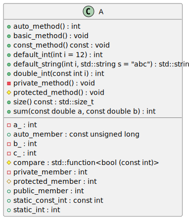

# t00067 - Class method type filter test case
## Config
```yaml
compilation_database_dir: ..
output_directory: puml
diagrams:
  t00067_class:
    type: class
    glob:
      - ../../tests/t00067/t00067.cc
    include:
      namespaces:
        - clanguml::t00067
    exclude:
      method_types:
        - constructor
        - destructor
        - operator
        - assignment
        - static
    using_namespace:
      - clanguml::t00067
```
## Source code
File t00067.cc
```cpp
#include <functional>
#include <string>

namespace clanguml {
namespace t00067 {
class A {
public:
    A() = default;
    A(int i)
        : private_member{i}
    {
    }
    A(A &&) = default;
    A(const A &) = delete;
    virtual ~A() = default;

    void basic_method() { }
    static int static_method() { return 0; }
    void const_method() const { }
    auto auto_method() { return 1; }

    A &operator++()
    {
        private_member++;
        return *this;
    }

    A &operator=(A &&other) noexcept { return *this; }
    A &operator=(A &other) noexcept { return *this; }

    std::size_t size() const { return private_member; }

    auto double_int(const int i) { return 2 * i; }
    auto sum(const double a, const double b) { return a_ + b_ + c_; }

    auto default_int(int i = 12) { return i + 10; }
    std::string default_string(int i, std::string s = "abc")
    {
        return s + std::to_string(i);
    }

    static A create_from_int(int i) { return A(i); }

    int public_member;
    static int static_int;
    static const int static_const_int = 1;
    static const auto auto_member{10UL};

protected:
    void protected_method() { }

    int protected_member;

    std::function<bool(const int)> compare = [this](const int v) {
        return private_member > v;
    };

private:
    void private_method() { }

    int private_member;
    int a_, b_, c_;
};

int A::static_int = 1;
}
}
```
## Generated UML diagrams

## Generated JSON models
```json
{
  "diagram_type": "class",
  "elements": [
    {
      "bases": [],
      "display_name": "clanguml::t00067::A",
      "id": "541140581420098839",
      "is_abstract": false,
      "is_nested": false,
      "is_struct": false,
      "is_template": false,
      "is_union": false,
      "members": [
        {
          "access": "public",
          "is_static": false,
          "name": "public_member",
          "source_location": {
            "file": "../../tests/t00067/t00067.cc",
            "line": 44
          },
          "type": "int"
        },
        {
          "access": "protected",
          "is_static": false,
          "name": "protected_member",
          "source_location": {
            "file": "../../tests/t00067/t00067.cc",
            "line": 52
          },
          "type": "int"
        },
        {
          "access": "protected",
          "is_static": false,
          "name": "compare",
          "source_location": {
            "file": "../../tests/t00067/t00067.cc",
            "line": 54
          },
          "type": "std::function<bool (const int)>"
        },
        {
          "access": "private",
          "is_static": false,
          "name": "private_member",
          "source_location": {
            "file": "../../tests/t00067/t00067.cc",
            "line": 61
          },
          "type": "int"
        },
        {
          "access": "private",
          "is_static": false,
          "name": "a_",
          "source_location": {
            "file": "../../tests/t00067/t00067.cc",
            "line": 62
          },
          "type": "int"
        },
        {
          "access": "private",
          "is_static": false,
          "name": "b_",
          "source_location": {
            "file": "../../tests/t00067/t00067.cc",
            "line": 62
          },
          "type": "int"
        },
        {
          "access": "private",
          "is_static": false,
          "name": "c_",
          "source_location": {
            "file": "../../tests/t00067/t00067.cc",
            "line": 62
          },
          "type": "int"
        },
        {
          "access": "public",
          "is_static": true,
          "name": "static_int",
          "source_location": {
            "file": "../../tests/t00067/t00067.cc",
            "line": 45
          },
          "type": "int"
        },
        {
          "access": "public",
          "is_static": true,
          "name": "static_const_int",
          "source_location": {
            "file": "../../tests/t00067/t00067.cc",
            "line": 46
          },
          "type": "const int"
        },
        {
          "access": "public",
          "is_static": true,
          "name": "auto_member",
          "source_location": {
            "file": "../../tests/t00067/t00067.cc",
            "line": 47
          },
          "type": "const unsigned long"
        }
      ],
      "methods": [
        {
          "access": "public",
          "is_const": false,
          "is_consteval": false,
          "is_constexpr": false,
          "is_constructor": false,
          "is_copy_assignment": false,
          "is_defaulted": false,
          "is_deleted": false,
          "is_move_assignment": false,
          "is_noexcept": false,
          "is_operator": false,
          "is_pure_virtual": false,
          "is_static": false,
          "is_virtual": false,
          "name": "basic_method",
          "parameters": [],
          "type": "void"
        },
        {
          "access": "public",
          "is_const": true,
          "is_consteval": false,
          "is_constexpr": false,
          "is_constructor": false,
          "is_copy_assignment": false,
          "is_defaulted": false,
          "is_deleted": false,
          "is_move_assignment": false,
          "is_noexcept": false,
          "is_operator": false,
          "is_pure_virtual": false,
          "is_static": false,
          "is_virtual": false,
          "name": "const_method",
          "parameters": [],
          "type": "void"
        },
        {
          "access": "public",
          "is_const": false,
          "is_consteval": false,
          "is_constexpr": false,
          "is_constructor": false,
          "is_copy_assignment": false,
          "is_defaulted": false,
          "is_deleted": false,
          "is_move_assignment": false,
          "is_noexcept": false,
          "is_operator": false,
          "is_pure_virtual": false,
          "is_static": false,
          "is_virtual": false,
          "name": "auto_method",
          "parameters": [],
          "type": "int"
        },
        {
          "access": "public",
          "is_const": true,
          "is_consteval": false,
          "is_constexpr": false,
          "is_constructor": false,
          "is_copy_assignment": false,
          "is_defaulted": false,
          "is_deleted": false,
          "is_move_assignment": false,
          "is_noexcept": false,
          "is_operator": false,
          "is_pure_virtual": false,
          "is_static": false,
          "is_virtual": false,
          "name": "size",
          "parameters": [],
          "type": "std::size_t"
        },
        {
          "access": "public",
          "is_const": false,
          "is_consteval": false,
          "is_constexpr": false,
          "is_constructor": false,
          "is_copy_assignment": false,
          "is_defaulted": false,
          "is_deleted": false,
          "is_move_assignment": false,
          "is_noexcept": false,
          "is_operator": false,
          "is_pure_virtual": false,
          "is_static": false,
          "is_virtual": false,
          "name": "double_int",
          "parameters": [
            {
              "name": "i",
              "type": "const int"
            }
          ],
          "type": "int"
        },
        {
          "access": "public",
          "is_const": false,
          "is_consteval": false,
          "is_constexpr": false,
          "is_constructor": false,
          "is_copy_assignment": false,
          "is_defaulted": false,
          "is_deleted": false,
          "is_move_assignment": false,
          "is_noexcept": false,
          "is_operator": false,
          "is_pure_virtual": false,
          "is_static": false,
          "is_virtual": false,
          "name": "sum",
          "parameters": [
            {
              "name": "a",
              "type": "const double"
            },
            {
              "name": "b",
              "type": "const double"
            }
          ],
          "type": "int"
        },
        {
          "access": "public",
          "is_const": false,
          "is_consteval": false,
          "is_constexpr": false,
          "is_constructor": false,
          "is_copy_assignment": false,
          "is_defaulted": false,
          "is_deleted": false,
          "is_move_assignment": false,
          "is_noexcept": false,
          "is_operator": false,
          "is_pure_virtual": false,
          "is_static": false,
          "is_virtual": false,
          "name": "default_int",
          "parameters": [
            {
              "default_value": "12",
              "name": "i",
              "type": "int"
            }
          ],
          "type": "int"
        },
        {
          "access": "public",
          "is_const": false,
          "is_consteval": false,
          "is_constexpr": false,
          "is_constructor": false,
          "is_copy_assignment": false,
          "is_defaulted": false,
          "is_deleted": false,
          "is_move_assignment": false,
          "is_noexcept": false,
          "is_operator": false,
          "is_pure_virtual": false,
          "is_static": false,
          "is_virtual": false,
          "name": "default_string",
          "parameters": [
            {
              "name": "i",
              "type": "int"
            },
            {
              "default_value": "\"abc\"",
              "name": "s",
              "type": "std::string"
            }
          ],
          "type": "std::string"
        },
        {
          "access": "protected",
          "is_const": false,
          "is_consteval": false,
          "is_constexpr": false,
          "is_constructor": false,
          "is_copy_assignment": false,
          "is_defaulted": false,
          "is_deleted": false,
          "is_move_assignment": false,
          "is_noexcept": false,
          "is_operator": false,
          "is_pure_virtual": false,
          "is_static": false,
          "is_virtual": false,
          "name": "protected_method",
          "parameters": [],
          "type": "void"
        },
        {
          "access": "private",
          "is_const": false,
          "is_consteval": false,
          "is_constexpr": false,
          "is_constructor": false,
          "is_copy_assignment": false,
          "is_defaulted": false,
          "is_deleted": false,
          "is_move_assignment": false,
          "is_noexcept": false,
          "is_operator": false,
          "is_pure_virtual": false,
          "is_static": false,
          "is_virtual": false,
          "name": "private_method",
          "parameters": [],
          "type": "void"
        }
      ],
      "name": "A",
      "namespace": "clanguml::t00067",
      "source_location": {
        "file": "../../tests/t00067/t00067.cc",
        "line": 6
      },
      "template_parameters": [],
      "type": "class"
    }
  ],
  "metadata": {
    "clang_uml_version": "0.3.6-31-g01ef3dc",
    "llvm_version": "Ubuntu clang version 15.0.6",
    "schema_version": 1
  },
  "name": "t00067_class",
  "relationships": [],
  "using_namespace": "clanguml::t00067"
}
```
