# t00068 - Context filter radius parameter test case
## Config
```yaml
diagrams:
  t00068_r0_class:
    type: class
    title: AAA context of radius 0
    glob:
      - t00068.cc
    include:
      namespaces:
        - clanguml::t00068
      context:
        - match:
            radius: 0
            pattern: clanguml::t00068::AAA
    using_namespace: clanguml::t00068
  t00068_r1_class:
    type: class
    title: AAA context of radius 1
    glob:
      - t00068.cc
    include:
      namespaces:
        - clanguml::t00068
      context:
        - match:
            radius: 1
            pattern: clanguml::t00068::AAA
    using_namespace: clanguml::t00068
  t00068_r2_class:
    type: class
    title: AAA context of radius 2
    glob:
      - t00068.cc
    include:
      namespaces:
        - clanguml::t00068
      context:
        - match:
            radius: 2
            pattern: clanguml::t00068::AAA
    using_namespace: clanguml::t00068
```
## Source code
File `tests/t00068/t00068.cc`
```cpp
#include <memory>
#include <vector>

namespace clanguml {
namespace t00068 {

struct B { };

struct BB {
    std::vector<B> b;
};

enum class AKind { OneA, TwoA, ThreeA };

struct A { };

struct AA : public A { };

struct AAA : public AA {
    BB *bb;
    AKind akind;
};

struct R {
    AAA *aaa;
};

struct RR {
    std::shared_ptr<R> r;
};
}
}
```
## Generated PlantUML diagrams


## Generated Mermaid diagrams



## Generated JSON models
```json
{
  "diagram_type": "class",
  "elements": [
    {
      "bases": [
        {
          "access": "public",
          "id": "577981285610429577",
          "is_virtual": false,
          "name": "clanguml::t00068::AA"
        }
      ],
      "display_name": "AAA",
      "id": "1484819281509619918",
      "is_abstract": false,
      "is_nested": false,
      "is_struct": true,
      "is_template": false,
      "is_union": false,
      "members": [
        {
          "access": "public",
          "is_static": false,
          "name": "bb",
          "source_location": {
            "column": 9,
            "file": "t00068.cc",
            "line": 20,
            "translation_unit": "t00068.cc"
          },
          "type": "BB *"
        },
        {
          "access": "public",
          "is_static": false,
          "name": "akind",
          "source_location": {
            "column": 11,
            "file": "t00068.cc",
            "line": 21,
            "translation_unit": "t00068.cc"
          },
          "type": "AKind"
        }
      ],
      "methods": [],
      "name": "AAA",
      "namespace": "clanguml::t00068",
      "source_location": {
        "column": 8,
        "file": "t00068.cc",
        "line": 19,
        "translation_unit": "t00068.cc"
      },
      "template_parameters": [],
      "type": "class"
    }
  ],
  "name": "t00068_r0_class",
  "package_type": "namespace",
  "relationships": [
    {
      "access": "public",
      "destination": "1427649116338755656",
      "label": "bb",
      "source": "1484819281509619918",
      "type": "association"
    },
    {
      "access": "public",
      "destination": "1888428536574868284",
      "label": "akind",
      "source": "1484819281509619918",
      "type": "aggregation"
    },
    {
      "access": "public",
      "destination": "577981285610429577",
      "source": "1484819281509619918",
      "type": "extension"
    }
  ],
  "title": "AAA context of radius 0",
  "using_namespace": "clanguml::t00068"
}
```
```json
{
  "diagram_type": "class",
  "elements": [
    {
      "bases": [],
      "display_name": "BB",
      "id": "1427649116338755656",
      "is_abstract": false,
      "is_nested": false,
      "is_struct": true,
      "is_template": false,
      "is_union": false,
      "members": [
        {
          "access": "public",
          "is_static": false,
          "name": "b",
          "source_location": {
            "column": 20,
            "file": "t00068.cc",
            "line": 10,
            "translation_unit": "t00068.cc"
          },
          "type": "std::vector<B>"
        }
      ],
      "methods": [],
      "name": "BB",
      "namespace": "clanguml::t00068",
      "source_location": {
        "column": 8,
        "file": "t00068.cc",
        "line": 9,
        "translation_unit": "t00068.cc"
      },
      "template_parameters": [],
      "type": "class"
    },
    {
      "constants": [
        "OneA",
        "TwoA",
        "ThreeA"
      ],
      "display_name": "AKind",
      "id": "1888428536574868284",
      "is_nested": false,
      "name": "AKind",
      "namespace": "clanguml::t00068",
      "source_location": {
        "column": 12,
        "file": "t00068.cc",
        "line": 13,
        "translation_unit": "t00068.cc"
      },
      "type": "enum"
    },
    {
      "bases": [
        {
          "access": "public",
          "id": "1297439817144700057",
          "is_virtual": false,
          "name": "clanguml::t00068::A"
        }
      ],
      "display_name": "AA",
      "id": "577981285610429577",
      "is_abstract": false,
      "is_nested": false,
      "is_struct": true,
      "is_template": false,
      "is_union": false,
      "members": [],
      "methods": [],
      "name": "AA",
      "namespace": "clanguml::t00068",
      "source_location": {
        "column": 8,
        "file": "t00068.cc",
        "line": 17,
        "translation_unit": "t00068.cc"
      },
      "template_parameters": [],
      "type": "class"
    },
    {
      "bases": [
        {
          "access": "public",
          "id": "577981285610429577",
          "is_virtual": false,
          "name": "clanguml::t00068::AA"
        }
      ],
      "display_name": "AAA",
      "id": "1484819281509619918",
      "is_abstract": false,
      "is_nested": false,
      "is_struct": true,
      "is_template": false,
      "is_union": false,
      "members": [
        {
          "access": "public",
          "is_static": false,
          "name": "bb",
          "source_location": {
            "column": 9,
            "file": "t00068.cc",
            "line": 20,
            "translation_unit": "t00068.cc"
          },
          "type": "BB *"
        },
        {
          "access": "public",
          "is_static": false,
          "name": "akind",
          "source_location": {
            "column": 11,
            "file": "t00068.cc",
            "line": 21,
            "translation_unit": "t00068.cc"
          },
          "type": "AKind"
        }
      ],
      "methods": [],
      "name": "AAA",
      "namespace": "clanguml::t00068",
      "source_location": {
        "column": 8,
        "file": "t00068.cc",
        "line": 19,
        "translation_unit": "t00068.cc"
      },
      "template_parameters": [],
      "type": "class"
    },
    {
      "bases": [],
      "display_name": "R",
      "id": "999621481464424961",
      "is_abstract": false,
      "is_nested": false,
      "is_struct": true,
      "is_template": false,
      "is_union": false,
      "members": [
        {
          "access": "public",
          "is_static": false,
          "name": "aaa",
          "source_location": {
            "column": 10,
            "file": "t00068.cc",
            "line": 25,
            "translation_unit": "t00068.cc"
          },
          "type": "AAA *"
        }
      ],
      "methods": [],
      "name": "R",
      "namespace": "clanguml::t00068",
      "source_location": {
        "column": 8,
        "file": "t00068.cc",
        "line": 24,
        "translation_unit": "t00068.cc"
      },
      "template_parameters": [],
      "type": "class"
    }
  ],
  "name": "t00068_r1_class",
  "package_type": "namespace",
  "relationships": [
    {
      "access": "public",
      "destination": "359183874441719256",
      "label": "b",
      "source": "1427649116338755656",
      "type": "aggregation"
    },
    {
      "access": "public",
      "destination": "1297439817144700057",
      "source": "577981285610429577",
      "type": "extension"
    },
    {
      "access": "public",
      "destination": "1427649116338755656",
      "label": "bb",
      "source": "1484819281509619918",
      "type": "association"
    },
    {
      "access": "public",
      "destination": "1888428536574868284",
      "label": "akind",
      "source": "1484819281509619918",
      "type": "aggregation"
    },
    {
      "access": "public",
      "destination": "577981285610429577",
      "source": "1484819281509619918",
      "type": "extension"
    },
    {
      "access": "public",
      "destination": "1484819281509619918",
      "label": "aaa",
      "source": "999621481464424961",
      "type": "association"
    }
  ],
  "title": "AAA context of radius 1",
  "using_namespace": "clanguml::t00068"
}
```
```json
{
  "diagram_type": "class",
  "elements": [
    {
      "bases": [],
      "display_name": "B",
      "id": "359183874441719256",
      "is_abstract": false,
      "is_nested": false,
      "is_struct": true,
      "is_template": false,
      "is_union": false,
      "members": [],
      "methods": [],
      "name": "B",
      "namespace": "clanguml::t00068",
      "source_location": {
        "column": 8,
        "file": "t00068.cc",
        "line": 7,
        "translation_unit": "t00068.cc"
      },
      "template_parameters": [],
      "type": "class"
    },
    {
      "bases": [],
      "display_name": "BB",
      "id": "1427649116338755656",
      "is_abstract": false,
      "is_nested": false,
      "is_struct": true,
      "is_template": false,
      "is_union": false,
      "members": [
        {
          "access": "public",
          "is_static": false,
          "name": "b",
          "source_location": {
            "column": 20,
            "file": "t00068.cc",
            "line": 10,
            "translation_unit": "t00068.cc"
          },
          "type": "std::vector<B>"
        }
      ],
      "methods": [],
      "name": "BB",
      "namespace": "clanguml::t00068",
      "source_location": {
        "column": 8,
        "file": "t00068.cc",
        "line": 9,
        "translation_unit": "t00068.cc"
      },
      "template_parameters": [],
      "type": "class"
    },
    {
      "constants": [
        "OneA",
        "TwoA",
        "ThreeA"
      ],
      "display_name": "AKind",
      "id": "1888428536574868284",
      "is_nested": false,
      "name": "AKind",
      "namespace": "clanguml::t00068",
      "source_location": {
        "column": 12,
        "file": "t00068.cc",
        "line": 13,
        "translation_unit": "t00068.cc"
      },
      "type": "enum"
    },
    {
      "bases": [],
      "display_name": "A",
      "id": "1297439817144700057",
      "is_abstract": false,
      "is_nested": false,
      "is_struct": true,
      "is_template": false,
      "is_union": false,
      "members": [],
      "methods": [],
      "name": "A",
      "namespace": "clanguml::t00068",
      "source_location": {
        "column": 8,
        "file": "t00068.cc",
        "line": 15,
        "translation_unit": "t00068.cc"
      },
      "template_parameters": [],
      "type": "class"
    },
    {
      "bases": [
        {
          "access": "public",
          "id": "1297439817144700057",
          "is_virtual": false,
          "name": "clanguml::t00068::A"
        }
      ],
      "display_name": "AA",
      "id": "577981285610429577",
      "is_abstract": false,
      "is_nested": false,
      "is_struct": true,
      "is_template": false,
      "is_union": false,
      "members": [],
      "methods": [],
      "name": "AA",
      "namespace": "clanguml::t00068",
      "source_location": {
        "column": 8,
        "file": "t00068.cc",
        "line": 17,
        "translation_unit": "t00068.cc"
      },
      "template_parameters": [],
      "type": "class"
    },
    {
      "bases": [
        {
          "access": "public",
          "id": "577981285610429577",
          "is_virtual": false,
          "name": "clanguml::t00068::AA"
        }
      ],
      "display_name": "AAA",
      "id": "1484819281509619918",
      "is_abstract": false,
      "is_nested": false,
      "is_struct": true,
      "is_template": false,
      "is_union": false,
      "members": [
        {
          "access": "public",
          "is_static": false,
          "name": "bb",
          "source_location": {
            "column": 9,
            "file": "t00068.cc",
            "line": 20,
            "translation_unit": "t00068.cc"
          },
          "type": "BB *"
        },
        {
          "access": "public",
          "is_static": false,
          "name": "akind",
          "source_location": {
            "column": 11,
            "file": "t00068.cc",
            "line": 21,
            "translation_unit": "t00068.cc"
          },
          "type": "AKind"
        }
      ],
      "methods": [],
      "name": "AAA",
      "namespace": "clanguml::t00068",
      "source_location": {
        "column": 8,
        "file": "t00068.cc",
        "line": 19,
        "translation_unit": "t00068.cc"
      },
      "template_parameters": [],
      "type": "class"
    },
    {
      "bases": [],
      "display_name": "R",
      "id": "999621481464424961",
      "is_abstract": false,
      "is_nested": false,
      "is_struct": true,
      "is_template": false,
      "is_union": false,
      "members": [
        {
          "access": "public",
          "is_static": false,
          "name": "aaa",
          "source_location": {
            "column": 10,
            "file": "t00068.cc",
            "line": 25,
            "translation_unit": "t00068.cc"
          },
          "type": "AAA *"
        }
      ],
      "methods": [],
      "name": "R",
      "namespace": "clanguml::t00068",
      "source_location": {
        "column": 8,
        "file": "t00068.cc",
        "line": 24,
        "translation_unit": "t00068.cc"
      },
      "template_parameters": [],
      "type": "class"
    },
    {
      "bases": [],
      "display_name": "RR",
      "id": "1168375787542426694",
      "is_abstract": false,
      "is_nested": false,
      "is_struct": true,
      "is_template": false,
      "is_union": false,
      "members": [
        {
          "access": "public",
          "is_static": false,
          "name": "r",
          "source_location": {
            "column": 24,
            "file": "t00068.cc",
            "line": 29,
            "translation_unit": "t00068.cc"
          },
          "type": "std::shared_ptr<R>"
        }
      ],
      "methods": [],
      "name": "RR",
      "namespace": "clanguml::t00068",
      "source_location": {
        "column": 8,
        "file": "t00068.cc",
        "line": 28,
        "translation_unit": "t00068.cc"
      },
      "template_parameters": [],
      "type": "class"
    }
  ],
  "name": "t00068_r2_class",
  "package_type": "namespace",
  "relationships": [
    {
      "access": "public",
      "destination": "359183874441719256",
      "label": "b",
      "source": "1427649116338755656",
      "type": "aggregation"
    },
    {
      "access": "public",
      "destination": "1297439817144700057",
      "source": "577981285610429577",
      "type": "extension"
    },
    {
      "access": "public",
      "destination": "1427649116338755656",
      "label": "bb",
      "source": "1484819281509619918",
      "type": "association"
    },
    {
      "access": "public",
      "destination": "1888428536574868284",
      "label": "akind",
      "source": "1484819281509619918",
      "type": "aggregation"
    },
    {
      "access": "public",
      "destination": "577981285610429577",
      "source": "1484819281509619918",
      "type": "extension"
    },
    {
      "access": "public",
      "destination": "1484819281509619918",
      "label": "aaa",
      "source": "999621481464424961",
      "type": "association"
    },
    {
      "access": "public",
      "destination": "999621481464424961",
      "label": "r",
      "source": "1168375787542426694",
      "type": "association"
    }
  ],
  "title": "AAA context of radius 2",
  "using_namespace": "clanguml::t00068"
}
```
